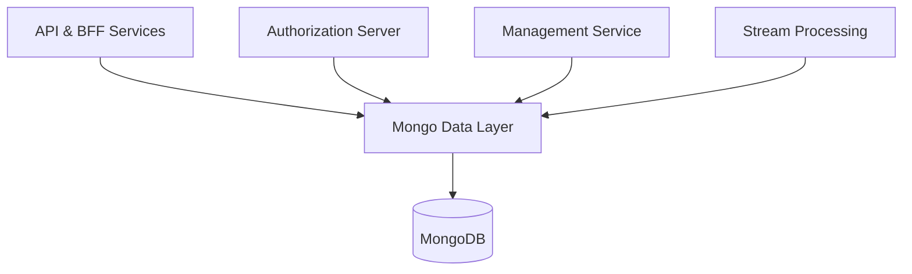
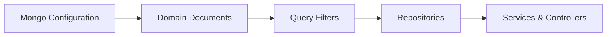

# data_mongo_layer

The **data_mongo_layer** module provides the MongoDB persistence foundation for the OpenFrame platform. It defines Mongo configuration, domain documents, query filters, and repository abstractions (blocking and reactive) used across API, Authorization, Management, Gateway, and Stream services.

This module centralizes **schema definitions**, **index management**, and **query logic** so higher-level services can focus on business behavior while relying on consistent, optimized data access patterns.

---

## Responsibilities

- Configure MongoDB (blocking and reactive) for Spring Boot services
- Define MongoDB documents for core domains (users, organizations, devices, events, OAuth, tools)
- Provide reusable query filter objects for complex searches
- Implement custom repositories for cursor-based pagination and filtered queries
- Expose base repository interfaces usable by both reactive and non-reactive stacks

---

## Position in the OpenFrame Architecture

The data_mongo_layer is consumed by:
- **api_service_core** for user, organization, device, and event access
- **authorization_server_core** for OAuth clients, tokens, and tenant-aware users
- **management_service_core** for tools, versions, and tenant bootstrap data
- **stream_processing_core** for event persistence and querying

---

## High-Level Structure

- **Configuration**: Mongo bootstrap, auditing, indexes
- **Documents**: Mongo collections mapped to domain models
- **Filters**: Typed filter objects used to build Mongo queries
- **Repositories**: Blocking and reactive repositories, plus custom implementations

---

## Sub-Modules

The module is organized conceptually into the following sub-modules:

- **Mongo Configuration** → `Mongo Configuration.md`
- **Domain Documents** → `Domain Documents.md`
- **Query Filters** → `Query Filters.md`
- **Repositories** → `Repositories.md`

Each sub-module is documented separately to avoid duplication and keep concerns isolated.

---

## Key Design Principles

- **Dual-stack support**: Blocking (`MongoRepository`) and reactive (`ReactiveMongoRepository`) coexist
- **Cursor-based pagination**: Efficient pagination using Mongo ObjectId cursors
- **Database-level filtering**: Heavy filtering pushed down to Mongo queries
- **Multi-tenancy ready**: Tenant- and organization-aware schemas and indexes
- **Index-first design**: Explicit index configuration for performance-sensitive collections

---

## Related Modules

This module is a foundational dependency for most backend services. For business logic and API exposure, refer to:

- api_service_core
- authorization_server_core
- management_service_core

---

## Next Steps

- See **Mongo Configuration** details in `data_mongo_config.md`
- Explore **Domain Documents** in `data_mongo_documents.md`
- Review **Custom Queries and Pagination** in `data_mongo_repositories.md`
