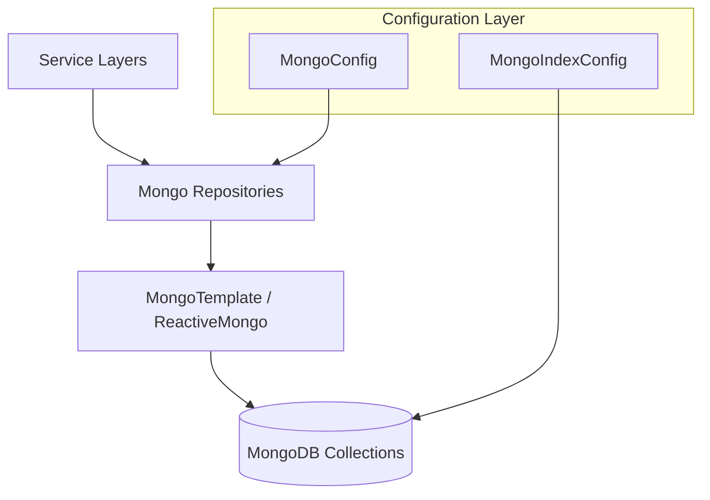

# Data Persistence – MongoDB Module

## Overview
The **data_persistence_mongo** module provides the MongoDB-based persistence layer for OpenFrame. It defines:

- MongoDB configuration (blocking and reactive)
- Domain document models mapped to MongoDB collections
- Repository abstractions and custom query implementations

This module is consumed by multiple service cores (API, Authorization, Management, Stream) as the primary operational datastore.

---

## Architecture Overview

**Key characteristics:**
- Supports both **blocking** (Servlet) and **reactive** (WebFlux) stacks
- Uses Spring Data MongoDB repositories with custom implementations where filtering, search, and cursor pagination are required
- Centralizes index management to ensure query performance

---

## Sub-modules

### Configuration
Defines MongoDB setup, repository activation, auditing, converters, and index initialization.

- Enables blocking repositories under `com.openframe.data.repository`
- Enables reactive repositories under `com.openframe.data.reactive.repository`
- Configures custom `MappingMongoConverter` behavior

➡️ See [Configuration](configuration.md)

---

### Documents (Domain Models)
MongoDB document classes representing core OpenFrame domain concepts such as users, organizations, devices, events, OAuth data, and tools.

These documents:
- Map directly to MongoDB collections
- Use indexes and compound indexes for multi-tenant safety and performance
- Are shared across multiple service cores

➡️ See [Documents](documents.md)

---

### Repositories
Repository interfaces and implementations that provide:

- Technology-agnostic base repository contracts
- Spring Data Mongo repositories (blocking and reactive)
- Custom repositories using `MongoTemplate` for advanced filtering, searching, and cursor-based pagination

➡️ See [Repositories](repositories.md)

---

## How This Module Fits Into the Platform

- **API & External API services** use this module for CRUD operations, filtering, and pagination
- **Authorization service** relies on MongoDB for OAuth clients, tokens, and multi-tenant users
- **Management service** uses it for configuration, tools, and initialization workflows
- **Stream service** correlates events stored in MongoDB with Kafka and Pinot pipelines

This module acts as the **source of truth** for operational data before it is streamed, cached, or analytically processed.

---

## Design Principles

- **Separation of concerns**: configuration, documents, and repositories are clearly separated
- **Reactive-first where needed**: reactive repositories are conditionally enabled
- **Performance-aware**: indexes and database-level filtering are preferred over in-memory processing
- **Multi-tenant safe**: compound indexes and scoped queries protect tenant isolation

---

## Summary

The **data_persistence_mongo** module is the backbone of OpenFrame's operational data layer. By combining strong domain modeling, flexible repository patterns, and dual reactive/blocking support, it enables scalable and consistent data access across the entire platform.
