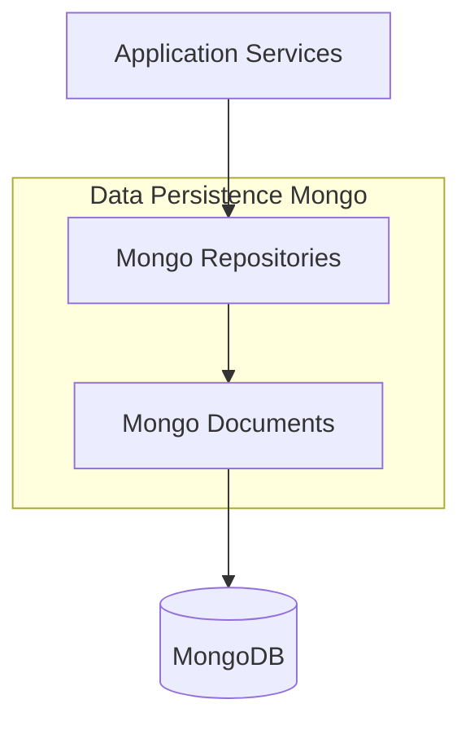
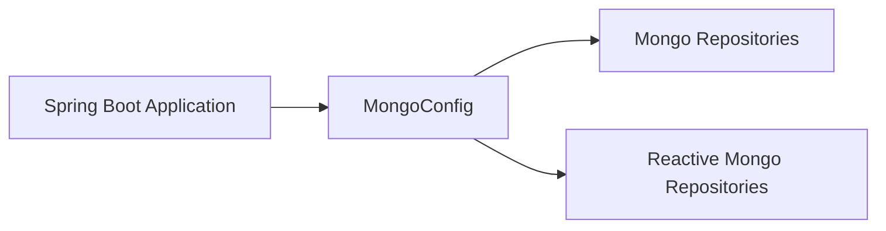
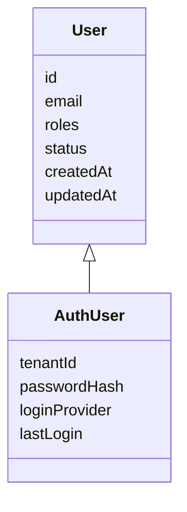
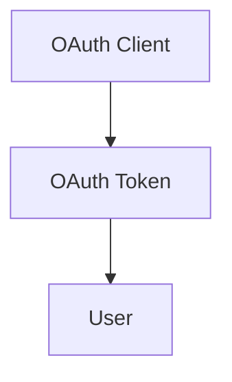
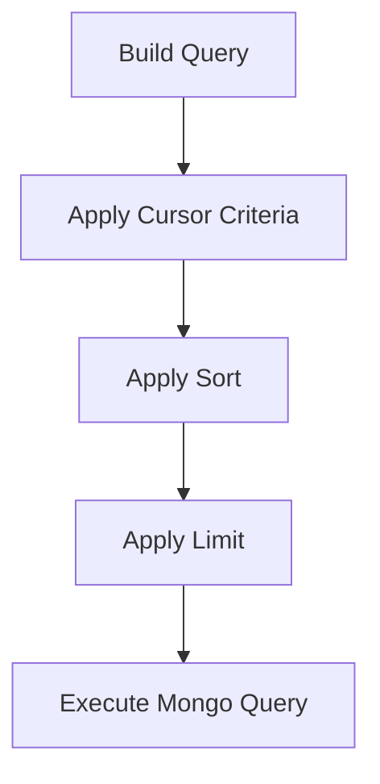

# Data Persistence Mongo

## Overview

Data Persistence Mongo is the MongoDB-backed persistence layer for the OpenFrame platform. It provides a unified, production-ready data model and repository abstraction used across API services, authorization, gateway, client services, and streaming components.

This module is responsible for:
- Defining MongoDB document schemas for core domain entities
- Configuring MongoDB access for both blocking and reactive runtimes
- Providing reusable repository interfaces and custom query implementations
- Enforcing indexing, auditing, and multi-tenant data constraints

It acts as the **single source of truth** for persisted state in the OpenFrame ecosystem.

---

## Position in the System Architecture

Data Persistence Mongo sits at the bottom of the service stack and is consumed by multiple higher-level modules, including API services, authorization server, management services, and streaming processors.

---

## Configuration Layer

### Mongo Configuration

The Mongo configuration enables both blocking and reactive MongoDB access depending on the runtime environment.

Key responsibilities:
- Conditional activation via `spring.data.mongodb.enabled`
- Separation of blocking and reactive repositories
- Custom MongoDB mapping behavior

**Highlights:**
- Enables Mongo auditing for created and updated timestamps
- Replaces dots in map keys to ensure MongoDB compatibility
- Uses Spring Boot conditional configuration for flexible deployment

### Mongo Index Configuration

Indexes are created programmatically at startup to guarantee query performance and consistency across environments.

Example optimizations:
- Compound index on application events by user and timestamp
- Metadata tag-based indexing for event filtering

This approach avoids manual index drift between environments.

---

## Document Model

Data Persistence Mongo defines strongly typed MongoDB documents for all major domains.

### Identity and Authorization

#### User

The base user document represents a platform user with lifecycle and role metadata.

Key characteristics:
- Normalized, lowercase email handling
- Role-based authorization support
- Auditing via created and updated timestamps

#### Auth User

Extends the base user model for authorization-server-specific needs.

Additional capabilities:
- Multi-tenant isolation via tenant ID
- Support for local and external identity providers
- Compound uniqueness constraint on tenant and email

---

### OAuth and Security

#### Registered OAuth Client

Represents OAuth clients registered with the authorization server.

Stored attributes include:
- Client credentials
- Grant and authentication methods
- Redirect URIs and scopes
- Token lifetime configuration

#### OAuth Token

Stores issued access and refresh tokens.

Used by:
- Authorization server for token validation
- Gateway and API services for request authentication

---

### Organization and Tenancy

#### Organization

Represents a business entity within the platform.

Notable features:
- Soft delete support
- Contract lifecycle tracking
- Rich filtering capabilities for management views

#### SSO Per-Tenant Configuration

Stores tenant-specific SSO configuration layered on top of shared SSO provider settings.

Supports:
- One-to-one tenant binding
- Auditing for configuration changes

---

### Devices and Assets

#### Device

Represents a managed physical or virtual device.

Attributes include:
- Hardware and OS metadata
- Health and configuration snapshots
- Last check-in timestamp

#### Machine Tag

Implements many-to-many tagging between machines and tags.

Enforced by:
- Compound unique index on machine and tag

---

### Tools and Agents

#### Tag

Reusable classification labels scoped to organizations.

Supports:
- Color and description metadata
- Organization-level isolation

#### Integrated Tool Agent

Defines how external tools are integrated and deployed as agents.

Includes:
- Versioning and release control
- Download and execution configuration
- Update and configuration permissions

---

### Events

#### Core Event

Represents system and application events persisted for auditing and analytics.

Supports:
- Lifecycle status tracking
- Time-based querying
- User attribution

---

## Repository Layer

The repository layer is designed to be **technology-agnostic**, supporting both blocking and reactive access patterns.

### Base Repository Interfaces

Base interfaces define common contracts shared across implementations:
- User repository operations
- Tenant lookup and existence checks
- API key management
- Integrated tool lookup

This enables consistent behavior regardless of execution model.

---

### Reactive Repositories

Reactive repositories are enabled automatically in reactive web applications.

Capabilities:
- Non-blocking access using reactive streams
- Seamless integration with reactive API services

Examples:
- Reactive user lookup by email
- Reactive OAuth client resolution

---

### Custom Repository Implementations

Custom repositories use MongoTemplate for advanced querying and pagination.

Common patterns:
- Cursor-based pagination using ObjectId
- Dynamic filtering based on query DTOs
- Validated sorting with whitelisted fields

#### Cursor Pagination Flow

These implementations are heavily used by API and external services for scalable list endpoints.

---

## Indexing and Performance

Data Persistence Mongo enforces performance best practices through:
- Programmatic index creation
- Compound indexes for multi-field queries
- Indexed soft delete flags
- Indexed tenant and organization identifiers

This ensures predictable query performance at scale.

---

## Multi-Tenancy Considerations

Multi-tenancy is enforced at the data layer by:
- Tenant-scoped user and SSO documents
- Organization-level isolation
- Unique constraints that include tenant identifiers

Higher-level services rely on these guarantees for security and data isolation.

---

## How Other Modules Use This Module

Data Persistence Mongo is consumed by:
- API services for CRUD and query operations
- Authorization server for users, clients, and tokens
- Management services for organizations and tools
- Streaming processors for event persistence

This module intentionally contains **no business logic**; it focuses purely on data modeling and access.

---

## Summary

Data Persistence Mongo provides a robust, scalable, and flexible MongoDB persistence foundation for OpenFrame.

Key strengths:
- Clear separation of documents, repositories, and configuration
- First-class support for reactive and blocking runtimes
- Strong indexing and query optimization patterns
- Designed for multi-tenant, production-scale deployments

It is a foundational module upon which the rest of the platform safely builds.