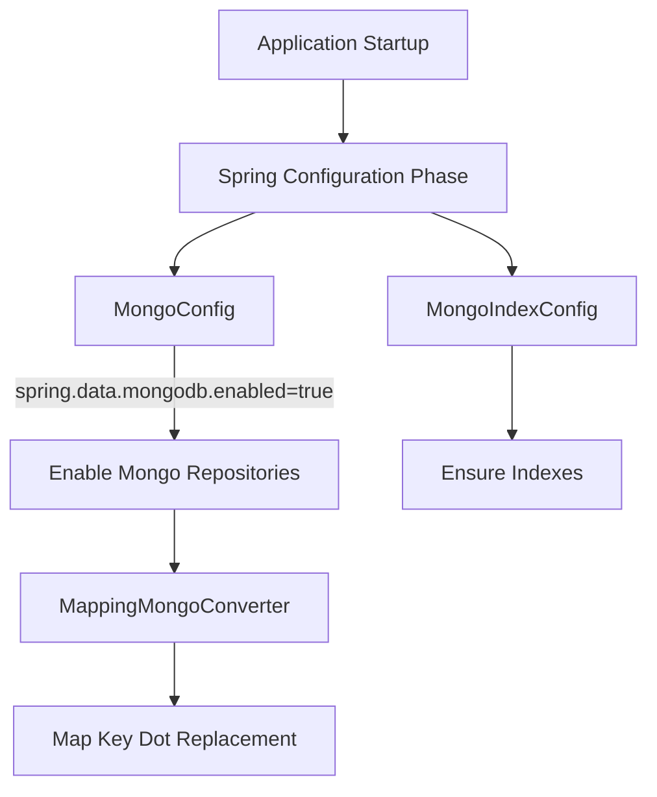
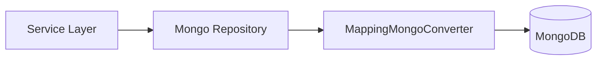

# Mongo Configuration Module

## Overview

The **configuration** module under `data_persistence_mongo` is responsible for wiring and initializing MongoDB access for OpenFrame services. It provides:

- Conditional enabling of synchronous and reactive Mongo repositories
- Custom MongoDB object mapping behavior
- Automatic auditing support
- Centralized creation of required MongoDB indexes

This module is a foundational building block used by multiple service cores (API, authorization, management, stream processors) that rely on MongoDB for persistence.

---

## Responsibilities

- Enable MongoDB repositories only when MongoDB is explicitly configured
- Support both **imperative** and **reactive** data access models
- Customize MongoDB serialization and reference handling
- Ensure required indexes exist at application startup

---

## Core Components

### MongoConfig

`MongoConfig` defines how MongoDB repositories and converters are initialized.

**Key behaviors:**

- Activates only when `spring.data.mongodb.enabled=true`
- Enables auditing annotations (for example, created/updated timestamps)
- Customizes the `MappingMongoConverter` to:
  - Register custom conversions
  - Safely replace dots in map keys with `__dot__` (MongoDB restriction)

It also conditionally enables **reactive Mongo repositories** when running in a reactive web application.

#### Configuration Variants

- **MongoConfiguration**
  - Enables blocking repositories under `com.openframe.data.repository`
  - Used by most synchronous service components

- **ReactiveMongoConfiguration**
  - Enables reactive repositories under `com.openframe.data.reactive.repository`
  - Used by reactive endpoints and streaming components

---

### MongoIndexConfig

`MongoIndexConfig` ensures critical MongoDB indexes are created automatically at startup.

**Current indexes:**

- Collection: `application_events`
  - Compound index on:
    - `userId` (ASC)
    - `timestamp` (DESC)
  - Compound index on:
    - `type` (ASC)
    - `metadata.tags` (ASC)

These indexes optimize:

- User-scoped event queries
- Time-based sorting
- Event-type and tag filtering

Indexes are created idempotently using `MongoTemplate.indexOps(...).ensureIndex(...)`.

---

## Architecture

### High-Level Configuration Flow

---

## Data Flow Interaction

### Repository Usage Path

---

## Conditional Activation

| Condition | Effect |
|---------|--------|
| `spring.data.mongodb.enabled=true` | Enables synchronous Mongo repositories |
| Reactive web application | Enables reactive Mongo repositories |
| Missing MongoDB config | Mongo persistence layer remains disabled |

This design allows OpenFrame services to be composed flexibly without forcing MongoDB usage in every deployment.

---

## Relationship to Other Modules

- **Parent module:** `data_persistence_mongo`
- **Sibling modules:**
  - `documents` – MongoDB domain models
  - `repositories` – Repository implementations

This module strictly focuses on **configuration**, while data models and access logic live in their respective sibling modules.

---

## Operational Notes

- Index creation runs at startup; large collections may experience a brief initialization delay
- Dot replacement strategy (`__dot__`) must be considered when querying map-based fields directly
- Auditing requires compatible domain annotations in document classes

---

## Summary

The Mongo configuration module provides a clean, conditional, and production-safe MongoDB setup for OpenFrame. By centralizing converter customization, repository activation, and index creation, it ensures consistent persistence behavior across all Mongo-backed services while remaining flexible for different runtime environments.
