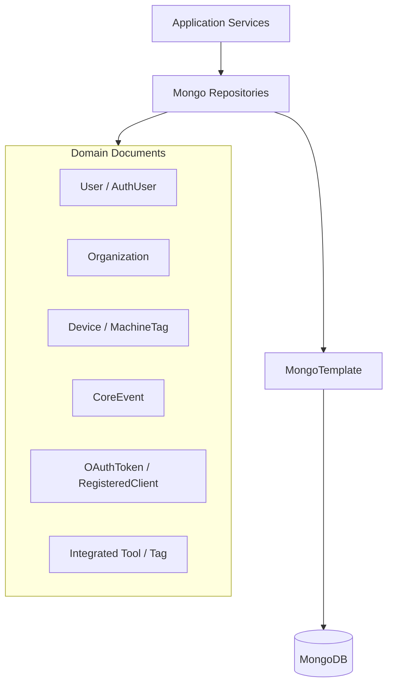
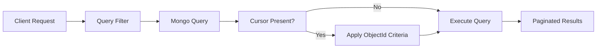

# Data Persistence Mongo

## Overview

**Data Persistence Mongo** is the primary persistence layer for the OpenFrame platform backed by MongoDB. It defines:

- MongoDB configuration and indexing
- Domain documents representing core business entities
- Blocking and reactive repositories
- Custom query, filtering, sorting, and cursor-based pagination logic

This module is consumed across the platform by API services, authorization services, management services, and stream processors to provide a consistent, tenant-aware data model.

## Responsibilities

- Configure MongoDB mappings, converters, auditing, and repository scanning
- Define MongoDB document schemas for users, organizations, devices, events, OAuth, and tools
- Provide reusable repository abstractions for blocking and reactive access
- Implement optimized MongoDB queries with filters, search, sorting, and cursor pagination
- Enforce data integrity via indexes and compound constraints

## High-Level Architecture

## Mongo Configuration

### MongoConfig

The `MongoConfig` class activates MongoDB support conditionally and configures core mapping behavior:

- Enables blocking repositories when `spring.data.mongodb.enabled=true`
- Enables reactive repositories for reactive web applications
- Configures a custom `MappingMongoConverter`

Key behaviors:

- Custom conversions support
- Safe replacement of dots in map keys using `__dot__`
- MongoDB auditing support for created and updated timestamps

### MongoIndexConfig

`MongoIndexConfig` ensures critical indexes are created at startup:

- Composite index on `application_events` for `(userId, timestamp)`
- Index on `(type, metadata.tags)` to optimize filtered event queries

Indexes are created programmatically using `MongoTemplate` during application initialization.

## Domain Documents

### User and Authentication

- **User**: Base user document with email, roles, status, and audit fields
- **AuthUser**: Extends User with tenant-aware authentication data

Key characteristics:

- Compound unique index on `(tenantId, email)`
- Supports local and external identity providers
- Tracks last login and credential metadata

### Organization

The **Organization** document represents tenant-scoped business entities:

- Unique immutable organization identifier
- Soft-delete support
- Contract lifecycle tracking
- Indexed fields for efficient search and filtering

Built-in helper methods determine contract activity and deletion state.

### Devices and Tags

- **Device**: Represents managed hardware with status, configuration, and health
- **MachineTag**: Many-to-many association between machines and tags
- **Tag**: Organization-scoped labels for tools and machines

Compound indexes enforce uniqueness and ensure efficient lookups.

### Events

- **CoreEvent**: Persistent representation of platform events
- **EventQueryFilter**: Filter object used to construct MongoDB queries

Events support:

- Date range filtering
- User and type filtering
- Full-text style search using regular expressions

### OAuth and Security

- **MongoRegisteredClient**: OAuth client registrations
- **OAuthToken**: Access and refresh token persistence

These documents are consumed directly by the Authorization Server module.

## Repository Design

### Repository Abstractions

The module defines multiple technology-agnostic base interfaces:

- BaseUserRepository
- BaseTenantRepository
- BaseApiKeyRepository
- BaseIntegratedToolRepository

These interfaces allow both blocking and reactive implementations to share a common contract.

### Blocking and Reactive Repositories

- Blocking repositories use `MongoRepository` and `MongoTemplate`
- Reactive repositories use `ReactiveMongoRepository`
- Conditional activation based on application type

### Custom Repository Implementations

Custom repositories encapsulate advanced MongoDB logic:

- Cursor-based pagination using ObjectId
- Multi-field sorting with deterministic ordering
- Dynamic query construction using filter objects
- Case-insensitive search with regex

Examples include:

- CustomOrganizationRepositoryImpl
- CustomEventRepositoryImpl
- CustomMachineRepositoryImpl
- CustomIntegratedToolRepositoryImpl

## Cursor-Based Pagination Flow

## Integration with Other Modules

**Data Persistence Mongo** is a foundational module used by:

- API Service Core for CRUD and query operations
- Authorization Server Core for OAuth and user persistence
- Management Service Core for organizations and tools
- Stream Processing Service Core for event persistence

This module does not contain business logic. It focuses strictly on persistence concerns, enabling higher-level services to remain stateless and scalable.

## Key Design Principles

- Clear separation between domain models and query filters
- Strong indexing strategy for scalability
- Consistent pagination and sorting semantics
- Support for both blocking and reactive stacks
- Tenant-aware and multi-tenant ready data models

## Summary

**Data Persistence Mongo** provides a robust, extensible, and high-performance MongoDB persistence layer for the OpenFrame platform. By centralizing document definitions, repository abstractions, and query logic, it ensures consistency and reliability across all platform services.
