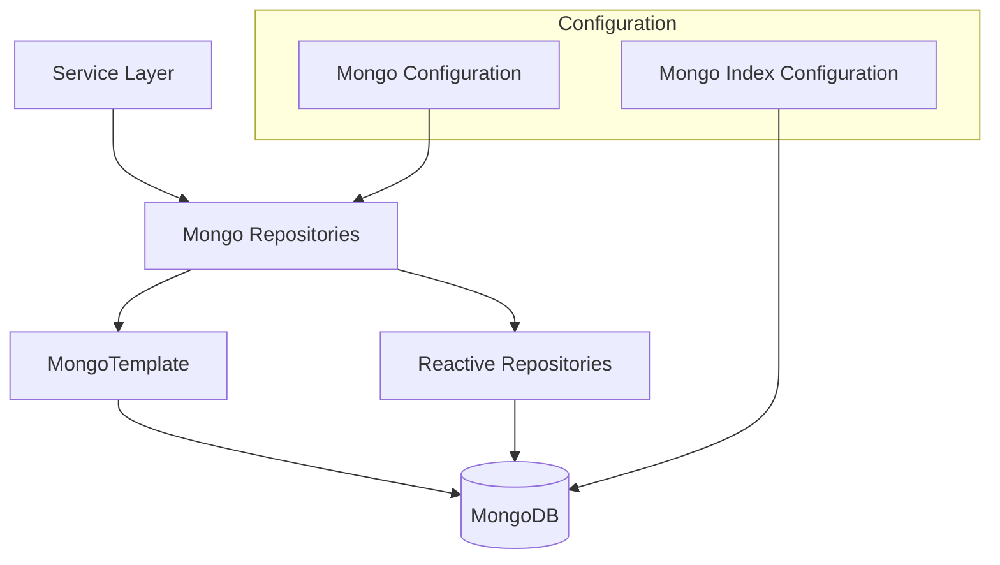
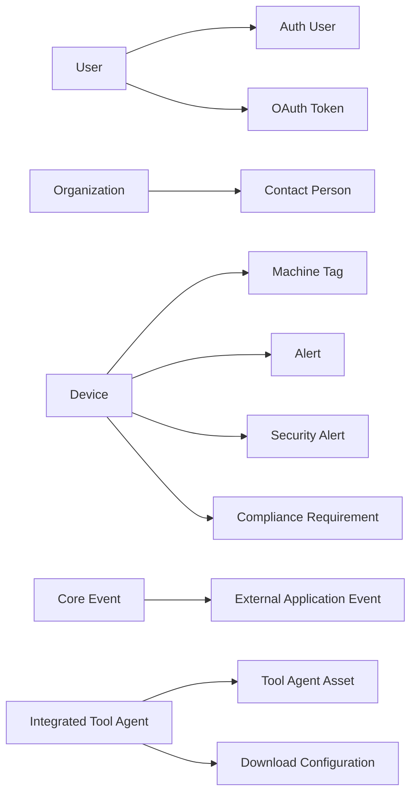
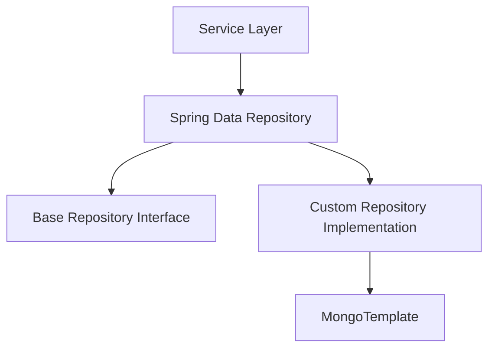

# Data Persistence Mongo

## Overview

**Data Persistence Mongo** is the primary MongoDB-based persistence layer for the OpenFrame platform. It defines:

- MongoDB configuration for both blocking (Servlet) and reactive (WebFlux) runtimes
- Domain documents representing core business entities (users, organizations, devices, events, OAuth, tools)
- Repository abstractions and custom implementations for complex querying, filtering, and cursor-based pagination
- Index initialization and performance optimizations

This module is consumed by multiple services, including API Service Core, Authorization Service Core, Management Service Core, and Stream Processing components, providing a consistent and centralized data model.

---

## Responsibilities

- Provide a unified MongoDB schema across services
- Support both reactive and non-reactive data access patterns
- Encapsulate query logic in repositories instead of services
- Enforce indexing, uniqueness, and soft-delete semantics at the data layer
- Enable multi-tenant and OAuth-related persistence

---

## High-Level Architecture

---

## Configuration Layer

### Mongo Configuration

The Mongo configuration is split to support different runtime modes:

- **Blocking / Servlet-based** applications
- **Reactive / WebFlux-based** applications

Key behaviors:

- Enables repository scanning for the correct package set
- Configures a custom `MappingMongoConverter`
- Replaces dots in map keys with `__dot__` to maintain MongoDB compatibility
- Enables Mongo auditing (`createdAt`, `updatedAt`)

This design allows the same data model to be reused across synchronous and reactive services.

### Mongo Index Configuration

Indexes are created automatically at startup using `MongoTemplate`.

Example enforced indexes:

- Compound index on application events by `userId` and `timestamp`
- Indexes on event `type` and nested `metadata.tags`

This ensures efficient querying for audit logs, activity feeds, and event analytics.

---

## Domain Model Overview

The module defines MongoDB documents grouped by functional domains.

---

## User and Authentication Documents

### User

Represents a platform user:

- Email-based identity (normalized and indexed)
- Role-based authorization
- Status lifecycle (ACTIVE, etc.)
- Audit timestamps

### Auth User

Extends the base user model with authorization-specific fields:

- Tenant-scoped identity
- Password hash or external provider reference
- Compound unique index on `(tenantId, email)`

Used primarily by the Authorization Service Core.

---

## Organization and Tenant Documents

### Organization

Represents a business entity within a tenant:

- Unique immutable `organizationId`
- Soft delete support (`deleted`, `deletedAt`)
- Contract lifecycle tracking
- Indexed fields for search and filtering

### Organization Query Filter

Encapsulates filter criteria such as:

- Category
- Employee range
- Active contract state

This enables efficient database-level filtering via custom repositories.

---

## Device and Asset Documents

### Device

Represents a managed endpoint:

- Machine and hardware identifiers
- Operational status and type
- Health and configuration snapshots

### Machine Tag

Maps tags to machines with a unique compound index:

- Prevents duplicate tag assignments
- Tracks tagging metadata

### Alerts and Compliance

Embedded-style documents representing:

- Security alerts
- Operational alerts
- Compliance requirements and evaluations

---

## Event and Audit Documents

### Core Event

Generic event representation:

- Type-based classification
- Timestamped lifecycle state
- Used by internal processing pipelines

### External Application Event

Designed for integrations and external systems:

- Flexible metadata map
- Indexed for tag-based querying
- Optimized by Mongo indexes defined at startup

### Event Query Filter

Provides structured filtering by:

- User IDs
- Event types
- Date ranges

---

## OAuth and Security Documents

### Mongo Registered Client

Persists OAuth client configuration:

- Client credentials
- Grant types and scopes
- Token lifetimes
- PKCE and consent requirements

### OAuth Token

Stores issued tokens:

- Access and refresh tokens
- Expiry timestamps
- Client association

Used by Authorization Service Core and OAuth BFF components.

---

## Tooling and Agent Documents

### Integrated Tool Agent

Defines agent-level configuration for integrated tools:

- Versioning and release control
- Installation and execution arguments
- Asset and download configuration

### Tool Agent Asset

Represents downloadable or local artifacts:

- OS-specific filenames
- Executable flags
- Source and version metadata

---

## Repository Architecture

Repositories are split into three layers:

1. **Spring Data Repositories** – CRUD and simple queries
2. **Base Repository Interfaces** – Technology-agnostic contracts
3. **Custom Repository Implementations** – Complex queries and pagination

### Key Patterns

- Cursor-based pagination using Mongo ObjectId
- Whitelisted sortable fields for safety
- Search implemented via regex with indexed fields
- Soft delete enforced at query level

---

## Reactive Support

Reactive repositories mirror blocking ones where needed:

- Reactive User Repository
- Reactive OAuth Client Repository

They:

- Implement the same base repository contracts
- Are conditionally enabled only for reactive web applications

This allows services to choose their execution model without duplicating data logic.

---

## How This Module Fits in the System

**Data Persistence Mongo** acts as the canonical MongoDB schema and access layer for OpenFrame. Other modules:

- Depend on its documents for shared data contracts
- Reuse repository logic for consistent querying behavior
- Avoid embedding Mongo-specific logic in service layers

This separation keeps business logic clean and ensures long-term maintainability of the data model.

---

## Summary

Data Persistence Mongo provides:

- A centralized MongoDB domain model
- Robust configuration for mixed reactive and blocking environments
- High-performance querying through indexes and custom repositories
- Strong support for multi-tenancy, OAuth, and integrated tools

It is a foundational module that underpins nearly every stateful service in the OpenFrame platform.
