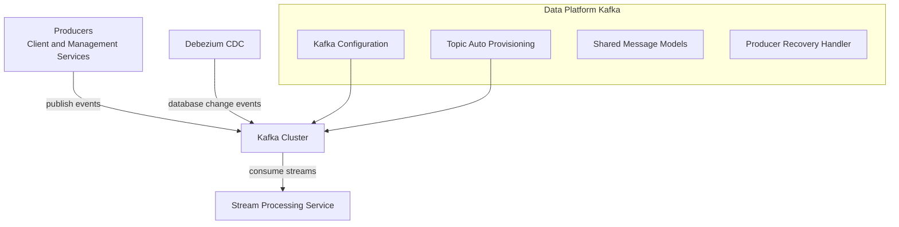
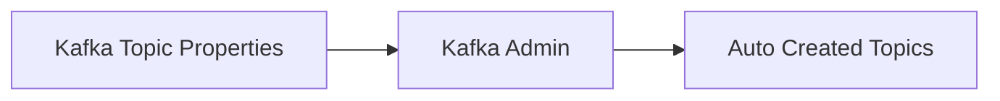
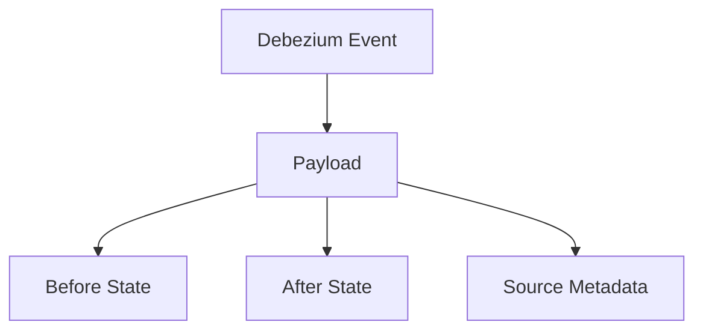

# Data Platform Kafka

## Overview

The **Data Platform Kafka** module provides the foundational Kafka infrastructure used across the OpenFrame and Flamingo platform. It standardizes how services interact with Kafka by offering:

- Centralized configuration for an OSS tenant Kafka cluster
- Strongly typed configuration properties for producers, consumers, listeners, and topics
- Automatic topic provisioning for inbound event streams
- Shared message models for Debezium-based change data capture (CDC)
- A recovery and observability mechanism for Kafka producer failures

This module does **not** implement business logic itself. Instead, it acts as a reusable infrastructure layer consumed by stream processing, management, and client-facing services.

---

## Role in the Overall Platform

Data Platform Kafka sits between **event producers** (clients, management services, CDC pipelines) and **event consumers** (stream processing services). It enables reliable, tenant-aware event streaming and integrates tightly with Spring Boot and Spring Kafka.

High-level interactions:

- Client and management services publish events through Kafka producers
- Debezium connectors emit CDC events into Kafka topics
- Stream processing services consume and enrich events
- Kafka topics are auto-created and managed consistently across environments

---

## Architecture Overview

The module is composed of several focused configuration and support components:

- **Kafka configuration layer** – replaces Spring Boot defaults with tenant-aware settings
- **Topic management** – defines and auto-creates inbound Kafka topics
- **Messaging contracts** – shared data models for Debezium payloads
- **Reliability utilities** – producer recovery handling and structured logging

All components are auto-configured and activated via Spring Boot configuration properties.

---

## Core Components

### Kafka Configuration

#### Oss Kafka Config

**Component:** `OssKafkaConfig`

This configuration explicitly disables Spring Boot’s default `KafkaAutoConfiguration` and enables Kafka support using custom, controlled settings.

Responsibilities:
- Ensures only OSS tenant Kafka settings are applied
- Prevents accidental usage of default Kafka auto-configuration
- Acts as the entry point for all Kafka-related beans in this module

---

#### Oss Tenant Kafka Properties

**Component:** `OssTenantKafkaProperties`

Defines the main configuration properties for the OSS tenant Kafka cluster. It wraps Spring’s native `KafkaProperties` while adding a top-level enable switch.

Key characteristics:
- Configuration prefix: `spring.oss-tenant`
- Enabled by default
- Supports all standard Kafka producer, consumer, admin, and listener properties

This class is the backbone for configuring bootstrap servers, serializers, consumer groups, and listener behavior across the platform.

---

### Topic Management

#### Kafka Topic Properties

**Component:** `KafkaTopicProperties`

Provides declarative configuration for Kafka topics that should be automatically created at startup.

Key features:
- Configuration prefix: `openframe.oss-tenant.kafka.topics`
- Supports multiple inbound topics
- Per-topic configuration:
  - Topic name
  - Number of partitions
  - Replication factor

When Kafka admin support is enabled, these definitions are translated into `NewTopic` beans and registered automatically.

---

### Auto Configuration and Bean Provisioning

#### Oss Tenant Kafka Auto Configuration

**Component:** `OssTenantKafkaAutoConfiguration`

This is the central auto-configuration class that wires all Kafka-related beans when Kafka is enabled for the tenant.

Provided beans include:

- **Producer Factory** – JSON value serialization, string keys
- **Kafka Template** – default topic support and shared producer usage
- **Consumer Factory** – JSON deserialization for inbound messages
- **Listener Container Factory** – concurrency, acknowledgment mode, polling, and idle settings
- **Kafka Admin** – optional topic and cluster administration
- **Tenant Kafka Producer** – simplified producer abstraction

Activation conditions:
- `spring.oss-tenant.kafka.enabled=true`

This design allows Kafka to be completely disabled in environments where it is not required.

---

### Messaging Contracts

#### Debezium Message Model

**Component:** `DebeziumMessage`

Represents a generic Debezium CDC message envelope used across the platform.

Structure highlights:
- `before` – entity state before the change
- `after` – entity state after the change
- `operation` – type of change (create, update, delete)
- `timestamp` – event timestamp
- `source` – metadata about the originating database, connector, and table or collection

This model allows stream processors to consume CDC events in a strongly typed and consistent manner.

---

### Kafka Headers

#### Kafka Header Constants

**Component:** `KafkaHeader`

Defines shared Kafka header keys used across producers and consumers.

Currently defined:
- `message-type` – used to classify or route messages at runtime

Centralizing header names avoids inconsistencies between services.

---

### Reliability and Recovery

#### Kafka Recovery Handler Implementation

**Component:** `KafkaRecoveryHandlerImpl`

Provides a fallback mechanism invoked when Kafka producer retries are exhausted.

Behavior:
- Captures topic, key, payload, and exception details
- Emits structured error logs with stack traces
- Ensures failures are observable even when messages cannot be delivered

This implementation focuses on observability and diagnostics and can be extended in the future to support dead-letter queues or external alerting.

---

## Usage Patterns

Common usage across the platform includes:

- Publishing tenant-scoped events using the OSS tenant Kafka template
- Consuming inbound events via Spring Kafka listeners
- Processing Debezium CDC messages in stream processing services
- Automatically provisioning Kafka topics during service startup

Configuration is fully externalized, allowing environments to tune performance, reliability, and scaling characteristics without code changes.

---

## Summary

The **Data Platform Kafka** module is a core infrastructure building block that standardizes Kafka usage across OpenFrame. By centralizing configuration, topic management, messaging contracts, and recovery handling, it enables:

- Consistent Kafka behavior across services
- Safer multi-tenant event streaming
- Easier onboarding of new producers and consumers
- Improved observability and operational control

This module is intentionally focused and lightweight, making it a stable foundation for higher-level streaming and data processing capabilities.
