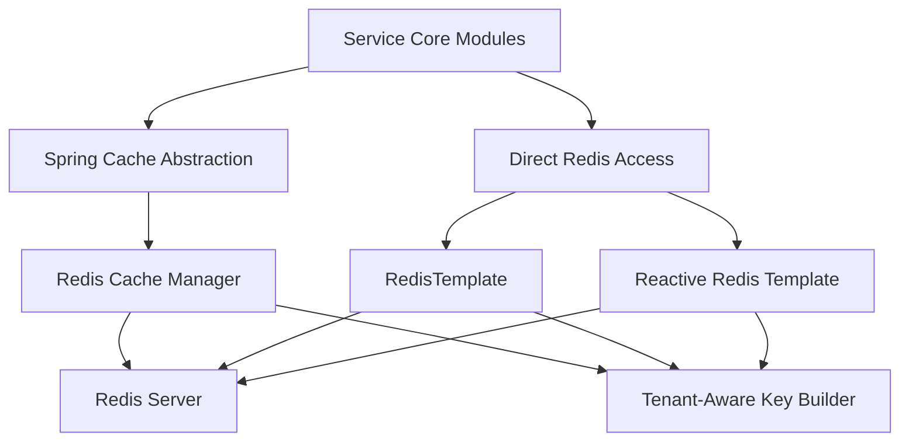

# Data Platform Redis Cache

## Overview

The **Data Platform Redis Cache** module provides a standardized, tenant-aware Redis integration for the OpenFrame data platform. It enables both **Spring Cache abstraction** and **direct Redis access** (blocking and reactive) while enforcing consistent key construction and safe defaults across services.

This module is designed to be:

- **Pluggable** – Automatically enabled only when Redis is configured
- **Tenant-aware** – Cache keys are namespaced to prevent cross-tenant data leakage
- **Framework-aligned** – Built on Spring Boot, Spring Cache, and Spring Data Redis
- **Dual-mode** – Supports both imperative and reactive access patterns

It is consumed by multiple service cores (API, Gateway, Management, Stream Processing) to improve read performance, reduce database load, and coordinate ephemeral platform state.

---

## Responsibilities

The Data Platform Redis Cache module is responsible for:

- Configuring Redis connectivity and serializers
- Enabling Spring Cache backed by Redis
- Providing blocking and reactive Redis templates
- Enforcing consistent, tenant-safe Redis key prefixes
- Acting as a shared infrastructure layer for caching and transient data

It **does not** contain business logic, domain services, or data models. Instead, it underpins other modules that require fast, distributed access to cached or temporary data.

---

## High-Level Architecture



**Key points:**
- Services interact with Redis either via Spring Cache annotations or directly
- All cache keys are generated using a shared tenant-aware strategy
- Redis remains an infrastructure dependency, not a business dependency

---

## Core Components

### Cache Configuration

**Component:** `CacheConfig`

This configuration enables Spring’s caching abstraction backed by Redis.

**Key characteristics:**

- Enabled only when Redis is explicitly turned on via configuration
- Registers a `CacheManager` if one is not already present
- Uses JSON serialization for cache values
- Disables caching of null values to avoid negative caching issues
- Applies a default time-to-live of **6 hours** for all cache entries
- Ensures all cache keys are prefixed using the shared key builder

**Conceptual cache key format:**

```text
<prefix>:<cacheName>::<entryKey>
```

This guarantees isolation between tenants and environments while remaining compatible with Spring Cache conventions.

---

### Redis Connectivity Configuration

**Component:** `RedisConfig`

This configuration defines the core Redis client beans used across the platform.

It provides:

- **Blocking access** via `RedisTemplate<String, String>`
- **Reactive access** via `ReactiveStringRedisTemplate`
- **Reactive structured access** via `ReactiveRedisTemplate<String, String>`

**Design choices:**

- Uses string serializers for keys, values, and hashes
- Keeps Redis interactions predictable and debuggable
- Supports both traditional service cores and reactive pipelines

The configuration is conditionally loaded and does not activate unless Redis is enabled, preventing unnecessary dependencies in environments that do not require caching.

---

### Redis Key Strategy

**Component:** `OpenframeRedisKeyConfiguration`

This configuration registers the shared Redis key builder used throughout the platform.

**Responsibilities:**

- Centralizes Redis key construction logic
- Injects platform and tenant metadata into keys
- Ensures consistent prefixes across cache and non-cache usage

The key builder is consumed implicitly by cache configuration and can also be used directly by services that interact with Redis outside of Spring Cache.

---

## Tenant Awareness and Isolation

A core design principle of the Data Platform Redis Cache module is **strict tenant isolation**.

- Every cache entry is namespaced
- Key prefixes are computed centrally
- No service constructs raw Redis keys independently

This approach prevents:

- Cross-tenant cache pollution
- Accidental data exposure
- Key collisions between services or environments

It also simplifies operational tasks such as cache inspection, eviction, and debugging.

---

## Usage Patterns

### Spring Cache Abstraction

Service cores typically use Spring annotations such as `@Cacheable`, `@CachePut`, and `@CacheEvict`.

The Redis-backed `CacheManager` provided by this module ensures:

- Automatic key prefixing
- Consistent serialization
- Centralized TTL management

### Direct Redis Access

For use cases that fall outside typical caching patterns, services can:

- Use `RedisTemplate` for imperative workflows
- Use `ReactiveRedisTemplate` for non-blocking pipelines

Typical scenarios include:

- Temporary coordination state
- Rate-limiting counters
- Short-lived integration metadata

---

## Interaction With Other Modules

The Data Platform Redis Cache module acts as a **shared infrastructure dependency** for:

- API and External API service cores (response caching, lookup acceleration)
- Gateway service core (rate limits, ephemeral auth data)
- Management service core (coordination and scheduling state)
- Stream processing service core (transient enrichment or deduplication state)

Rather than embedding Redis logic in each service, this module ensures a single, consistent Redis integration across the entire platform.

---

## Configuration Expectations

Although exact property values are environment-specific, this module assumes:

- Redis can be enabled or disabled via configuration
- Redis connection factories are provided by the runtime environment
- Tenant and platform identifiers are available to the key builder

When Redis is disabled, none of the beans in this module are activated, allowing services to run without modification.

---

## Summary

The **Data Platform Redis Cache** module provides a robust, tenant-safe, and framework-aligned Redis foundation for OpenFrame.

By centralizing cache configuration, Redis access patterns, and key construction, it:

- Reduces duplication across service cores
- Improves performance and scalability
- Enforces platform-wide safety and consistency

This module is a critical infrastructure building block that enables higher-level services to focus on business logic rather than caching and data access concerns.
