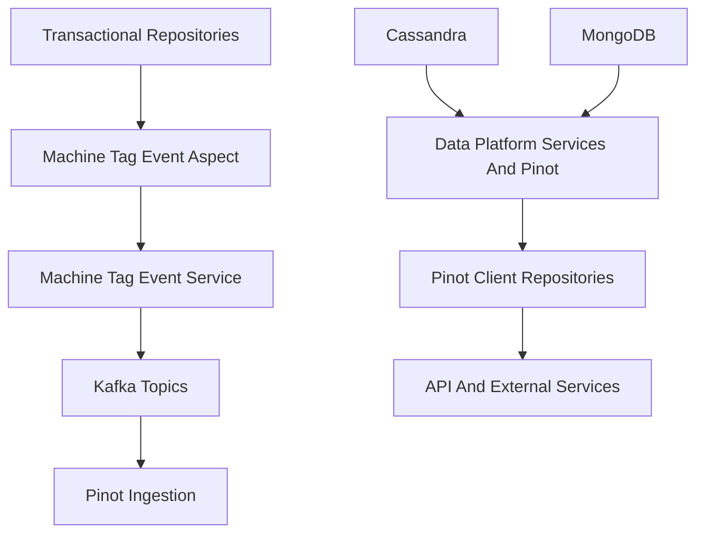
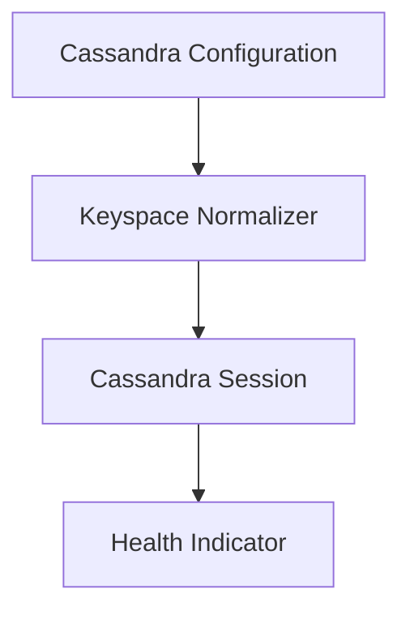
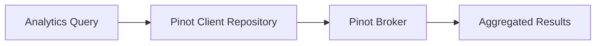
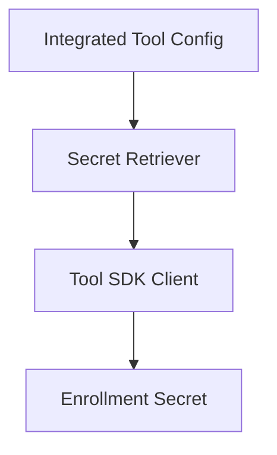

# Data Platform Services And Pinot

## Overview

Data Platform Services And Pinot is the core data foundation module of the OpenFrame platform. It is responsible for:

- Managing analytical and operational data access across Cassandra and Apache Pinot
- Emitting real-time device and tag state changes into Kafka for downstream analytics
- Providing repository abstractions for high-performance filtering, aggregation, and search
- Supplying shared data models used by stream processing, management, and API layers

This module acts as the **bridge between transactional data stores, streaming infrastructure, and analytical query engines**, ensuring that device, tag, and log data can be queried efficiently at scale.

---

## Architectural Position

Data Platform Services And Pinot sits between persistence, streaming, and query-facing services.

**Key responsibilities:**
- Detect entity changes (machines, tags)
- Publish enriched events to Kafka
- Query Apache Pinot for analytics-driven APIs
- Configure and monitor data infrastructure dependencies

---

## Core Functional Areas

### Event Detection And Streaming

**Machine Tag Event Aspect**
- Uses Spring AOP to intercept repository save and saveAll operations
- Monitors changes to machines, machine tags, and tags
- Delegates processing to a dedicated service layer

**Machine Tag Event Service**
- Aggregates machine and tag state
- Builds analytics-ready messages
- Publishes events to Kafka using tenant-aware producers

This design ensures that **any data mutation automatically propagates to analytics pipelines** without duplicating logic across repositories.

---

### Cassandra Integration

Cassandra is used for scalable, tenant-isolated operational data storage.

**Key features:**
- Conditional enablement via configuration flags
- Automatic keyspace creation if missing
- Keyspace name normalization for tenant safety
- Health checks exposed through Spring Actuator

This allows multi-tenant deployments to safely map tenant identifiers to valid Cassandra keyspaces.

---

### Apache Pinot Integration

Apache Pinot powers low-latency analytical queries for devices and logs.

**Provided capabilities:**
- Broker and controller connections
- Dynamic query construction for filtering and pagination
- Aggregation queries for filter option generation
- Cursor-based pagination for large result sets

**Pinot Client Repositories:**
- Device analytics and filter counts
- Log search, sorting, and time-range queries
- Organization option discovery for UI filters

These repositories are optimized for **high-cardinality data exploration** in dashboards and APIs.

---

### Shared Data Models

This module defines shared models used across services:

- **Integrated Tool Types**: Canonical identifiers for infrastructure and third-party tools
- **Tool Credentials**: Unified credential representation
- **NATS Message Models**: Agent lifecycle and tool installation events
- **Pinot Models**: Lightweight projections and filter option DTOs

These models reduce coupling between services while ensuring consistent semantics.

---

### Tool Integration Support

Data Platform Services And Pinot supports dynamic interaction with integrated tools.

**Agent Registration Secret Retrieval:**
- Fleet MDM
- Tactical RMM

Secrets are fetched at runtime using tool SDKs and stored integration metadata, enabling **zero-touch agent onboarding**.

---

## Configuration And Observability

### Runtime Configuration Logging

At application startup, key data-related configuration values are logged:
- MongoDB
- Cassandra
- Redis
- Pinot broker and controller endpoints

This improves operational visibility and simplifies troubleshooting in distributed environments.

### Health Monitoring

- Cassandra connectivity is continuously validated
- Failures are surfaced through standard health endpoints

---

## How This Module Fits Into The Platform

Data Platform Services And Pinot enables:

- **Stream Processing Services** to ingest enriched events
- **API Services** to serve fast analytical queries
- **Management Services** to configure and observe data pipelines
- **External APIs** to expose filtered, aggregated datasets

It acts as the **analytics backbone** of OpenFrame, transforming raw operational data into queryable insights.

---

## Summary

Data Platform Services And Pinot provides:

- Automated propagation of data changes to Kafka
- Scalable Cassandra configuration with tenant isolation
- High-performance analytical querying via Apache Pinot
- Shared models and tooling for consistent data handling

This module is essential for delivering **real-time visibility, analytics, and scalable data access** across the OpenFrame ecosystem.
