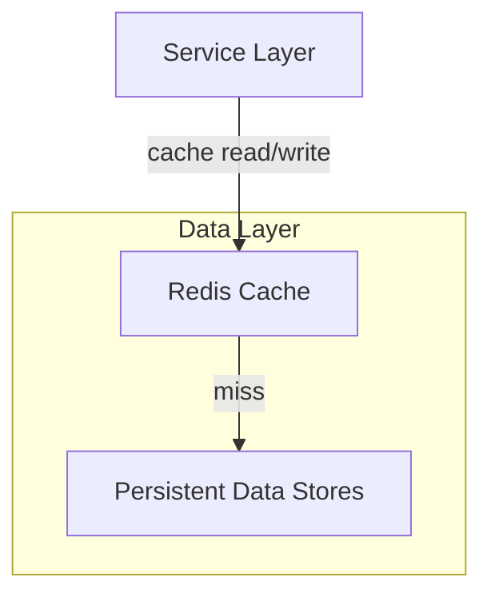
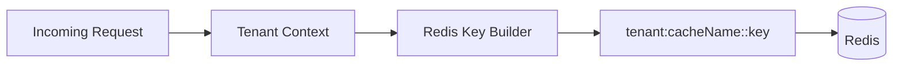

# Data Redis Cache Module

## Overview
The **data_redis_cache** module provides Redis-backed caching and key management capabilities for the OpenFrame platform. It standardizes how Redis is configured, how Spring Cache integrates with Redis, and how cache keys are generated in a **tenant-aware** manner across all services.

This module is a foundational infrastructure component used by multiple service cores (API, authorization, gateway, management, stream, etc.) to improve performance, reduce database load, and ensure consistent cache isolation between tenants.

Key goals:
- Centralized Redis configuration
- Safe enablement via feature flags
- Consistent serialization strategy
- Tenant-aware cache key generation

---

## Position in the System

The Redis cache layer sits between service-level components and persistence layers such as MongoDB, Cassandra, and Pinot.



---

## Core Components

### 1. CacheConfig
**Component:** `CacheConfig`

**Responsibility:**
- Enables Spring Cache abstraction
- Configures `RedisCacheManager`
- Defines default cache behavior

**Key Characteristics:**
- Enabled only when the `spring.redis.enabled` property is set to `true`
- Default TTL of **6 hours** for cache entries
- Null values are not cached
- Uses string keys and JSON-serialized values
- Applies tenant-aware cache key prefixes by default

**Why it matters:**
This ensures all caches across the platform follow the same lifecycle rules and are isolated per tenant without requiring each service to implement custom logic.

---

### 2. RedisConfig
**Component:** `RedisConfig`

**Responsibility:**
- Provides Redis client beans for both blocking and reactive use cases
- Enables Redis repositories

**Provided Beans:**
- `RedisTemplate<String, String>`
- `ReactiveStringRedisTemplate`
- `ReactiveRedisTemplate<String, String>`

**Design Notes:**
- All serializers are string-based for predictability and interoperability
- Reactive templates support non-blocking services such as gateway and stream processors
- Configuration is activated only when Redis is explicitly enabled

---

### 3. OpenframeRedisKeyConfiguration
**Component:** `OpenframeRedisKeyConfiguration`

**Responsibility:**
- Registers the `OpenframeRedisKeyBuilder`
- Binds Redis key-related properties

**Key Behavior:**
- Ensures a single, shared strategy for generating Redis keys
- Allows customization through configuration properties

This component is critical for enforcing consistent key formats across caching, distributed locks, and other Redis-backed features.

---

## Tenant-Aware Cache Keys

One of the most important features of this module is **tenant isolation** at the cache key level.



**Benefits:**
- Prevents data leakage between tenants
- Enables safe multi-tenant deployments on shared Redis clusters
- Makes cache eviction and debugging easier

---

## Configuration Requirements

To enable Redis caching in a service:

```text
spring.redis.enabled=true
```

If this property is missing or set to `false`:
- Redis beans are not created
- Spring Cache falls back to default behavior or is disabled

This makes Redis caching an **opt-in capability**, suitable for different deployment profiles.

---

## Interaction With Other Modules

The **data_redis_cache** module is commonly used alongside:
- Data persistence modules (MongoDB, Cassandra)
- API and authorization service cores
- Gateway and stream processing services

Rather than duplicating Redis logic in each service, this module provides a shared, opinionated implementation that all services can rely on.

For details on how cached data is ultimately persisted, refer to the data persistence modules in the platform documentation.

---

## Summary

The **data_redis_cache** module:
- Standardizes Redis usage across OpenFrame
- Provides safe, tenant-aware caching
- Supports both synchronous and reactive access patterns
- Is conditionally enabled for flexible deployments

It plays a critical role in performance optimization and multi-tenant safety throughout the platform.
