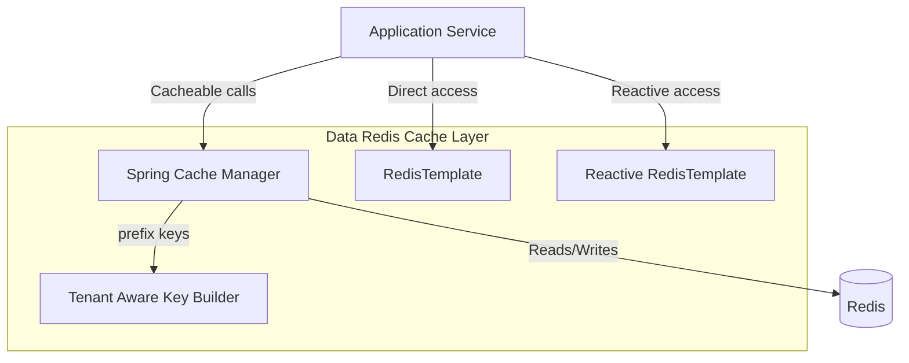

# Data Redis Cache Layer

## Overview
The **data_redis_cache_layer** module provides Redis-based caching and key management for the OpenFrame platform. It integrates Spring Cache, Redis templates (blocking and reactive), and a tenant-aware key strategy to ensure safe, scalable, and multi-tenant caching across services.

This module is a shared infrastructure dependency used by multiple services such as API services, gateway, authorization server, and management services to improve performance and reduce load on primary data stores like MongoDB.

## Responsibilities
- Enable and configure Redis as a caching backend
- Provide a standardized `CacheManager` with sane defaults
- Expose blocking and reactive Redis templates
- Enforce tenant-aware Redis key construction
- Centralize Redis-related configuration behind feature flags

## High-Level Architecture



## Core Components

### 1. Cache Configuration
**Component:** `CacheConfig`

- Enables Spring Cache abstraction
- Creates a `RedisCacheManager` if Redis is enabled
- Applies global cache defaults:
  - TTL: 6 hours
  - JSON value serialization
  - String key serialization
  - Null values are not cached
- Uses a tenant-aware key prefix strategy

See detailed documentation: [Cache Configuration.md](Cache Configuration.md)

---

### 2. Redis Connection and Templates
**Component:** `RedisConfig`

- Conditionally enables Redis repositories
- Exposes blocking and reactive Redis templates
- Uses string serialization for keys and values
- Supports both imperative and reactive programming models

See detailed documentation: [Redis Templates.md](Redis Templates.md)

---

### 3. Redis Key Strategy
**Component:** `OpenframeRedisKeyConfiguration`

- Registers a singleton `OpenframeRedisKeyBuilder`
- Loads Redis key-related properties
- Ensures all cache keys are tenant-aware by default

See detailed documentation: [Redis Key Management.md](Redis Key Management.md)

## How This Module Fits in the Platform

- **API Services**: Cache frequently accessed domain data (organizations, devices, users)
- **Gateway Service**: Temporary data and rate-limiting helpers
- **Authorization Server**: Token- and client-related transient data
- **Management Services**: Reduce read pressure during administrative operations

Primary data persistence remains handled by the [data_mongo_layer](data_mongo_layer.md), while Redis acts as a fast-access cache and ephemeral store.

## Configuration Flags

Redis features are fully opt-in and controlled via configuration:

```text
spring.redis.enabled=true
```

If Redis is disabled, all beans in this module are skipped safely.

## Design Principles

- **Tenant Isolation**: All keys include tenant context
- **Fail-Safe Defaults**: Conditional bean creation prevents conflicts
- **Performance First**: JSON serialization and TTL-based eviction
- **Reactive Ready**: Native support for WebFlux-based services

## Summary

The **data_redis_cache_layer** is a foundational infrastructure module that standardizes Redis usage across OpenFrame services. By combining Spring Cache, Redis templates, and tenant-aware key management, it delivers safe, scalable, and high-performance caching without leaking cross-tenant data.
