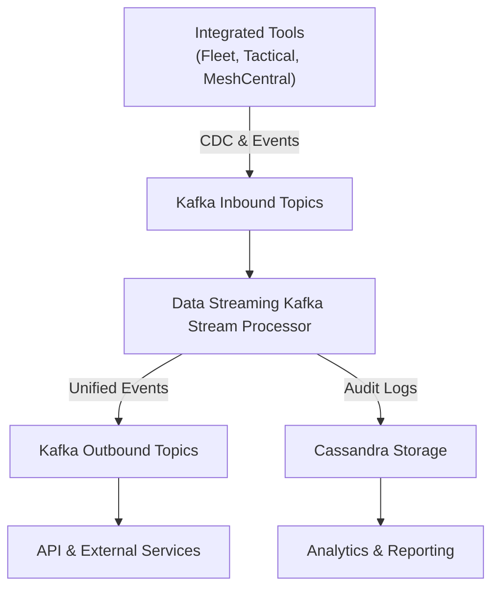
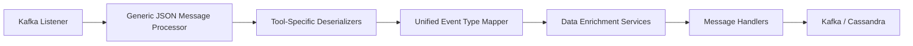
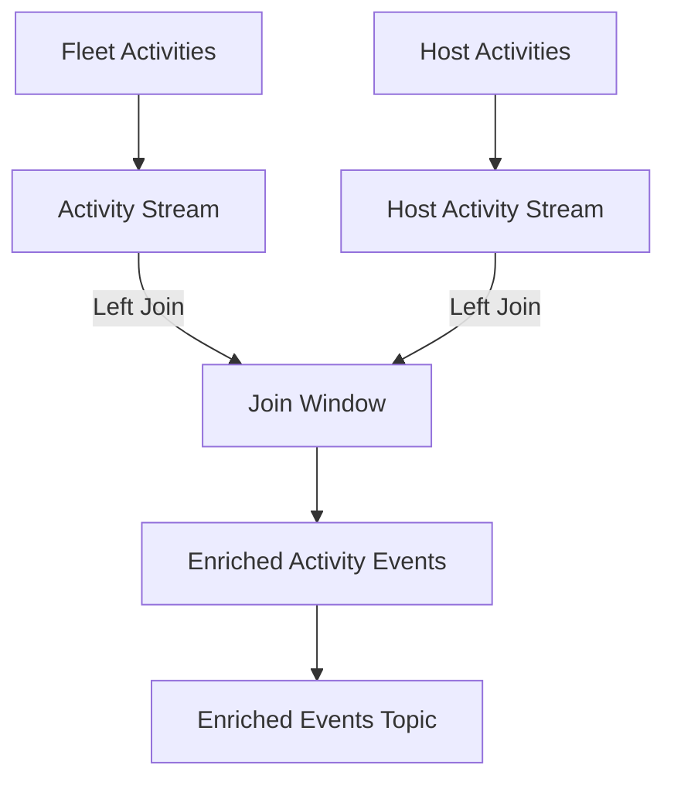
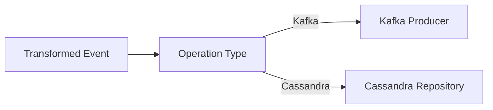

# Data Streaming Kafka Stream Processor

## Overview

The **Data Streaming Kafka Stream Processor** is the core event-processing and stream-enrichment module within the OpenFrame platform. It consumes change data capture (CDC) events and operational events from multiple integrated tools (Fleet MDM, Tactical RMM, MeshCentral) via Kafka, normalizes them into unified event models, enriches them with tenant and device context, and routes them to downstream destinations such as Kafka topics and Cassandra for long-term storage.

This module is a foundational part of the OpenFrame real-time data pipeline. It enables:

- Near–real-time processing of integrated tool events
- Consistent, unified event semantics across heterogeneous tools
- Scalable Kafka Streams–based enrichment and correlation
- Fan-out of enriched events to analytics, audit, and API layers

The **Data Streaming Kafka Stream Processor** is deployed as the Stream Application entrypoint and integrates tightly with persistence, caching, and messaging layers across the platform.

---

## Position in the Platform Architecture

Within the overall OpenFrame stack, this module sits between event producers (Debezium connectors and integrated tools) and event consumers (data persistence, APIs, analytics, and notifications).

---

## Core Responsibilities

The **Data Streaming Kafka Stream Processor** is responsible for the following high-level functions:

1. **Kafka Consumption**
   - Listens to multiple inbound Kafka topics for integrated tool events
   - Routes messages based on message type headers

2. **Event Deserialization**
   - Parses tool-specific event payloads
   - Extracts agent, event, timestamp, and message data

3. **Event Normalization**
   - Maps tool-specific event types to unified event types
   - Produces consistent, cross-tool semantics

4. **Stream Enrichment**
   - Joins related event streams (for example, Fleet activities and host activities)
   - Enriches events with device, user, and organization metadata

5. **Message Handling and Routing**
   - Applies operation semantics (create, read, update, delete)
   - Routes processed events to Kafka or Cassandra destinations

---

## High-Level Processing Flow

The end-to-end processing flow inside the **Data Streaming Kafka Stream Processor** follows a well-defined pipeline.

---

## Configuration Layer

### Kafka Configuration

The Kafka configuration layer defines converters and base Kafka settings used throughout the module.

- **KafkaConfig**
  - Provides a converter from Kafka message headers to `MessageType`
  - Ensures message routing can be performed based on event type metadata

- **KafkaStreamsConfig**
  - Configures Kafka Streams application settings
  - Defines application ID construction using tenant or cluster identifiers
  - Registers JSON serdes for typed Debezium messages

Key characteristics:

- At-least-once processing guarantee
- Tenant-aware application IDs
- Explicit state directory configuration for stream state

---

## Kafka Streams Enrichment

### Activity Enrichment Service

The **Activity Enrichment Service** uses Kafka Streams to correlate Fleet MDM activity events with host activity events.

Key behaviors:

- Consumes activity and host-activity topics
- Joins streams within a bounded time window
- Enriches activity events with host and agent identifiers
- Adds required Kafka headers for downstream compatibility

This stream-based enrichment enables accurate attribution of events to specific devices and agents.

---

## Event Deserialization Layer

The **Data Streaming Kafka Stream Processor** includes multiple tool-specific deserializers, each responsible for translating raw CDC payloads into structured internal representations.

### Supported Deserializers

- **Fleet Event Deserializer**
  - Handles Fleet MDM activity events
  - Maps activity types to human-readable messages

- **Fleet Query Result Event Deserializer**
  - Processes query execution results
  - Enriches messages using cached query metadata

- **MeshCentral Event Deserializer**
  - Parses embedded JSON payloads
  - Extracts composite event identifiers

- **Tactical RMM Agent History Deserializer**
  - Handles command and script execution lifecycle events
  - Extracts results, errors, and execution metadata

- **Tactical RMM Audit Event Deserializer**
  - Processes audit log events
  - Preserves original audit details for traceability

Each deserializer declares the `MessageType` it supports, enabling dynamic dispatch during processing.

---

## Unified Event Mapping

### Event Type Mapper

The **Event Type Mapper** translates tool-specific source event types into platform-wide unified event types.

Key properties:

- Tool-aware mapping keys
- Centralized registration of mappings
- Graceful fallback to `UNKNOWN` for unmapped events

This mapping layer ensures consistent semantics across all integrated tools and downstream consumers.

---

## Data Enrichment Services

### Integrated Tool Data Enrichment Service

This service enriches deserialized events with contextual data retrieved from caches.

Enrichment includes:

- Machine identifiers
- Hostnames
- Organization identifiers and names

The service relies on cached machine and organization data to avoid synchronous database calls during stream processing.

---

## Message Handling and Destinations

### Generic Message Handling

At the core of the processing pipeline is a generic message handler abstraction that:

- Applies operation semantics (create, read, update, delete)
- Delegates transformed messages to destination-specific handlers

### Destination-Specific Handlers

- **Debezium Kafka Message Handler**
  - Publishes unified events to outbound Kafka topics
  - Uses tenant-aware retrying Kafka producers

- **Debezium Cassandra Message Handler**
  - Persists unified log events to Cassandra
  - Builds composite keys optimized for time-series queries

---

## Utility Components

### Timestamp Parser

The **Timestamp Parser** provides a shared utility for converting ISO 8601 timestamps into epoch milliseconds.

This utility ensures consistent timestamp handling across all deserializers and handlers.

---

## Integration with Other Modules

The **Data Streaming Kafka Stream Processor** integrates closely with:

- **Data Persistence Mongo** for cached metadata and enrichment
- **Management Service Core** for Debezium connector lifecycle
- **API Service Core** and **External API Service Core** as downstream consumers of unified events

Rather than duplicating responsibilities, this module focuses exclusively on streaming, enrichment, and routing.

---

## Summary

The **Data Streaming Kafka Stream Processor** is the real-time backbone of OpenFrame’s event architecture. By combining Kafka Streams, Debezium CDC, and structured enrichment pipelines, it transforms raw operational data into actionable, unified events that power analytics, auditing, and user-facing APIs across the platform.
