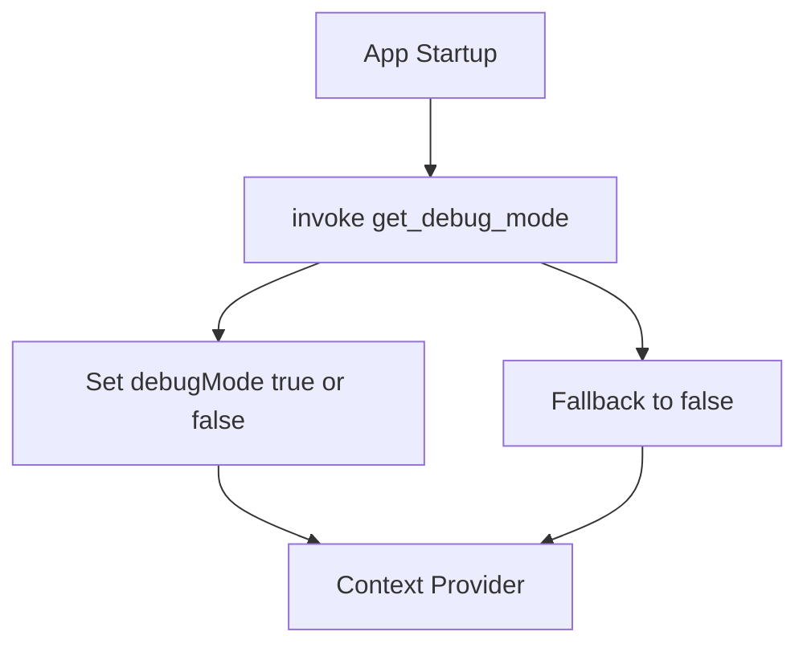

# DebugModeContext

## Purpose
`DebugModeContext` provides a global React context that exposes whether the application is running in **debug mode**. This is primarily used in the Tauri-based desktop environment to toggle logging, diagnostics, and development-only UI behavior.

---

## Core Component
- **DebugModeContextType** – Defines the shape of the debug context.

---

## Responsibilities

- Fetch debug-mode state from the native (Rust/Tauri) layer
- Expose `debugMode` and `setDebugMode` to React components
- Ensure consistent debug behavior across the application

---

## Lifecycle

---

## Usage Pattern

- Wrap the application (or chat root) with `DebugModeProvider`
- Access debug state via the `useDebugMode` hook

This ensures that all descendant components can safely read debug state without directly calling Tauri APIs.

---

## Integration Points

- **Tauri Runtime**: Uses `invoke('get_debug_mode')`
- **Chat UI Components**: Conditionally enable debug output or mock services

---

## Error Handling

If the debug mode cannot be fetched from the native layer:
- The context defaults to `false`
- An error is logged to the console
- The application continues to function normally
