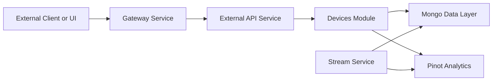
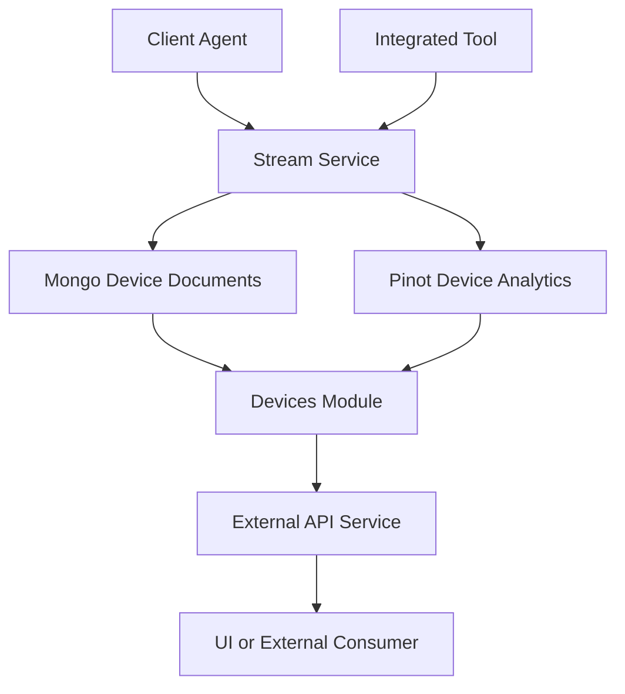
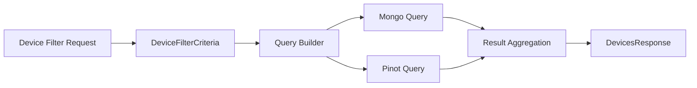

# Devices Module

## Overview

The **Devices module** provides read-oriented access to managed devices within the OpenFrame platform. It is responsible for exposing device inventories, metadata, tags, and filter capabilities to external consumers (UI, integrations, and APIs) in a secure, tenant-aware manner.

This module lives under the **external-api-service** and focuses on **querying and presenting device state**, not mutating device data. Device lifecycle changes originate from agent connections, tool integrations, and stream processing pipelines, while the Devices module aggregates and exposes that data.

Key responsibilities:
- List and paginate devices per tenant
- Apply rich filtering (status, organization, tags, tools)
- Expose normalized device representations
- Surface tag metadata for UI filtering

---

## Position in the Platform

At a high level, the Devices module sits at the boundary between **external consumers** and the **internal data + stream layers**.

**Key points:**
- The module is **read-only** from an API perspective
- Device data is continuously enriched by the Stream Service
- MongoDB provides authoritative device metadata
- Pinot is used for high-volume analytical queries when needed

---

## Core Components

The Devices module is composed of DTOs and filtering primitives that define its public contract.

### DeviceController (External API)

Although implemented in the External API service, the DeviceController is the primary entry point for this module. It:
- Accepts filter and pagination criteria
- Delegates queries to underlying services and repositories
- Returns normalized device responses

### Data Transfer Objects (DTOs)

#### DeviceResponse
Represents a single device returned to clients.

Typical fields include:
- Device identifier
- Hostname / display name
- Organization reference
- Connection and health status
- Installed agents and tools
- Associated tags

#### DevicesResponse
Wraps a paginated list of devices along with metadata.

- List of DeviceResponse objects
- Pagination details (page, size, total)

#### DeviceFilterCriteria
Defines the filter inputs supported by the module.

Common criteria:
- Organization identifiers
- Device status (online, offline, degraded)
- Tags
- Tool or agent presence
- Search text (hostname, identifier)

#### DeviceFilterResponse
Provides available filter values for building UI filters dynamically.

- Distinct organizations
- Available tags
- Tool presence options
- Status counts

#### TagResponse
Represents tag metadata associated with devices.

- Tag identifier
- Display name
- Usage counts (optional)

---

## Data Flow

The following diagram illustrates how device data flows from ingestion to API consumption.

**Explanation:**
- Agents and tools emit events
- Stream Service normalizes and enriches events
- Data is persisted and indexed
- Devices module aggregates and exposes the result

---

## Filtering and Query Model

The Devices module is optimized for **filter-first access patterns**, enabling fast UI interactions and API queries.

**Design notes:**
- MongoDB is preferred for entity-centric queries
- Pinot is leveraged for high-cardinality or analytical dimensions
- Results are merged and normalized before returning

---

## Relationship to Other Modules

- **Stream Service**: Supplies continuous device state updates
- **Client Service**: Registers agents that ultimately become devices
- **Management Service**: Initializes tool agents and device-related configuration
- **Data Layer (Mongo / Pinot)**: Stores and indexes device information
- **Gateway Service**: Secures and routes external traffic

This separation ensures that device querying scales independently from ingestion and processing.

---

## Security and Tenancy

- All device queries are **tenant-scoped**
- Authentication and authorization are enforced upstream (Gateway and Security modules)
- The Devices module assumes a resolved tenant context and does not perform identity resolution itself

---

## Extensibility Considerations

The module is designed to evolve without breaking consumers:

- New filter fields can be added to DeviceFilterCriteria
- Additional attributes can be appended to DeviceResponse
- Backend data sources can be optimized transparently

This makes the Devices module suitable for both UI-driven exploration and automation-heavy API usage.

---

## Summary

The Devices module acts as the **single source of truth for device visibility** in OpenFrame. By aggregating data from agents, tools, and streams, and exposing it through a clean, filterable API, it enables operators, automations, and integrations to reason about their managed environments efficiently and securely.