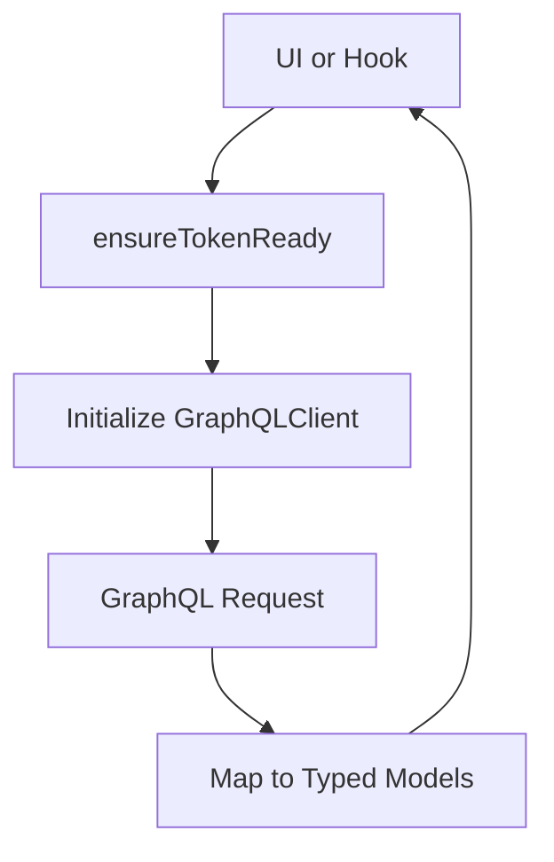
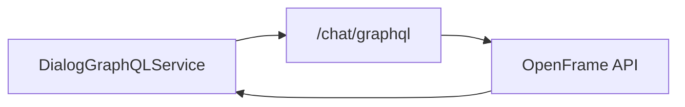

# DialogGraphQLService

## Purpose
`DialogGraphQLService` encapsulates all GraphQL communication related to chat dialogs and messages. It provides a typed, token-aware client for retrieving resumable dialogs and paginated message history.

---

## Core Responsibilities

- Initialize and cache a GraphQL client
- Attach authentication headers dynamically
- Fetch resumable dialogs for session recovery
- Retrieve complete dialog message history with pagination

---

## Internal Architecture

---

## Supported Operations

### Resumable Dialog
- Retrieves the active or last unresolved dialog
- Enables seamless continuation across sessions

### Dialog Messages
- Cursor-based pagination
- Automatic page traversal
- Supports multiple message data types:
  - Text
  - Tool execution
  - Approval flows
  - Error responses

---

## Data Flow to Backend

---

## Error Handling

- Network or auth errors are caught and logged
- Methods return `null` instead of throwing
- Client can be reset using `dispose()`

---

## Integration Points

- **TokenService** – Supplies tokens and API base URL
- **frontend_service_core_mingo_chat** – Consumes dialog and message data

---

## Design Notes

- The service is stateful but disposable
- Headers are refreshed when tokens change
- Pagination is abstracted away from callers
