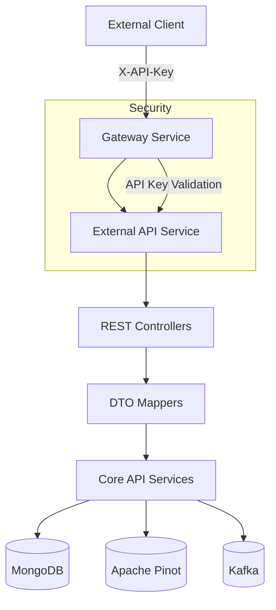
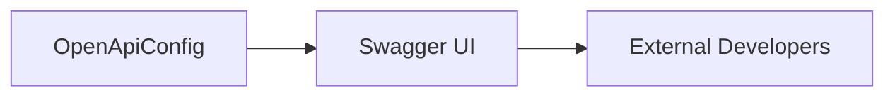
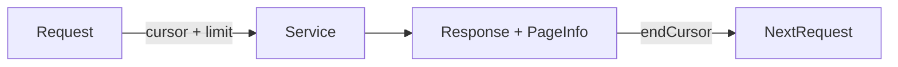

# External API Service

## Overview
The **External API Service** exposes a stable, API-key–secured REST interface that allows third‑party systems and integrations to interact with the OpenFrame platform. It is designed for **programmatic access** to operational data such as events, logs, devices, organizations, and integrated tools.

This service is intentionally decoupled from the internal GraphQL and UI-facing APIs. It focuses on:

- Secure API‑key authentication
- Predictable REST semantics
- Cursor‑based pagination for large datasets
- Filtering and sorting primitives optimized for automation

It is typically consumed by:
- External integrations (SIEMs, reporting tools, MSP automations)
- Partners building against OpenFrame
- Internal automation jobs requiring API‑key access

---

## Entry Point

The service boots from the Spring Boot application below:

```java
@SpringBootApplication
@ComponentScan(basePackages = {
    "com.openframe.external",
    "com.openframe.data",
    "com.openframe.core",
    "com.openframe.api",
    "com.openframe.kafka"
})
public class ExternalApiApplication {
    public static void main(String[] args) {
        SpringApplication.run(ExternalApiApplication.class, args);
    }
}
```

Key implications:
- Reuses **core API services** (`com.openframe.api.service.*`)
- Shares **data-layer** modules (Mongo, Pinot, Kafka)
- Adds a thin REST + DTO + mapping layer on top

---

## High-Level Architecture



**Key points**:
- Authentication is enforced via API keys propagated by the Gateway
- Business logic is **not duplicated** — it delegates to shared core services
- External API focuses on **representation, filtering, and pagination**

---

## Authentication Model

All endpoints require an API key passed via header:

```text
X-API-Key: ak_<key_id>.sk_<secret>
```

At runtime:
1. Gateway validates and rate‑limits the key
2. Key metadata is injected into headers (e.g. `X-API-Key-Id`)
3. External API uses this context for authorization and auditing

---

## OpenAPI / Swagger

The OpenAPI configuration is centralized in `OpenApiConfig` and automatically published.

Key features:
- API‑key security scheme
- Grouped under `external-api`
- Excludes internal and actuator endpoints



---

## Module Structure

The External API Service is organized by **resource domain**:

| Domain | Description | Documentation |
|------|------------|---------------|
| Events | Platform and integration events | [events.md](events.md) |
| Logs | Audit and operational logs | [logs.md](logs.md) |
| Tools | Integrated tools metadata | [tools.md](tools.md) |
| Devices | Managed devices inventory | [devices.md](devices.md) |
| Organizations | Tenant organizations | [organizations.md](organizations.md) |

Each domain follows the same pattern:
- REST Controller
- Filter & pagination DTOs
- Response DTOs
- Mapper delegating to core services

---

## Pagination & Sorting Model

The service uses **cursor‑based pagination** to ensure consistency at scale.



Shared DTOs:
- `PaginationCriteria`
- `SortCriteria`

Limits:
- Default: 20
- Maximum: 100

---

## Error Handling

All endpoints return structured errors:

- `400` – Invalid parameters
- `401` – Missing or invalid API key
- `404` – Resource not found
- `429` – Rate limit exceeded
- `500` – Internal error

Errors are returned using `ErrorResponse` from `core`.

---

## Relationship to Other Services

- **Gateway Service**: Authentication, rate limiting, routing
- **API Service**: Business logic and domain services
- **Data Layer**: MongoDB, Pinot, Kafka
- **Authorization Server**: Indirectly involved via key provisioning

This service is intentionally **read‑heavy** and optimized for integration workloads.

---

## See Also

- Events API: [events.md](events.md)
- Logs API: [logs.md](logs.md)
- Tools API: [tools.md](tools.md)
- Devices API: [devices.md](devices.md)
- Organizations API: [organizations.md](organizations.md)
