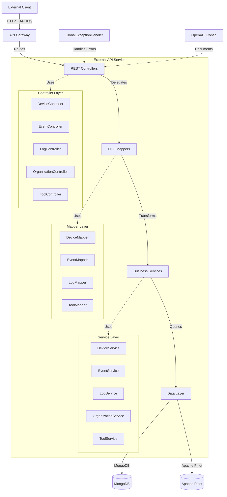
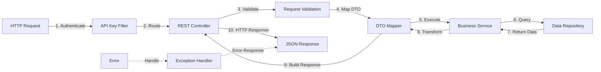
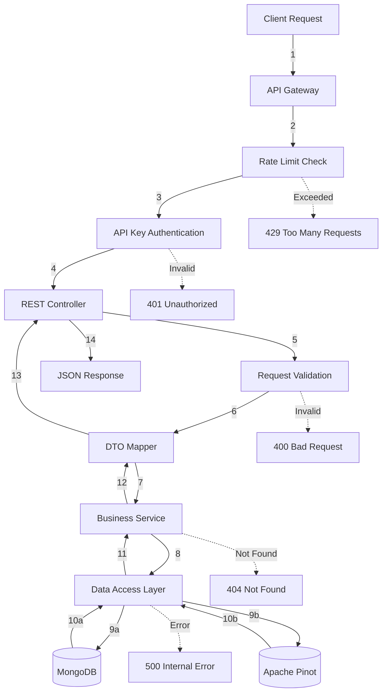
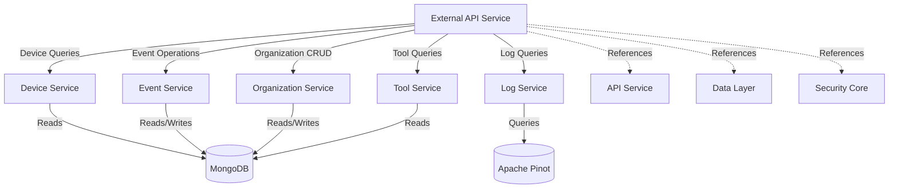

# External API Service

## Overview

The **External API Service** is a RESTful API gateway that provides programmatic access to OpenFrame platform functionality for external integrations and third-party applications. It exposes a comprehensive set of endpoints for managing devices, events, logs, organizations, and integrated tools through API key-based authentication.

This service is designed for:
- **Third-party integrations** requiring programmatic access to OpenFrame data
- **Custom automation scripts** and workflows
- **External monitoring and reporting tools**
- **Partner applications** that need to interact with OpenFrame resources

### Key Features

- 🔐 **API Key Authentication** - Secure access using API key credentials
- 📊 **Comprehensive Resource Access** - Full CRUD operations on devices, events, logs, organizations, and tools
- 🔍 **Advanced Filtering & Search** - Powerful query capabilities with cursor-based pagination
- 📈 **Rate Limiting** - Built-in rate limiting to protect service availability
- 📝 **OpenAPI Documentation** - Interactive Swagger UI for API exploration
- 🎯 **RESTful Design** - Standard HTTP methods and status codes
- 🔄 **Cursor-based Pagination** - Efficient pagination for large datasets

---

## Architecture Overview

The External API Service follows a layered architecture pattern, separating concerns between REST controllers, service layer, data access, and cross-cutting concerns like authentication and error handling.



### Component Interaction Flow



---

## Sub-Modules

The External API Service is organized into the following sub-modules:

### 1. [REST Controllers](./external_api_rest_controllers.md)

Handles HTTP request routing and response formatting for all API endpoints.

**Core Components:**
- `DeviceController` - Device management endpoints
- `EventController` - Event tracking and retrieval
- `LogController` - System log access and filtering
- `OrganizationController` - Organization CRUD operations
- `ToolController` - Integrated tools management

**Responsibilities:**
- HTTP request/response handling
- Request parameter validation
- OpenAPI documentation annotations
- Delegating business logic to services

### 2. [DTO Mappers](./external_api_dto_mappers.md)

Transforms between internal domain models and external API DTOs (Data Transfer Objects).

**Core Components:**
- `DeviceMapper` - Device entity to DTO mapping
- `EventMapper` - Event entity to DTO mapping
- `LogMapper` - Log entity to DTO mapping
- `ToolMapper` - Tool entity to DTO mapping

**Responsibilities:**
- Entity to DTO transformation
- DTO to entity transformation
- Filter criteria mapping
- Pagination metadata conversion

### 3. [Configuration](./external_api_configuration.md)

Configures the External API service including OpenAPI documentation and security settings.

**Core Components:**
- `OpenApiConfig` - Swagger/OpenAPI configuration
- `ExternalApiApplication` - Spring Boot application entry point

**Responsibilities:**
- OpenAPI/Swagger UI setup
- API documentation metadata
- Component scanning configuration
- Application bootstrapping

### 4. [Exception Handling](./external_api_exception_handling.md)

Centralized error handling and response formatting for all API errors.

**Core Components:**
- `GlobalExceptionHandler` - Centralized exception handling
- Custom exception classes (DeviceNotFoundException, EventNotFoundException, etc.)

**Responsibilities:**
- HTTP error response formatting
- Exception to error code mapping
- Error logging and monitoring
- Consistent error response structure

---

## API Endpoints Overview

### Device Management

| Endpoint | Method | Description |
|----------|--------|-------------|
| `/api/v1/devices` | GET | List devices with filtering and pagination |
| `/api/v1/devices/{machineId}` | GET | Get device details by machine ID |
| `/api/v1/devices/{machineId}` | PATCH | Update device status |
| `/api/v1/devices/filters` | GET | Get available device filter options |

### Event Management

| Endpoint | Method | Description |
|----------|--------|-------------|
| `/api/v1/events` | GET | List events with filtering and pagination |
| `/api/v1/events/{id}` | GET | Get event details by ID |
| `/api/v1/events` | POST | Create a new event |
| `/api/v1/events/{id}` | PUT | Update an existing event |
| `/api/v1/events/filters` | GET | Get available event filter options |

### Log Management

| Endpoint | Method | Description |
|----------|--------|-------------|
| `/api/v1/logs` | GET | List logs with filtering and pagination |
| `/api/v1/logs/details` | GET | Get detailed log information |
| `/api/v1/logs/filters` | GET | Get available log filter options |

### Organization Management

| Endpoint | Method | Description |
|----------|--------|-------------|
| `/api/v1/organizations` | GET | List organizations with filtering |
| `/api/v1/organizations/{id}` | GET | Get organization by database ID |
| `/api/v1/organizations/by-organization-id/{organizationId}` | GET | Get organization by business ID |
| `/api/v1/organizations` | POST | Create a new organization |
| `/api/v1/organizations/{id}` | PUT | Update an existing organization |
| `/api/v1/organizations/{id}` | DELETE | Delete an organization |

### Tool Management

| Endpoint | Method | Description |
|----------|--------|-------------|
| `/api/v1/tools` | GET | List integrated tools with filtering |
| `/api/v1/tools/filters` | GET | Get available tool filter options |

---

## Authentication & Security

### API Key Authentication

All endpoints require authentication using an API key in the `X-API-Key` header:

```bash
curl -H "X-API-Key: ak_your_key_id.sk_your_secret_key" \
  https://api.openframe.ai/external-api/api/v1/devices
```

**API Key Format:**
- `ak_` prefix for key ID
- `sk_` prefix for secret key
- Combined format: `ak_keyId.sk_secretKey`

### Rate Limiting

API requests are rate-limited based on your API key configuration:

| Period | Default Limit |
|--------|---------------|
| Per Minute | 100 requests |
| Per Hour | 1,000 requests |
| Per Day | 10,000 requests |

**Rate Limit Headers:**
```text
X-RateLimit-Limit-Minute: 100
X-RateLimit-Remaining-Minute: 95
X-RateLimit-Limit-Hour: 1000
X-RateLimit-Remaining-Hour: 950
```

### Security Headers

The service automatically injects security context headers:
- `X-User-Id` - Authenticated user ID (if applicable)
- `X-API-Key-Id` - API key identifier for audit logging

---

## Data Flow

### Request Processing Flow



### Data Transformation Pipeline

```mermaid
flowchart LR
    Request["HTTP Request"] -->|"Query Params"| FilterCriteria["FilterCriteria DTO"]
    FilterCriteria -->|"Mapper"| FilterOptions["FilterOptions"]
    FilterOptions -->|"Service"| Query["Database Query"]
    Query -->|"Repository"| Entities["Domain Entities"]
    Entities -->|"Mapper"| ResponseDTO["Response DTOs"]
    ResponseDTO -->|"Controller"| JSON["JSON Response"]
```



---

## Pagination Strategy

The External API uses **cursor-based pagination** for efficient traversal of large datasets.

### Cursor Pagination Benefits

- ✅ **Consistent Results** - No duplicate or missing items during pagination
- ✅ **Performance** - Efficient for large datasets
- ✅ **Real-time Data** - Handles concurrent data changes gracefully

### Pagination Request

```bash
GET /api/v1/devices?limit=20&cursor=eyJpZCI6MTIzNDU2fQ==
```

**Parameters:**
- `limit` - Number of items per page (default: 20, max: 100)
- `cursor` - Opaque cursor token for next page (optional)

### Pagination Response

```json
{
  "devices": [...],
  "pageInfo": {
    "hasNextPage": true,
    "nextCursor": "eyJpZCI6MTIzNDU2fQ==",
    "hasPreviousPage": false,
    "previousCursor": null
  },
  "filteredCount": 1500
}
```

---

## Error Handling

### Standard Error Response

All errors return a consistent JSON structure:

```json
{
  "code": "DEVICE_NOT_FOUND",
  "message": "Device not found with ID: device-123"
}
```

### HTTP Status Codes

| Status Code | Description | Example |
|-------------|-------------|---------|
| `200 OK` | Successful request | Device retrieved successfully |
| `201 Created` | Resource created | Event created successfully |
| `204 No Content` | Successful with no response body | Device status updated |
| `400 Bad Request` | Invalid request parameters | Invalid date format |
| `401 Unauthorized` | Missing or invalid API key | API key not provided |
| `403 Forbidden` | Valid API key but insufficient permissions | Cannot access organization |
| `404 Not Found` | Resource not found | Device does not exist |
| `409 Conflict` | Resource conflict | Organization already exists |
| `429 Too Many Requests` | Rate limit exceeded | Too many requests per minute |
| `500 Internal Server Error` | Server error | Database connection failed |
| `503 Service Unavailable` | Service temporarily unavailable | Pinot query service down |

### Error Codes

| Error Code | HTTP Status | Description |
|------------|-------------|-------------|
| `DEVICE_NOT_FOUND` | 404 | Device with specified ID not found |
| `EVENT_NOT_FOUND` | 404 | Event with specified ID not found |
| `LOG_NOT_FOUND` | 404 | Log entry not found |
| `ORGANIZATION_NOT_FOUND` | 404 | Organization not found |
| `VALIDATION_ERROR` | 400 | Request validation failed |
| `TYPE_MISMATCH` | 400 | Invalid parameter type |
| `PINOT_QUERY_ERROR` | 503 | Pinot query service error |
| `DATABASE_ERROR` | 503 | Database operation failed |
| `INTERNAL_ERROR` | 500 | Unexpected server error |

---

## Integration with Other Services

The External API Service integrates with multiple OpenFrame services:



### Service Dependencies

| Service | Purpose | Reference |
|---------|---------|-----------|
| **API Service** | Core business logic for devices, events, organizations | [api_service.md](./api_service.md) |
| **Data Layer (Mongo)** | MongoDB document models and repositories | [data_layer_mongo.md](./data_layer_mongo.md) |
| **Data Layer (Core)** | Apache Pinot repositories for log queries | [data_layer_core.md](./data_layer_core.md) |
| **Security Core** | JWT and authentication primitives | [security_core.md](./security_core.md) |

---

## OpenAPI Documentation

The External API Service provides interactive API documentation via Swagger UI.

### Accessing Swagger UI

**URL:** `https://api.openframe.ai/external-api/swagger-ui.html`

### OpenAPI Specification

**URL:** `https://api.openframe.ai/external-api/v3/api-docs`

### Features

- 📖 **Interactive Documentation** - Try API endpoints directly from the browser
- 🔐 **Authentication Testing** - Test with your API key
- 📋 **Request/Response Examples** - See example payloads
- 🎯 **Schema Definitions** - Detailed DTO schemas
- 📊 **Error Response Examples** - Understand error formats

---

## Configuration

### Application Properties

```yaml
# Server Configuration
server:
  port: 8080
  servlet:
    context-path: /external-api

# Spring Configuration
spring:
  application:
    name: openframe-external-api
  
  # MongoDB Configuration
  data:
    mongodb:
      uri: ${MONGODB_URI}
      database: ${MONGODB_DATABASE}
  
  # Kafka Configuration (for event publishing)
  kafka:
    bootstrap-servers: ${KAFKA_BOOTSTRAP_SERVERS}

# OpenAPI Configuration
springdoc:
  api-docs:
    path: /v3/api-docs
  swagger-ui:
    path: /swagger-ui.html
    enabled: true

# Rate Limiting Configuration
rate-limit:
  per-minute: 100
  per-hour: 1000
  per-day: 10000
```

### Environment Variables

| Variable | Description | Default |
|----------|-------------|---------|
| `MONGODB_URI` | MongoDB connection string | `mongodb://localhost:27017` |
| `MONGODB_DATABASE` | MongoDB database name | `openframe` |
| `KAFKA_BOOTSTRAP_SERVERS` | Kafka broker addresses | `localhost:9092` |
| `PINOT_BROKER_URL` | Apache Pinot broker URL | `http://localhost:8099` |

---

## Usage Examples

### List Devices with Filtering

```bash
curl -X GET "https://api.openframe.ai/external-api/api/v1/devices?statuses=ONLINE&limit=20" \
  -H "X-API-Key: ak_your_key_id.sk_your_secret_key"
```

**Response:**
```json
{
  "devices": [
    {
      "id": "device-123",
      "machineId": "machine-123",
      "hostname": "server-01",
      "status": "ONLINE",
      "osType": "Linux",
      "organizationId": "org-456"
    }
  ],
  "pageInfo": {
    "hasNextPage": true,
    "nextCursor": "eyJpZCI6MTIzNDU2fQ=="
  },
  "filteredCount": 150
}
```

### Create an Event

```bash
curl -X POST "https://api.openframe.ai/external-api/api/v1/events" \
  -H "X-API-Key: ak_your_key_id.sk_your_secret_key" \
  -H "Content-Type: application/json" \
  -d '{
    "type": "DEVICE_REGISTERED",
    "payload": {
      "deviceId": "device-123",
      "timestamp": "2024-01-15T10:30:00Z"
    },
    "userId": "user-789"
  }'
```

### Query Logs with Filters

```bash
curl -X GET "https://api.openframe.ai/external-api/api/v1/logs?startDate=2024-01-01&endDate=2024-01-31&severities=ERROR,CRITICAL&limit=50" \
  -H "X-API-Key: ak_your_key_id.sk_your_secret_key"
```

### Create an Organization

```bash
curl -X POST "https://api.openframe.ai/external-api/api/v1/organizations" \
  -H "X-API-Key: ak_your_key_id.sk_your_secret_key" \
  -H "Content-Type: application/json" \
  -d '{
    "name": "Acme Corporation",
    "organizationId": "acme-corp",
    "category": "ENTERPRISE",
    "employeeCount": 500,
    "hasActiveContract": true
  }'
```

---

## Best Practices

### 1. API Key Management

- ✅ **Store securely** - Never commit API keys to version control
- ✅ **Rotate regularly** - Change API keys periodically
- ✅ **Use environment variables** - Store keys in environment variables
- ✅ **Limit scope** - Use separate keys for different applications

### 2. Pagination

- ✅ **Use appropriate page sizes** - Balance between performance and data freshness
- ✅ **Handle cursor expiration** - Cursors may expire after a period
- ✅ **Implement retry logic** - Handle transient failures gracefully

### 3. Error Handling

- ✅ **Check HTTP status codes** - Don't rely solely on response body
- ✅ **Parse error codes** - Use error codes for programmatic handling
- ✅ **Implement exponential backoff** - For rate limit and server errors
- ✅ **Log errors** - Maintain audit trail of API errors

### 4. Performance

- ✅ **Use filtering** - Reduce data transfer with appropriate filters
- ✅ **Cache responses** - Cache data when appropriate
- ✅ **Batch operations** - Use bulk endpoints when available
- ✅ **Monitor rate limits** - Track rate limit headers

---

## Monitoring & Observability

### Metrics

The External API Service exposes metrics via Spring Boot Actuator:

**Endpoint:** `/actuator/metrics`

**Key Metrics:**
- `http.server.requests` - Request count and latency
- `api.key.authentication.success` - Successful authentications
- `api.key.authentication.failure` - Failed authentications
- `rate.limit.exceeded` - Rate limit violations

### Health Checks

**Endpoint:** `/actuator/health`

**Health Indicators:**
- MongoDB connection status
- Apache Pinot connection status
- Kafka connection status

### Logging

The service uses structured logging with the following log levels:

- `INFO` - Normal operations (request/response logging)
- `WARN` - Validation errors, not found errors
- `ERROR` - Service errors, database errors

**Log Format:**
```text
2024-01-15 10:30:00.123 INFO [external-api] Getting devices - userId: user-123, apiKeyId: ak_key123, limit: 20
```

---

## Deployment

### Docker Deployment

```bash
docker run -d \
  --name openframe-external-api \
  -p 8080:8080 \
  -e MONGODB_URI=mongodb://mongo:27017 \
  -e KAFKA_BOOTSTRAP_SERVERS=kafka:9092 \
  -e PINOT_BROKER_URL=http://pinot-broker:8099 \
  openframe/external-api:latest
```

### Kubernetes Deployment

```yaml
apiVersion: apps/v1
kind: Deployment
metadata:
  name: external-api
spec:
  replicas: 3
  selector:
    matchLabels:
      app: external-api
  template:
    metadata:
      labels:
        app: external-api
    spec:
      containers:
      - name: external-api
        image: openframe/external-api:latest
        ports:
        - containerPort: 8080
        env:
        - name: MONGODB_URI
          valueFrom:
            secretKeyRef:
              name: mongodb-secret
              key: uri
        - name: KAFKA_BOOTSTRAP_SERVERS
          value: "kafka:9092"
        - name: PINOT_BROKER_URL
          value: "http://pinot-broker:8099"
```

---

## Related Documentation

- [API Service](./api_service.md) - Core business logic services
- [Data Layer (MongoDB)](./data_layer_mongo.md) - MongoDB data models
- [Data Layer (Core)](./data_layer_core.md) - Apache Pinot repositories
- [Security Core](./security_core.md) - Authentication and JWT handling
- [Gateway Service](./gateway_service.md) - API Gateway routing

---

## Support

For questions or issues with the External API Service:

- 💬 **Slack Community:** [OpenMSP Slack](https://join.slack.com/t/openmsp/shared_invite/zt-36bl7mx0h-3~U2nFH6nqHqoTPXMaHEHA)
- 📧 **Email:** support@openframe.ai
- 📖 **Documentation:** https://docs.openframe.ai

---

**Last Updated:** 2024-01-15  
**Version:** 1.0.0  
**Maintainer:** OpenFrame Team
