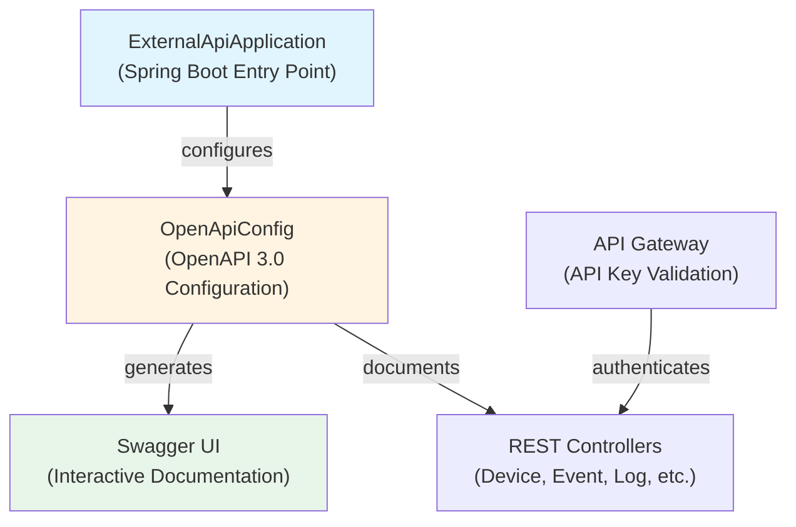
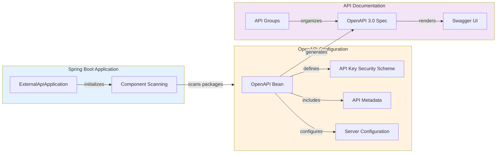
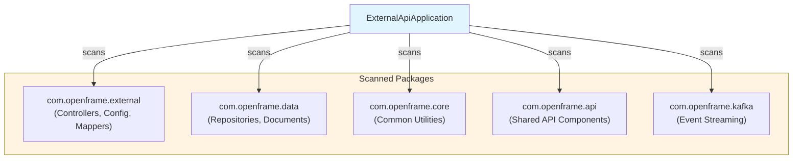
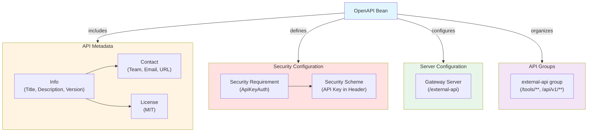
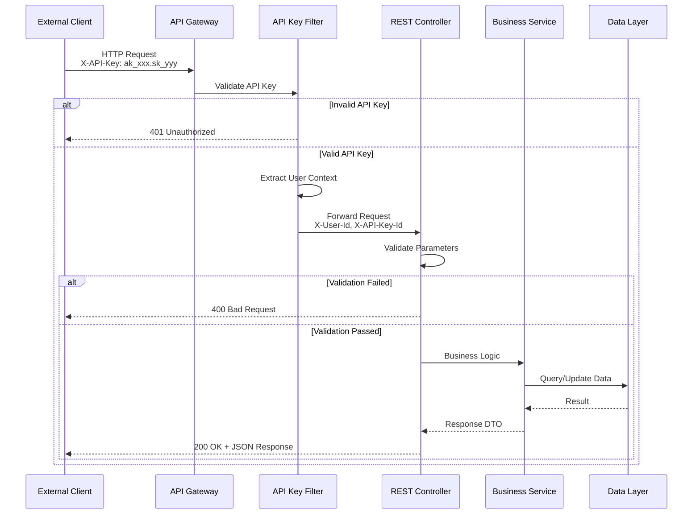
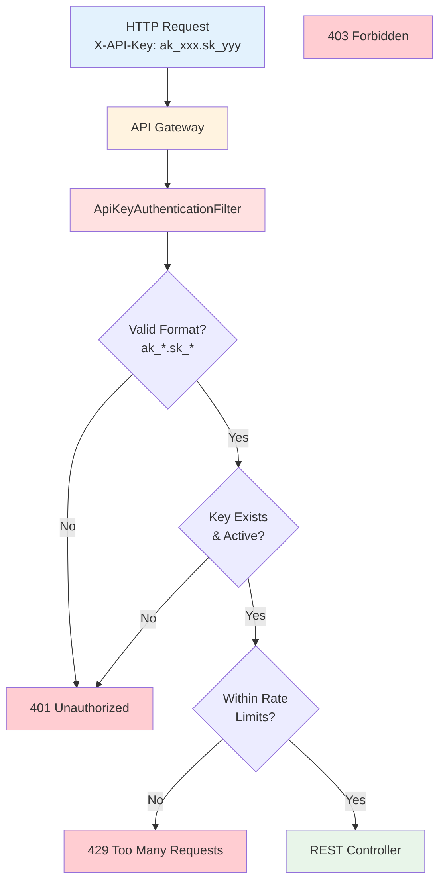

# External API Configuration Module

## Overview

The **External API Configuration** module provides OpenAPI/Swagger documentation and Spring Boot application configuration for the OpenFrame External API service. This module enables third-party integrations and programmatic access to OpenFrame platform functionality through RESTful APIs secured with API key authentication.

**Key Responsibilities:**
- OpenAPI 3.0 specification configuration with comprehensive API documentation
- Swagger UI setup for interactive API exploration
- API security scheme definition (API key authentication)
- Spring Boot application bootstrapping and component scanning
- API versioning and endpoint grouping
- Rate limiting documentation and error response standards

**Related Modules:**
- [External API REST Controllers](external_api_rest_controllers.md) - REST endpoint implementations
- [Gateway Service Security](gateway_service_security.md) - API key validation and authentication
- [Security Core](security_core.md) - Core security primitives
- [External API Exception Handling](external_api_exception_handling.md) - Error handling and responses

---

## Architecture

### Component Overview



### Configuration Architecture



---

## Core Components

### 1. ExternalApiApplication

**Purpose:** Spring Boot application entry point that bootstraps the External API service.

**Location:** `openframe.services.openframe-external-api.src.main.java.com.openframe.external.ExternalApiApplication`

**Key Features:**
- Spring Boot auto-configuration
- Multi-package component scanning
- Service initialization and lifecycle management

**Component Scanning Strategy:**



**Code Structure:**

```java
@SpringBootApplication
@ComponentScan(basePackages = {
    "com.openframe.external",  // External API controllers and config
    "com.openframe.data",      // Data layer (MongoDB, Kafka, Pinot)
    "com.openframe.core",      // Core utilities and constants
    "com.openframe.api",       // Shared API components
    "com.openframe.kafka"      // Kafka producers and consumers
})
public class ExternalApiApplication {
    public static void main(String[] args) {
        SpringApplication.run(ExternalApiApplication.class, args);
    }
}
```

**Configuration Properties:**

The application reads configuration from `application.yml`:

```yaml
server:
  port: 8080
  servlet:
    context-path: /external-api

spring:
  application:
    name: openframe-external-api
  data:
    mongodb:
      uri: ${MONGODB_URI}
    kafka:
      bootstrap-servers: ${KAFKA_BOOTSTRAP_SERVERS}

springdoc:
  api-docs:
    path: /api-docs
  swagger-ui:
    path: /swagger-ui.html
    enabled: true
```

---

### 2. OpenApiConfig

**Purpose:** Configures OpenAPI 3.0 specification with comprehensive API documentation, security schemes, and endpoint grouping.

**Location:** `deps-openframe-oss-lib.openframe-external-api-service-core.src.main.java.com.openframe.external.config.OpenApiConfig`

**Key Features:**
- OpenAPI 3.0 metadata (title, description, version, contact, license)
- API key security scheme definition (`X-API-Key` header)
- Server configuration for Kubernetes gateway routing
- API endpoint grouping and organization
- Rate limiting documentation
- Error response standards

#### OpenAPI Configuration Structure



#### API Documentation Features

**1. Comprehensive Description:**

The OpenAPI configuration includes detailed markdown documentation covering:

- **Authentication:** API key format and header requirements
- **Rate Limiting:** Per-minute, per-hour, and per-day limits with response headers
- **Error Handling:** Standard HTTP status codes and error response format
- **Usage Examples:** Code snippets and integration patterns

**2. Security Scheme:**

```java
.addSecuritySchemes("ApiKeyAuth", new SecurityScheme()
    .type(SecurityScheme.Type.APIKEY)
    .in(SecurityScheme.In.HEADER)
    .name("X-API-Key")
    .description("API key for authentication (format: ak_keyId.sk_secretKey)"))
```

**API Key Format:**
- **Structure:** `ak_{keyId}.sk_{secretKey}`
- **Example:** `ak_1a2b3c4d.sk_5e6f7g8h9i0j`
- **Header:** `X-API-Key: ak_1a2b3c4d.sk_5e6f7g8h9i0j`

**3. Rate Limiting Documentation:**

| Limit Type | Default Value | Response Header |
|------------|---------------|-----------------|
| Per Minute | 100 requests | `X-RateLimit-Limit-Minute` |
| Per Hour | 1,000 requests | `X-RateLimit-Limit-Hour` |
| Per Day | 10,000 requests | `X-RateLimit-Limit-Day` |

**Rate Limit Response Headers:**

```text
X-RateLimit-Limit-Minute: 100
X-RateLimit-Remaining-Minute: 87
X-RateLimit-Limit-Hour: 1000
X-RateLimit-Remaining-Hour: 923
```

**4. Error Response Standards:**

```json
{
  "code": "ERROR_CODE",
  "message": "Human-readable error message"
}
```

**Standard Error Codes:**

| HTTP Status | Error Code | Description |
|-------------|------------|-------------|
| 400 | `VALIDATION_ERROR` | Invalid request parameters |
| 400 | `TYPE_MISMATCH` | Parameter type conversion failed |
| 401 | `UNAUTHORIZED` | Invalid or missing API key |
| 403 | `FORBIDDEN` | Valid API key but insufficient permissions |
| 404 | `DEVICE_NOT_FOUND` | Device resource not found |
| 404 | `EVENT_NOT_FOUND` | Event resource not found |
| 404 | `LOG_NOT_FOUND` | Log resource not found |
| 429 | `RATE_LIMIT_EXCEEDED` | Too many requests |
| 500 | `INTERNAL_ERROR` | Internal server error |
| 503 | `PINOT_QUERY_ERROR` | Query service unavailable |
| 503 | `DATABASE_ERROR` | Database operation failed |

See [External API Exception Handling](external_api_exception_handling.md) for detailed error handling implementation.

#### API Endpoint Grouping

```java
@Bean
public GroupedOpenApi externalApiGroup() {
    return GroupedOpenApi.builder()
        .group("external-api")
        .pathsToMatch("/tools/**", "/test/**", "/api/v1/**")
        .pathsToExclude("/actuator/**", "/api/core/**")
        .build();
}
```

**Included Paths:**
- `/tools/**` - Tool integration endpoints
- `/test/**` - Testing and validation endpoints
- `/api/v1/**` - Versioned API endpoints (devices, events, logs, organizations)

**Excluded Paths:**
- `/actuator/**` - Spring Boot actuator endpoints (internal monitoring)
- `/api/core/**` - Internal core API endpoints (not for external use)

---

## API Documentation Access

### Swagger UI

**URL:** `https://{gateway-host}/external-api/swagger-ui.html`

**Features:**
- Interactive API exploration
- Request/response examples
- Authentication testing with API keys
- Schema definitions and models
- Try-it-out functionality for all endpoints

### OpenAPI Specification

**JSON Format:** `https://{gateway-host}/external-api/api-docs`

**YAML Format:** `https://{gateway-host}/external-api/api-docs.yaml`

**Usage:**
- Import into Postman, Insomnia, or other API clients
- Generate client SDKs using OpenAPI Generator
- Integrate with API management platforms

---

## Integration Flow

### API Request Lifecycle



### Authentication Flow



**Authentication Headers:**

**Request Headers:**
```text
X-API-Key: ak_1a2b3c4d.sk_5e6f7g8h9i0j
```

**Injected Headers (by Gateway):**
```text
X-User-Id: user_123456
X-API-Key-Id: ak_1a2b3c4d
X-Organization-Id: org_789012
```

See [Gateway Service Security](gateway_service_security.md) for detailed authentication implementation.

---

## API Endpoints Overview

### Device Management API

**Base Path:** `/api/v1/devices`

| Endpoint | Method | Description |
|----------|--------|-------------|
| `/api/v1/devices` | GET | List devices with filtering and pagination |
| `/api/v1/devices/{machineId}` | GET | Get device details by machine ID |
| `/api/v1/devices/{machineId}` | PATCH | Update device status |
| `/api/v1/devices/filters` | GET | Get available device filter options |

**Example Request:**

```bash
curl -X GET "https://api.openframe.ai/external-api/api/v1/devices?limit=20&statuses=ONLINE" \
  -H "X-API-Key: ak_1a2b3c4d.sk_5e6f7g8h9i0j"
```

**Example Response:**

```json
{
  "items": [
    {
      "machineId": "machine_123",
      "hostname": "workstation-01",
      "status": "ONLINE",
      "deviceType": "WORKSTATION",
      "osType": "Windows",
      "organizationId": "org_789",
      "tags": ["production", "finance-dept"]
    }
  ],
  "cursor": "eyJpZCI6Im1hY2hpbmVfMTIzIn0=",
  "hasMore": true
}
```

See [External API REST Controllers](external_api_rest_controllers.md) for complete endpoint documentation.

### Event Management API

**Base Path:** `/api/v1/events`

| Endpoint | Method | Description |
|----------|--------|-------------|
| `/api/v1/events` | GET | List events with filtering and pagination |
| `/api/v1/events/{id}` | GET | Get event details by ID |
| `/api/v1/events` | POST | Create new event |
| `/api/v1/events/{id}` | PUT | Update existing event |
| `/api/v1/events/filters` | GET | Get available event filter options |

### Log Management API

**Base Path:** `/api/v1/logs`

| Endpoint | Method | Description |
|----------|--------|-------------|
| `/api/v1/logs` | GET | List logs with filtering and pagination |
| `/api/v1/logs/details` | GET | Get detailed log entry |
| `/api/v1/logs/filters` | GET | Get available log filter options |

### Organization Management API

**Base Path:** `/api/v1/organizations`

| Endpoint | Method | Description |
|----------|--------|-------------|
| `/api/v1/organizations` | GET | List organizations |
| `/api/v1/organizations/{id}` | GET | Get organization details |

### Tool Integration API

**Base Path:** `/tools`

| Endpoint | Method | Description |
|----------|--------|-------------|
| `/tools/{toolType}/devices` | GET | Get devices from integrated tool |
| `/tools/{toolType}/sync` | POST | Trigger tool synchronization |

---

## Configuration Properties

### Application Configuration

**File:** `application.yml`

```yaml
# Server Configuration
server:
  port: 8080
  servlet:
    context-path: /external-api

# Spring Boot Configuration
spring:
  application:
    name: openframe-external-api
  
  # MongoDB Configuration
  data:
    mongodb:
      uri: ${MONGODB_URI:mongodb://localhost:27017/openframe}
      database: openframe
  
  # Kafka Configuration
  kafka:
    bootstrap-servers: ${KAFKA_BOOTSTRAP_SERVERS:localhost:9092}
    consumer:
      group-id: external-api-service
      auto-offset-reset: earliest
    producer:
      key-serializer: org.apache.kafka.common.serialization.StringSerializer
      value-serializer: org.springframework.kafka.support.serializer.JsonSerializer

# OpenAPI/Swagger Configuration
springdoc:
  api-docs:
    path: /api-docs
    enabled: true
  swagger-ui:
    path: /swagger-ui.html
    enabled: true
    operations-sorter: method
    tags-sorter: alpha
  show-actuator: false
  
# Logging Configuration
logging:
  level:
    com.openframe.external: INFO
    org.springframework.web: INFO
    org.springframework.data.mongodb: DEBUG
  pattern:
    console: "%d{yyyy-MM-dd HH:mm:ss} - %msg%n"

# Management Endpoints
management:
  endpoints:
    web:
      exposure:
        include: health,info,metrics
  endpoint:
    health:
      show-details: when-authorized
```

### Environment Variables

| Variable | Description | Default | Required |
|----------|-------------|---------|----------|
| `MONGODB_URI` | MongoDB connection string | `mongodb://localhost:27017/openframe` | Yes |
| `KAFKA_BOOTSTRAP_SERVERS` | Kafka broker addresses | `localhost:9092` | Yes |
| `SERVER_PORT` | HTTP server port | `8080` | No |
| `SPRING_PROFILES_ACTIVE` | Active Spring profiles | - | No |
| `LOG_LEVEL` | Application log level | `INFO` | No |

---

## Dependencies

### Maven Dependencies

```xml
<dependencies>
    <!-- Spring Boot Starters -->
    <dependency>
        <groupId>org.springframework.boot</groupId>
        <artifactId>spring-boot-starter-web</artifactId>
    </dependency>
    
    <dependency>
        <groupId>org.springframework.boot</groupId>
        <artifactId>spring-boot-starter-data-mongodb</artifactId>
    </dependency>
    
    <dependency>
        <groupId>org.springframework.kafka</groupId>
        <artifactId>spring-kafka</artifactId>
    </dependency>
    
    <!-- OpenAPI/Swagger -->
    <dependency>
        <groupId>org.springdoc</groupId>
        <artifactId>springdoc-openapi-starter-webmvc-ui</artifactId>
        <version>2.2.0</version>
    </dependency>
    
    <!-- OpenFrame Internal Libraries -->
    <dependency>
        <groupId>com.openframe</groupId>
        <artifactId>openframe-external-api-service-core</artifactId>
    </dependency>
    
    <dependency>
        <groupId>com.openframe</groupId>
        <artifactId>openframe-data-mongo</artifactId>
    </dependency>
    
    <dependency>
        <groupId>com.openframe</groupId>
        <artifactId>openframe-data-kafka</artifactId>
    </dependency>
    
    <dependency>
        <groupId>com.openframe</groupId>
        <artifactId>openframe-core</artifactId>
    </dependency>
    
    <!-- Utilities -->
    <dependency>
        <groupId>org.projectlombok</groupId>
        <artifactId>lombok</artifactId>
        <scope>provided</scope>
    </dependency>
</dependencies>
```

### Module Dependencies

```mermaid
flowchart TD
    ExternalAPIConfig["External API Configuration"]
    
    subgraph Internal["Internal Modules"]
        Controllers["External API REST Controllers"]
        Mappers["External API DTO Mappers"]
        ExceptionHandling["External API Exception Handling"]
        DataMongo["Data Layer MongoDB"]
        DataKafka["Data Layer Kafka"]
        Core["Core Utilities"]
    end
    
    subgraph External["External Dependencies"]
        SpringBoot["Spring Boot Web"]
        SpringData["Spring Data MongoDB"]
        SpringKafka["Spring Kafka"]
        SpringDoc["SpringDoc OpenAPI"]
    end
    
    ExternalAPIConfig -->|"configures"| Controllers
    ExternalAPIConfig -->|"documents"| Mappers
    ExternalAPIConfig -->|"integrates"| ExceptionHandling
    ExternalAPIConfig -->|"uses"| DataMongo
    ExternalAPIConfig -->|"uses"| DataKafka
    ExternalAPIConfig -->|"uses"| Core
    
    ExternalAPIConfig -.->|"depends on"| SpringBoot
    ExternalAPIConfig -.->|"depends on"| SpringData
    ExternalAPIConfig -.->|"depends on"| SpringKafka
    ExternalAPIConfig -.->|"depends on"| SpringDoc
    
    style ExternalAPIConfig fill:#e1f5ff
    style Internal fill:#fff4e1
    style External fill:#f3e5f5
```



---

## Deployment

### Docker Configuration

**Dockerfile:**

```dockerfile
FROM eclipse-temurin:17-jre-alpine

WORKDIR /app

# Copy application JAR
COPY target/openframe-external-api-*.jar app.jar

# Expose port
EXPOSE 8080

# Health check
HEALTHCHECK --interval=30s --timeout=3s --start-period=40s --retries=3 \
  CMD wget --no-verbose --tries=1 --spider http://localhost:8080/external-api/actuator/health || exit 1

# Run application
ENTRYPOINT ["java", "-jar", "app.jar"]
```

### Kubernetes Deployment

**deployment.yaml:**

```yaml
apiVersion: apps/v1
kind: Deployment
metadata:
  name: openframe-external-api
  namespace: openframe
spec:
  replicas: 3
  selector:
    matchLabels:
      app: openframe-external-api
  template:
    metadata:
      labels:
        app: openframe-external-api
    spec:
      containers:
      - name: external-api
        image: openframe/external-api:latest
        ports:
        - containerPort: 8080
          name: http
        env:
        - name: MONGODB_URI
          valueFrom:
            secretKeyRef:
              name: mongodb-credentials
              key: uri
        - name: KAFKA_BOOTSTRAP_SERVERS
          value: "kafka-service:9092"
        - name: SPRING_PROFILES_ACTIVE
          value: "production"
        resources:
          requests:
            memory: "512Mi"
            cpu: "500m"
          limits:
            memory: "1Gi"
            cpu: "1000m"
        livenessProbe:
          httpGet:
            path: /external-api/actuator/health
            port: 8080
          initialDelaySeconds: 60
          periodSeconds: 10
        readinessProbe:
          httpGet:
            path: /external-api/actuator/health
            port: 8080
          initialDelaySeconds: 30
          periodSeconds: 5
---
apiVersion: v1
kind: Service
metadata:
  name: openframe-external-api
  namespace: openframe
spec:
  selector:
    app: openframe-external-api
  ports:
  - port: 8080
    targetPort: 8080
    name: http
  type: ClusterIP
```

### Gateway Route Configuration

**Gateway routes for External API:**

```yaml
spring:
  cloud:
    gateway:
      routes:
      - id: external-api
        uri: http://openframe-external-api:8080
        predicates:
        - Path=/external-api/**
        filters:
        - StripPrefix=1
        - name: ApiKeyAuthenticationFilter
```

See [Gateway Service Configuration](gateway_service_configuration.md) for complete gateway setup.

---

## Usage Examples

### Example 1: List Devices with Filtering

```bash
curl -X GET "https://api.openframe.ai/external-api/api/v1/devices?statuses=ONLINE&deviceTypes=WORKSTATION&limit=50" \
  -H "X-API-Key: ak_1a2b3c4d.sk_5e6f7g8h9i0j" \
  -H "Accept: application/json"
```

**Response:**

```json
{
  "items": [
    {
      "machineId": "machine_123",
      "hostname": "workstation-01",
      "status": "ONLINE",
      "deviceType": "WORKSTATION",
      "osType": "Windows 11",
      "osVersion": "22H2",
      "organizationId": "org_789",
      "lastSeen": "2024-01-15T10:30:00Z",
      "tags": ["production", "finance-dept"]
    }
  ],
  "cursor": "eyJpZCI6Im1hY2hpbmVfMTIzIiwidGltZXN0YW1wIjoxNzA1MzE3MDAwfQ==",
  "hasMore": true
}
```

### Example 2: Query Logs with Date Range

```bash
curl -X GET "https://api.openframe.ai/external-api/api/v1/logs?startDate=2024-01-01&endDate=2024-01-31&severities=ERROR,CRITICAL&limit=100" \
  -H "X-API-Key: ak_1a2b3c4d.sk_5e6f7g8h9i0j" \
  -H "Accept: application/json"
```

**Response:**

```json
{
  "items": [
    {
      "id": "log_456",
      "timestamp": "2024-01-15T14:23:45Z",
      "severity": "ERROR",
      "toolType": "FLEET_MDM",
      "eventType": "DEVICE_OFFLINE",
      "summary": "Device lost connection",
      "deviceId": "machine_123",
      "organizationId": "org_789"
    }
  ],
  "cursor": "eyJpZCI6ImxvZ180NTYifQ==",
  "hasMore": false
}
```

### Example 3: Create Event

```bash
curl -X POST "https://api.openframe.ai/external-api/api/v1/events" \
  -H "X-API-Key: ak_1a2b3c4d.sk_5e6f7g8h9i0j" \
  -H "Content-Type: application/json" \
  -d '{
    "eventType": "DEVICE_MAINTENANCE",
    "userId": "user_123",
    "deviceId": "machine_456",
    "description": "Scheduled maintenance completed",
    "metadata": {
      "duration": "2 hours",
      "technician": "John Doe"
    }
  }'
```

**Response:**

```json
{
  "id": "event_789",
  "eventType": "DEVICE_MAINTENANCE",
  "userId": "user_123",
  "deviceId": "machine_456",
  "description": "Scheduled maintenance completed",
  "timestamp": "2024-01-15T16:45:00Z",
  "metadata": {
    "duration": "2 hours",
    "technician": "John Doe"
  }
}
```

### Example 4: Python SDK Integration

```python
import requests
from typing import List, Optional

class OpenFrameClient:
    def __init__(self, api_key: str, base_url: str = "https://api.openframe.ai/external-api"):
        self.api_key = api_key
        self.base_url = base_url
        self.headers = {
            "X-API-Key": api_key,
            "Accept": "application/json"
        }
    
    def list_devices(
        self, 
        statuses: Optional[List[str]] = None,
        device_types: Optional[List[str]] = None,
        limit: int = 20,
        cursor: Optional[str] = None
    ) -> dict:
        """List devices with optional filtering."""
        params = {"limit": limit}
        if statuses:
            params["statuses"] = ",".join(statuses)
        if device_types:
            params["deviceTypes"] = ",".join(device_types)
        if cursor:
            params["cursor"] = cursor
        
        response = requests.get(
            f"{self.base_url}/api/v1/devices",
            headers=self.headers,
            params=params
        )
        response.raise_for_status()
        return response.json()
    
    def get_device(self, machine_id: str) -> dict:
        """Get device details by machine ID."""
        response = requests.get(
            f"{self.base_url}/api/v1/devices/{machine_id}",
            headers=self.headers
        )
        response.raise_for_status()
        return response.json()
    
    def query_logs(
        self,
        start_date: str,
        end_date: str,
        severities: Optional[List[str]] = None,
        limit: int = 20
    ) -> dict:
        """Query logs with date range and severity filtering."""
        params = {
            "startDate": start_date,
            "endDate": end_date,
            "limit": limit
        }
        if severities:
            params["severities"] = ",".join(severities)
        
        response = requests.get(
            f"{self.base_url}/api/v1/logs",
            headers=self.headers,
            params=params
        )
        response.raise_for_status()
        return response.json()

# Usage
client = OpenFrameClient(api_key="ak_1a2b3c4d.sk_5e6f7g8h9i0j")

# List online devices
devices = client.list_devices(statuses=["ONLINE"], limit=50)
print(f"Found {len(devices['items'])} online devices")

# Get specific device
device = client.get_device("machine_123")
print(f"Device: {device['hostname']} - Status: {device['status']}")

# Query error logs
logs = client.query_logs(
    start_date="2024-01-01",
    end_date="2024-01-31",
    severities=["ERROR", "CRITICAL"]
)
print(f"Found {len(logs['items'])} error logs")
```

---

## Testing

### Unit Tests

**Test Configuration:**

```java
@SpringBootTest
@AutoConfigureMockMvc
@TestPropertySource(properties = {
    "spring.data.mongodb.uri=mongodb://localhost:27017/test",
    "spring.kafka.bootstrap-servers=localhost:9092"
})
class OpenApiConfigTest {
    
    @Autowired
    private OpenAPI openAPI;
    
    @Test
    void testOpenAPIConfiguration() {
        assertNotNull(openAPI);
        assertEquals("OpenFrame External API", openAPI.getInfo().getTitle());
        assertEquals("1.0.0", openAPI.getInfo().getVersion());
        
        // Verify security scheme
        var securitySchemes = openAPI.getComponents().getSecuritySchemes();
        assertTrue(securitySchemes.containsKey("ApiKeyAuth"));
        
        var apiKeyScheme = securitySchemes.get("ApiKeyAuth");
        assertEquals(SecurityScheme.Type.APIKEY, apiKeyScheme.getType());
        assertEquals(SecurityScheme.In.HEADER, apiKeyScheme.getIn());
        assertEquals("X-API-Key", apiKeyScheme.getName());
    }
    
    @Test
    void testServerConfiguration() {
        var servers = openAPI.getServers();
        assertFalse(servers.isEmpty());
        assertEquals("/external-api", servers.get(0).getUrl());
    }
}
```

### Integration Tests

**API Documentation Test:**

```java
@SpringBootTest(webEnvironment = SpringBootTest.WebEnvironment.RANDOM_PORT)
@AutoConfigureMockMvc
class SwaggerUIIntegrationTest {
    
    @Autowired
    private MockMvc mockMvc;
    
    @Test
    void testSwaggerUIAccessible() throws Exception {
        mockMvc.perform(get("/external-api/swagger-ui.html"))
            .andExpect(status().isOk())
            .andExpect(content().contentType(MediaType.TEXT_HTML));
    }
    
    @Test
    void testOpenAPISpecAccessible() throws Exception {
        mockMvc.perform(get("/external-api/api-docs"))
            .andExpect(status().isOk())
            .andExpect(content().contentType(MediaType.APPLICATION_JSON))
            .andExpect(jsonPath("$.info.title").value("OpenFrame External API"))
            .andExpect(jsonPath("$.components.securitySchemes.ApiKeyAuth").exists());
    }
    
    @Test
    void testAPIGroupConfiguration() throws Exception {
        mockMvc.perform(get("/external-api/api-docs"))
            .andExpect(status().isOk())
            .andExpect(jsonPath("$.paths['/api/v1/devices']").exists())
            .andExpect(jsonPath("$.paths['/api/v1/events']").exists())
            .andExpect(jsonPath("$.paths['/api/v1/logs']").exists());
    }
}
```

---

## Monitoring and Observability

### Health Checks

**Endpoint:** `/external-api/actuator/health`

**Response:**

```json
{
  "status": "UP",
  "components": {
    "mongo": {
      "status": "UP",
      "details": {
        "version": "6.0.5"
      }
    },
    "kafka": {
      "status": "UP"
    },
    "diskSpace": {
      "status": "UP",
      "details": {
        "total": 107374182400,
        "free": 53687091200,
        "threshold": 10485760
      }
    }
  }
}
```

### Metrics

**Endpoint:** `/external-api/actuator/metrics`

**Key Metrics:**
- `http.server.requests` - HTTP request metrics
- `jvm.memory.used` - JVM memory usage
- `jvm.threads.live` - Active thread count
- `mongodb.driver.pool.size` - MongoDB connection pool size
- `kafka.producer.request.total` - Kafka producer requests

### Logging

**Log Format:**

```text
2024-01-15 10:30:45 - Getting devices - userId: user_123, apiKeyId: ak_1a2b3c4d, limit: 20, cursor: null
2024-01-15 10:30:45 - Successfully retrieved 15 devices
```

**Log Levels:**
- `INFO` - Request/response logging
- `DEBUG` - Detailed query and data access logging
- `WARN` - Validation errors and not-found scenarios
- `ERROR` - Unexpected errors and exceptions

---

## Security Considerations

### API Key Management

**Best Practices:**
1. **Rotation:** Rotate API keys regularly (recommended: every 90 days)
2. **Scope:** Create separate API keys for different integrations
3. **Storage:** Store API keys in secure secret management systems (e.g., HashiCorp Vault, AWS Secrets Manager)
4. **Monitoring:** Monitor API key usage for anomalies

### Rate Limiting

**Implementation:**
- Rate limits enforced at API Gateway level
- Per-API-key tracking
- Configurable limits per organization
- Graceful degradation with 429 responses

See [Gateway Service Security](gateway_service_security.md) for rate limiting implementation.

### HTTPS/TLS

**Requirements:**
- All external API traffic must use HTTPS
- TLS 1.2 or higher required
- Valid SSL certificates from trusted CA

### Input Validation

**Validation Layers:**
1. **Parameter Validation:** Spring `@Valid` annotations
2. **Type Validation:** Automatic type conversion with error handling
3. **Business Validation:** Service-layer validation rules
4. **SQL Injection Prevention:** Parameterized queries in Pinot/MongoDB

---

## Troubleshooting

### Common Issues

#### 1. Swagger UI Not Loading

**Symptoms:**
- 404 error when accessing `/external-api/swagger-ui.html`
- Blank page or JavaScript errors

**Solutions:**

```yaml
# Verify springdoc configuration in application.yml
springdoc:
  swagger-ui:
    enabled: true
    path: /swagger-ui.html
  api-docs:
    enabled: true
```

**Check logs:**

```bash
kubectl logs -n openframe deployment/openframe-external-api | grep springdoc
```

#### 2. API Key Authentication Failing

**Symptoms:**
- 401 Unauthorized responses
- "Invalid API key" errors

**Solutions:**

1. **Verify API key format:**
   ```bash
   # Correct format: ak_{keyId}.sk_{secretKey}
   echo "ak_1a2b3c4d.sk_5e6f7g8h9i0j" | grep -E '^ak_[a-zA-Z0-9]+\.sk_[a-zA-Z0-9]+$'
   ```

2. **Check API key in database:**
   ```javascript
   // MongoDB query
   db.api_keys.findOne({ keyId: "ak_1a2b3c4d" })
   ```

3. **Verify gateway routing:**
   ```bash
   kubectl logs -n openframe deployment/openframe-gateway | grep "X-API-Key"
   ```

#### 3. Rate Limit Exceeded

**Symptoms:**
- 429 Too Many Requests responses
- `X-RateLimit-Remaining-*` headers showing 0

**Solutions:**

1. **Check current rate limits:**
   ```bash
   curl -I "https://api.openframe.ai/external-api/api/v1/devices" \
     -H "X-API-Key: ak_xxx.sk_yyy"
   ```

2. **Request rate limit increase:**
   - Contact OpenFrame support
   - Provide use case justification
   - Specify required limits

3. **Implement exponential backoff:**
   ```python
   import time
   import requests
   
   def make_request_with_retry(url, headers, max_retries=3):
       for attempt in range(max_retries):
           response = requests.get(url, headers=headers)
           if response.status_code == 429:
               retry_after = int(response.headers.get('Retry-After', 60))
               time.sleep(retry_after)
               continue
           return response
       raise Exception("Max retries exceeded")
   ```

#### 4. MongoDB Connection Issues

**Symptoms:**
- 503 Service Unavailable responses
- "DATABASE_ERROR" in error responses
- Connection timeout errors in logs

**Solutions:**

1. **Verify MongoDB connectivity:**
   ```bash
   kubectl exec -it deployment/openframe-external-api -n openframe -- \
     mongosh "$MONGODB_URI" --eval "db.adminCommand('ping')"
   ```

2. **Check connection pool:**
   ```bash
   curl "http://localhost:8080/external-api/actuator/metrics/mongodb.driver.pool.size"
   ```

3. **Review MongoDB logs:**
   ```bash
   kubectl logs -n openframe statefulset/mongodb
   ```

---

## Performance Optimization

### Caching Strategy

**OpenAPI Specification Caching:**

```java
@Configuration
public class CacheConfig {
    
    @Bean
    public CacheManager cacheManager() {
        return new ConcurrentMapCacheManager("openapi-spec");
    }
}
```

### Connection Pooling

**MongoDB Connection Pool:**

```yaml
spring:
  data:
    mongodb:
      uri: ${MONGODB_URI}
      # Connection pool settings
      options:
        maxPoolSize: 50
        minPoolSize: 10
        maxIdleTimeMS: 60000
        maxConnectionLifeTimeMS: 300000
```

### Response Compression

**Enable GZIP compression:**

```yaml
server:
  compression:
    enabled: true
    mime-types: application/json,application/xml,text/html,text/xml,text/plain
    min-response-size: 1024
```

---

## Related Documentation

- **[External API REST Controllers](external_api_rest_controllers.md)** - REST endpoint implementations
- **[External API DTO Mappers](external_api_dto_mappers.md)** - Request/response mapping
- **[External API Exception Handling](external_api_exception_handling.md)** - Error handling
- **[Gateway Service Security](gateway_service_security.md)** - API key authentication
- **[Data Layer MongoDB](data_layer_mongo.md)** - MongoDB data access
- **[Data Layer Kafka](data_layer_kafka.md)** - Event streaming
- **[API Service Configuration](api_service_configuration.md)** - Internal API configuration

---

## Additional Resources

### OpenAPI/Swagger Resources

- **OpenAPI Specification:** https://spec.openapis.org/oas/v3.0.3
- **SpringDoc Documentation:** https://springdoc.org/
- **Swagger UI:** https://swagger.io/tools/swagger-ui/

### Spring Boot Resources

- **Spring Boot Reference:** https://docs.spring.io/spring-boot/docs/current/reference/html/
- **Spring Data MongoDB:** https://docs.spring.io/spring-data/mongodb/docs/current/reference/html/
- **Spring Kafka:** https://docs.spring.io/spring-kafka/docs/current/reference/html/

### OpenFrame Resources

- **OpenFrame Documentation:** https://docs.openframe.ai
- **API Reference:** https://api.openframe.ai/external-api/swagger-ui.html
- **OpenMSP Community:** https://openmsp.ai

---

## Support

For questions, issues, or feature requests related to the External API Configuration module:

- **Slack Community:** [OpenMSP Slack](https://join.slack.com/t/openmsp/shared_invite/zt-36bl7mx0h-3~U2nFH6nqHqoTPXMaHEHA)
- **Documentation:** https://docs.openframe.ai
- **GitHub Issues:** Not used - all discussions happen on Slack

---

**Last Updated:** 2024-01-15  
**Module Version:** 1.0.0  
**Maintained By:** OpenFrame Team
