# External API DTO Mappers Module

## Overview

The **External API DTO Mappers** module provides a comprehensive data transformation layer that converts between internal domain models and external REST API representations. This module is a critical component of the [External API Service](external_api.md), ensuring clean separation between internal data structures and the public API contract exposed to external consumers.

**Key Responsibilities:**
- Transform MongoDB documents to REST API response DTOs
- Convert internal GraphQL DTOs to REST-compatible formats
- Map filter criteria between REST and internal query formats
- Handle pagination metadata transformation (cursor-based to REST pagination)
- Provide consistent null-safety and data validation during mapping

**Architecture Pattern:** The module implements the **Data Transfer Object (DTO) Mapper Pattern**, providing bidirectional transformation between:
- **Internal Layer**: MongoDB documents, GraphQL DTOs, internal service models
- **External Layer**: REST API request/response DTOs optimized for external consumption

---

## Architecture

### Component Structure

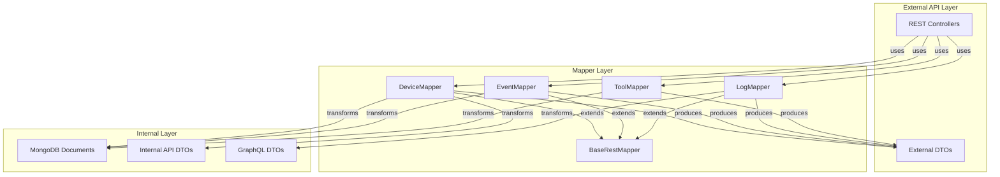

### Mapper Hierarchy

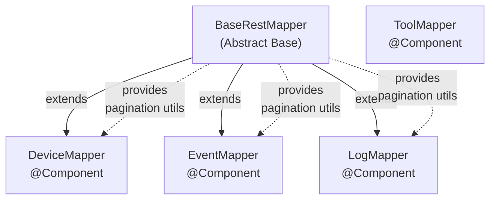

---

## Core Components

### 1. BaseRestMapper (Abstract Base Class)

**Purpose:** Provides common mapping utilities for pagination and shared transformation logic.

**Key Responsibilities:**
- Convert cursor-based pagination (GraphQL) to REST pagination format
- Transform `CursorPageInfo` to `PageInfo` (REST)
- Convert `PaginationCriteria` (REST) to `CursorPaginationCriteria` (internal)

**Core Methods:**

```java
protected PageInfo toRestPageInfo(CursorPageInfo cursorPageInfo)
```
- Transforms GraphQL cursor pagination metadata to REST format
- Maps: `endCursor` → `nextCursor`, `startCursor` → `previousCursor`
- Preserves: `hasNextPage`, `hasPreviousPage` flags

```java
public CursorPaginationCriteria toCursorPaginationCriteria(PaginationCriteria criteria)
```
- Converts REST pagination request to internal cursor-based format
- Extracts: `cursor`, `limit` parameters

**Null Safety:** All methods handle null inputs gracefully, returning null or default values.

---

### 2. DeviceMapper

**Purpose:** Transforms device-related data between MongoDB documents and REST API representations.

**Source Documents:**
- `Machine` (MongoDB document from [Data Layer - MongoDB](data_layer_mongo.md))
- `Tag` (MongoDB document for device tagging)
- `DeviceFilters`, `DeviceFilterCriteria` (internal filter models)

**Target DTOs:**
- `DeviceResponse` - Single device representation
- `DevicesResponse` - Paginated device list with metadata
- `DeviceFilterResponse` - Available filter options with counts
- `TagResponse` - Device tag representation

#### Key Transformation Methods

##### Device Entity Mapping

```java
public DeviceResponse toDeviceResponse(Machine machine, List<Tag> tags)
```

**Transformation Flow:**

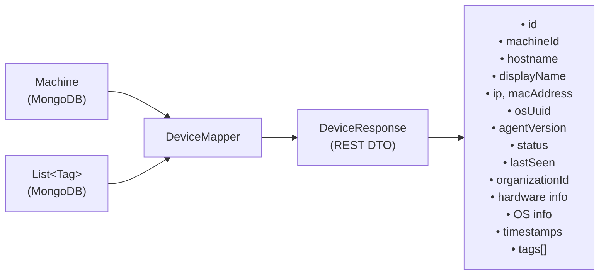

**Mapped Fields:**
- **Identity**: `id`, `machineId`, `osUuid`
- **Network**: `hostname`, `displayName`, `ip`, `macAddress`
- **Hardware**: `serialNumber`, `manufacturer`, `model`, `type`
- **Operating System**: `osType`, `osVersion`, `osBuild`, `timezone`
- **Status**: `status`, `lastSeen`, `agentVersion`
- **Organization**: `organizationId`
- **Metadata**: `registeredAt`, `updatedAt`
- **Tags**: Transformed via `toTagResponses(tags)`

##### Paginated Device List Mapping

```java
public DevicesResponse toDevicesResponse(CountedGenericQueryResult<Machine> queryResult)
```

**Transformation:**
- Converts `CountedGenericQueryResult<Machine>` to `DevicesResponse`
- Maps each `Machine` to `DeviceResponse` (without tags)
- Includes pagination metadata via `toRestPageInfo()`
- Preserves `filteredCount` for UI display

```java
public DevicesResponse toDevicesResponseWithTags(
    CountedGenericQueryResult<Machine> queryResult, 
    List<List<Tag>> tagsPerMachine
)
```

**Advanced Transformation:**
- Pairs each device with its corresponding tag list
- Uses indexed iteration to match devices with tags
- Handles mismatched list sizes gracefully (defaults to empty tag list)

**Data Flow:**

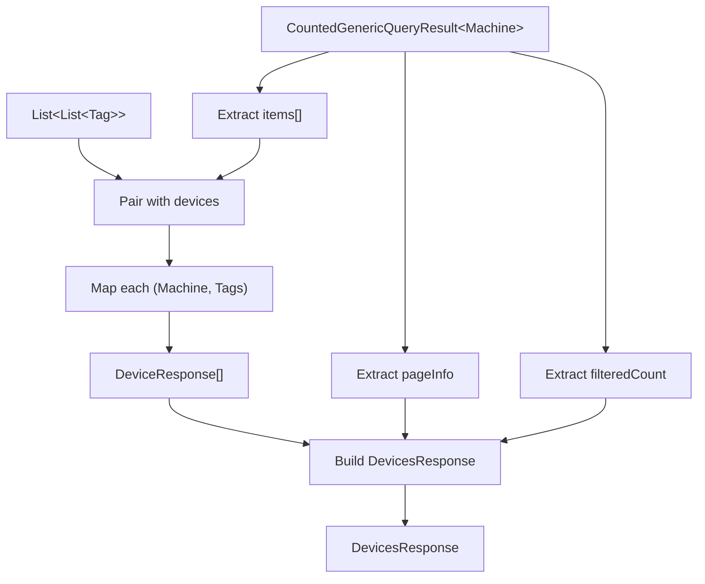

##### Filter Options Mapping

```java
public DeviceFilterResponse toDeviceFilterResponse(DeviceFilters filters)
```

**Transforms:**
- `DeviceFilters` (internal) → `DeviceFilterResponse` (REST)
- Converts filter options with counts for UI dropdowns
- Maps: `statuses`, `deviceTypes`, `osTypes`, `organizationIds`, `tags`

```java
public DeviceFilterOptions toDeviceFilterOptions(DeviceFilterCriteria criteria)
```

**Transforms:**
- `DeviceFilterCriteria` (REST request) → `DeviceFilterOptions` (internal)
- Extracts: `statuses`, `deviceTypes`, `osTypes`, `organizationIds`, `tagNames`

##### Tag Transformation

```java
private TagResponse toTagResponse(Tag tag)
```

**Mapped Fields:**
- `id`, `name`, `description`, `color`
- `organizationId`, `createdAt`, `createdBy`

---

### 3. EventMapper

**Purpose:** Transforms event data between internal event documents and REST API representations.

**Source Documents:**
- `Event` (MongoDB document from [Data Layer - MongoDB](data_layer_mongo.md))
- `EventFilters`, `EventFilterCriteria` (internal filter models)

**Target DTOs:**
- `EventResponse` - Single event representation
- `EventsResponse` - Paginated event list
- `EventFilterResponse` - Available filter options

#### Key Transformation Methods

##### Event Entity Mapping

```java
public EventResponse toEventResponse(Event event)
```

**Transformation:**

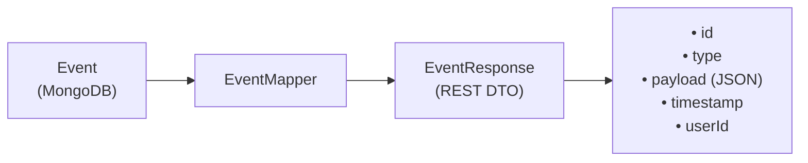

**Mapped Fields:**
- `id` - Event identifier
- `type` - Event type classification
- `payload` - JSON payload (preserved as-is)
- `timestamp` - Event occurrence time
- `userId` - Associated user identifier

##### Paginated Event List Mapping

```java
public EventsResponse toEventsResponse(GenericQueryResult<Event> queryResult)
```

**Transformation:**
- Converts `GenericQueryResult<Event>` to `EventsResponse`
- Maps each `Event` to `EventResponse`
- Includes pagination metadata

##### Filter Mapping

```java
public EventFilterResponse toEventFilterResponse(EventFilters filters)
```

**Transforms:**
- `EventFilters` (internal) → `EventFilterResponse` (REST)
- Extracts: `userIds`, `eventTypes`

```java
public EventFilterOptions toEventFilterOptions(EventFilterCriteria criteria)
```

**Transforms:**
- `EventFilterCriteria` (REST) → `EventFilterOptions` (internal)
- Extracts: `userIds`, `eventTypes`, `startDate`, `endDate`

---

### 4. LogMapper

**Purpose:** Transforms audit log data between internal log events and REST API representations.

**Source Documents:**
- `LogEvent` (from [Data Layer - Core](data_layer_core.md) Pinot repositories)
- `LogDetails` (detailed log view)
- `LogFilters`, `LogFilterCriteria` (internal filter models)

**Target DTOs:**
- `LogResponse` - Single log entry representation
- `LogsResponse` - Paginated log list
- `LogDetailsResponse` - Detailed log view with full content
- `LogFilterResponse` - Available filter options
- `OrganizationFilterResponse` - Organization filter options

#### Key Transformation Methods

##### Log Entity Mapping

```java
public LogResponse toLogResponse(LogEvent logEvent)
```

**Transformation:**

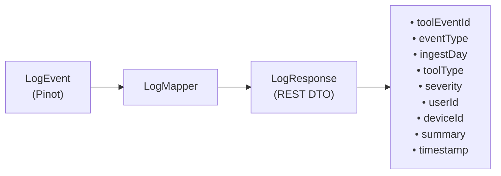

**Mapped Fields:**
- `toolEventId` - Unique event identifier from integrated tool
- `eventType` - Classification of log event
- `ingestDay` - Partitioning key for time-series data
- `toolType` - Source tool (e.g., Fleet MDM, Tactical RMM)
- `severity` - Log level (INFO, WARN, ERROR, CRITICAL)
- `userId`, `deviceId` - Associated entities
- `summary` - Brief description
- `timestamp` - Event occurrence time

##### Paginated Log List Mapping

```java
public LogsResponse toLogsResponse(GenericQueryResult<LogEvent> result)
```

**Transformation:**
- Converts `GenericQueryResult<LogEvent>` to `LogsResponse`
- Maps each `LogEvent` to `LogResponse`
- Includes pagination metadata
- Handles null results gracefully (returns empty list)

##### Detailed Log View Mapping

```java
public LogDetailsResponse toLogDetailsResponse(LogDetails logDetails)
```

**Transformation:**
- Extends `LogResponse` fields with full content
- Maps `details` field to `content` (full log payload)
- Used for drill-down views in UI

##### Filter Mapping

```java
public LogFilterResponse toLogFilterResponse(LogFilters filters)
```

**Transforms:**
- `LogFilters` (internal) → `LogFilterResponse` (REST)
- Converts organization list to `OrganizationFilterResponse[]`
- Extracts: `toolTypes`, `eventTypes`, `severities`, `organizations`

```java
public LogFilterOptions toLogFilterOptions(LogFilterCriteria criteria)
```

**Transforms:**
- `LogFilterCriteria` (REST) → `LogFilterOptions` (internal)
- Extracts: `startDate`, `endDate`, `toolTypes`, `eventTypes`, `severities`, `organizationIds`, `deviceId`

---

### 5. ToolMapper

**Purpose:** Transforms integrated tool data between MongoDB documents and REST API representations.

**Source Documents:**
- `IntegratedTool` (MongoDB document from [Data Layer - MongoDB](data_layer_mongo.md))
- `ToolCredentials`, `ToolApiKey`, `ToolUrl` (nested documents)
- `ToolFilters`, `ToolFilterCriteria` (internal filter models)

**Target DTOs:**
- `ToolResponse` - Single tool representation
- `ToolsResponse` - Tool list
- `ToolFilterResponse` - Available filter options
- `ToolCredentialsResponse`, `ToolApiKeyResponse`, `ToolUrlResponse` (nested DTOs)

#### Key Transformation Methods

##### Tool Entity Mapping

```java
public ToolResponse toToolResponse(IntegratedTool tool)
```

**Transformation:**

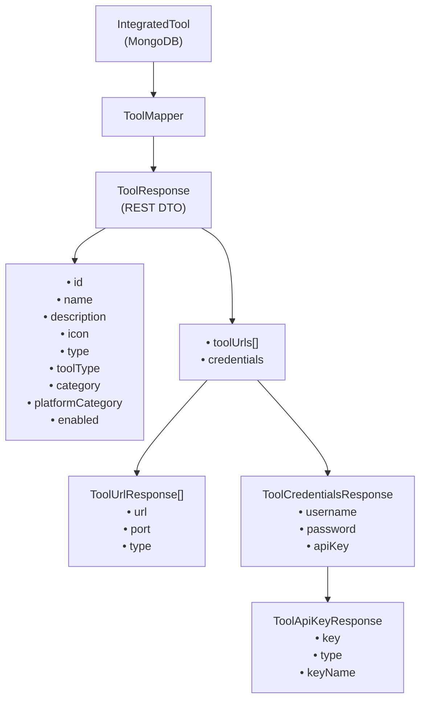

**Mapped Fields:**
- **Identity**: `id`, `name`, `description`, `icon`
- **Classification**: `type`, `toolType`, `category`, `platformCategory`
- **Status**: `enabled`
- **Connectivity**: `toolUrls[]` (transformed via `toToolUrlResponseList()`)
- **Authentication**: `credentials` (transformed via `toToolCredentialsResponse()`)

##### Tool List Mapping

```java
public ToolsResponse toToolsResponse(ToolList result)
```

**Transformation:**
- Converts `ToolList` (internal) to `ToolsResponse` (REST)
- Maps each `IntegratedTool` to `ToolResponse`
- Handles null results gracefully

##### Filter Mapping

```java
public ToolFilterResponse toToolFilterResponse(ToolFilters filters)
```

**Transforms:**
- `ToolFilters` (internal) → `ToolFilterResponse` (REST)
- Extracts: `types`, `categories`, `platformCategories`

```java
public ToolFilterOptions toToolFilterOptions(ToolFilterCriteria criteria)
```

**Transforms:**
- `ToolFilterCriteria` (REST) → `ToolFilterOptions` (internal)
- Extracts: `enabled`, `type`, `category`, `platformCategory`

##### Nested Object Transformations

**Tool URL Mapping:**
```java
private ToolUrlResponse toToolUrlResponse(ToolUrl toolUrl)
```
- Maps: `url`, `port`, `type` (enum to string)

**Credentials Mapping:**
```java
private ToolCredentialsResponse toToolCredentialsResponse(ToolCredentials credentials)
```
- Maps: `username`, `password`, `apiKey` (nested transformation)

**API Key Mapping:**
```java
private ToolApiKeyResponse toToolApiKeyResponse(ToolApiKey apiKey)
```
- Maps: `key`, `type` (enum to string), `keyName`

---

## Data Flow Patterns

### Request-Response Transformation Flow

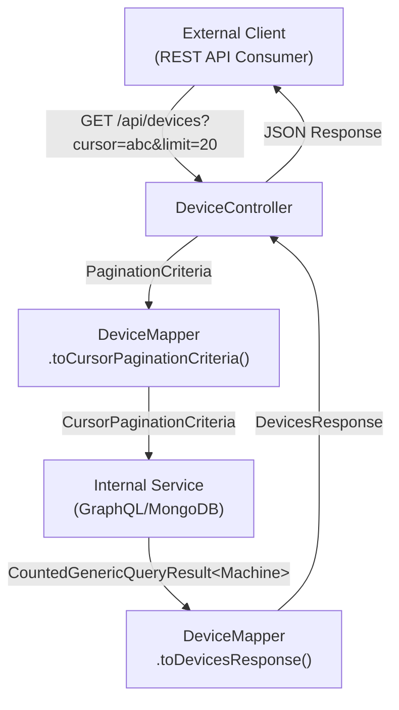

### Filter Criteria Transformation Flow

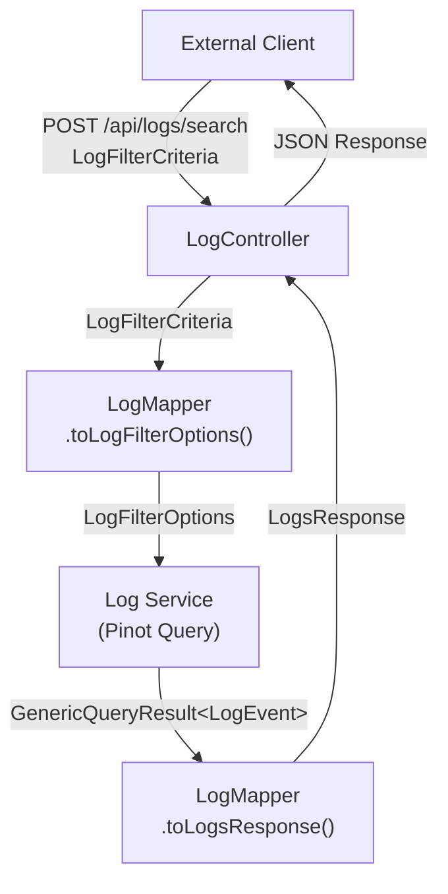

### Nested Object Transformation Flow

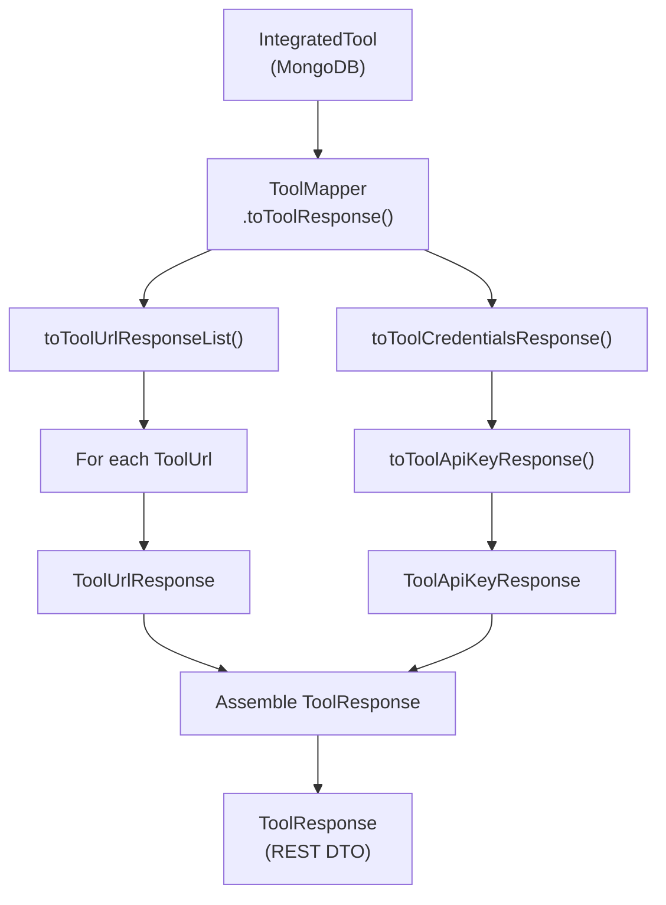

---

## Integration Points

### 1. REST Controllers

**Consumers:** All mappers are injected into REST controllers via Spring dependency injection.

**Usage Pattern:**

```java
@RestController
@RequestMapping("/api/devices")
public class DeviceController {
    
    private final DeviceMapper deviceMapper;
    private final DeviceService deviceService;
    
    @GetMapping
    public ResponseEntity<DevicesResponse> getDevices(
        @RequestParam(required = false) String cursor,
        @RequestParam(defaultValue = "20") int limit
    ) {
        // Convert REST pagination to internal format
        PaginationCriteria restCriteria = PaginationCriteria.builder()
            .cursor(cursor)
            .limit(limit)
            .build();
        
        CursorPaginationCriteria internalCriteria = 
            deviceMapper.toCursorPaginationCriteria(restCriteria);
        
        // Query internal service
        CountedGenericQueryResult<Machine> result = 
            deviceService.getDevices(internalCriteria);
        
        // Convert to REST response
        DevicesResponse response = deviceMapper.toDevicesResponse(result);
        
        return ResponseEntity.ok(response);
    }
}
```

**Related Documentation:** [External API REST Controllers](external_api_rest_controllers.md)

### 2. MongoDB Documents

**Source:** Mappers transform MongoDB documents from the [Data Layer - MongoDB](data_layer_mongo.md) module.

**Key Documents:**
- `Machine` → `DeviceResponse`
- `Event` → `EventResponse`
- `IntegratedTool` → `ToolResponse`
- `Tag` → `TagResponse`

### 3. Internal API DTOs

**Source:** Mappers transform internal GraphQL DTOs from the [API Service](api_service.md) module.

**Key DTOs:**
- `CountedGenericQueryResult<T>` → `*Response` (with pagination)
- `GenericQueryResult<T>` → `*Response` (with pagination)
- `DeviceFilters` → `DeviceFilterResponse`
- `EventFilters` → `EventFilterResponse`
- `LogFilters` → `LogFilterResponse`
- `ToolFilters` → `ToolFilterResponse`

### 4. Pinot Query Results

**Source:** Log mappers transform query results from [Data Layer - Core](data_layer_core.md) Pinot repositories.

**Key Transformations:**
- `LogEvent` (Pinot row) → `LogResponse`
- `LogDetails` (Pinot row) → `LogDetailsResponse`

---

## Design Patterns

### 1. Data Transfer Object (DTO) Pattern

**Purpose:** Separate internal domain models from external API contracts.

**Benefits:**
- **Decoupling**: Internal changes don't break external API
- **Security**: Control which fields are exposed externally
- **Versioning**: Support multiple API versions with different DTOs
- **Optimization**: Tailor DTOs for specific use cases (list vs. detail views)

### 2. Mapper Pattern

**Purpose:** Centralize transformation logic in dedicated mapper components.

**Benefits:**
- **Single Responsibility**: Each mapper handles one domain
- **Testability**: Easy to unit test transformations
- **Reusability**: Shared mapping logic in base class
- **Maintainability**: Changes to mapping logic are localized

### 3. Builder Pattern

**Usage:** All DTOs use Lombok `@Builder` for construction.

**Benefits:**
- **Readability**: Clear, fluent API for object creation
- **Immutability**: DTOs are typically immutable
- **Null Safety**: Explicit handling of optional fields

### 4. Null Object Pattern

**Implementation:** Mappers return empty collections or null-safe defaults.

**Example:**
```java
public LogsResponse toLogsResponse(GenericQueryResult<LogEvent> result) {
    if (result == null) {
        return LogsResponse.builder()
                .logs(List.of())  // Empty list, not null
                .pageInfo(null)
                .build();
    }
    // ... normal mapping
}
```

---

## Pagination Transformation

### Cursor-Based to REST Pagination

**Internal Format (GraphQL):**
```json
{
  "pageInfo": {
    "startCursor": "eyJpZCI6IjEyMyJ9",
    "endCursor": "eyJpZCI6IjQ1NiJ9",
    "hasNextPage": true,
    "hasPreviousPage": false
  }
}
```

**External Format (REST):**
```json
{
  "pageInfo": {
    "previousCursor": "eyJpZCI6IjEyMyJ9",
    "nextCursor": "eyJpZCI6IjQ1NiJ9",
    "hasPrevious": false,
    "hasNext": true
  }
}
```

**Transformation Logic:**

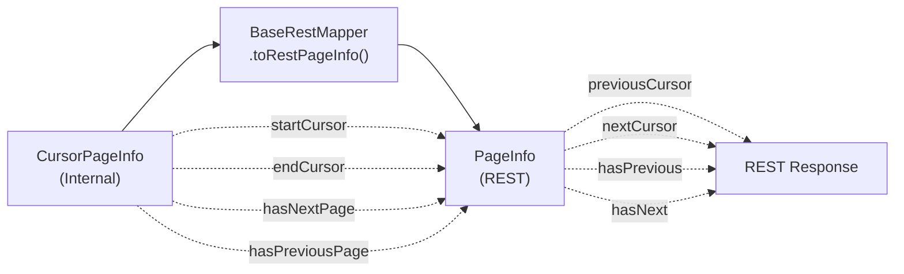

---

## Error Handling

### Null Safety

**All mappers implement defensive null checks:**

```java
public EventResponse toEventResponse(Event event) {
    if (event == null) {
        return null;  // Explicit null return
    }
    // ... mapping logic
}
```

**Collection Handling:**

```java
private List<TagResponse> toTagResponses(List<Tag> tags) {
    return tags.stream()
            .map(this::toTagResponse)
            .collect(Collectors.toList());
}
```

**Note:** If `tags` is null, this will throw `NullPointerException`. Callers must ensure non-null collections or add null checks.

### Graceful Degradation

**Example: Device with Missing Tags**

```java
public DevicesResponse toDevicesResponseWithTags(
    CountedGenericQueryResult<Machine> queryResult, 
    List<List<Tag>> tagsPerMachine
) {
    List<Machine> devices = queryResult.getItems();
    
    List<DeviceResponse> deviceResponses = IntStream.range(0, devices.size())
            .mapToObj(i -> {
                Machine machine = devices.get(i);
                // Graceful fallback to empty list if tags missing
                List<Tag> tags = i < tagsPerMachine.size() 
                    ? tagsPerMachine.get(i) 
                    : List.of();
                return toDeviceResponse(machine, tags);
            })
            .collect(Collectors.toList());
    
    // ... rest of mapping
}
```

---

## Configuration

### Spring Component Registration

All mappers are registered as Spring beans via `@Component` annotation:

```java
@Component
public class DeviceMapper extends BaseRestMapper {
    // ... implementation
}
```

**Bean Lifecycle:**
- **Scope**: Singleton (default)
- **Initialization**: Eager (loaded at application startup)
- **Injection**: Available for autowiring in controllers and services

### No External Configuration Required

Mappers are stateless and require no external configuration files or properties.

---

## Testing Considerations

### Unit Testing Mappers

**Test Structure:**

```java
@ExtendWith(MockitoExtension.class)
class DeviceMapperTest {
    
    private DeviceMapper deviceMapper;
    
    @BeforeEach
    void setUp() {
        deviceMapper = new DeviceMapper();
    }
    
    @Test
    void toDeviceResponse_withValidMachine_mapsAllFields() {
        // Given
        Machine machine = Machine.builder()
            .id("device-123")
            .machineId("machine-456")
            .hostname("test-host")
            // ... other fields
            .build();
        
        List<Tag> tags = List.of(
            Tag.builder().id("tag-1").name("Production").build()
        );
        
        // When
        DeviceResponse response = deviceMapper.toDeviceResponse(machine, tags);
        
        // Then
        assertThat(response.getId()).isEqualTo("device-123");
        assertThat(response.getMachineId()).isEqualTo("machine-456");
        assertThat(response.getHostname()).isEqualTo("test-host");
        assertThat(response.getTags()).hasSize(1);
        assertThat(response.getTags().get(0).getName()).isEqualTo("Production");
    }
    
    @Test
    void toDeviceResponse_withNullMachine_returnsNull() {
        // When
        DeviceResponse response = deviceMapper.toDeviceResponse(null, List.of());
        
        // Then
        assertThat(response).isNull();
    }
}
```

### Integration Testing with Controllers

**Test REST endpoint with mapper:**

```java
@WebMvcTest(DeviceController.class)
class DeviceControllerIntegrationTest {
    
    @Autowired
    private MockMvc mockMvc;
    
    @MockBean
    private DeviceService deviceService;
    
    @Autowired
    private DeviceMapper deviceMapper;  // Real mapper
    
    @Test
    void getDevices_returnsDevicesResponse() throws Exception {
        // Given
        Machine machine = createTestMachine();
        CountedGenericQueryResult<Machine> queryResult = 
            CountedGenericQueryResult.<Machine>builder()
                .items(List.of(machine))
                .filteredCount(1L)
                .pageInfo(createTestPageInfo())
                .build();
        
        when(deviceService.getDevices(any())).thenReturn(queryResult);
        
        // When & Then
        mockMvc.perform(get("/api/devices")
                .param("limit", "20"))
            .andExpect(status().isOk())
            .andExpect(jsonPath("$.devices").isArray())
            .andExpect(jsonPath("$.devices[0].id").value(machine.getId()))
            .andExpect(jsonPath("$.pageInfo.hasNext").isBoolean());
    }
}
```

---

## Performance Considerations

### Stream Processing

**All list transformations use Java Streams for efficiency:**

```java
List<DeviceResponse> deviceResponses = queryResult.getItems().stream()
        .map(machine -> toDeviceResponse(machine, List.of()))
        .collect(Collectors.toList());
```

**Benefits:**
- Lazy evaluation
- Potential for parallel processing (if needed)
- Functional, readable code

### Memory Efficiency

**Mappers are stateless:**
- No instance variables
- No caching
- Single instance per application (singleton scope)

**Large Result Sets:**
- Pagination limits result set size
- Streaming transformations avoid intermediate collections
- No unnecessary object creation

### Optimization Opportunities

**1. Batch Tag Loading:**

Current implementation loads tags separately:
```java
toDevicesResponseWithTags(queryResult, tagsPerMachine)
```

**Optimization:** Load tags in batch query before mapping to avoid N+1 queries.

**2. Selective Field Mapping:**

For list views, consider creating lightweight DTOs:
```java
DeviceListItemResponse (subset of DeviceResponse fields)
```

**3. Caching:**

For rarely-changing data (e.g., filter options), consider caching:
```java
@Cacheable("deviceFilters")
public DeviceFilterResponse toDeviceFilterResponse(DeviceFilters filters)
```

---

## Security Considerations

### Data Sanitization

**Mappers should NOT expose sensitive fields:**

```java
public ToolResponse toToolResponse(IntegratedTool tool) {
    return ToolResponse.builder()
        // ... other fields
        .credentials(toToolCredentialsResponse(tool.getCredentials()))
        .build();
}

private ToolCredentialsResponse toToolCredentialsResponse(ToolCredentials credentials) {
    return ToolCredentialsResponse.builder()
        .username(credentials.getUsername())
        .password(credentials.getPassword())  // ⚠️ Consider masking
        .apiKey(toToolApiKeyResponse(credentials.getApiKey()))  // ⚠️ Consider masking
        .build();
}
```

**Recommendation:** Implement field-level security or masking for sensitive data:
- Passwords: Return masked value or null
- API Keys: Return partial key (e.g., `"sk-...xyz"`)
- Tokens: Never expose in responses

### Authorization

**Mappers do NOT enforce authorization:**
- Authorization is handled at controller/service layer
- Mappers assume input data is already authorized
- Controllers must filter data before passing to mappers

---

## Future Enhancements

### 1. Bidirectional Mapping

**Current:** Mappers only support internal → external transformation.

**Enhancement:** Add reverse mapping for POST/PUT requests:

```java
public Machine toMachine(CreateDeviceRequest request)
public IntegratedTool toIntegratedTool(CreateToolRequest request)
```

### 2. MapStruct Integration

**Current:** Manual mapping code.

**Enhancement:** Use MapStruct for compile-time code generation:

```java
@Mapper(componentModel = "spring")
public interface DeviceMapper {
    DeviceResponse toDeviceResponse(Machine machine);
    
    @Mapping(target = "tags", source = "tags")
    DeviceResponse toDeviceResponse(Machine machine, List<Tag> tags);
}
```

**Benefits:**
- Type-safe mapping
- Compile-time validation
- Better performance (no reflection)

### 3. Versioned DTOs

**Current:** Single DTO version.

**Enhancement:** Support multiple API versions:

```java
public DeviceResponseV1 toDeviceResponseV1(Machine machine)
public DeviceResponseV2 toDeviceResponseV2(Machine machine)
```

### 4. Partial Response Support

**Enhancement:** Support field selection (GraphQL-style):

```java
public DeviceResponse toDeviceResponse(
    Machine machine, 
    Set<String> requestedFields
)
```

---

## Troubleshooting

### Common Issues

#### 1. NullPointerException in Mapping

**Symptom:** NPE when mapping nested objects.

**Cause:** Null nested object not handled.

**Solution:** Add null checks:

```java
private ToolCredentialsResponse toToolCredentialsResponse(ToolCredentials credentials) {
    if (credentials == null) {
        return null;
    }
    // ... mapping logic
}
```

#### 2. Missing Fields in Response

**Symptom:** Expected fields are null in REST response.

**Cause:** Field not mapped in mapper method.

**Solution:** Verify all fields are mapped:

```java
return DeviceResponse.builder()
    .id(machine.getId())
    .machineId(machine.getMachineId())
    // ... ensure all fields are mapped
    .build();
```

#### 3. Pagination Metadata Incorrect

**Symptom:** `hasNext` or `hasPrevious` flags are wrong.

**Cause:** Incorrect transformation in `toRestPageInfo()`.

**Solution:** Verify cursor mapping:

```java
return PageInfo.builder()
    .nextCursor(cursorPageInfo.getEndCursor())      // ✅ Correct
    .previousCursor(cursorPageInfo.getStartCursor()) // ✅ Correct
    .hasNext(cursorPageInfo.isHasNextPage())        // ✅ Correct
    .hasPrevious(cursorPageInfo.isHasPreviousPage()) // ✅ Correct
    .build();
```

#### 4. Tag Mismatch in Device List

**Symptom:** Devices have wrong tags or missing tags.

**Cause:** Index mismatch in `toDevicesResponseWithTags()`.

**Solution:** Ensure tag lists are ordered correctly:

```java
List<DeviceResponse> deviceResponses = IntStream.range(0, devices.size())
    .mapToObj(i -> {
        Machine machine = devices.get(i);
        List<Tag> tags = i < tagsPerMachine.size() 
            ? tagsPerMachine.get(i) 
            : List.of();  // ✅ Fallback to empty list
        return toDeviceResponse(machine, tags);
    })
    .collect(Collectors.toList());
```

---

## Related Documentation

- **[External API Service](external_api.md)** - Parent module overview
- **[External API REST Controllers](external_api_rest_controllers.md)** - Controller implementations that use these mappers
- **[Data Layer - MongoDB](data_layer_mongo.md)** - Source documents for mapping
- **[Data Layer - Core](data_layer_core.md)** - Pinot repositories for log data
- **[API Service](api_service.md)** - Internal GraphQL API and DTOs

---

## Summary

The **External API DTO Mappers** module provides a robust, maintainable transformation layer between OpenFrame's internal data models and external REST API representations. By centralizing mapping logic in dedicated, testable components, the module ensures:

- **Clean API Contracts**: External DTOs are optimized for REST consumers
- **Internal Flexibility**: Internal models can evolve without breaking external APIs
- **Type Safety**: Compile-time validation of transformations
- **Maintainability**: Localized mapping logic for easy updates
- **Performance**: Efficient stream-based transformations with pagination support

The module follows established design patterns (DTO, Mapper, Builder) and integrates seamlessly with Spring Boot's dependency injection, making it a critical component of OpenFrame's external API layer.
