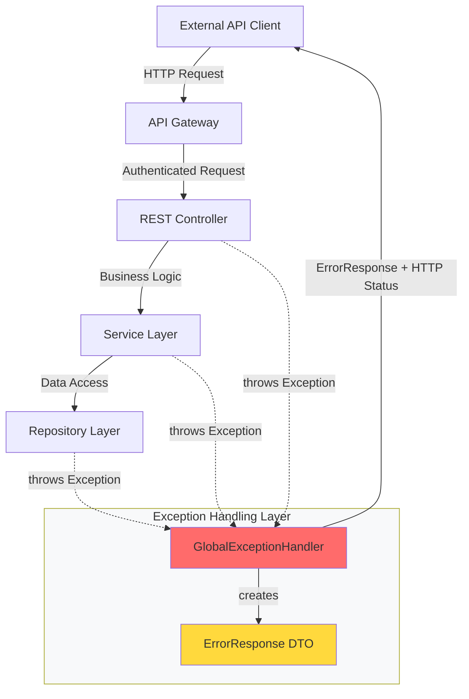
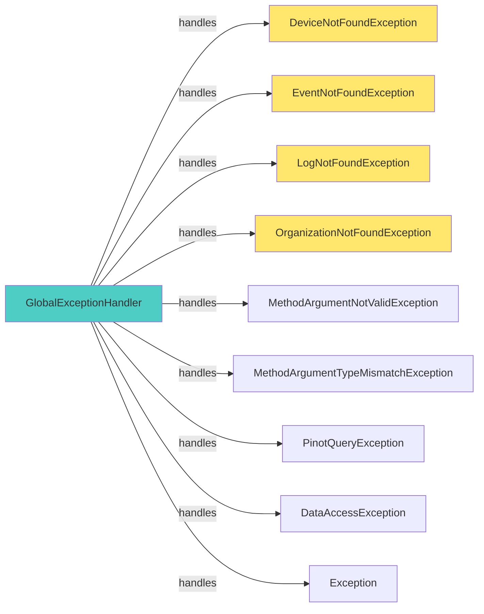
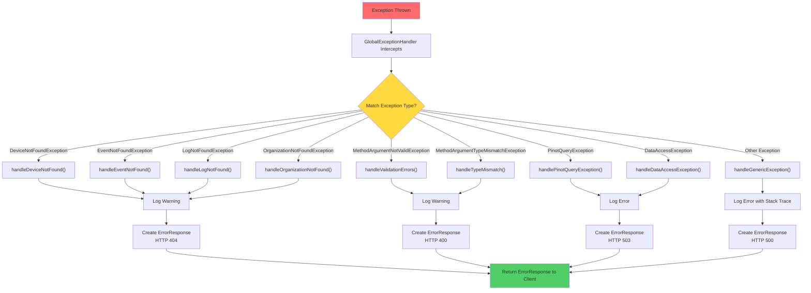
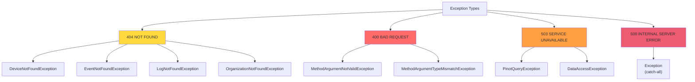
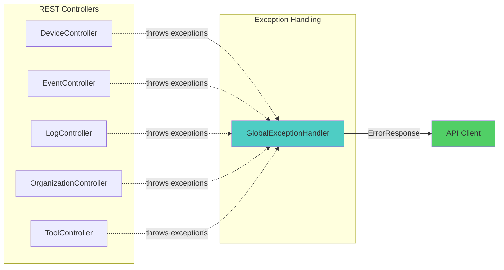
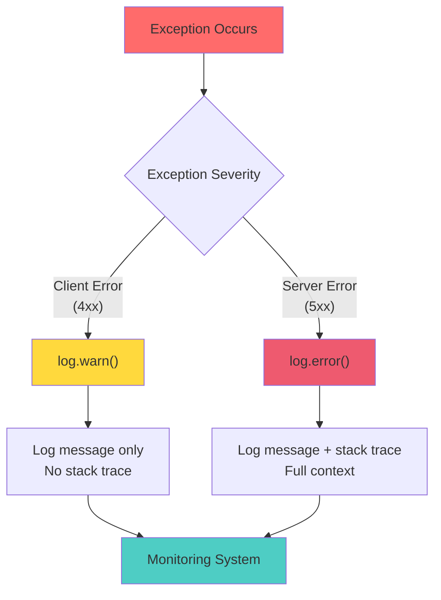
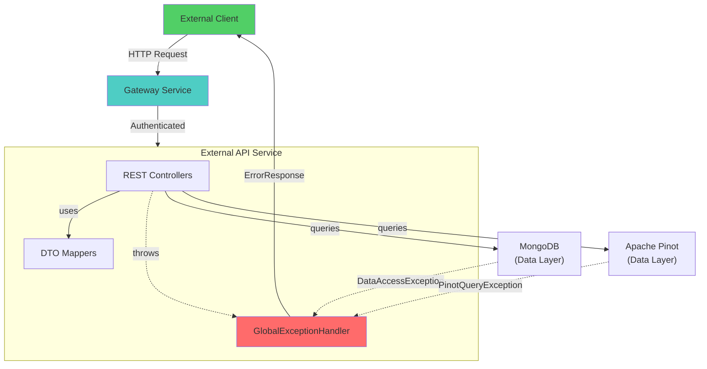
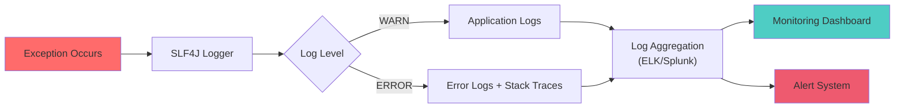

# External API Exception Handling Module

## Overview

The **External API Exception Handling** module provides centralized error handling and exception management for the OpenFrame External API service. It implements a global exception handler that intercepts exceptions thrown by REST controllers and transforms them into standardized, client-friendly error responses with appropriate HTTP status codes.

This module ensures consistent error reporting across all external API endpoints, improving API usability and debugging capabilities while protecting sensitive internal implementation details from external consumers.

---

## Table of Contents

1. [Architecture Overview](#architecture-overview)
2. [Core Components](#core-components)
3. [Exception Handling Flow](#exception-handling-flow)
4. [Exception Types](#exception-types)
5. [Error Response Format](#error-response-format)
6. [HTTP Status Code Mapping](#http-status-code-mapping)
7. [Integration with External API](#integration-with-external-api)
8. [Best Practices](#best-practices)
9. [Related Modules](#related-modules)

---

## Architecture Overview

The exception handling module uses Spring's `@RestControllerAdvice` annotation to provide global exception handling across all REST controllers in the External API service. It intercepts exceptions before they reach the client and transforms them into structured error responses.



### Key Design Principles

1. **Centralized Error Handling**: Single point of exception management for all external API endpoints
2. **Consistent Error Format**: Standardized error response structure across all endpoints
3. **Appropriate HTTP Status Codes**: Semantic HTTP status codes matching error types
4. **Security-Conscious**: Prevents leaking sensitive internal details to external clients
5. **Comprehensive Logging**: Detailed error logging for debugging and monitoring

---

## Core Components

### GlobalExceptionHandler

**Location**: `com.openframe.external.exception.GlobalExceptionHandler`

The central exception handler that intercepts and processes all exceptions thrown by External API controllers.



**Key Features**:
- Annotated with `@RestControllerAdvice` for global scope
- Uses `@ExceptionHandler` methods for specific exception types
- Applies `@ResponseStatus` to set HTTP status codes
- Implements SLF4J logging for error tracking

**Code Structure**:

```java
@RestControllerAdvice
@Slf4j
public class GlobalExceptionHandler {
    
    // Resource Not Found Handlers (404)
    @ExceptionHandler(DeviceNotFoundException.class)
    @ResponseStatus(HttpStatus.NOT_FOUND)
    public ErrorResponse handleDeviceNotFound(DeviceNotFoundException ex)
    
    // Validation Error Handlers (400)
    @ExceptionHandler(MethodArgumentNotValidException.class)
    @ResponseStatus(HttpStatus.BAD_REQUEST)
    public ErrorResponse handleValidationErrors(MethodArgumentNotValidException ex)
    
    // Service Unavailable Handlers (503)
    @ExceptionHandler(PinotQueryException.class)
    @ResponseStatus(HttpStatus.SERVICE_UNAVAILABLE)
    public ErrorResponse handlePinotQueryException(PinotQueryException ex)
    
    // Generic Error Handler (500)
    @ExceptionHandler(Exception.class)
    @ResponseStatus(HttpStatus.INTERNAL_SERVER_ERROR)
    public ErrorResponse handleGenericException(Exception ex)
}
```

---

## Exception Handling Flow



### Processing Steps

1. **Exception Thrown**: Controller, service, or repository layer throws an exception
2. **Interception**: `GlobalExceptionHandler` intercepts the exception
3. **Type Matching**: Handler matches exception to appropriate `@ExceptionHandler` method
4. **Logging**: Exception details logged at appropriate level (WARN/ERROR)
5. **Response Creation**: `ErrorResponse` object created with error code and message
6. **Status Code Application**: HTTP status code set via `@ResponseStatus`
7. **Client Response**: Structured error response returned to client

---

## Exception Types

### Resource Not Found Exceptions (404)

Thrown when requested resources cannot be found in the system.

| Exception | Error Code | Description | Source |
|-----------|------------|-------------|--------|
| `DeviceNotFoundException` | `DEVICE_NOT_FOUND` | Device with specified ID not found | Device queries |
| `EventNotFoundException` | `EVENT_NOT_FOUND` | Event with specified ID not found | Event queries |
| `LogNotFoundException` | `LOG_NOT_FOUND` | Log entry with specified ID not found | Log queries |
| `OrganizationNotFoundException` | `ORGANIZATION_NOT_FOUND` | Organization with specified ID not found | Organization queries |

**Example Response**:
```json
{
  "errorCode": "DEVICE_NOT_FOUND",
  "message": "Device with ID 'abc123' not found"
}
```

### Validation Exceptions (400)

Thrown when request parameters fail validation.

| Exception | Error Code | Description | Trigger |
|-----------|------------|-------------|---------|
| `MethodArgumentNotValidException` | `VALIDATION_ERROR` | Request body validation failed | `@Valid` annotation failures |
| `MethodArgumentTypeMismatchException` | `TYPE_MISMATCH` | Parameter type conversion failed | Invalid parameter types |

**Example Response**:
```json
{
  "errorCode": "TYPE_MISMATCH",
  "message": "Invalid value 'abc' for parameter 'limit'"
}
```

### Service Unavailable Exceptions (503)

Thrown when backend services are temporarily unavailable.

| Exception | Error Code | Description | Source |
|-----------|------------|-------------|--------|
| `PinotQueryException` | `PINOT_QUERY_ERROR` | Apache Pinot query execution failed | Pinot repository layer |
| `DataAccessException` | `DATABASE_ERROR` | Database operation failed | MongoDB/Cassandra operations |

**Example Response**:
```json
{
  "errorCode": "PINOT_QUERY_ERROR",
  "message": "Query service temporarily unavailable. Please try again later."
}
```

### Generic Exceptions (500)

Catch-all for unexpected errors.

| Exception | Error Code | Description | Handling |
|-----------|------------|-------------|----------|
| `Exception` | `INTERNAL_ERROR` | Unexpected internal error | Logs full stack trace, returns generic message |

**Example Response**:
```json
{
  "errorCode": "INTERNAL_ERROR",
  "message": "Internal server error"
}
```

---

## Error Response Format

All error responses follow a consistent structure defined by the `ErrorResponse` DTO.

### ErrorResponse Structure

```java
public class ErrorResponse {
    private String errorCode;  // Machine-readable error identifier
    private String message;    // Human-readable error description
}
```

### Response Characteristics

- **Consistent Structure**: Same format across all error types
- **Machine-Readable Codes**: `errorCode` field for programmatic handling
- **Human-Readable Messages**: `message` field for display/logging
- **No Stack Traces**: Internal details hidden from external clients
- **JSON Format**: Standard JSON serialization via Spring

### Example Responses

**404 Not Found**:
```json
{
  "errorCode": "DEVICE_NOT_FOUND",
  "message": "Device with ID 'device-123' not found"
}
```

**400 Bad Request**:
```json
{
  "errorCode": "VALIDATION_ERROR",
  "message": "Invalid request parameters"
}
```

**503 Service Unavailable**:
```json
{
  "errorCode": "DATABASE_ERROR",
  "message": "Database operation failed. Please try again later."
}
```

**500 Internal Server Error**:
```json
{
  "errorCode": "INTERNAL_ERROR",
  "message": "Internal server error"
}
```

---

## HTTP Status Code Mapping



### Status Code Guidelines

| HTTP Status | Semantic Meaning | When to Use | Client Action |
|-------------|------------------|-------------|---------------|
| **404 NOT FOUND** | Resource does not exist | Querying non-existent entities | Check resource ID, verify existence |
| **400 BAD REQUEST** | Invalid client request | Validation failures, type mismatches | Fix request parameters/body |
| **503 SERVICE UNAVAILABLE** | Backend service temporarily down | Database/Pinot unavailable | Retry with exponential backoff |
| **500 INTERNAL SERVER ERROR** | Unexpected server error | Unhandled exceptions | Report to support, check logs |

---

## Integration with External API

### Controller Integration

Exception handling is automatically applied to all REST controllers in the External API service through Spring's component scanning.



### Example Controller Usage

Controllers can throw exceptions naturally without handling them:

```java
@RestController
@RequestMapping("/api/v1/devices")
public class DeviceController {
    
    @GetMapping("/{id}")
    public DeviceDTO getDevice(@PathVariable String id) {
        // Exception automatically handled by GlobalExceptionHandler
        Device device = deviceService.findById(id)
            .orElseThrow(() -> new DeviceNotFoundException("Device with ID '" + id + "' not found"));
        
        return deviceMapper.toDTO(device);
    }
}
```

### Logging Behavior



**Logging Levels**:
- **WARN**: Client errors (404, 400) - Expected conditions
- **ERROR**: Server errors (503, 500) - Unexpected conditions requiring investigation

---

## Best Practices

### For API Developers

1. **Use Specific Exceptions**: Throw specific exception types (e.g., `DeviceNotFoundException`) rather than generic exceptions
2. **Provide Context**: Include relevant details in exception messages (IDs, parameters)
3. **Don't Catch and Wrap**: Let exceptions propagate to `GlobalExceptionHandler`
4. **Validate Early**: Use `@Valid` annotations for automatic validation

**Good Example**:
```java
public Device getDevice(String deviceId) {
    return deviceRepository.findById(deviceId)
        .orElseThrow(() -> new DeviceNotFoundException(
            "Device with ID '" + deviceId + "' not found"
        ));
}
```

**Bad Example**:
```java
public Device getDevice(String deviceId) {
    try {
        return deviceRepository.findById(deviceId).get();
    } catch (Exception e) {
        // Don't catch and wrap - let GlobalExceptionHandler handle it
        throw new RuntimeException("Error getting device", e);
    }
}
```

### For API Consumers

1. **Check HTTP Status Codes**: Use status codes for flow control
2. **Parse Error Codes**: Use `errorCode` field for programmatic error handling
3. **Display Messages**: Show `message` field to end users
4. **Implement Retry Logic**: Retry 503 errors with exponential backoff
5. **Log Errors**: Log full error responses for debugging

**Client Error Handling Example**:
```typescript
async function getDevice(deviceId: string): Promise<Device> {
  try {
    const response = await fetch(`/api/v1/devices/${deviceId}`);
    
    if (!response.ok) {
      const error = await response.json();
      
      switch (error.errorCode) {
        case 'DEVICE_NOT_FOUND':
          throw new DeviceNotFoundError(error.message);
        case 'VALIDATION_ERROR':
          throw new ValidationError(error.message);
        case 'PINOT_QUERY_ERROR':
          // Retry with backoff
          return retryWithBackoff(() => getDevice(deviceId));
        default:
          throw new ApiError(error.message);
      }
    }
    
    return response.json();
  } catch (error) {
    console.error('Device fetch failed:', error);
    throw error;
  }
}
```

### Security Considerations

1. **No Internal Details**: Never expose stack traces or internal paths to clients
2. **Generic Messages**: Use generic messages for 500 errors
3. **Sanitize User Input**: Validate and sanitize all user input in error messages
4. **Rate Limiting**: Implement rate limiting to prevent error-based attacks
5. **Audit Logging**: Log all errors for security monitoring

---

## Related Modules

### Direct Dependencies

- **[external_api_rest_controllers](external_api_rest_controllers.md)**: REST controllers that throw exceptions handled by this module
- **[data_layer_core](data_layer_core.md)**: Source of `PinotQueryException` and data access errors
- **[data_layer_mongo](data_layer_mongo.md)**: Source of `DataAccessException` from MongoDB operations

### Related Modules

- **[external_api_configuration](external_api_configuration.md)**: Configuration for External API service including error handling setup
- **[api_service_rest_controllers](api_service_rest_controllers.md)**: Similar exception handling patterns in internal API
- **[gateway_service_security](gateway_service_security.md)**: Gateway-level error handling and security

### Integration Flow



---

## Monitoring and Observability

### Metrics to Track

1. **Error Rate by Type**: Count of each exception type
2. **4xx vs 5xx Ratio**: Client errors vs server errors
3. **Response Time**: Time to process and return errors
4. **Error Trends**: Patterns in error occurrences

### Logging Strategy



### Alert Conditions

- **High 5xx Rate**: More than 5% of requests returning 500/503
- **Pinot Query Failures**: Sustained `PinotQueryException` occurrences
- **Database Errors**: Multiple `DataAccessException` in short period
- **Unexpected Exceptions**: Any unhandled exception reaching generic handler

---

## Summary

The External API Exception Handling module provides:

✅ **Centralized Error Management**: Single point for all exception handling  
✅ **Consistent Error Format**: Standardized responses across all endpoints  
✅ **Appropriate HTTP Status Codes**: Semantic status codes for different error types  
✅ **Security-Conscious Design**: No internal details exposed to clients  
✅ **Comprehensive Logging**: Detailed error tracking for debugging  
✅ **Client-Friendly Messages**: Clear, actionable error messages  
✅ **Automatic Integration**: Works seamlessly with all REST controllers  

This module is essential for providing a professional, secure, and maintainable external API interface for OpenFrame's MSP platform.

---

**Related Documentation**:
- [External API REST Controllers](external_api_rest_controllers.md)
- [External API Configuration](external_api_configuration.md)
- [Data Layer Core](data_layer_core.md)
- [Gateway Service Security](gateway_service_security.md)
