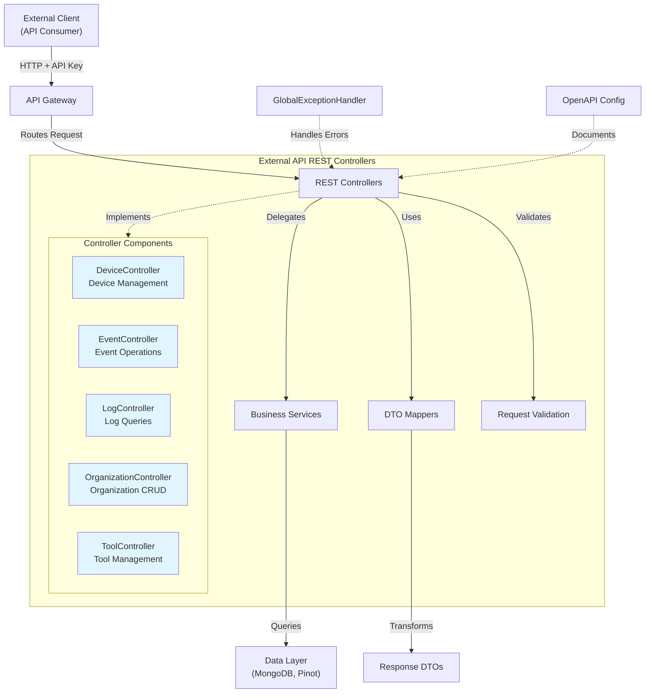
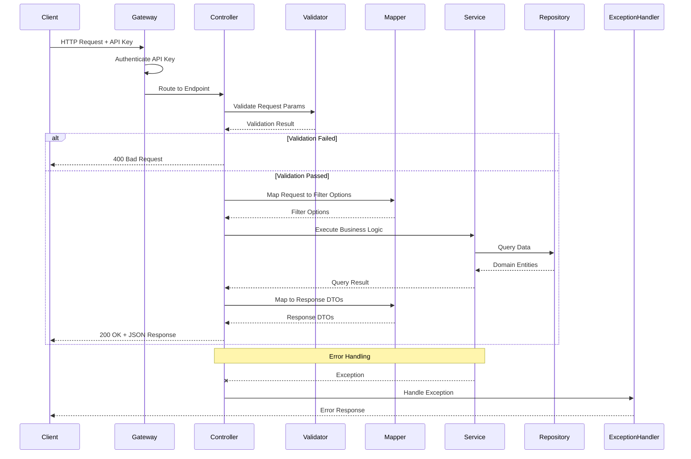
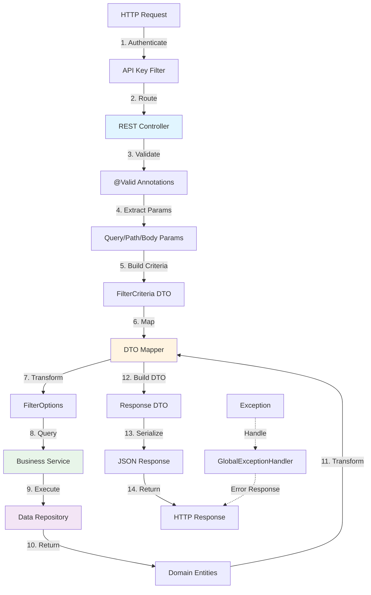
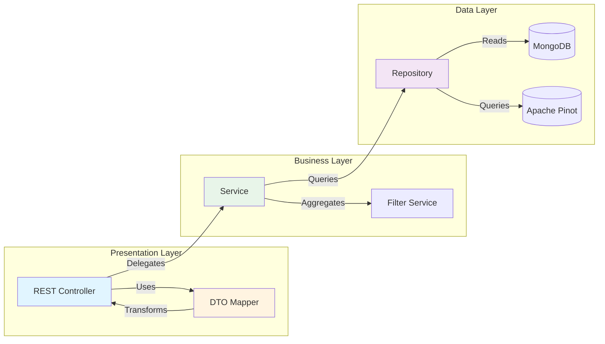
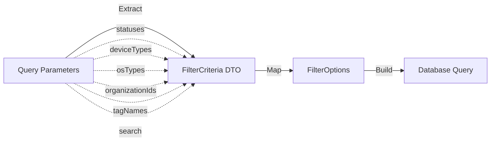
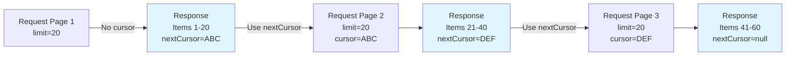
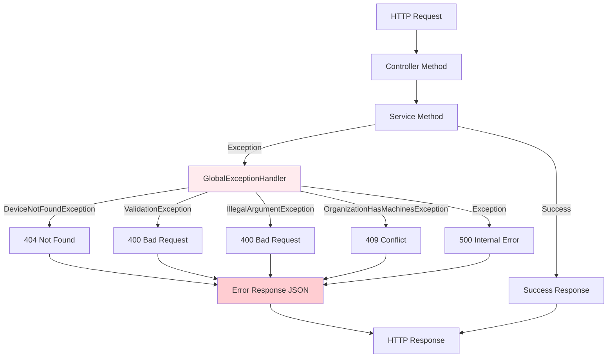
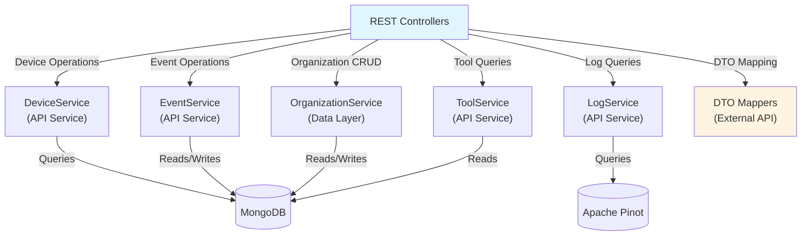
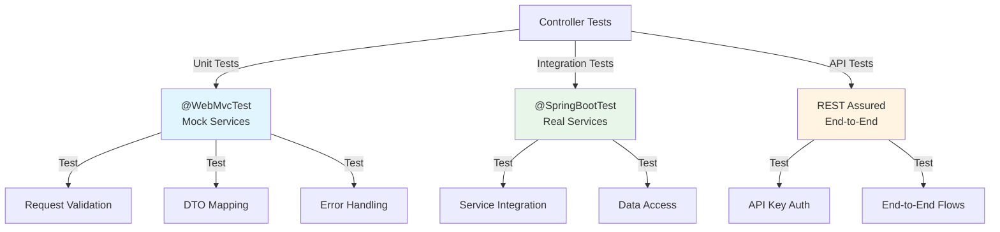

# External API REST Controllers

## Overview

The **External API REST Controllers** module provides the HTTP endpoint layer for OpenFrame's External API Service. This module exposes RESTful endpoints that enable third-party applications, automation scripts, and external integrations to programmatically interact with OpenFrame platform resources including devices, events, logs, organizations, and integrated tools.

This module serves as the primary interface for:
- 🔌 **Third-party integrations** requiring programmatic access to OpenFrame data
- 🤖 **Automation workflows** and custom scripts
- 📊 **External monitoring and reporting tools**
- 🔗 **Partner applications** needing OpenFrame resource access
- 📱 **Mobile and web applications** consuming OpenFrame APIs

### Key Features

- 🌐 **RESTful API Design** - Standard HTTP methods (GET, POST, PUT, PATCH, DELETE)
- 🔐 **API Key Authentication** - Secure access via API key headers
- 📖 **OpenAPI Documentation** - Comprehensive Swagger/OpenAPI annotations
- 🔍 **Advanced Filtering** - Multi-criteria filtering with dynamic filter options
- 📄 **Cursor-based Pagination** - Efficient pagination for large datasets
- 🔎 **Full-text Search** - Search capabilities across resource fields
- ✅ **Request Validation** - Jakarta Bean Validation for request parameters
- 🎯 **Consistent Error Handling** - Standardized error responses
- 📊 **Audit Logging** - Request tracking via `X-User-Id` and `X-API-Key-Id` headers

---

## Architecture

### Controller Layer Architecture



### Request Processing Flow



---

## Core Components

### 1. DeviceController

**Purpose:** Manages device-related operations including listing, retrieval, status updates, and filter options.

**Endpoints:**

| Method | Path | Description |
|--------|------|-------------|
| GET | `/api/v1/devices` | List devices with filtering and pagination |
| GET | `/api/v1/devices/{machineId}` | Get device details by machine ID |
| PATCH | `/api/v1/devices/{machineId}` | Update device status |
| GET | `/api/v1/devices/filters` | Get available device filter options |

**Key Features:**
- Multi-criteria filtering (status, type, OS, organization, tags)
- Optional tag loading with `includeTags` parameter
- Full-text search across device name and hostname
- Cursor-based pagination
- Dynamic filter options with counts

**Example Request:**

```bash
curl -X GET "https://api.openframe.ai/external-api/api/v1/devices?statuses=ONLINE&deviceTypes=WORKSTATION&limit=20&includeTags=true" \
  -H "X-API-Key: ak_your_key_id.sk_your_secret_key"
```

**Example Response:**

```json
{
  "devices": [
    {
      "id": "507f1f77bcf86cd799439011",
      "machineId": "machine-123",
      "hostname": "workstation-01",
      "displayName": "John's Workstation",
      "ip": "192.168.1.100",
      "status": "ONLINE",
      "type": "WORKSTATION",
      "osType": "Windows",
      "osVersion": "11",
      "organizationId": "org-456",
      "lastSeen": "2024-01-15T10:30:00Z",
      "tags": [
        {
          "id": "tag-789",
          "name": "Production",
          "color": "#FF5733"
        }
      ]
    }
  ],
  "pageInfo": {
    "hasNextPage": true,
    "nextCursor": "eyJpZCI6IjUwN2YxZjc3YmNmODZjZDc5OTQzOTAxMSJ9",
    "hasPreviousPage": false,
    "previousCursor": null
  },
  "filteredCount": 150
}
```

**Dependencies:**
- `DeviceService` - Core device business logic
- `DeviceFilterService` - Filter aggregation and counting
- `TagService` - Tag loading for devices
- `DeviceMapper` - DTO transformation

---

### 2. EventController

**Purpose:** Handles event creation, retrieval, updates, and filtering for system events.

**Endpoints:**

| Method | Path | Description |
|--------|------|-------------|
| GET | `/api/v1/events` | List events with filtering and pagination |
| GET | `/api/v1/events/{id}` | Get event details by ID |
| POST | `/api/v1/events` | Create a new event |
| PUT | `/api/v1/events/{id}` | Update an existing event |
| GET | `/api/v1/events/filters` | Get available event filter options |

**Key Features:**
- Filter by user IDs, event types, date ranges
- Full-text search in event payloads
- Event creation and updates
- Cursor-based pagination
- Dynamic filter options

**Example Request:**

```bash
curl -X POST "https://api.openframe.ai/external-api/api/v1/events" \
  -H "X-API-Key: ak_your_key_id.sk_your_secret_key" \
  -H "Content-Type: application/json" \
  -d '{
    "type": "USER_LOGIN",
    "userId": "user-123",
    "payload": {
      "ipAddress": "192.168.1.50",
      "userAgent": "Mozilla/5.0"
    }
  }'
```

**Example Response:**

```json
{
  "id": "event-789",
  "type": "USER_LOGIN",
  "userId": "user-123",
  "payload": {
    "ipAddress": "192.168.1.50",
    "userAgent": "Mozilla/5.0"
  },
  "timestamp": "2024-01-15T10:30:00Z"
}
```

**Dependencies:**
- `EventService` - Event business logic and persistence
- `EventMapper` - DTO transformation

---

### 3. LogController

**Purpose:** Provides access to system logs with advanced filtering and detailed log retrieval.

**Endpoints:**

| Method | Path | Description |
|--------|------|-------------|
| GET | `/api/v1/logs` | List logs with filtering and pagination |
| GET | `/api/v1/logs/details` | Get detailed log information |
| GET | `/api/v1/logs/filters` | Get available log filter options |

**Key Features:**
- Multi-criteria filtering (date range, tool type, event type, severity, organization, device)
- Full-text search in log summary and content
- Detailed log retrieval with full content
- Cursor-based pagination
- Dynamic filter options with organization details

**Example Request:**

```bash
curl -X GET "https://api.openframe.ai/external-api/api/v1/logs?startDate=2024-01-01&endDate=2024-01-31&severities=ERROR&severities=CRITICAL&limit=50" \
  -H "X-API-Key: ak_your_key_id.sk_your_secret_key"
```

**Example Response:**

```json
{
  "logs": [
    {
      "toolEventId": "log-123",
      "eventType": "SYSTEM_ERROR",
      "ingestDay": "2024-01-15",
      "toolType": "FLEET_MDM",
      "severity": "ERROR",
      "userId": "user-456",
      "deviceId": "device-789",
      "summary": "Failed to connect to device",
      "timestamp": "2024-01-15T10:30:00Z"
    }
  ],
  "pageInfo": {
    "hasNextPage": true,
    "nextCursor": "eyJpZCI6ImxvZy0xMjMifQ==",
    "hasPreviousPage": false,
    "previousCursor": null
  }
}
```

**Log Details Request:**

```bash
curl -X GET "https://api.openframe.ai/external-api/api/v1/logs/details?ingestDay=2024-01-15&toolType=FLEET_MDM&eventType=SYSTEM_ERROR&timestamp=2024-01-15T10:30:00Z&toolEventId=log-123" \
  -H "X-API-Key: ak_your_key_id.sk_your_secret_key"
```

**Dependencies:**
- `LogService` - Log querying from Apache Pinot
- `LogMapper` - DTO transformation

---

### 4. OrganizationController

**Purpose:** Provides full CRUD operations for organization management.

**Endpoints:**

| Method | Path | Description |
|--------|------|-------------|
| GET | `/api/v1/organizations` | List organizations with filtering |
| GET | `/api/v1/organizations/{id}` | Get organization by database ID |
| GET | `/api/v1/organizations/by-organization-id/{organizationId}` | Get organization by business ID |
| POST | `/api/v1/organizations` | Create a new organization |
| PUT | `/api/v1/organizations/{id}` | Update an existing organization |
| DELETE | `/api/v1/organizations/{id}` | Delete an organization |

**Key Features:**
- Filter by category, employee count, contract status
- Full-text search in organization name and category
- Dual ID lookup (database ID and business organizationId)
- Create, update, and delete operations
- Validation prevents deletion of organizations with associated machines

**Example Create Request:**

```bash
curl -X POST "https://api.openframe.ai/external-api/api/v1/organizations" \
  -H "X-API-Key: ak_your_key_id.sk_your_secret_key" \
  -H "Content-Type: application/json" \
  -d '{
    "name": "Acme Corporation",
    "organizationId": "acme-corp",
    "category": "ENTERPRISE",
    "employeeCount": 500,
    "hasActiveContract": true,
    "contactEmail": "admin@acme.com"
  }'
```

**Example Response:**

```json
{
  "id": "org-123",
  "name": "Acme Corporation",
  "organizationId": "acme-corp",
  "category": "ENTERPRISE",
  "employeeCount": 500,
  "hasActiveContract": true,
  "contactEmail": "admin@acme.com",
  "createdAt": "2024-01-15T10:30:00Z",
  "updatedAt": "2024-01-15T10:30:00Z"
}
```

**Dependencies:**
- `OrganizationService` - Organization data access
- `OrganizationQueryService` - Organization querying with filters
- `OrganizationCommandService` - Organization CRUD operations
- `OrganizationMapper` - DTO transformation

---

### 5. ToolController

**Purpose:** Manages integrated tools listing and filtering.

**Endpoints:**

| Method | Path | Description |
|--------|------|-------------|
| GET | `/api/v1/tools` | List integrated tools with filtering |
| GET | `/api/v1/tools/filters` | Get available tool filter options |

**Key Features:**
- Filter by enabled status, tool type, category
- Full-text search in tool name and description
- Dynamic filter options

**Example Request:**

```bash
curl -X GET "https://api.openframe.ai/external-api/api/v1/tools?enabled=true&type=MDM" \
  -H "X-API-Key: ak_your_key_id.sk_your_secret_key"
```

**Example Response:**

```json
{
  "tools": [
    {
      "id": "tool-123",
      "name": "Fleet MDM",
      "type": "MDM",
      "category": "DEVICE_MANAGEMENT",
      "enabled": true,
      "description": "Fleet Device Management and Monitoring",
      "version": "1.2.3",
      "createdAt": "2024-01-01T00:00:00Z"
    }
  ],
  "total": 1
}
```

**Dependencies:**
- `ToolService` - Tool business logic
- `ToolMapper` - DTO transformation

---

## Component Interaction

### Data Flow Diagram



### Controller-Service-Repository Pattern



---

## Request Validation

### Validation Annotations

Controllers use Jakarta Bean Validation annotations for request validation:

```java
@GetMapping
public DevicesResponse getDevices(
    @RequestParam(required = false) List<DeviceStatus> statuses,
    @RequestParam(defaultValue = "20") @Min(1) @Max(100) Integer limit,
    @RequestParam(required = false) String cursor) {
    // Implementation
}
```

**Common Validation Annotations:**

| Annotation | Purpose | Example |
|------------|---------|---------|
| `@Min(1)` | Minimum value validation | Pagination limit minimum |
| `@Max(100)` | Maximum value validation | Pagination limit maximum |
| `@Valid` | Nested object validation | Request body validation |
| `@NotNull` | Null check | Required fields |
| `@NotEmpty` | Empty check | Required collections |
| `@Pattern` | Regex validation | Format validation |

### Validation Error Response

```json
{
  "code": "VALIDATION_ERROR",
  "message": "Validation failed for parameter 'limit': must be less than or equal to 100"
}
```

---

## Filtering and Search

### Multi-Criteria Filtering

Controllers support complex filtering through query parameters:

**Device Filtering Example:**

```bash
GET /api/v1/devices?statuses=ONLINE&statuses=IDLE&deviceTypes=WORKSTATION&osTypes=Windows&organizationIds=org-123&tagNames=Production&search=workstation
```

**Filter Criteria Mapping:**



### Dynamic Filter Options

The `/filters` endpoints return available filter values with counts:

**Request:**

```bash
GET /api/v1/devices/filters?statuses=ONLINE
```

**Response:**

```json
{
  "statuses": [
    { "value": "ONLINE", "label": "Online", "count": 150 },
    { "value": "OFFLINE", "label": "Offline", "count": 25 },
    { "value": "IDLE", "label": "Idle", "count": 10 }
  ],
  "deviceTypes": [
    { "value": "WORKSTATION", "label": "Workstation", "count": 120 },
    { "value": "SERVER", "label": "Server", "count": 30 }
  ],
  "osTypes": [
    { "value": "Windows", "label": "Windows", "count": 100 },
    { "value": "Linux", "label": "Linux", "count": 50 }
  ],
  "filteredCount": 150
}
```

---

## Pagination

### Cursor-Based Pagination

All list endpoints use cursor-based pagination for efficient data traversal:

**Pagination Parameters:**

| Parameter | Type | Default | Max | Description |
|-----------|------|---------|-----|-------------|
| `limit` | Integer | 20 | 100 | Number of items per page |
| `cursor` | String | null | - | Opaque cursor for next page |

**Pagination Response:**

```json
{
  "items": [...],
  "pageInfo": {
    "hasNextPage": true,
    "nextCursor": "eyJpZCI6IjUwN2YxZjc3YmNmODZjZDc5OTQzOTAxMSJ9",
    "hasPreviousPage": false,
    "previousCursor": null
  }
}
```

**Pagination Flow:**



---

## OpenAPI Documentation

### Swagger Annotations

Controllers are extensively documented with OpenAPI annotations:

```java
@Operation(
    summary = "Get list of devices",
    description = "Retrieve a paginated list of devices with optional filtering, search, and tags"
)
@ApiResponses(value = {
    @ApiResponse(responseCode = "200", description = "Successfully retrieved devices",
        content = @Content(schema = @Schema(implementation = DevicesResponse.class))),
    @ApiResponse(responseCode = "400", description = "Invalid request parameters",
        content = @Content(schema = @Schema(implementation = ErrorResponse.class))),
    @ApiResponse(responseCode = "401", description = "Unauthorized - invalid or missing API key",
        content = @Content(schema = @Schema(implementation = ErrorResponse.class)))
})
@GetMapping
public DevicesResponse getDevices(...) {
    // Implementation
}
```

### OpenAPI Features

- 📖 **Interactive Documentation** - Try endpoints in Swagger UI
- 🔐 **Authentication Testing** - Test with API keys
- 📋 **Request/Response Examples** - See sample payloads
- 🎯 **Schema Definitions** - Detailed DTO schemas
- 📊 **Error Response Examples** - Understand error formats

**Access Swagger UI:**

```text
https://api.openframe.ai/external-api/swagger-ui.html
```

---

## Error Handling

### HTTP Status Codes

| Status Code | Description | Example Scenario |
|-------------|-------------|------------------|
| `200 OK` | Successful request | Device list retrieved |
| `201 Created` | Resource created | Event created successfully |
| `204 No Content` | Successful with no body | Device status updated |
| `400 Bad Request` | Invalid request | Invalid date format |
| `401 Unauthorized` | Missing/invalid API key | API key not provided |
| `404 Not Found` | Resource not found | Device does not exist |
| `409 Conflict` | Resource conflict | Organization already exists |
| `500 Internal Server Error` | Server error | Database connection failed |

### Error Response Format

```json
{
  "code": "DEVICE_NOT_FOUND",
  "message": "Device not found with ID: device-123"
}
```

### Exception Handling Flow



---

## Security and Audit

### API Key Authentication

Controllers receive authentication context via headers:

```java
@GetMapping
public DevicesResponse getDevices(
    @RequestHeader(value = "X-User-Id", required = false) String userId,
    @RequestHeader(value = "X-API-Key-Id", required = false) String apiKeyId) {
    
    log.info("Getting devices - userId: {}, apiKeyId: {}", userId, apiKeyId);
    // Implementation
}
```

**Security Headers:**

| Header | Description | Example |
|--------|-------------|---------|
| `X-API-Key` | API key for authentication | `ak_keyId.sk_secretKey` |
| `X-User-Id` | Authenticated user ID (injected) | `user-123` |
| `X-API-Key-Id` | API key identifier (injected) | `ak_keyId` |

### Audit Logging

All controller methods log requests with authentication context:

```java
log.info("Getting devices - userId: {}, apiKeyId: {}, limit: {}, cursor: {}", 
    userId, apiKeyId, limit, cursor);
```

**Audit Log Example:**

```text
2024-01-15 10:30:00 INFO  DeviceController - Getting devices - userId: user-123, apiKeyId: ak_abc123, limit: 20, cursor: null
```

---

## Integration with Other Modules

### Service Dependencies



### Module References

| Module | Purpose | Reference |
|--------|---------|-----------|
| **API Service** | Core business logic for devices, events, organizations | [api_service.md](./api_service.md) |
| **External API DTO Mappers** | DTO transformation layer | [external_api_dto_mappers.md](./external_api_dto_mappers.md) |
| **External API Configuration** | OpenAPI and application configuration | [external_api_configuration.md](./external_api_configuration.md) |
| **External API Exception Handling** | Centralized error handling | [external_api_exception_handling.md](./external_api_exception_handling.md) |
| **Data Layer (Mongo)** | MongoDB repositories and documents | [data_layer_mongo.md](./data_layer_mongo.md) |
| **Data Layer (Core)** | Apache Pinot repositories | [data_layer_core.md](./data_layer_core.md) |
| **Security Core** | Authentication and authorization | [security_core.md](./security_core.md) |

---

## Configuration

### Controller Configuration

Controllers are auto-configured via Spring Boot component scanning:

```java
@RestController
@RequestMapping("/api/v1/devices")
@RequiredArgsConstructor
@Slf4j
@Tag(name = "Devices API v1", description = "Device management endpoints")
public class DeviceController {
    // Implementation
}
```

**Configuration Properties:**

```yaml
# Server Configuration
server:
  port: 8080
  servlet:
    context-path: /external-api

# Spring Configuration
spring:
  application:
    name: openframe-external-api

# OpenAPI Configuration
springdoc:
  api-docs:
    path: /v3/api-docs
  swagger-ui:
    path: /swagger-ui.html
    enabled: true
```

---

## Best Practices

### 1. Request Parameter Validation

✅ **DO:**
```java
@GetMapping
public DevicesResponse getDevices(
    @RequestParam(defaultValue = "20") @Min(1) @Max(100) Integer limit) {
    // Implementation
}
```

❌ **DON'T:**
```java
@GetMapping
public DevicesResponse getDevices(@RequestParam Integer limit) {
    // No validation - could cause issues
}
```

### 2. Consistent Logging

✅ **DO:**
```java
log.info("Getting devices - userId: {}, apiKeyId: {}, limit: {}", 
    userId, apiKeyId, limit);
```

❌ **DON'T:**
```java
System.out.println("Getting devices");
```

### 3. Proper Exception Handling

✅ **DO:**
```java
Machine machine = deviceService.findByMachineId(machineId)
    .orElseThrow(() -> new DeviceNotFoundException("Device not found with ID: " + machineId));
```

❌ **DON'T:**
```java
Machine machine = deviceService.findByMachineId(machineId).get(); // Throws NoSuchElementException
```

### 4. OpenAPI Documentation

✅ **DO:**
```java
@Operation(summary = "Get device by ID", description = "Retrieve detailed information...")
@ApiResponses(value = {
    @ApiResponse(responseCode = "200", description = "Device found"),
    @ApiResponse(responseCode = "404", description = "Device not found")
})
```

❌ **DON'T:**
```java
@GetMapping("/{id}")
public DeviceResponse getDevice(@PathVariable String id) {
    // No documentation
}
```

### 5. DTO Mapping

✅ **DO:**
```java
var result = deviceService.queryDevices(filterOptions, paginationCriteria, search);
return deviceMapper.toDevicesResponse(result);
```

❌ **DON'T:**
```java
return result; // Exposing internal domain models
```

---

## Testing

### Controller Testing Strategy



### Example Unit Test

```java
@WebMvcTest(DeviceController.class)
class DeviceControllerTest {
    
    @Autowired
    private MockMvc mockMvc;
    
    @MockBean
    private DeviceService deviceService;
    
    @MockBean
    private DeviceMapper deviceMapper;
    
    @Test
    void getDevices_shouldReturnDeviceList() throws Exception {
        // Given
        var queryResult = createMockQueryResult();
        when(deviceService.queryDevices(any(), any(), any())).thenReturn(queryResult);
        
        // When & Then
        mockMvc.perform(get("/api/v1/devices")
                .header("X-API-Key", "ak_test.sk_test")
                .param("limit", "20"))
            .andExpect(status().isOk())
            .andExpect(jsonPath("$.devices").isArray());
    }
}
```

---

## Performance Considerations

### 1. Pagination Limits

- Default limit: 20 items
- Maximum limit: 100 items
- Prevents excessive data transfer

### 2. Optional Tag Loading

```java
@GetMapping
public DevicesResponse getDevices(
    @RequestParam(defaultValue = "false") Boolean includeTags) {
    
    if (includeTags) {
        // Additional query to load tags
    }
}
```

### 3. Cursor-Based Pagination

- More efficient than offset-based pagination
- Consistent results during concurrent updates
- Better performance for large datasets

### 4. Filter Optimization

- Filter options are pre-aggregated
- Counts are cached when possible
- Efficient database queries

---

## Troubleshooting

### Common Issues

#### 1. 401 Unauthorized

**Cause:** Missing or invalid API key

**Solution:**
```bash
# Ensure API key is in correct format
curl -H "X-API-Key: ak_keyId.sk_secretKey" ...
```

#### 2. 400 Bad Request - Validation Error

**Cause:** Invalid request parameters

**Solution:**
```bash
# Check parameter constraints
# limit must be between 1 and 100
curl "https://api.openframe.ai/external-api/api/v1/devices?limit=20"
```

#### 3. 404 Not Found

**Cause:** Resource does not exist

**Solution:**
```bash
# Verify resource ID exists
curl "https://api.openframe.ai/external-api/api/v1/devices/{valid-machine-id}"
```

#### 4. 429 Too Many Requests

**Cause:** Rate limit exceeded

**Solution:**
- Implement exponential backoff
- Reduce request frequency
- Contact support for higher limits

---

## Related Documentation

- [External API Service Overview](./external_api.md)
- [External API DTO Mappers](./external_api_dto_mappers.md)
- [External API Configuration](./external_api_configuration.md)
- [External API Exception Handling](./external_api_exception_handling.md)
- [API Service](./api_service.md)
- [Data Layer (MongoDB)](./data_layer_mongo.md)
- [Data Layer (Core - Pinot)](./data_layer_core.md)
- [Security Core](./security_core.md)

---

## Additional Resources

### API Documentation
- **Swagger UI:** `https://api.openframe.ai/external-api/swagger-ui.html`
- **OpenAPI Spec:** `https://api.openframe.ai/external-api/v3/api-docs`

### Community Support
- **OpenMSP Slack:** [Join Community](https://join.slack.com/t/openmsp/shared_invite/zt-36bl7mx0h-3~U2nFH6nqHqoTPXMaHEHA)
- **Website:** [https://www.openmsp.ai/](https://www.openmsp.ai/)

### Related Projects
- **Flamingo:** [https://flamingo.run](https://flamingo.run)
- **OpenFrame:** [https://openframe.ai](https://openframe.ai)

---

**Last Updated:** 2024-01-15  
**Module Version:** 1.0.0  
**Maintainers:** OpenFrame Development Team
