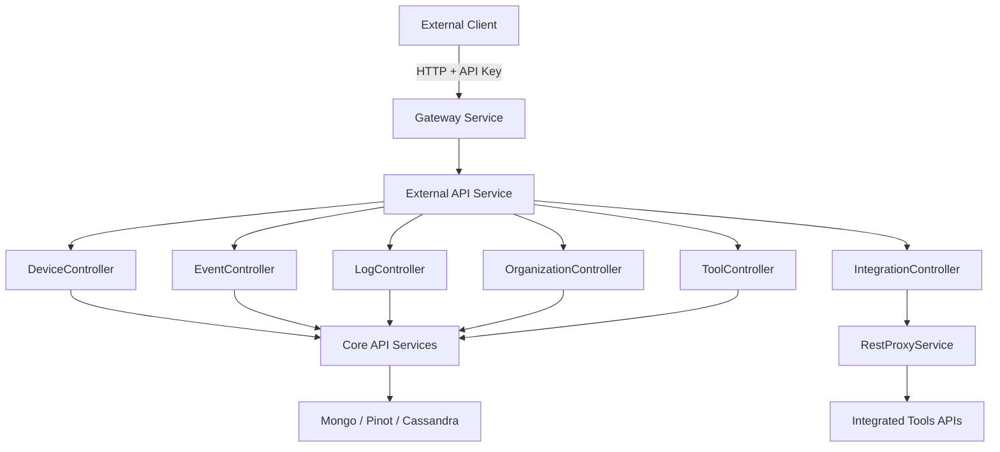
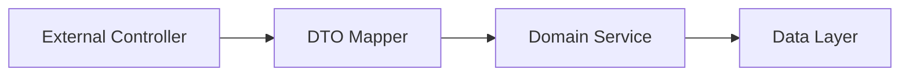
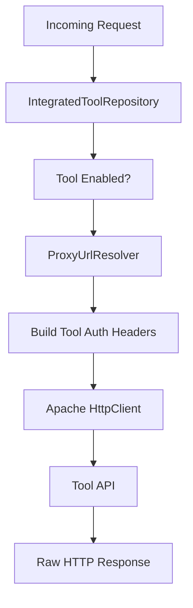

# External API Service – Application and Controllers

## Overview
The **External API Service** exposes a secure, API‑key–based REST interface that allows third‑party systems and integrations to interact with the OpenFrame platform. It is designed for **external consumers** (partners, customer integrations, automation tools) and provides controlled access to devices, events, logs, organizations, and integrated tools.

Key characteristics:
- **API key authentication** (header‑based)
- **Rate‑limited** and gateway‑friendly
- **REST‑first** (no GraphQL dependency for external clients)
- **Proxy capabilities** for integrated third‑party tools
- **OpenAPI / Swagger** documentation out of the box

This module acts as a **boundary layer** between external systems and OpenFrame’s internal API, data, and service layers.

---

## Entry Point and Bootstrapping

### ExternalApiApplication

The service is bootstrapped via a standard Spring Boot application:

```java
@SpringBootApplication
@ComponentScan(basePackages = {
    "com.openframe.external",
    "com.openframe.data",
    "com.openframe.core",
    "com.openframe.api",
    "com.openframe.kafka"
})
public class ExternalApiApplication {
    public static void main(String[] args) {
        SpringApplication.run(ExternalApiApplication.class, args);
    }
}
```

**Key responsibilities:**
- Starts the External API service
- Scans shared OpenFrame modules (core services, data layer, Kafka)
- Ensures controllers can reuse internal domain services without duplication

---

## High‑Level Architecture



**Position in the platform:**
- Sits behind the **Gateway Service**
- Reuses **core domain services** and repositories
- Avoids direct data access in controllers

---

## API Documentation and Security

### OpenAPI / Swagger Configuration

The `OpenApiConfig` class configures:
- API metadata (title, version, contact, license)
- API key authentication scheme
- Server base path (`/external-api`)
- Grouping and endpoint inclusion rules

**Authentication model:**
- Header‑based API key
- Header name: `X-API-Key`
- Format:

```text
ak_<keyId>.sk_<secretKey>
```

**Security scheme:**
- Defined as `ApiKeyAuth`
- Applied globally to all endpoints

---

## Controllers Overview

The External API exposes several REST controllers, each mapping closely to a business domain. Controllers are intentionally thin and delegate all logic to internal services and mappers.



### Common Patterns
- **Filtering & pagination** via criteria objects
- **Cursor‑based pagination**
- **Sorting abstraction**
- **DTO mapping** between internal models and external responses
- **Consistent error handling** with `ErrorResponse`

---

## DeviceController

**Base path:** `/api/v1/devices`

**Responsibilities:**
- List devices with filtering, search, pagination, and sorting
- Retrieve a single device by machine ID
- Expose available device filter options
- Update device lifecycle status (ARCHIVED / DELETED)

**Internal dependencies:**
- `DeviceService`
- `DeviceFilterService`
- `TagService`
- `DeviceMapper`

**Notable behavior:**
- Optional tag enrichment (`includeTags=true`)
- Graceful fallback if tag loading fails

---

## EventController

**Base path:** `/api/v1/events`

**Responsibilities:**
- Query events with filters and cursor pagination
- Retrieve an event by ID
- Create and update events
- Expose available event filter options

**Internal dependencies:**
- `EventService`
- `EventMapper`

**Design notes:**
- Supports both read and write operations
- Uses shared event domain models

---

## LogController

**Base path:** `/api/v1/logs`

**Responsibilities:**
- Query logs with advanced filtering (date, severity, tool, org, device)
- Retrieve log filter metadata
- Fetch detailed log entries by composite identifiers

**Internal dependencies:**
- `LogService`
- `LogMapper`

**Data sources:**
- Optimized for analytical backends (Pinot / Cassandra)

---

## OrganizationController

**Base path:** `/api/v1/organizations`

**Responsibilities:**
- Full CRUD lifecycle for organizations
- Query organizations with filters, search, sorting, and pagination
- Lookup by database ID or business `organizationId`

**Internal dependencies:**
- `OrganizationService`
- `OrganizationQueryService`
- `OrganizationCommandService`
- `OrganizationMapper`

**Business rules enforced:**
- Prevent deletion if machines are associated
- Distinguish query vs command responsibilities

---

## ToolController

**Base path:** `/api/v1/tools`

**Responsibilities:**
- List integrated tools
- Filter by enabled state, type, category
- Expose tool filter metadata

**Internal dependencies:**
- `ToolService`
- `ToolMapper`

---

## IntegrationController (Proxy API)

**Base path:** `/tools/{toolId}/**`

This controller enables **transparent proxying** of HTTP requests to integrated third‑party tools.

**Responsibilities:**
- Accept any HTTP method
- Forward requests to the correct tool endpoint
- Inject tool‑specific authentication
- Return raw responses to the client

**Internal dependency:**
- `RestProxyService`

---

## RestProxyService

The `RestProxyService` encapsulates all logic required to safely proxy requests to external tools.



**Key features:**
- Tool existence and enabled checks
- Dynamic URL resolution
- Supports HEADER and BEARER token authentication
- Centralized timeout configuration
- Full HTTP verb support

**Why this matters:**
- External clients do not need direct credentials for tools
- OpenFrame remains the security and audit boundary

---

## Error Handling and Observability

- Standard HTTP status codes
- Structured error responses via `ErrorResponse`
- Extensive structured logging with request context
- Safe exception handling in proxy flows

---

## How This Module Fits in the Platform

- **Gateway Service** handles authentication, rate limiting, and routing
- **External API Service** exposes stable, external‑facing REST contracts
- **Core API & Domain Services** implement business logic
- **Data Layer** persists and queries data
- **Integrated Tools** are accessed indirectly via proxying

This separation ensures:
- Strong security boundaries
- Reusable internal services
- Minimal duplication between internal and external APIs

---

## Summary

The `external_api_service_app_and_controllers` module is the **official external integration surface** of OpenFrame. It provides:

- A clean, well‑documented REST API
- Secure API key authentication
- Rich filtering, pagination, and sorting
- Safe proxy access to integrated tools
- Tight integration with OpenFrame’s internal domain services

This makes it the preferred entry point for **partners, automation platforms, and third‑party integrations**.