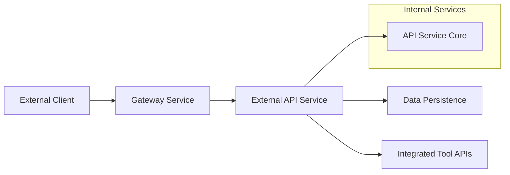
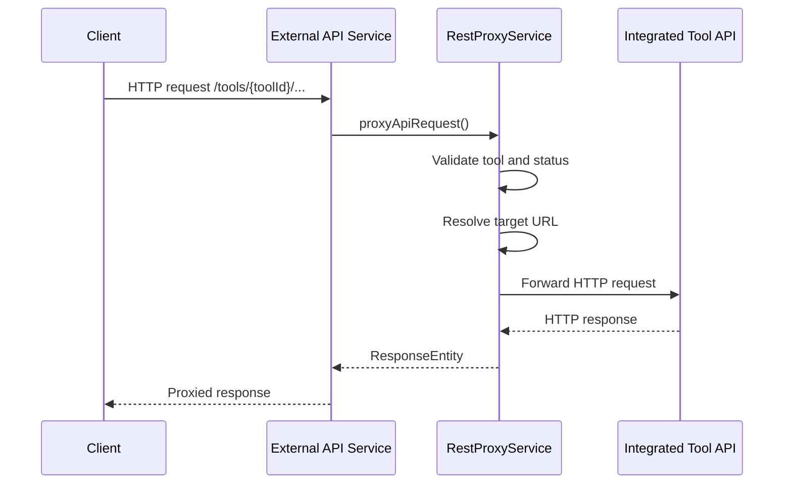

# External API Service Core

## Overview
The **external_api_service_core** module exposes the OpenFrame platform to third-party integrations through a secure, API-key–based REST interface. It acts as the primary **northbound API** for external systems, providing controlled access to devices, events, logs, organizations, and integrated tools, as well as a generic proxy for tool APIs.

This module is deployed as part of the **External API Service** and is typically accessed through the OpenFrame Gateway.

Key characteristics:
- API-key authentication (no OAuth flows)
- Strong rate limiting and observability
- Cursor-based pagination and flexible filtering
- OpenAPI / Swagger documentation
- Safe proxying of integrated tool APIs

---

## Responsibilities

The module is responsible for:
- Exposing versioned REST endpoints under `/api/v1/**`
- Translating external REST contracts into internal service calls
- Mapping domain models into stable external DTOs
- Enforcing API-key–based access control (via gateway filters)
- Providing OpenAPI documentation for all endpoints
- Proxying HTTP requests to enabled integrated tools

---

## Position in the Platform Architecture

The External API Service Core sits between the **Gateway** and the **internal service layer**, reusing existing domain services without duplicating business logic.



---

## Authentication Model

All endpoints require an API key provided through the `X-API-Key` HTTP header.

```text
X-API-Key: ak_keyId.sk_secretKey
```

Authentication, rate limiting, and tenant resolution are enforced upstream by the **Gateway Service Core**. The External API Service assumes that requests reaching controllers are already authenticated.

---

## OpenAPI / Swagger Configuration

The `OpenApiConfig` class configures:
- API metadata (title, description, license)
- API key security scheme
- Server base path (`/external-api`)
- Grouping and filtering of exposed endpoints

This ensures that all controllers are automatically documented and discoverable via Swagger UI.

---

## Core Subsystems

The module can be logically divided into the following subsystems:

- **REST Controllers** – Versioned HTTP endpoints for external consumers
- **DTO Layer** – Stable request/response contracts
- **Mappers** – Translation between domain models and external DTOs
- **Proxy Service** – Secure request forwarding to integrated tools

Detailed documentation for each subsystem is provided below.

---

## REST Controllers

Each controller exposes a focused API surface aligned with a specific domain.

### DeviceController
- Endpoint base: `/api/v1/devices`
- Responsibilities:
  - List devices with filtering, search, sorting, and pagination
  - Fetch a single device by machine ID
  - Retrieve available device filter options with counts
  - Update device lifecycle status (ARCHIVED / DELETED)

Key integrations:
- `DeviceService`
- `DeviceFilterService`
- `TagService`

---

### EventController
- Endpoint base: `/api/v1/events`
- Responsibilities:
  - List events with cursor-based pagination
  - Retrieve a single event by ID
  - Create new events
  - Update existing events
  - Expose available event filter options

Key integrations:
- `EventService`

---

### LogController
- Endpoint base: `/api/v1/logs`
- Responsibilities:
  - Query audit and system logs
  - Support advanced filtering (date, severity, tool, organization, device)
  - Provide aggregated filter metadata
  - Fetch detailed log entries by composite identifiers

Key integrations:
- `LogService`

---

### OrganizationController
- Endpoint base: `/api/v1/organizations`
- Responsibilities:
  - Full CRUD operations on organizations
  - Cursor-based pagination and search
  - Protection against deleting organizations with active devices

Key integrations:
- `OrganizationQueryService`
- `OrganizationCommandService`
- `OrganizationService`

---

### ToolController
- Endpoint base: `/api/v1/tools`
- Responsibilities:
  - List integrated tools
  - Filter by status, type, category, and platform
  - Expose available tool filter metadata

Key integrations:
- `ToolService`

---

### IntegrationController (Tool Proxy)
- Endpoint base: `/tools/{toolId}/**`
- Responsibilities:
  - Proxy arbitrary HTTP requests to enabled integrated tools
  - Preserve HTTP method, path, query parameters, and body
  - Inject tool-specific authentication headers

This controller enables seamless access to third-party tool APIs through OpenFrame without exposing credentials.

---

## REST Proxy Flow

The proxy flow ensures that only enabled tools with valid API credentials can be accessed.



---

## DTO Layer

The DTO layer defines **stable external contracts** decoupled from internal domain models. DTOs are grouped by domain:

- **Devices**: `DeviceResponse`, `DevicesResponse`, `DeviceFilterResponse`
- **Events**: `EventResponse`, `EventsResponse`, `EventFilterResponse`
- **Logs**: `LogResponse`, `LogsResponse`, `LogDetailsResponse`, `LogFilterResponse`
- **Organizations**: `OrganizationsResponse`
- **Tools**: `ToolResponse`, `ToolsResponse`, `ToolFilterResponse`
- **Shared**: Pagination and sorting criteria

These DTOs are designed to:
- Be backward compatible
- Support pagination and filtering consistently
- Hide internal implementation details

---

## Pagination and Sorting

All list endpoints support **cursor-based pagination** using:
- `limit` (default: 20, max: 100)
- `cursor` (opaque string)

Sorting is handled via:
- `sortField`
- `sortDirection` (`ASC` or `DESC`)

This design ensures predictable performance and scalability for large datasets.

---

## Error Handling

The API uses standard HTTP status codes with structured error responses:

- `400` – Invalid request or validation error
- `401` – Missing or invalid API key
- `403` – Insufficient permissions
- `404` – Resource not found
- `409` – Conflict (for example, deleting an organization with devices)
- `429` – Rate limit exceeded
- `500` – Internal server error

---

## Dependencies on Other Modules

The External API Service Core builds on existing platform modules:

- **API Service Core** – Domain services and query logic
- **Gateway Service Core** – Authentication, rate limiting, tenant resolution
- **Data Persistence** – MongoDB, Pinot, and Kafka-backed data access
- **Security Core** – API key models and validation

Business logic remains centralized in these modules; this service focuses purely on **external exposure and contract stability**.

---

## Summary

The **external_api_service_core** module is the primary integration surface for OpenFrame. It provides:
- A clean, well-documented REST API
- Strong separation between external contracts and internal models
- Secure, auditable access to platform data
- A powerful proxy mechanism for integrated tools

This design allows OpenFrame to evolve internally while maintaining a stable and secure API for external consumers.
