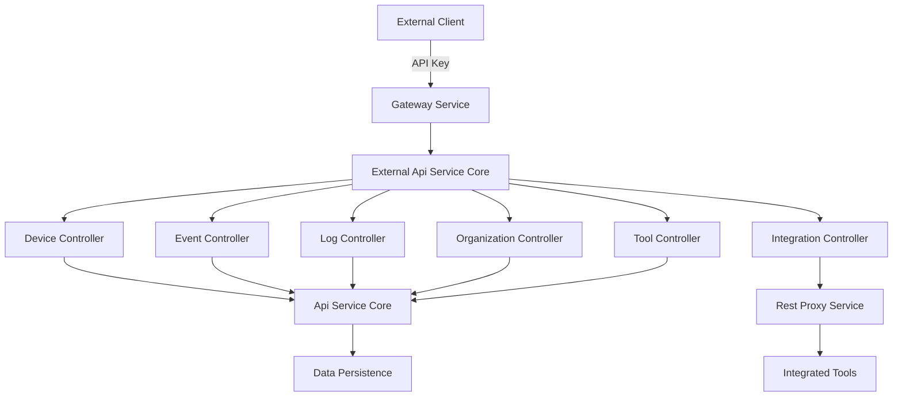

# External Api Service Core

## Overview

The **External Api Service Core** module exposes a secure, API-key–based REST interface that allows third-party systems and integrations to interact with the OpenFrame platform. It is designed as the primary **external integration surface**, providing controlled access to devices, events, logs, organizations, tools, and proxied third-party tool APIs.

This module focuses on:
- Stable, versioned REST APIs for external consumers
- API key authentication and rate-limited access (enforced upstream)
- Consistent filtering, pagination, and sorting patterns
- Safe proxying of requests to integrated third-party tools
- First-class OpenAPI (Swagger) documentation

The External Api Service Core does **not** own core domain logic or persistence. Instead, it orchestrates and exposes capabilities implemented in other internal services.

---

## Responsibilities

The External Api Service Core is responsible for:

- Exposing public REST endpoints under `/api/v1/**`
- Translating HTTP requests into internal service calls
- Mapping domain objects into external-facing DTOs
- Enforcing API structure, validation, and error semantics
- Proxying requests to integrated tools through a controlled gateway
- Publishing OpenAPI documentation for external developers

It deliberately avoids:
- Direct data persistence
- Complex business rules
- Authentication flows beyond API key context propagation

---

## High-Level Architecture

**Key points:**
- API key authentication, rate limiting, and tenant context are handled upstream (typically by the gateway layer).
- Controllers in this module delegate all business logic to internal services.
- The integration proxy path bypasses normal CRUD flows and safely forwards requests to third-party tools.

---

## OpenAPI and Documentation

### OpenApiConfig

The `OpenApiConfig` component configures Swagger / OpenAPI documentation for the external API.

**Responsibilities:**
- Defines API metadata (title, version, license, contact)
- Declares API key–based authentication using the `X-API-Key` header
- Documents standard error handling and rate-limiting behavior
- Groups external endpoints under a dedicated OpenAPI group

**Notable characteristics:**
- All endpoints require an API key
- The documented server base path is `/external-api`
- Security scheme clearly documents the API key format

This configuration ensures external developers have a self-describing and discoverable API surface.

---

## REST Controllers

The External Api Service Core is structured around resource-oriented controllers. Each controller follows consistent patterns for filtering, pagination, sorting, and error handling.

### Device Controller

**Purpose:**
Provides read and limited lifecycle management access to devices.

**Key capabilities:**
- List devices with advanced filtering (status, type, OS, organization, tags)
- Cursor-based pagination and sorting
- Optional tag enrichment per device
- Fetch individual devices by machine ID
- Retrieve available device filter options with counts
- Update device status (archive or delete)

**Delegates to:**
- Device services from the internal API layer
- Tag services for enrichment

---

### Event Controller

**Purpose:**
Exposes event ingestion and querying capabilities to external systems.

**Key capabilities:**
- Query events with cursor pagination
- Filter by users, event types, and date ranges
- Full-text search support
- Create and update events programmatically
- Retrieve event-level filter metadata

**Delegates to:**
- Internal event services

This controller is commonly used for integrations that need to push or consume operational or audit events.

---

### Log Controller

**Purpose:**
Provides access to normalized audit and system logs across integrated tools.

**Key capabilities:**
- Query logs with filtering by date, severity, tool, event type, organization, and device
- Cursor-based pagination and sorting
- Retrieve available filter dimensions
- Fetch detailed log entries using compound identifiers

**Delegates to:**
- Internal log aggregation and query services

Logs exposed here are optimized for investigation, compliance, and monitoring use cases.

---

### Organization Controller

**Purpose:**
Enables full lifecycle management of organizations for external integrations.

**Key capabilities:**
- List organizations with filtering and search
- Retrieve organizations by database ID or business identifier
- Create new organizations
- Update existing organizations
- Delete organizations with safety checks

**Important behavior:**
- Organizations with associated machines cannot be deleted
- Supports both query and command service separation

This controller is frequently used by provisioning and onboarding integrations.

---

### Tool Controller

**Purpose:**
Exposes metadata about integrated tools available in the platform.

**Key capabilities:**
- List tools with filtering by status, type, and category
- Search tools by name or description
- Retrieve tool-level filter metadata

**Delegates to:**
- Internal tool registry services

This controller does not proxy tool APIs; it only exposes catalog and configuration data.

---

### Integration Controller

**Purpose:**
Acts as a dynamic HTTP proxy for integrated third-party tools.

**Key capabilities:**
- Accepts arbitrary HTTP methods (GET, POST, PUT, PATCH, DELETE, OPTIONS)
- Routes requests under `/tools/{toolId}/**`
- Preserves request path, query parameters, and body
- Injects tool-specific authentication headers

This controller is intentionally generic and delegates all logic to the Rest Proxy Service.

---

## Rest Proxy Service

### RestProxyService

The **Rest Proxy Service** is the most specialized component in this module. It enables secure, transparent proxying of API requests to integrated tools.

**Core responsibilities:**
- Validate tool existence and enabled status
- Resolve the correct target URL using proxy resolution rules
- Apply tool-specific authentication (header-based or bearer token)
- Forward requests using a hardened HTTP client
- Return raw responses and status codes to the caller

**Key design characteristics:**
- Stateless request handling
- Explicit timeout configuration
- No response transformation or schema enforcement
- Designed for flexibility across heterogeneous tool APIs

This service allows OpenFrame to function as a unified API gateway for many third-party systems without tightly coupling their APIs.

---

## Cross-Cutting Concerns

### Security Model

- API key authentication is mandatory for all endpoints
- API key context (key ID, user ID) is propagated via headers
- Authorization decisions are enforced in upstream or delegated services

### Pagination and Sorting

- Cursor-based pagination is used consistently
- Sorting is explicit and optional
- Default limits protect backend services from unbounded queries

### Error Handling

- Standard HTTP status codes are used consistently
- Domain-specific exceptions are mapped to clear error responses
- Internal errors are not leaked to clients

---

## How This Module Fits Into the Platform

The External Api Service Core sits at the boundary between OpenFrame and external ecosystems.

- It **consumes** internal APIs for devices, events, logs, organizations, and tools
- It **exposes** a stable, versioned API for partners and customers
- It **bridges** OpenFrame with third-party tools via safe proxying

By isolating external concerns into this module, OpenFrame maintains a clean separation between internal evolution and external compatibility.

---

## Summary

The **External Api Service Core** provides:

- A well-documented, API-key–secured external API surface
- Consistent patterns for querying, filtering, and pagination
- A powerful integration proxy for third-party tools
- Clear separation between external contracts and internal logic

This design enables OpenFrame to scale its ecosystem of integrations while preserving internal flexibility and security.