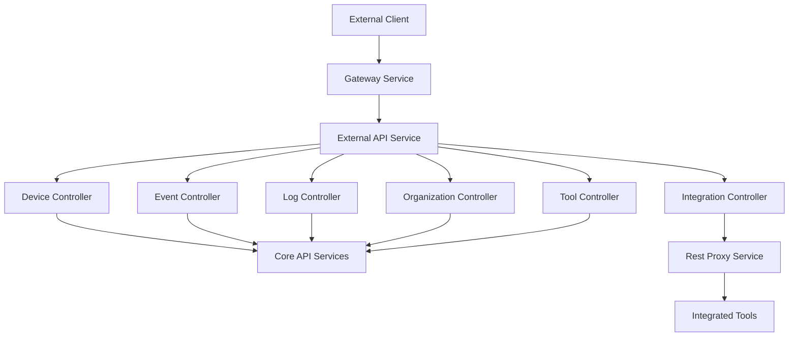
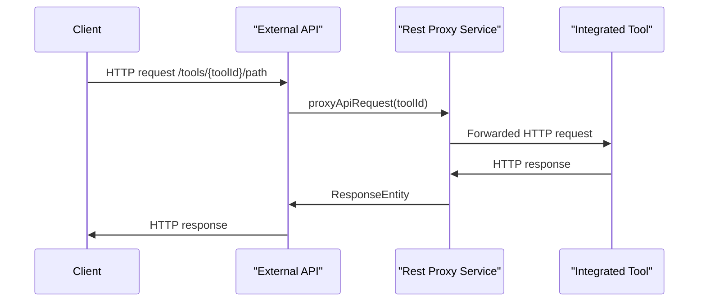

# External API Service Core

## Overview

The **External API Service Core** module provides a secure, API-key–based REST interface for external systems to interact with the OpenFrame platform. It exposes read and write operations for core OpenFrame resources (devices, events, logs, organizations, and tools) and includes a flexible proxy mechanism for forwarding requests to integrated third‑party tools.

This module is consumed by the **External API service** runtime and is typically accessed through the OpenFrame Gateway. Authentication is enforced via API keys, with rate limiting and request attribution handled upstream.

---

## Responsibilities

- Expose versioned REST APIs for external consumers (`/api/v1/**`)
- Enforce API‑key authentication and request attribution
- Provide filtering, pagination, and sorting across large datasets
- Proxy arbitrary HTTP requests to integrated tools
- Publish OpenAPI / Swagger documentation for external developers

---

## High-Level Architecture

**Key points:**
- The module itself contains no persistence logic.
- All domain access is delegated to shared API services and data layers.
- The integration path (`/tools/**`) bypasses standard resource handling and forwards traffic to external systems.

---

## Authentication and Security Model

- **Authentication**: API key–based, using the `X-API-Key` header.
- **Authorization**: Derived from the API key’s scope and configuration.
- **Attribution headers** (injected upstream):
  - `X-User-Id`
  - `X-API-Key-Id`

This module assumes authentication and rate limiting are enforced consistently by the Gateway and shared security components.

---

## OpenAPI / Swagger Configuration

### OpenApiConfig

**Component**: `OpenApiConfig`

Responsibilities:
- Defines OpenAPI metadata (title, version, contact, license)
- Registers API‑key authentication scheme
- Declares gateway-relative server URL (`/external-api`)
- Groups and filters exposed endpoints

This configuration ensures external developers can discover and test APIs using Swagger UI while keeping internal endpoints hidden.

---

## REST Controllers

### DeviceController

**Base path**: `/api/v1/devices`

Capabilities:
- List devices with advanced filtering, search, pagination, and sorting
- Retrieve a single device by machine ID
- Retrieve device filter metadata with counts
- Update device lifecycle status (ARCHIVED, DELETED)

**Key integrations**:
- DeviceService
- DeviceFilterService
- TagService

This controller is optimized for large fleets, using cursor‑based pagination and optional tag hydration.

---

### EventController

**Base path**: `/api/v1/events`

Capabilities:
- Query events with filters (user, type, date range)
- Retrieve individual events
- Create and update events
- Retrieve available event filter options

Events are first‑class entities and may originate from tools, agents, or internal workflows.

---

### LogController

**Base path**: `/api/v1/logs`

Capabilities:
- Query audit and operational logs
- Filter by time range, severity, tool, event type, organization, or device
- Retrieve available log filter metadata
- Fetch detailed log entries using composite identifiers

This controller provides access to high‑volume, time‑series log data using cursor pagination.

---

### OrganizationController

**Base path**: `/api/v1/organizations`

Capabilities:
- List organizations with filtering and search
- Retrieve organizations by database ID or business identifier
- Create, update, and delete organizations

**Important constraint**:
- Organizations with associated machines cannot be deleted

This controller exposes full CRUD semantics for external system synchronization.

---

### ToolController

**Base path**: `/api/v1/tools`

Capabilities:
- List integrated tools
- Filter by type, category, and enabled state
- Retrieve tool filter metadata

Tools represent external systems connected to OpenFrame (RMM, MDM, SIEM, etc.).

---

### IntegrationController

**Base path**: `/tools/{toolId}/**`

Capabilities:
- Proxy arbitrary HTTP requests to an integrated tool
- Support all standard HTTP verbs

This controller does not expose a fixed contract. Instead, it dynamically forwards requests based on tool configuration and credentials.

---

## RestProxyService

**Component**: `RestProxyService`

Responsibilities:
- Resolve target URLs for integrated tools
- Inject tool‑specific authentication headers
- Forward HTTP requests and relay responses

### Proxy Flow

**Authentication handling**:
- Header-based API keys
- Bearer tokens
- No authentication (if configured)

Timeouts and error handling are centralized to prevent cascading failures.

---

## Pagination, Filtering, and Sorting

Across all list endpoints:
- **Pagination**: Cursor‑based (`cursor`, `limit`)
- **Filtering**: Domain‑specific filter DTOs mapped to shared API filter options
- **Sorting**: Field + direction (ASC/DESC)

This design ensures consistent behavior across resources and scalability for large datasets.

---

## Error Handling

- Standard HTTP status codes are used consistently
- Domain‑specific exceptions are translated into API‑friendly error responses
- Validation errors return structured error payloads

---

## Position in the OpenFrame Platform

The External API Service Core sits at the boundary between OpenFrame and third‑party systems:

- Upstream: Gateway, Security, Authorization services
- Downstream: Core API services, data layers, integrated tools

It is intentionally thin, delegating business logic to shared services while focusing on stability, compatibility, and developer experience.

---

## Summary

The **External API Service Core** module:
- Provides a stable, documented integration surface for external systems
- Enforces security and consistency across all exposed APIs
- Enables powerful integrations through dynamic tool proxying

This makes it a cornerstone for automation, reporting, and ecosystem integrations within OpenFrame.