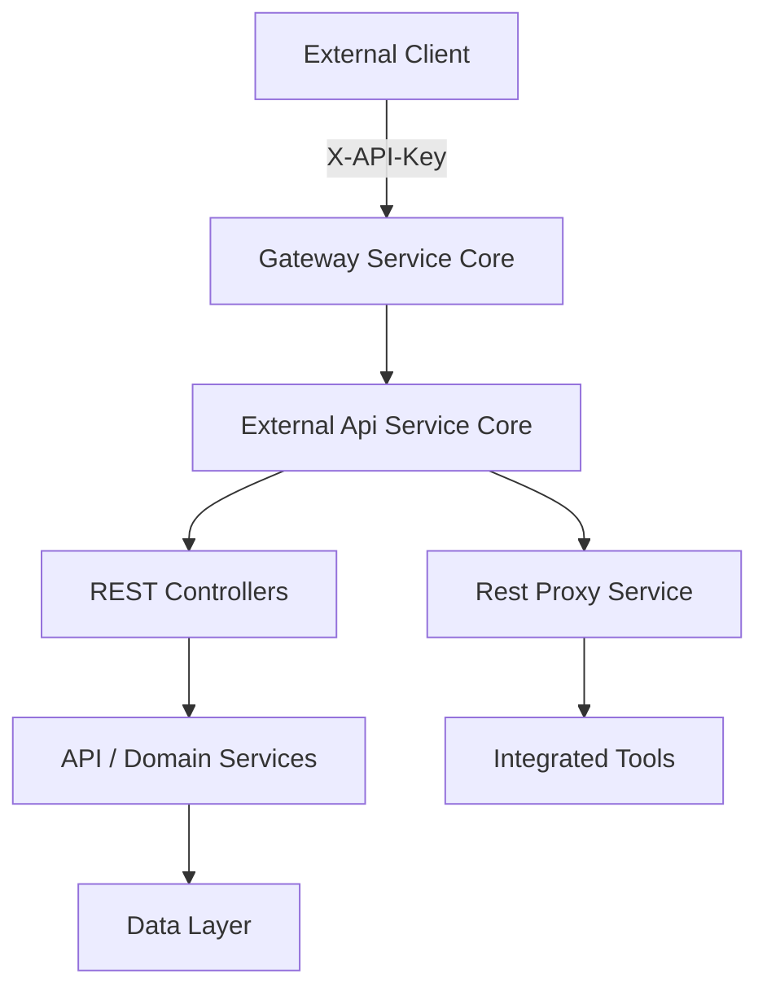
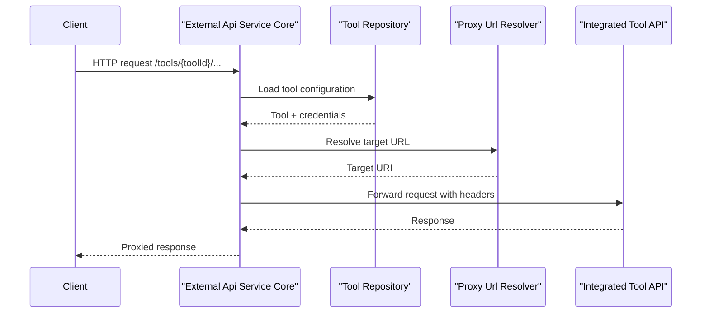

# External Api Service Core

## Overview

**External Api Service Core** provides a secure, API key–based REST interface for external systems to interact with the OpenFrame platform. It is designed for third‑party integrations, automation, and partner tooling that need controlled access to devices, events, logs, organizations, and integrated tools without exposing internal APIs.

Key characteristics:
- API key authentication (`X-API-Key`) with rate limiting
- REST-first design with cursor-based pagination and filtering
- Clear separation between external contracts (DTOs) and internal domain models
- Built-in OpenAPI (Swagger) documentation
- Proxy support for forwarding requests to integrated external tools

This module runs as its own Spring Boot application and depends on core OpenFrame services for business logic, persistence, and security enforcement.

---

## Responsibilities

External Api Service Core is responsible for:

- Exposing **public, stable REST endpoints** for external consumers
- Translating external request/response DTOs into internal query and command models
- Enforcing API key–level authorization and rate limits (via upstream gateway/security layers)
- Aggregating and filtering data from multiple internal services
- Safely proxying requests to integrated tools

It explicitly does **not**:
- Implement core business logic (delegated to API and data services)
- Manage authentication flows (handled by gateway and security modules)
- Expose internal or tenant-only endpoints

---

## High-Level Architecture

The External Api Service Core sits behind the OpenFrame Gateway and exposes versioned REST endpoints. Controllers translate HTTP requests into service calls, map results into external DTOs, and return paginated responses.

---

## Application Entry Point

The module is packaged and run as a standalone Spring Boot application.

- **ExternalApiApplication**
  - Enables component scanning for external API, core services, data access, and Kafka
  - Acts as the deployment unit for the external REST API

This design allows the external API to scale independently from internal services.

---

## OpenAPI and Documentation

### OpenAPI Configuration

**OpenApiConfig** defines the OpenAPI (Swagger) specification for the External Api Service Core.

Key aspects:
- API title and description tailored for external consumers
- API key security scheme using the `X-API-Key` header
- Versioned grouping of endpoints (`/api/v1/**`, `/tools/**`)
- Server base path configured for gateway routing

External consumers can rely on the generated OpenAPI spec as the **single source of truth** for endpoint contracts.

---

## REST Controllers

The module exposes several REST controllers, each focused on a specific domain. Controllers are thin by design and delegate logic to internal services.

### Device Controller

**Purpose:** Device inventory access and lifecycle operations.

Responsibilities:
- List devices with advanced filtering, search, sorting, and pagination
- Fetch a single device by machine ID
- Retrieve available device filter options with counts
- Update device lifecycle status (for example archived or deleted)

Key characteristics:
- Cursor-based pagination
- Optional tag enrichment per device
- Strict separation between filter criteria DTOs and internal query models

---

### Event Controller

**Purpose:** Event ingestion and querying for external systems.

Responsibilities:
- Query events with filters such as user, type, date range, and search
- Retrieve a single event by ID
- Create and update events programmatically
- Expose available event filter options

This controller enables external tools to both **consume** and **publish** events into OpenFrame.

---

### Log Controller

**Purpose:** Access to system and audit logs.

Responsibilities:
- Query logs with rich filtering (time range, tool, severity, organization, device)
- Retrieve detailed log entries by composite identifiers
- Provide filter metadata for building dynamic log queries

Logs are optimized for analytics-style access patterns and support cursor-based pagination.

---

### Organization Controller

**Purpose:** External CRUD access to organization data.

Responsibilities:
- List organizations with filtering, search, sorting, and pagination
- Retrieve organizations by database ID or business identifier
- Create, update, and delete organizations

Safeguards:
- Prevents deletion of organizations with associated devices
- Returns explicit conflict errors for invalid destructive operations

---

### Tool Controller

**Purpose:** Discover and query integrated tools.

Responsibilities:
- List integrated tools with filtering and sorting
- Expose available filter dimensions (type, category, platform)

This controller is typically used to dynamically discover integrations available to an API key.

---

### Integration Controller

**Purpose:** Proxy API requests to integrated tools.

Responsibilities:
- Accept arbitrary HTTP requests under `/tools/{toolId}/**`
- Resolve the correct target URL for the integrated tool
- Inject tool-specific authentication headers
- Forward requests and stream responses back to the client

This allows external clients to access third‑party tools **through OpenFrame**, without direct network access.

---

## Rest Proxy Service

**RestProxyService** implements the core logic behind the Integration Controller.

Key steps in the proxy flow:

Design considerations:
- Supports multiple authentication mechanisms (header key, bearer token, none)
- Enforces timeouts and error isolation
- Never exposes internal credentials to the client

---

## External DTO Model

The External Api Service Core defines a comprehensive set of **public DTOs** that form the external contract.

Characteristics:
- Stable and versioned independently of internal models
- Explicit pagination metadata
- Filter and sort criteria expressed as dedicated DTOs

DTO categories include:
- Devices and device filters
- Events and event filters
- Logs, log details, and log filters
- Organizations
- Tools and tool URLs

These DTOs act as an **anti-corruption layer**, protecting external consumers from internal schema changes.

---

## Pagination, Filtering, and Sorting

All list endpoints share common patterns:

- **Pagination**: Cursor-based via `cursor` and `limit`
- **Filtering**: Domain-specific filter criteria DTOs
- **Sorting**: Field + direction abstraction

This consistency allows API consumers to reuse client logic across endpoints.

---

## Security Model

External Api Service Core relies on upstream and shared security components:

- API key authentication via request headers
- Rate limiting enforced at gateway level
- Tool-level credential isolation in proxy flows

The module assumes that:
- API keys are already validated and enriched into request headers
- Tenant and user context is resolved before controller execution

---

## Position in the Platform

External Api Service Core acts as the **public integration boundary** of OpenFrame.

- Internal services expose rich domain capabilities
- Gateway enforces security and routing
- External Api Service Core provides a clean, stable, and documented interface for partners

When adding new external capabilities, this module is the preferred place to define:
- New public endpoints
- New external DTOs
- Controlled access to internal services

---

## Summary

External Api Service Core is a critical integration layer that:
- Enables safe external access to OpenFrame
- Preserves internal architecture boundaries
- Provides a consistent, well-documented REST experience

Its design prioritizes stability, security, and extensibility for long‑term partner integrations.
