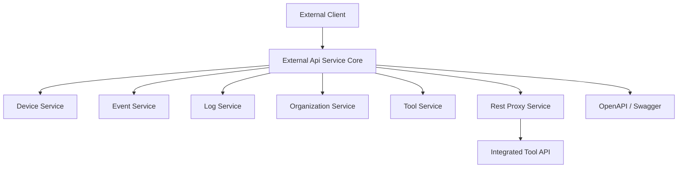
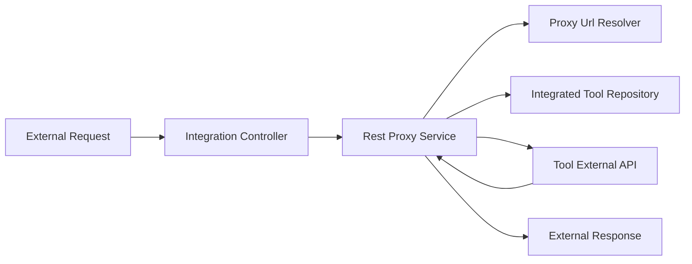

# External Api Service Core

## Overview

The **External Api Service Core** module exposes a secure, API-key–authenticated REST interface for third‑party integrations and customers to interact with the OpenFrame platform. It is designed as the public-facing API layer that sits in front of internal services, providing:

- Programmatic access to devices, events, logs, organizations, and integrated tools
- A consistent REST and pagination model tailored for external consumers
- Secure proxying of requests to integrated third‑party tools
- OpenAPI (Swagger) documentation for discoverability and self‑service onboarding

This module is consumed by external systems such as MSP integrations, automation platforms, and custom client applications, and is deployed as the **External API** service entrypoint.

---

## Responsibilities

The External Api Service Core is responsible for:

- **API Surface**: Defining stable REST endpoints under `/api/v1/**` and `/tools/**`
- **Authentication**: Enforcing API key–based authentication (via gateway and security layers)
- **Request Translation**: Mapping external DTOs to internal query, filter, and pagination models
- **Aggregation**: Coordinating data retrieval across internal services (devices, events, logs, tools)
- **Proxying**: Securely forwarding requests to integrated tool APIs
- **Documentation**: Publishing OpenAPI metadata for all exposed endpoints

---

## High-Level Architecture

The External Api Service Core acts as an adapter between external clients and internal OpenFrame services.

**Key points:**
- Business logic remains in internal services; this module focuses on orchestration and API contracts
- External DTOs shield consumers from internal data model changes
- Tool integrations are accessed indirectly through a controlled proxy

---

## Core Components

### OpenAPI Configuration

**Component:** `OpenApiConfig`

The OpenAPI configuration defines the public contract of the External API.

**Key features:**
- API metadata (title, description, version, license)
- API key security scheme using the `X-API-Key` header
- Default server path `/external-api`
- Logical grouping of endpoints for documentation clarity

This configuration ensures that all endpoints are discoverable through Swagger UI and machine‑readable OpenAPI specs.

---

## REST Controllers

The External Api Service Core exposes multiple domain‑focused controllers. Each controller follows consistent patterns for filtering, sorting, pagination, and error handling.

### Device Controller

**Base path:** `/api/v1/devices`

Provides read and lifecycle‑management access to managed devices.

**Capabilities:**
- List devices with advanced filtering (status, type, OS, tags, organization)
- Cursor‑based pagination and sorting
- Optional tag enrichment per device
- Retrieve a single device by machine ID
- Retrieve available filter options with counts
- Update device lifecycle state (for example archived or deleted)

The controller translates external filter and pagination DTOs into internal query models and delegates execution to the device services.

---

### Event Controller

**Base path:** `/api/v1/events`

Exposes access to time‑based platform events.

**Capabilities:**
- Query events with filters such as user, type, and date range
- Cursor‑based pagination and sorting
- Retrieve a single event by ID
- Create new events
- Update existing events
- Retrieve available event filter values

This controller is commonly used by audit, automation, and monitoring integrations.

---

### Log Controller

**Base path:** `/api/v1/logs`

Provides access to system and tool‑generated logs.

**Capabilities:**
- Query logs with rich filtering (date range, tool type, severity, organization, device)
- Full‑text search across summaries and content
- Cursor‑based pagination and sorting
- Retrieve available log filter values
- Retrieve detailed log entries using compound identifiers

Logs are optimized for audit trails, compliance, and security investigations.

---

### Organization Controller

**Base path:** `/api/v1/organizations`

Enables external systems to manage organizations.

**Capabilities:**
- List organizations with filtering and search
- Cursor‑based pagination and sorting
- Retrieve organizations by internal ID or business identifier
- Create, update, and delete organizations

Deletion safeguards prevent removal of organizations that still own devices.

---

### Tool Controller

**Base path:** `/api/v1/tools`

Exposes metadata about integrated tools available in the platform.

**Capabilities:**
- List tools with filtering by type, category, and enabled status
- Search tools by name and description
- Retrieve available tool filter values

This controller is typically used to dynamically discover available integrations.

---

### Integration Controller

**Base path:** `/tools/{toolId}/**`

Acts as a secure reverse proxy to integrated third‑party tool APIs.

**Capabilities:**
- Proxies all standard HTTP methods
- Resolves target URLs dynamically per tool
- Injects tool‑specific authentication (API key headers or bearer tokens)
- Enforces enablement checks before forwarding requests

This design prevents direct exposure of tool credentials while enabling seamless API access.

---

## Rest Proxy Service

**Component:** `RestProxyService`

The Rest Proxy Service is the core of the integration proxy mechanism.

**Responsibilities:**
- Resolve the correct target API URL for a tool
- Construct outbound HTTP requests with appropriate headers
- Apply tool‑specific authentication strategies
- Stream responses back to the external caller
- Enforce timeouts and handle error translation

This service isolates integration complexity from controllers and ensures consistent, auditable behavior.

---

## Data Transfer Objects (DTOs)

The module defines a comprehensive set of DTOs under the `external.dto` namespace.

**Design principles:**
- Explicit schemas for all requests and responses
- Stable contracts for external consumers
- Clear separation from internal persistence models

**Key DTO groups:**
- Device DTOs: device details, filters, tags, pagination
- Event DTOs: event payloads, filters, and pagination
- Log DTOs: summaries, details, filters, and audit metadata
- Organization DTOs: list and CRUD responses
- Tool DTOs: tool metadata, URLs, and credentials references
- Shared DTOs: pagination and sorting criteria

These DTOs are fully annotated for OpenAPI generation.

---

## Security Model

- All endpoints require a valid API key
- API keys are provided via the `X-API-Key` header
- Authorization and rate limiting are enforced upstream by gateway and security services
- Tool credentials are never exposed directly to external callers

---

## How This Module Fits Into OpenFrame

The External Api Service Core complements other OpenFrame services by:

- Providing a stable, external‑facing API layer
- Reusing internal domain services without duplicating business logic
- Acting as the integration boundary for third‑party tools
- Serving as the canonical REST API for external automation and reporting

It is a critical component for enabling ecosystem integrations while preserving internal service integrity.

---

## Summary

The **External Api Service Core** module is the public gateway into the OpenFrame platform. By combining strong API contracts, consistent pagination and filtering, secure proxying, and rich OpenAPI documentation, it enables safe and scalable external integrations without leaking internal implementation details.