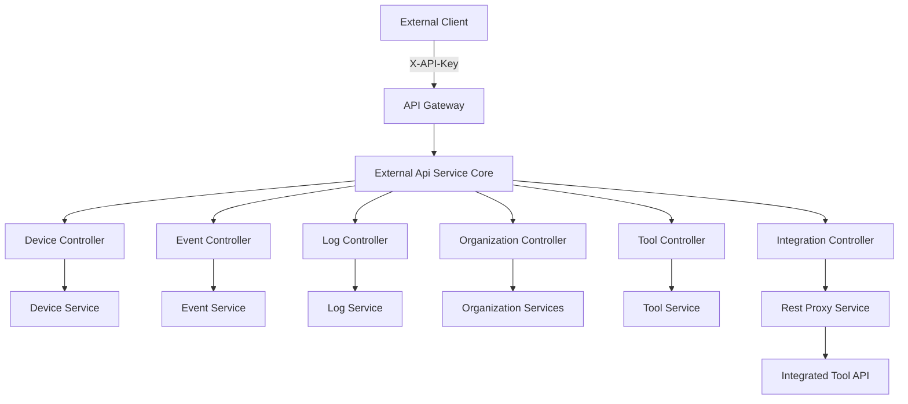
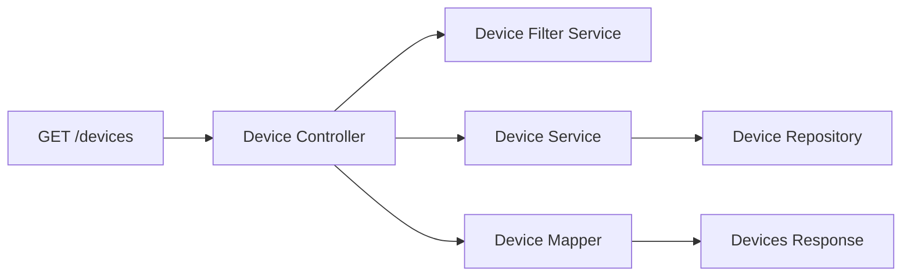
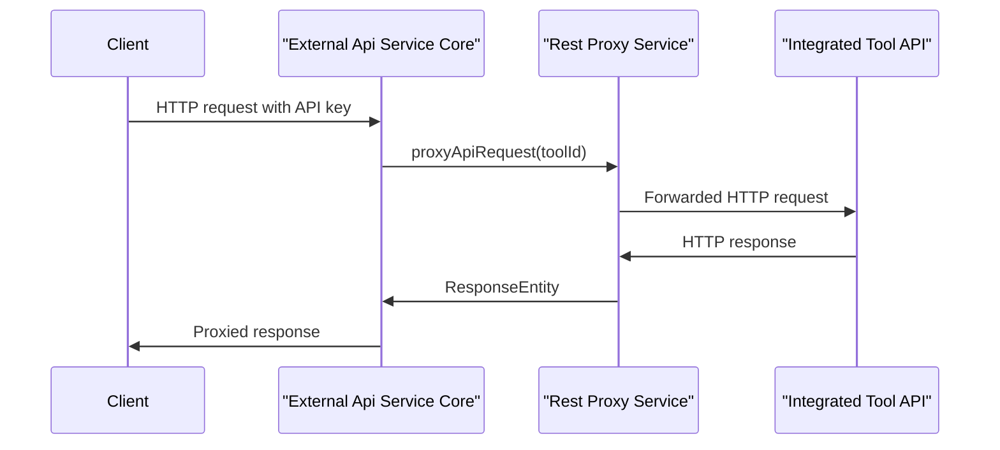

# External Api Service Core

## Overview

The **External Api Service Core** module exposes a secure, API-key–based REST interface that allows third-party systems, integrations, and partners to interact programmatically with the OpenFrame platform. It acts as a controlled façade over internal domain services, enforcing authentication, rate limiting, filtering, pagination, and consistent response contracts.

This module is primarily consumed by:
- External integrations and automation tools
- Partners building on top of the OpenFrame ecosystem
- Custom MSP workflows that require read/write access to devices, events, logs, organizations, and integrated tools

Unlike internal APIs, the External Api Service Core is designed for **public consumption**, with strong emphasis on stability, documentation (OpenAPI), and backward compatibility.

---

## Responsibilities

The External Api Service Core is responsible for:

- Exposing versioned REST endpoints under `/api/v1/**`
- Enforcing API key authentication and permissions
- Providing rich filtering, sorting, and cursor-based pagination
- Mapping internal domain models to external DTOs
- Proxying requests to integrated third-party tools in a secure way
- Publishing a complete OpenAPI (Swagger) specification

---

## High-Level Architecture



**Key points:**
- Authentication and rate limiting are handled upstream (Gateway Service Core)
- This module focuses on orchestration, validation, and response shaping
- Domain logic lives in shared API and data modules

---

## OpenAPI and Documentation

The module publishes a fully configured OpenAPI 3 specification using Springdoc.

### OpenApiConfig

The **OpenApiConfig** component:

- Defines API metadata (title, description, version, license)
- Documents API key authentication via the `X-API-Key` header
- Describes standard error handling and rate limiting headers
- Groups and filters exposed paths

**Authentication model:**

- All endpoints require an API key
- Header format:

```text
X-API-Key: ak_keyId.sk_secretKey
```

---

## REST Controllers

The External Api Service Core is organized around resource-specific controllers. Each controller:
- Accepts HTTP requests
- Builds filter, pagination, and sort criteria
- Delegates execution to internal services
- Maps domain objects to external DTOs

### Device Controller

**Base path:** `/api/v1/devices`

Responsibilities:
- List devices with advanced filtering (status, type, OS, tags, organization)
- Cursor-based pagination and sorting
- Optional tag enrichment
- Fetch a single device by machine ID
- Update device lifecycle status (ARCHIVED, DELETED)
- Expose available filter options with counts

**Typical flow:**



---

### Event Controller

**Base path:** `/api/v1/events`

Responsibilities:
- Query events with date ranges, types, users, and search terms
- Cursor-based pagination and sorting
- Retrieve a single event by ID
- Create and update events
- Expose event filter metadata

This controller enables external systems to both **consume** and **publish** events into OpenFrame.

---

### Log Controller

**Base path:** `/api/v1/logs`

Responsibilities:
- Query audit and system logs
- Filter by date, severity, tool type, event type, organization, and device
- Retrieve detailed log entries using composite identifiers
- Provide filter option discovery

Logs are optimized for high-volume access with strict pagination limits.

---

### Organization Controller

**Base path:** `/api/v1/organizations`

Responsibilities:
- Full CRUD lifecycle for organizations
- Query organizations with filtering and search
- Support both database IDs and business identifiers
- Enforce deletion constraints when organizations have linked devices

This controller is commonly used by provisioning and tenant-management integrations.

---

### Tool Controller

**Base path:** `/api/v1/tools`

Responsibilities:
- List integrated tools
- Filter by type, category, and enabled state
- Expose available tool filter metadata

This controller provides visibility into the integration surface of the platform.

---

### Integration Controller

**Base path:** `/tools/{toolId}/**`

Responsibilities:
- Act as a transparent HTTP proxy to integrated third-party tools
- Support all standard HTTP verbs
- Preserve request paths and query parameters
- Inject tool-specific authentication credentials

This enables a **single, secure entry point** for accessing multiple external tool APIs.

---

## Rest Proxy Service

The **Rest Proxy Service** is the core infrastructure component behind tool integrations.

Responsibilities:
- Resolve target tool API URLs dynamically
- Validate tool existence and enabled state
- Inject credentials (API key header or bearer token)
- Forward requests using Apache HttpClient
- Stream responses back to the caller with original status codes

### Proxy Flow



---

## Cross-Cutting Concerns

### Security

- API key authentication enforced via headers
- Tool-level authentication handled transparently
- Sensitive headers are never exposed to clients

### Pagination and Sorting

- Cursor-based pagination for scalable queries
- Consistent limit enforcement (default 20, max 100)
- Explicit sort field and direction handling

### Error Handling

- Standard HTTP status codes
- Structured error responses
- Clear distinction between client and server errors

---

## Position in the OpenFrame Platform

The External Api Service Core sits at the boundary between:
- External consumers (partners, tools, scripts)
- Internal OpenFrame services and data layers

It complements:
- Gateway Service Core for traffic control and security
- API Service Core for internal domain access
- Authorization Server Core for identity and OAuth flows

Together, these modules form a layered, secure, and extensible API architecture.

---

## Summary

The **External Api Service Core** is the official, stable integration surface of the OpenFrame platform. It provides:

- Well-documented, versioned REST APIs
- Strong security and operational safeguards
- Deep access to devices, events, logs, organizations, and tools
- A powerful proxy mechanism for third-party integrations

This makes it the primary entry point for building rich, automated, and scalable integrations on top of OpenFrame.
