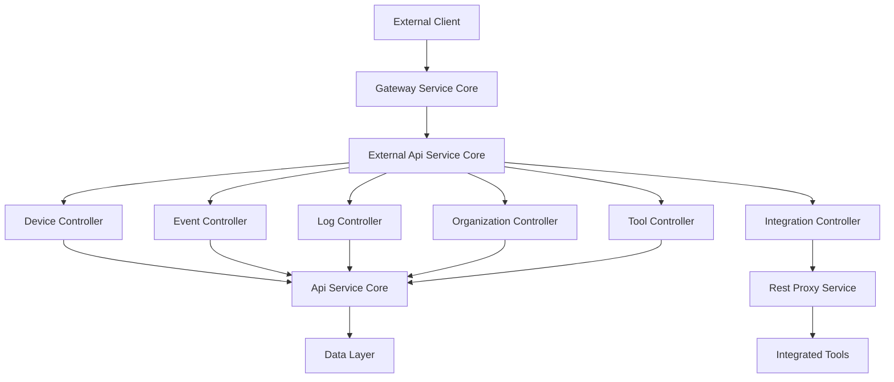
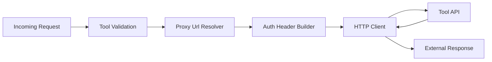

# External Api Service Core

## Overview

The **External Api Service Core** module provides a secure, API-key–authenticated REST interface for external systems and integrations to interact with the OpenFrame platform. It is designed for partners, automation tools, and third-party services that need controlled access to operational data such as devices, events, logs, organizations, and integrated tools.

This module focuses on:
- **External-facing REST APIs** with stable contracts
- **API key–based authentication** and rate limiting (enforced upstream)
- **Read-heavy, filterable endpoints** with cursor-based pagination
- **Safe proxying** of requests to integrated third-party tools
- **Clear separation** from internal and gateway APIs

The External Api Service Core is deployed as the `ExternalApiApplication` service and typically sits behind the OpenFrame Gateway.

---

## Responsibilities

The External Api Service Core is responsible for:

- Exposing versioned REST endpoints under `/api/v1/**`
- Providing OpenAPI (Swagger) documentation for all external endpoints
- Translating external DTOs into internal service contracts
- Enforcing API key–scoped access (via headers propagated by the gateway)
- Proxying requests to integrated tools in a controlled and auditable way

It **does not**:
- Handle authentication flows (OAuth, SSO)
- Manage internal domain logic directly
- Persist data itself

Those responsibilities belong to sibling modules such as Api Service Core, Authorization Server Core, and the Data Layer.

---

## High-Level Architecture

---

## API Documentation and OpenAPI Configuration

### OpenApiConfig

The **OpenApiConfig** component configures Swagger / OpenAPI documentation for the External Api Service Core.

Key characteristics:

- API title: **OpenFrame External API**
- Authentication method: API key via `X-API-Key` header
- Group name: `external-api`
- Base server URL: `/external-api`
- Exposes only external endpoints (internal and actuator paths are excluded)

This ensures that external consumers have a clear, self-documented contract without visibility into internal APIs.

---

## REST Controllers

The External Api Service Core exposes several REST controllers, each focused on a specific domain. Controllers are thin by design and delegate all business logic to underlying services.

### Device Controller

**Base path:** `/api/v1/devices`

Responsibilities:
- Retrieve paginated lists of devices
- Support advanced filtering (status, type, OS, organization, tags)
- Support cursor-based pagination and sorting
- Retrieve individual device details
- Update device lifecycle status (archived or deleted)

Key design points:
- Optional tag enrichment using the Tag Service
- Graceful fallback when tag resolution fails
- Consistent pagination and filter DTOs

---

### Event Controller

**Base path:** `/api/v1/events`

Responsibilities:
- Query platform events with filters and search
- Cursor-based pagination for large event streams
- Retrieve individual events by ID
- Create and update events for external producers
- Expose available event filter values

This controller enables external systems to both **consume** and **produce** events in the OpenFrame ecosystem.

---

### Log Controller

**Base path:** `/api/v1/logs`

Responsibilities:
- Retrieve audit and operational logs
- Support filtering by date, severity, tool type, event type, organization, and device
- Cursor-based pagination and sorting
- Retrieve detailed log entries by composite identifiers
- Expose filter metadata for UI and automation use cases

Logs are optimized for observability and forensic analysis by external systems.

---

### Organization Controller

**Base path:** `/api/v1/organizations`

Responsibilities:
- Full CRUD operations on organizations
- Query organizations with filters and search
- Support both database IDs and business identifiers
- Enforce deletion constraints (organizations with machines cannot be deleted)

This controller is intended for MSP automation and tenant lifecycle management.

---

### Tool Controller

**Base path:** `/api/v1/tools`

Responsibilities:
- List integrated tools
- Filter by enabled status, type, category, and platform
- Expose available filter values

This controller provides visibility into the tool ecosystem connected to OpenFrame.

---

### Integration Controller

**Base path:** `/tools/{toolId}/**`

Responsibilities:
- Proxy arbitrary HTTP requests to integrated tools
- Support all major HTTP verbs
- Inject tool-specific authentication headers
- Resolve correct target URLs dynamically
- Provide a safe abstraction layer over third-party APIs

This controller enables OpenFrame to act as a **secure API gateway** for downstream tools.

---

## Rest Proxy Service

### RestProxyService

The **RestProxyService** is the core infrastructure component behind the Integration Controller.

Key responsibilities:

- Resolve the correct target URL for a tool using the Proxy Url Resolver
- Validate tool existence and enabled state
- Apply tool-specific authentication strategies:
  - Header-based API keys
  - Bearer tokens
  - No authentication
- Forward requests using Apache HttpClient
- Preserve HTTP methods and payloads
- Return raw responses to the caller

This design ensures that external integrations remain decoupled from internal credentials and network topology.

---

## Data Transfer Objects

The External Api Service Core defines a comprehensive set of DTOs that:

- Represent stable external contracts
- Shield internal domain models from direct exposure
- Support pagination, filtering, and sorting consistently

DTO categories include:

- **Device DTOs**: devices, tags, filter options
- **Event DTOs**: events, filters, pagination
- **Log DTOs**: logs, detailed log entries, filter metadata
- **Organization DTOs**: paginated organization responses
- **Tool DTOs**: integrated tools and URLs
- **Shared DTOs**: pagination and sort criteria

All DTOs are annotated for OpenAPI schema generation.

---

## Pagination, Filtering, and Sorting

The External Api Service Core uses a consistent pattern across all endpoints:

- **Cursor-based pagination** for scalability
- **Explicit filter criteria objects** per domain
- **Optional search parameters** for free-text queries
- **Explicit sort field and direction**

This consistency simplifies client implementations and reduces integration errors.

---

## Security Model

- Authentication is based on API keys
- API keys are provided via the `X-API-Key` header
- Key validation and rate limiting are enforced by upstream components
- User and API key identifiers are propagated via headers for auditing

The External Api Service Core assumes a **zero-trust perimeter** and validates all incoming requests through service-level checks.

---

## Position in the OpenFrame Platform

The External Api Service Core acts as:

- The **primary integration surface** for third-party systems
- A **stable contract boundary** between OpenFrame and external consumers
- A **controlled proxy layer** for accessing integrated tools

It complements internal APIs and the gateway while maintaining strict separation between internal and external concerns.

---

## Summary

The **External Api Service Core** is a critical module for enabling safe, scalable, and well-documented external integrations with OpenFrame. By combining consistent REST patterns, strong separation of concerns, and robust proxying capabilities, it allows OpenFrame to function as an extensible platform without compromising security or maintainability.