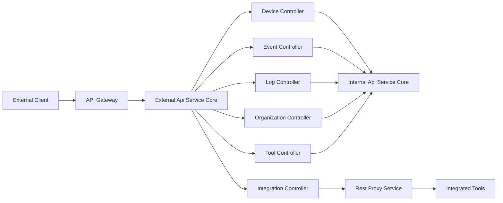
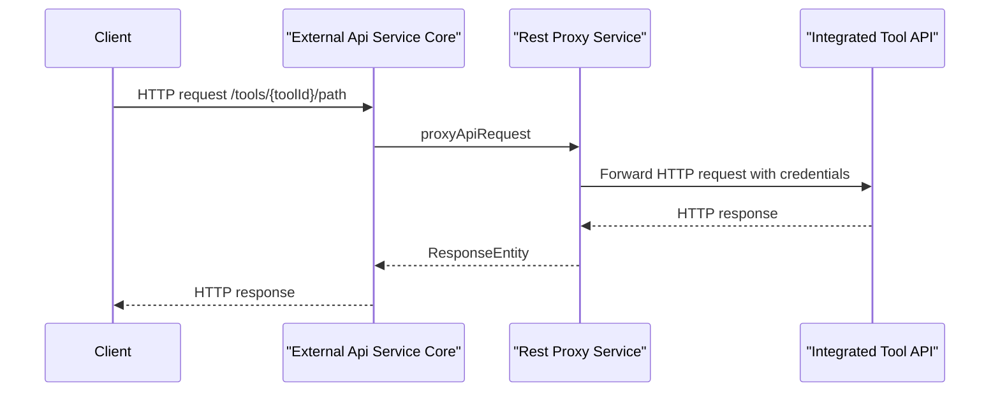

# External Api Service Core

## Overview

The **External Api Service Core** module exposes a secure, API-key–based REST interface for third‑party integrations and automation clients. It provides controlled access to OpenFrame platform data and operations such as devices, events, logs, organizations, tools, and dynamic proxying to integrated tools.

This module is designed for:
- External system integrations
- Automation and reporting pipelines
- MSP tooling that requires programmatic access

All endpoints are authenticated using API keys and are documented through an OpenAPI/Swagger specification.

---

## Responsibilities

- Expose versioned REST APIs for external consumers
- Enforce API-key authentication and rate limiting (via the gateway layer)
- Provide rich filtering, sorting, and cursor-based pagination
- Proxy requests securely to integrated third‑party tools
- Publish a comprehensive OpenAPI definition for discoverability

---

## High-Level Architecture



**Key points:**
- The External Api Service Core does not own core business logic; it delegates to internal services.
- Authentication, rate limiting, and tenant isolation are enforced upstream by the gateway and security layers.
- The Integration Controller enables transparent API proxying to enabled tools.

---

## OpenAPI and Documentation

The OpenAPI configuration is provided by **OpenApiConfig**.

### OpenAPI Features
- API title and versioning
- API key security scheme using the `X-API-Key` header
- Grouped endpoints for external APIs
- Server base path aligned with gateway routing

### Authentication Model

All endpoints require an API key:

```text
X-API-Key: ak_keyId.sk_secretKey
```

The API key identifier and resolved user context are propagated internally via headers such as:
- `X-API-Key-Id`
- `X-User-Id`

---

## Controllers

### Device Controller

**Base path:** `/api/v1/devices`

Responsibilities:
- Retrieve devices with advanced filtering and search
- Cursor-based pagination and sorting
- Optional tag enrichment
- Fetch single device details
- Update device lifecycle status

**Key capabilities:**
- Filter by status, type, OS, organization, and tags
- Efficient pagination for large device fleets

---

### Event Controller

**Base path:** `/api/v1/events`

Responsibilities:
- Query events with time-based and attribute filters
- Retrieve individual events by identifier
- Create and update events
- Expose available filter dimensions

**Key capabilities:**
- Date-range filtering
- Free-text search
- Sortable event streams

---

### Log Controller

**Base path:** `/api/v1/logs`

Responsibilities:
- Query audit and system logs
- Provide aggregated filter options
- Retrieve detailed log entries

**Key capabilities:**
- Multi-dimensional filtering (severity, tool, event type)
- Cursor-based pagination for large log volumes
- Deep-link access to log details

---

### Organization Controller

**Base path:** `/api/v1/organizations`

Responsibilities:
- Full CRUD operations for organizations
- Query organizations with filtering and search
- Enforce deletion constraints when organizations own devices

**Key capabilities:**
- Business identifier and database identifier lookups
- Safe deletion with conflict handling

---

### Tool Controller

**Base path:** `/api/v1/tools`

Responsibilities:
- Query integrated tools
- Filter by type, category, and enabled status
- Expose available tool filter options

**Key capabilities:**
- Sorted tool discovery
- Metadata exposure for integrations

---

### Integration Controller

**Base path:** `/tools/{toolId}/**`

Responsibilities:
- Proxy arbitrary HTTP requests to integrated tools
- Preserve HTTP methods and paths
- Inject tool-specific authentication credentials

**Key capabilities:**
- Transparent API proxying
- Support for multiple authentication strategies (header, bearer token)

---

## Rest Proxy Service

The **Rest Proxy Service** is the core engine behind integration proxying.

### Responsibilities
- Resolve target tool URLs dynamically
- Inject credentials based on tool configuration
- Forward requests using a managed HTTP client
- Return raw responses to external callers

### Proxy Flow



**Important safeguards:**
- Disabled tools are rejected
- Missing tool URLs return validation errors
- Timeouts and IO errors are handled gracefully

---

## Security Model

- API-key authentication is mandatory for all endpoints
- Tool credentials are never exposed to clients
- Authorization context is derived from API keys and enforced upstream

This module assumes that:
- JWT validation and tenant resolution are handled by the gateway and authorization services
- Rate limiting is applied before requests reach this service

---

## Error Handling

The External Api Service Core uses standard HTTP semantics:

| Status Code | Meaning |
|------------|---------|
| 200 | Successful operation |
| 201 | Resource created |
| 204 | No content |
| 400 | Invalid request |
| 401 | Unauthorized |
| 404 | Resource not found |
| 409 | Conflict |
| 429 | Rate limit exceeded |
| 500 | Internal server error |

Errors are returned using a consistent error response structure.

---

## Role in the OpenFrame Platform

The **External Api Service Core** acts as the public-facing integration layer of OpenFrame. It bridges external systems with internal platform services while preserving strict security boundaries, scalability, and observability.

It is intentionally thin, delegating business logic to internal services and focusing on:
- API ergonomics
- Stability for third‑party consumers
- Long-term backward compatibility
