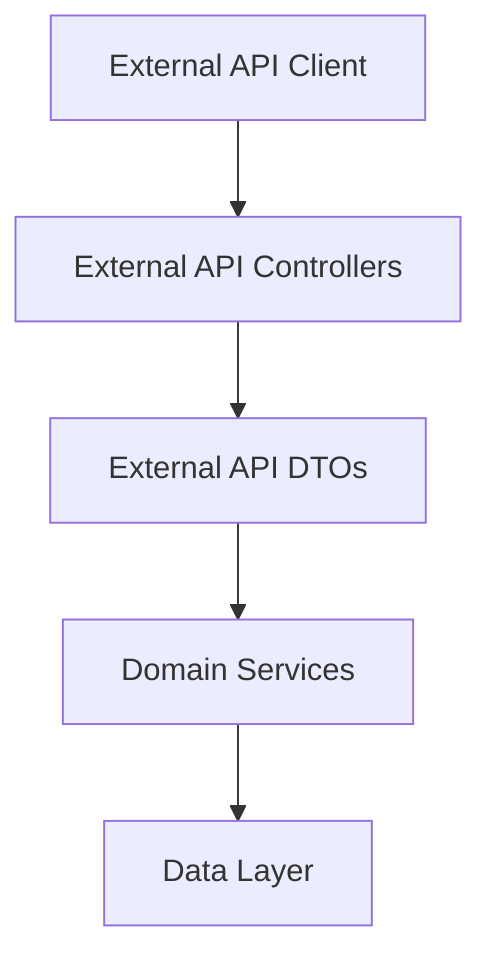
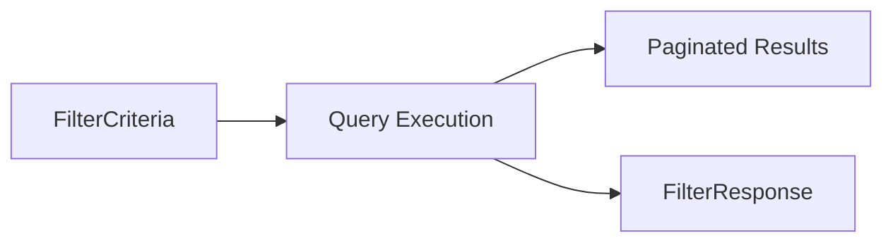

# External API Service DTOs

This module defines the **Data Transfer Objects (DTOs)** used by the OpenFrame **External API Service**. These DTOs represent request criteria, response payloads, pagination, sorting, and filter metadata exposed to external consumers via REST endpoints.

The module acts as a **boundary layer** between external clients and the internal domain, ensuring:

- Stable and versioned API contracts
- Clear separation between persistence/domain models and external representations
- Consistent pagination, sorting, and filtering semantics
- OpenAPI/Swagger documentation via annotations

---

## Position in the OpenFrame Architecture

The External API Service DTOs sit between external REST controllers and internal domain services.

---

## DTO Groups Overview

The module is organized by **business domain**, each documented separately:

- **Audit & Logs DTOs** – log search, filters, and log details
- **Device DTOs** – devices, tags, and device-level filters
- **Event DTOs** – system and user events
- **Organization DTOs** – organization listings
- **Tool DTOs** – integrated tools and tool filters
- **Shared DTOs** – pagination and sorting primitives

Detailed documentation for each group:

- [Audit DTOs](Audit DTOs.md)
- [Device DTOs](Device DTOs.md)
- [Event DTOs](Event DTOs.md)
- [Organization DTOs](Organization DTOs.md)
- [Tool DTOs](Tool DTOs.md)
- [Shared DTOs](Shared DTOs.md)

---

## Common Design Patterns

### 1. Filter + FilterResponse Pattern

Most resources expose:
- `*FilterCriteria` – input filters for list endpoints
- `*FilterResponse` – available filter values and counts

### 2. Paginated Responses

List responses follow a consistent structure:
- `items` (logs, devices, events, etc.)
- `pageInfo` or cursor-based metadata

### 3. Lombok + Swagger Annotations

All DTOs:
- Use Lombok for boilerplate reduction
- Use OpenAPI annotations for schema documentation

---

## Used By

- External REST controllers in the **External API Service**
- OpenAPI / Swagger documentation generation
- External SDKs and API clients

---

## Non-Goals

This module intentionally does **not** contain:

- Business logic
- Persistence annotations
- Validation beyond basic structural constraints

Those concerns are handled in service and domain layers.
