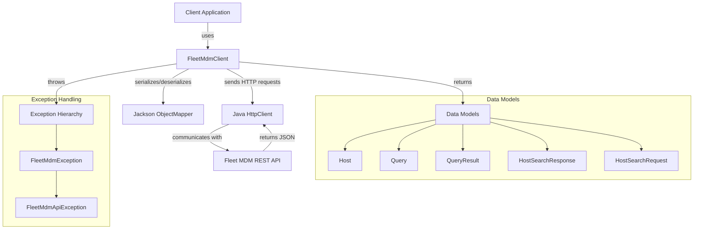
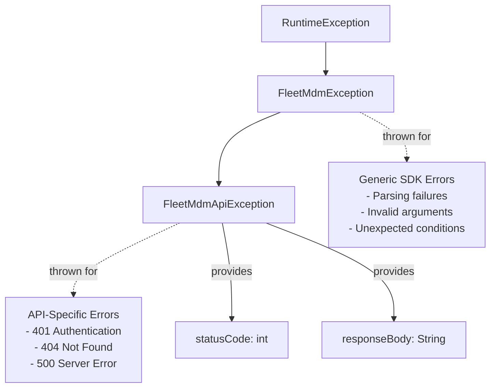
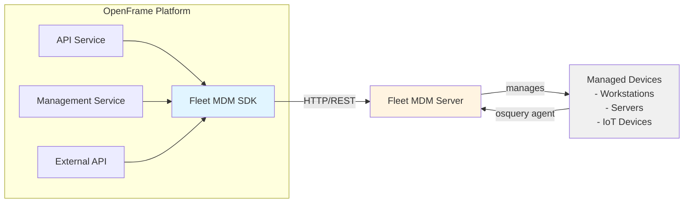

# Fleet MDM SDK

## Overview

The **Fleet MDM SDK** is a Java client library that provides a type-safe, high-level interface for interacting with [Fleet Device Management](https://fleetdm.com/) (Fleet MDM) APIs. Fleet is an open-source device management platform built on osquery that enables IT teams to query, monitor, and manage endpoints across their infrastructure.

This SDK abstracts the complexity of Fleet's REST API, providing developers with an intuitive Java interface for:

- **Host Management**: Search, retrieve, and query device information
- **Query Execution**: Run osquery SQL statements on managed devices
- **Enrollment**: Retrieve enrollment secrets for device onboarding
- **Query Management**: Access and manage saved queries

The SDK is designed for integration into the OpenFrame platform, enabling seamless device management capabilities within the unified MSP interface.

---

## Architecture Overview

The Fleet MDM SDK follows a clean, layered architecture that separates concerns and promotes maintainability:



### Key Architectural Principles

1. **Single Responsibility**: Each class has a focused purpose (client, models, exceptions)
2. **Immutable Models**: Data transfer objects are designed for safe concurrent access
3. **Type Safety**: Strong typing prevents runtime errors and improves IDE support
4. **Error Handling**: Comprehensive exception hierarchy for different failure scenarios
5. **Resource Efficiency**: Reusable HTTP client and JSON mapper instances

---

## Core Components

### 1. FleetMdmClient

**Purpose**: Main entry point for all Fleet MDM API interactions

**Key Responsibilities**:
- HTTP request construction and execution
- Authentication via Bearer token
- Response parsing and error handling
- Timeout management

**Key Methods**:

| Method | Description | Returns |
|--------|-------------|---------|
| `getHostById(long id)` | Retrieve a single host by ID | `Host` |
| `searchHosts(String query)` | Search hosts with default pagination | `List<Host>` |
| `searchHosts(HostSearchRequest)` | Advanced host search with custom parameters | `List<Host>` |
| `runQuery(long hostId, String query)` | Execute osquery SQL on a specific host | `QueryResult` |
| `getEnrollSecret()` | Retrieve enrollment secret for device onboarding | `String` |
| `getQueryById(long id)` | Retrieve a saved query by ID | `Query` |

**Thread Safety**: The client uses a shared `HttpClient` and `ObjectMapper` instance, making it safe for concurrent use across multiple threads.

---

### 2. Data Models

The SDK provides strongly-typed models that map directly to Fleet MDM API responses:

#### Host Model

Represents a managed device/endpoint with comprehensive hardware and software information.

**Key Attributes**:
- **Identity**: `id`, `uuid`, `hostname`, `computerName`
- **Platform**: `platform`, `osVersion`, `build`, `platformLike`
- **Hardware**: `cpuBrand`, `memory`, `hardwareVendor`, `hardwareModel`, `hardwareSerial`
- **Network**: `primaryIp`, `primaryMac`, `publicIp`
- **Status**: `status`, `seenTime`, `lastEnrolledAt`, `uptime`
- **Fleet Metadata**: `osqueryVersion`, `orbitVersion`, `fleetDesktopVersion`
- **Storage**: `gigsDiskSpaceAvailable`, `percentDiskSpaceAvailable`, `gigsTotalDiskSpace`
- **Organization**: `teamId`, `teamName`

**Usage Example**:
```java
Host host = client.getHostById(12345L);
System.out.println("Hostname: " + host.getHostname());
System.out.println("OS: " + host.getPlatform() + " " + host.getOsVersion());
System.out.println("IP: " + host.getPrimaryIp());
System.out.println("Disk Available: " + host.getPercentDiskSpaceAvailable() + "%");
```

#### Query Model

Represents a saved or scheduled osquery query in Fleet MDM.

**Key Attributes**:
- **Identity**: `id`, `name`, `description`
- **Query Definition**: `query` (SQL statement), `platform`, `minOsqueryVersion`
- **Authorship**: `authorId`, `authorName`, `authorEmail`
- **Scheduling**: `interval`, `automationsEnabled`, `logging`
- **Organization**: `teamId`, `teamName`
- **Statistics**: `stats` (execution metrics)

**Helper Methods**:
- `isScheduled()`: Returns `true` if query is configured to run automatically

**Usage Example**:
```java
Query query = client.getQueryById(789L);
System.out.println("Query: " + query.getName());
System.out.println("SQL: " + query.getQuery());
if (query.isScheduled()) {
    System.out.println("Runs every " + query.getInterval() + " seconds");
}
```

#### QueryResult Model

Contains the results of an executed osquery statement.

**Key Attributes**:
- `hostId`: Target host identifier
- `rows`: List of result rows (each row is a `Map<String, Object>`)
- `query`: The executed SQL statement
- `status`: Execution status
- `error`: Error message (if failed)
- `executedAt`: Timestamp of execution

**Helper Methods**:
- `isSuccess()`: Returns `true` if query executed without errors
- `getRowCount()`: Returns the number of result rows

**Usage Example**:
```java
QueryResult result = client.runQuery(12345L, "SELECT * FROM system_info");
if (result.isSuccess()) {
    System.out.println("Found " + result.getRowCount() + " rows");
    for (Map<String, Object> row : result.getRows()) {
        System.out.println(row);
    }
} else {
    System.err.println("Query failed: " + result.getError());
}
```

#### HostSearchRequest Model

Encapsulates search parameters for host queries.

**Attributes**:
- `query`: Search string (hostname, UUID, IP, etc.)
- `page`: Page number (0-based, default: 0)
- `perPage`: Results per page (default: 100)
- `orderKey`: Field to sort by
- `orderDirection`: Sort direction (`asc` or `desc`)

**Usage Example**:
```java
HostSearchRequest request = new HostSearchRequest("ubuntu");
request.setPage(0);
request.setPerPage(50);
request.setOrderKey("hostname");
request.setOrderDirection("asc");

List<Host> hosts = client.searchHosts(request);
```

#### HostSearchResponse Model

Wrapper for paginated host search results.

**Attributes**:
- `hosts`: List of matching hosts
- `page`: Current page number
- `perPage`: Results per page
- `orderKey`: Sort field
- `orderDirection`: Sort direction
- `query`: Original search query

---

### 3. Exception Hierarchy

The SDK provides a structured exception hierarchy for different failure scenarios:



#### FleetMdmException

**Base exception** for all SDK-related errors.

**When Thrown**:
- JSON parsing failures
- Invalid method arguments
- Unexpected response formats
- Network I/O errors (wrapped)

**Usage**:
```java
try {
    String secret = client.getEnrollSecret();
} catch (FleetMdmException e) {
    logger.error("SDK error: " + e.getMessage(), e);
}
```

#### FleetMdmApiException

**Specialized exception** for HTTP API errors, extends `FleetMdmException`.

**Additional Properties**:
- `statusCode`: HTTP status code (e.g., 401, 404, 500)
- `responseBody`: Raw API response body for debugging

**When Thrown**:
- 401 Unauthorized (invalid API token)
- 404 Not Found (host/query doesn't exist)
- 4xx Client errors
- 5xx Server errors

**Usage**:
```java
try {
    Host host = client.getHostById(99999L);
} catch (FleetMdmApiException e) {
    if (e.getStatusCode() == 404) {
        logger.warn("Host not found");
    } else if (e.getStatusCode() == 401) {
        logger.error("Authentication failed - check API token");
    } else {
        logger.error("API error " + e.getStatusCode() + ": " + e.getResponseBody());
    }
}
```

---

## Integration with OpenFrame

The Fleet MDM SDK integrates into the OpenFrame ecosystem as a device management backend:



### Integration Points

1. **Device Discovery**: OpenFrame uses `searchHosts()` to discover and inventory managed devices
2. **Device Details**: `getHostById()` retrieves comprehensive device information for dashboards
3. **Remote Queries**: `runQuery()` enables real-time device interrogation for troubleshooting
4. **Enrollment**: `getEnrollSecret()` supports automated device onboarding workflows
5. **Query Management**: `getQueryById()` accesses predefined queries for compliance and monitoring

### Related Modules

- **[tactical_rmm_sdk](tactical_rmm_sdk.md)**: Alternative RMM integration for Tactical RMM
- **[management_service](management_service.md)**: Orchestrates integrated tool management including Fleet MDM
- **[external_api](external_api.md)**: Exposes device data via REST API
- **[data_layer_mongo](data_layer_mongo.md)**: Persists device metadata and relationships

---

## Usage Examples

### Basic Client Initialization

```java
// Initialize the client with Fleet MDM server URL and API token
String fleetUrl = "https://fleet.example.com";
String apiToken = "your-api-token-here";

FleetMdmClient client = new FleetMdmClient(fleetUrl, apiToken);
```

### Searching for Hosts

```java
// Simple search by hostname
List<Host> hosts = client.searchHosts("web-server");

// Advanced search with pagination
HostSearchRequest request = new HostSearchRequest();
request.setQuery("ubuntu");
request.setPage(0);
request.setPerPage(25);
request.setOrderKey("hostname");
request.setOrderDirection("asc");

List<Host> ubuntuHosts = client.searchHosts(request);

for (Host host : ubuntuHosts) {
    System.out.println(host.getHostname() + " - " + host.getPrimaryIp());
}
```

### Retrieving Host Details

```java
try {
    Host host = client.getHostById(12345L);
    
    if (host != null) {
        System.out.println("=== Host Information ===");
        System.out.println("Hostname: " + host.getHostname());
        System.out.println("Platform: " + host.getPlatform());
        System.out.println("OS Version: " + host.getOsVersion());
        System.out.println("CPU: " + host.getCpuBrand());
        System.out.println("Memory: " + host.getMemory() + " bytes");
        System.out.println("Primary IP: " + host.getPrimaryIp());
        System.out.println("Last Seen: " + host.getSeenTime());
        System.out.println("Disk Available: " + host.getPercentDiskSpaceAvailable() + "%");
    } else {
        System.out.println("Host not found");
    }
} catch (FleetMdmApiException e) {
    System.err.println("API Error: " + e.getMessage());
    System.err.println("Status Code: " + e.getStatusCode());
}
```

### Running Osquery Queries

```java
// Query system information
String query = "SELECT * FROM system_info";

try {
    QueryResult result = client.runQuery(12345L, query);
    
    if (result.isSuccess()) {
        System.out.println("Query executed successfully");
        System.out.println("Rows returned: " + result.getRowCount());
        
        for (Map<String, Object> row : result.getRows()) {
            System.out.println("Computer Name: " + row.get("computer_name"));
            System.out.println("CPU Brand: " + row.get("cpu_brand"));
            System.out.println("Physical Memory: " + row.get("physical_memory"));
        }
    } else {
        System.err.println("Query failed: " + result.getError());
    }
} catch (FleetMdmApiException e) {
    if (e.getStatusCode() == 404) {
        System.err.println("Host not found");
    } else {
        System.err.println("Failed to execute query: " + e.getMessage());
    }
}
```

### Checking Installed Software

```java
// Query installed applications on Windows
String softwareQuery = "SELECT name, version, install_date FROM programs";

QueryResult result = client.runQuery(hostId, softwareQuery);

if (result.isSuccess()) {
    System.out.println("Installed Software:");
    for (Map<String, Object> row : result.getRows()) {
        System.out.printf("- %s (v%s) installed on %s%n",
            row.get("name"),
            row.get("version"),
            row.get("install_date")
        );
    }
}
```

### Retrieving Enrollment Secret

```java
try {
    String enrollSecret = client.getEnrollSecret();
    System.out.println("Enrollment Secret: " + enrollSecret);
    
    // Use this secret to configure new devices
    // Example: fleetctl package --type=deb --fleet-url=https://fleet.example.com \
    //          --enroll-secret=" + enrollSecret
} catch (FleetMdmException e) {
    System.err.println("Failed to retrieve enrollment secret: " + e.getMessage());
}
```

### Managing Saved Queries

```java
try {
    Query savedQuery = client.getQueryById(789L);
    
    if (savedQuery != null) {
        System.out.println("Query Name: " + savedQuery.getName());
        System.out.println("Description: " + savedQuery.getDescription());
        System.out.println("SQL: " + savedQuery.getQuery());
        System.out.println("Platform: " + savedQuery.getPlatform());
        
        if (savedQuery.isScheduled()) {
            System.out.println("Scheduled to run every " + savedQuery.getInterval() + " seconds");
        } else {
            System.out.println("Not scheduled (manual execution only)");
        }
        
        if (savedQuery.getStats() != null) {
            System.out.println("Total Executions: " + savedQuery.getStats().getTotalExecutions());
        }
    }
} catch (FleetMdmApiException e) {
    System.err.println("Failed to retrieve query: " + e.getMessage());
}
```

### Error Handling Best Practices

```java
public Host getHostSafely(long hostId) {
    try {
        return client.getHostById(hostId);
    } catch (FleetMdmApiException e) {
        // Handle specific API errors
        switch (e.getStatusCode()) {
            case 401:
                logger.error("Authentication failed - API token may be invalid or expired");
                // Trigger token refresh logic
                break;
            case 404:
                logger.warn("Host {} not found", hostId);
                return null;
            case 429:
                logger.warn("Rate limit exceeded - backing off");
                // Implement retry with exponential backoff
                break;
            default:
                logger.error("API error {}: {}", e.getStatusCode(), e.getResponseBody());
        }
        throw e;
    } catch (FleetMdmException e) {
        // Handle generic SDK errors
        logger.error("SDK error while fetching host {}: {}", hostId, e.getMessage(), e);
        throw e;
    } catch (IOException | InterruptedException e) {
        // Handle network/threading errors
        logger.error("Network error while fetching host {}: {}", hostId, e.getMessage(), e);
        throw new FleetMdmException("Network error", e);
    }
}
```

---

## Configuration

### Environment Variables

The SDK itself doesn't require environment variables, but typical integration patterns use:

| Variable | Description | Example |
|----------|-------------|---------|
| `FLEET_URL` | Fleet MDM server base URL | `https://fleet.example.com` |
| `FLEET_API_TOKEN` | API authentication token | `eyJhbGciOiJIUzI1Ni...` |
| `FLEET_TIMEOUT_SECONDS` | Request timeout (optional) | `30` |

### Spring Boot Integration

```java
@Configuration
public class FleetMdmConfig {
    
    @Value("${fleet.url}")
    private String fleetUrl;
    
    @Value("${fleet.api-token}")
    private String apiToken;
    
    @Bean
    public FleetMdmClient fleetMdmClient() {
        return new FleetMdmClient(fleetUrl, apiToken);
    }
}
```

**application.yml**:
```yaml
fleet:
  url: ${FLEET_URL:https://fleet.example.com}
  api-token: ${FLEET_API_TOKEN}
```

---

## API Reference

### FleetMdmClient Methods

#### Host Operations

**`Host getHostById(long id)`**
- **Description**: Retrieve a single host by its numeric ID
- **Parameters**: `id` - Host identifier
- **Returns**: `Host` object or `null` if not found
- **Throws**: `FleetMdmApiException`, `IOException`, `InterruptedException`

**`List<Host> searchHosts(String query)`**
- **Description**: Search hosts using default pagination (page 0, 100 results)
- **Parameters**: `query` - Search string (hostname, UUID, IP, etc.)
- **Returns**: List of matching `Host` objects (empty list if no matches)
- **Throws**: `FleetMdmApiException`, `IOException`, `InterruptedException`

**`List<Host> searchHosts(String query, Integer page, Integer perPage)`**
- **Description**: Search hosts with custom pagination
- **Parameters**: 
  - `query` - Search string
  - `page` - Page number (0-based)
  - `perPage` - Results per page
- **Returns**: List of matching `Host` objects
- **Throws**: `FleetMdmApiException`, `IOException`, `InterruptedException`

**`List<Host> searchHosts(HostSearchRequest searchRequest)`**
- **Description**: Advanced search with full control over parameters
- **Parameters**: `searchRequest` - Search configuration object
- **Returns**: List of matching `Host` objects
- **Throws**: `FleetMdmApiException`, `IOException`, `InterruptedException`

#### Query Operations

**`QueryResult runQuery(long hostId, String query)`**
- **Description**: Execute an osquery SQL statement on a specific host
- **Parameters**: 
  - `hostId` - Target host ID
  - `query` - osquery SQL statement
- **Returns**: `QueryResult` with execution results or error details
- **Throws**: `FleetMdmApiException`, `IOException`, `InterruptedException`
- **Timeout**: 90 seconds (supports complex multi-table queries)

**`Query getQueryById(long id)`**
- **Description**: Retrieve a saved query by its ID
- **Parameters**: `id` - Query identifier
- **Returns**: `Query` object or `null` if not found
- **Throws**: `FleetMdmApiException`, `IOException`, `InterruptedException`

#### Enrollment Operations

**`String getEnrollSecret()`**
- **Description**: Retrieve the enrollment secret for device onboarding
- **Returns**: Enrollment secret string
- **Throws**: `FleetMdmException` if secret cannot be retrieved or parsed

---

## Performance Considerations

### Connection Pooling

The SDK uses Java's built-in `HttpClient` which maintains a connection pool automatically. For high-throughput scenarios, consider:

```java
HttpClient customClient = HttpClient.newBuilder()
    .connectTimeout(Duration.ofSeconds(10))
    .executor(Executors.newFixedThreadPool(20)) // Custom thread pool
    .build();

// Use package-private constructor for testing/customization
FleetMdmClient client = new FleetMdmClient(fleetUrl, apiToken, customClient);
```

### Timeout Configuration

Default timeouts:
- **Standard operations**: 30 seconds
- **Query execution**: 90 seconds (complex queries may take longer)

### Pagination Best Practices

When searching large host inventories:

```java
int pageSize = 100; // Balance between API calls and memory usage
int currentPage = 0;
List<Host> allHosts = new ArrayList<>();

while (true) {
    List<Host> page = client.searchHosts("", currentPage, pageSize);
    if (page.isEmpty()) break;
    
    allHosts.addAll(page);
    currentPage++;
    
    // Optional: Add delay to avoid rate limiting
    Thread.sleep(100);
}
```

### Caching Strategies

For frequently accessed data:

```java
// Example using Caffeine cache
Cache<Long, Host> hostCache = Caffeine.newBuilder()
    .expireAfterWrite(5, TimeUnit.MINUTES)
    .maximumSize(1000)
    .build();

public Host getCachedHost(long hostId) {
    return hostCache.get(hostId, id -> {
        try {
            return client.getHostById(id);
        } catch (Exception e) {
            throw new RuntimeException(e);
        }
    });
}
```

---

## Testing

### Unit Testing with Mocked HttpClient

```java
@Test
public void testGetHostById() throws Exception {
    // Create mock HttpClient
    HttpClient mockClient = mock(HttpClient.class);
    HttpResponse<String> mockResponse = mock(HttpResponse.class);
    
    String jsonResponse = "{\"host\": {\"id\": 123, \"hostname\": \"test-host\"}}";
    when(mockResponse.statusCode()).thenReturn(200);
    when(mockResponse.body()).thenReturn(jsonResponse);
    when(mockClient.send(any(), any())).thenReturn(mockResponse);
    
    // Create client with mocked HttpClient
    FleetMdmClient client = new FleetMdmClient("https://test.com", "token", mockClient);
    
    // Test
    Host host = client.getHostById(123L);
    assertNotNull(host);
    assertEquals("test-host", host.getHostname());
}
```

### Integration Testing

```java
@SpringBootTest
public class FleetMdmIntegrationTest {
    
    @Autowired
    private FleetMdmClient client;
    
    @Test
    public void testRealHostSearch() throws Exception {
        List<Host> hosts = client.searchHosts("ubuntu");
        assertNotNull(hosts);
        // Additional assertions based on your test environment
    }
}
```

---

## Troubleshooting

### Common Issues

#### Authentication Failures (401)

**Symptom**: `FleetMdmApiException` with status code 401

**Solutions**:
1. Verify API token is correct and not expired
2. Check token has appropriate permissions in Fleet MDM
3. Ensure token is properly formatted (no extra whitespace)

```java
// Debug authentication
try {
    client.getHostById(1L);
} catch (FleetMdmApiException e) {
    if (e.getStatusCode() == 401) {
        logger.error("Token: {}", apiToken.substring(0, 10) + "...");
        logger.error("Response: {}", e.getResponseBody());
    }
}
```

#### Host Not Found (404)

**Symptom**: `getHostById()` returns `null` or throws 404 exception

**Solutions**:
1. Verify host ID is correct
2. Check host hasn't been removed from Fleet
3. Ensure host is enrolled and active

#### Query Timeout

**Symptom**: `InterruptedException` or timeout during `runQuery()`

**Solutions**:
1. Simplify the osquery SQL statement
2. Add WHERE clauses to limit result set
3. Increase timeout for complex queries
4. Check host is online and responsive

#### Rate Limiting

**Symptom**: HTTP 429 responses

**Solutions**:
1. Implement exponential backoff retry logic
2. Add delays between bulk operations
3. Use pagination to reduce request frequency
4. Contact Fleet admin to increase rate limits

---

## Security Considerations

### API Token Management

- **Never hardcode tokens** in source code
- Store tokens in secure configuration management (e.g., AWS Secrets Manager, HashiCorp Vault)
- Rotate tokens regularly
- Use environment-specific tokens (dev, staging, prod)

### Network Security

- Always use HTTPS for Fleet MDM connections
- Validate SSL certificates in production
- Consider using mutual TLS for enhanced security

### Query Safety

When executing user-provided queries:

```java
// Validate query before execution
public QueryResult executeSafeQuery(long hostId, String userQuery) {
    // Whitelist allowed tables
    Set<String> allowedTables = Set.of("system_info", "users", "processes");
    
    // Basic SQL injection prevention
    if (userQuery.toLowerCase().contains("drop") || 
        userQuery.toLowerCase().contains("delete") ||
        userQuery.toLowerCase().contains("update")) {
        throw new IllegalArgumentException("Unsafe query detected");
    }
    
    // Validate table access
    String lowerQuery = userQuery.toLowerCase();
    boolean hasAllowedTable = allowedTables.stream()
        .anyMatch(table -> lowerQuery.contains("from " + table));
    
    if (!hasAllowedTable) {
        throw new IllegalArgumentException("Query accesses unauthorized tables");
    }
    
    return client.runQuery(hostId, userQuery);
}
```

---

## Dependencies

### Maven

```xml
<dependency>
    <groupId>com.openframe</groupId>
    <artifactId>fleet-mdm-sdk</artifactId>
    <version>1.0.0</version>
</dependency>
```

### Required Dependencies

- **Java 11+**: Uses `java.net.http.HttpClient`
- **Jackson**: JSON serialization/deserialization
  - `com.fasterxml.jackson.core:jackson-databind`
  - `com.fasterxml.jackson.core:jackson-annotations`

---

## Contributing

For questions, issues, or contributions, please join the **OpenMSP Slack community**:

- **Website**: https://www.openmsp.ai/
- **Slack Invite**: https://join.slack.com/t/openmsp/shared_invite/zt-36bl7mx0h-3~U2nFH6nqHqoTPXMaHEHA

---

## Related Documentation

- **[Tactical RMM SDK](tactical_rmm_sdk.md)**: Alternative RMM integration
- **[Management Service](management_service.md)**: Tool orchestration and lifecycle management
- **[External API](external_api.md)**: REST API for device data access
- **[Data Layer - MongoDB](data_layer_mongo.md)**: Device metadata persistence

---

## License

This SDK is part of the OpenFrame platform. See the main repository for license information.

---

**Last Updated**: 2024  
**Version**: 1.0.0
