# Frontend API Clients Module

## Overview

The **Frontend API Clients** module provides a unified, type-safe HTTP client layer for the OpenFrame frontend application. It implements a centralized API communication strategy with automatic authentication handling, token refresh logic, and specialized clients for different backend services and integrated tools.

This module serves as the primary interface between the React frontend and the OpenFrame backend microservices, handling both cookie-based and header-based authentication patterns, automatic token refresh, and request/response lifecycle management.

**Key Responsibilities:**
- Centralized HTTP request handling with automatic authentication
- Token refresh and session management
- Specialized API clients for different services (Auth, Fleet MDM, Tactical RMM)
- Request/response error handling and retry logic
- Multi-tenancy support with dynamic URL resolution

---

## Architecture Overview

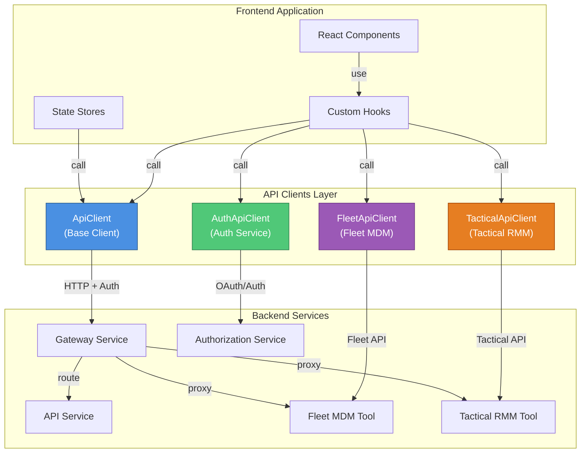

---

## Core Components

### 1. ApiClient (Base Client)

**Location:** `openframe/services/openframe-frontend/src/lib/api-client.ts`

The base API client provides core HTTP functionality with automatic authentication and token refresh.

#### Key Features

- **Dual Authentication Support**: Handles both cookie-based (production) and header-based (dev) authentication
- **Automatic Token Refresh**: Detects 401 responses and attempts token refresh before retrying
- **Request Queueing**: Queues concurrent requests during token refresh to prevent race conditions
- **Multi-tenancy**: Dynamic URL resolution based on tenant configuration
- **Error Handling**: Unified error response format with detailed error messages

#### Authentication Flow

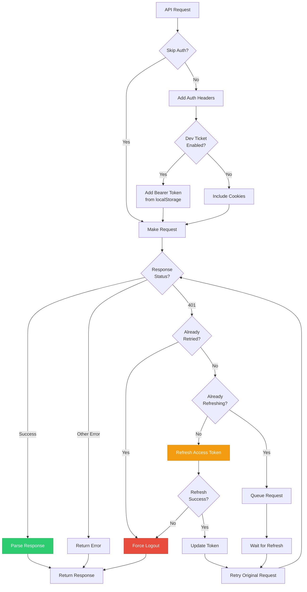

#### Core Methods

```typescript
class ApiClient {
  // Core request method with auth and retry logic
  async request<T>(path: string, options?: ApiRequestOptions, isRetry?: boolean): Promise<ApiResponse<T>>
  
  // Convenience methods
  async get<T>(path: string, options?: ApiRequestOptions): Promise<ApiResponse<T>>
  async post<T>(path: string, body?: any, options?: ApiRequestOptions): Promise<ApiResponse<T>>
  async put<T>(path: string, body?: any, options?: ApiRequestOptions): Promise<ApiResponse<T>>
  async patch<T>(path: string, body?: any, options?: ApiRequestOptions): Promise<ApiResponse<T>>
  async delete<T>(path: string, options?: ApiRequestOptions): Promise<ApiResponse<T>>
  
  // Special methods
  async external<T>(url: string, options?: ApiRequestOptions): Promise<ApiResponse<T>>
  async me<T>(): Promise<ApiResponse<T>>
}
```

#### Token Refresh Logic

The client implements sophisticated token refresh logic to handle expired tokens gracefully:

1. **Detection**: Intercepts 401 Unauthorized responses
2. **Deduplication**: Ensures only one refresh request is in-flight at a time
3. **Queueing**: Queues concurrent requests during refresh
4. **Retry**: Automatically retries failed requests after successful refresh
5. **Fallback**: Forces logout if refresh fails

```typescript
private async refreshAccessToken(): Promise<boolean> {
  // Prevent concurrent refresh requests
  if (this.isRefreshing && this.refreshPromise) {
    return this.refreshPromise
  }

  this.isRefreshing = true
  
  this.refreshPromise = (async () => {
    try {
      // Get tenant ID from auth store
      const { useAuthStore } = await import('../app/auth/stores/auth-store')
      const authState = useAuthStore.getState()
      const tenantId = authState.tenantId || authState.user?.organizationId
      
      // Call refresh endpoint
      const response = await authApiClient.refresh(tenantId)
      
      if (response.ok) {
        // Update tokens in localStorage if dev mode
        if (this.isDevTicketEnabled) {
          const { access_token, refresh_token } = response.data
          if (access_token) {
            localStorage.setItem(ACCESS_TOKEN_KEY, access_token)
            if (refresh_token) {
              localStorage.setItem(REFRESH_TOKEN_KEY, refresh_token)
            }
          }
        }
        return true
      }
      return false
    } finally {
      this.isRefreshing = false
      this.refreshPromise = null
      
      // Process queued requests
      const queue = [...this.requestQueue]
      this.requestQueue = []
      queue.forEach(retryRequest => retryRequest())
    }
  })()

  return this.refreshPromise
}
```

#### URL Resolution

The client supports multiple deployment modes with dynamic URL resolution:

```typescript
private buildUrl(path: string): string {
  // Absolute URLs pass through unchanged
  if (path.startsWith('http://') || path.startsWith('https://')) {
    return path
  }

  // Get tenant-specific host from runtime config
  const tenantHost = runtimeEnv.tenantHostUrl()
  
  const cleanPath = path.startsWith('/') ? path : `/${path}`
  
  // Use tenant host if available, otherwise relative path
  if (tenantHost) {
    return `${tenantHost}${cleanPath}`
  }

  return cleanPath
}
```

---

### 2. AuthApiClient (Authentication Service Client)

**Location:** `openframe/services/openframe-frontend/src/lib/auth-api-client.ts`

Specialized client for authentication and authorization operations.

#### Key Features

- **OAuth Flow Management**: Handles OAuth 2.0 authorization code flow with PKCE
- **Multi-tenant Authentication**: Supports tenant discovery and tenant-specific login
- **SSO Integration**: Provides methods for Google and Microsoft SSO
- **Registration Flows**: Handles organization registration and user invitations
- **Password Management**: Supports password reset and recovery flows

#### Authentication Methods

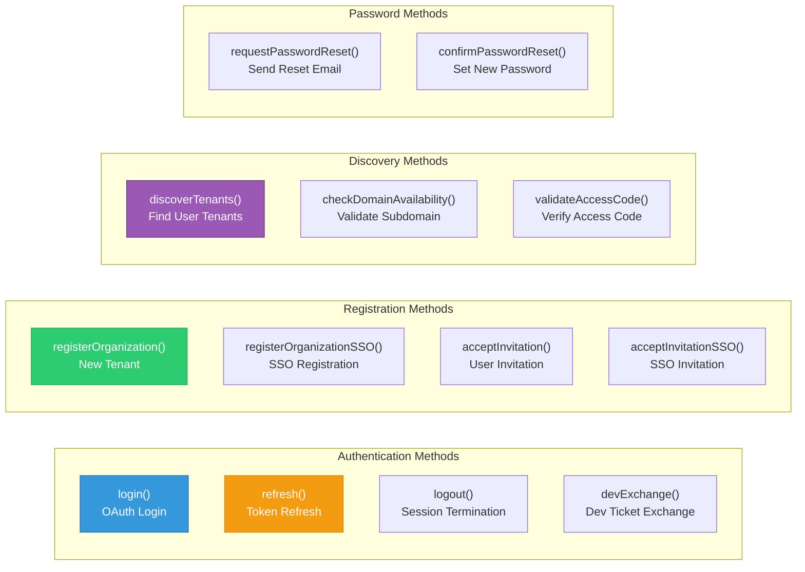

#### Core Methods

```typescript
class AuthApiClient {
  // OAuth and session management
  async refresh<T>(tenantId?: string): Promise<AuthApiResponse<T>>
  async devExchange(ticket: string): Promise<Response>
  async oauth<T>(path: string, body?: any, init?: RequestInit): Promise<AuthApiResponse<T>>
  loginUrl(tenantId: string, redirectTo: string, provider?: string): string
  logout(tenantId?: string): void
  
  // Tenant discovery
  async discoverTenants<T>(email: string): Promise<AuthApiResponse<T>>
  async checkDomainAvailability<T>(subdomain: string, organizationName: string): Promise<AuthApiResponse<T>>
  
  // Registration
  async registerOrganization<T>(payload: RegisterPayload): Promise<AuthApiResponse<T>>
  registerOrganizationSSO(payload: RegisterSSOPayload): Promise<AuthApiResponse<T>>
  async getRegistrationProviders<T>(): Promise<AuthApiResponse<T>>
  
  // Invitations
  async acceptInvitation<T>(payload: InvitationPayload): Promise<AuthApiResponse<T>>
  acceptInvitationSSO(payload: InvitationSSOPayload): Promise<AuthApiResponse<T>>
  async getInviteProviders<T>(invitationId: string): Promise<AuthApiResponse<T>>
  
  // Password management
  async requestPasswordReset<T>(payload: { email: string }): Promise<AuthApiResponse<T>>
  async confirmPasswordReset<T>(payload: { token: string, newPassword: string }): Promise<AuthApiResponse<T>>
  
  // Access code validation
  async validateAccessCode<T>(email: string, code: string): Promise<AuthApiResponse<T>>
  async resendVerificationEmail<T>(email: string): Promise<AuthApiResponse<T>>
}
```

#### Multi-Tenant URL Resolution

The auth client uses shared host URLs for multi-tenant deployments:

```typescript
function buildAuthUrl(path: string): string {
  // Get shared host from runtime config (e.g., https://auth.openframe.ai)
  const base = runtimeEnv.sharedHostUrl()
  
  // Fall back to relative path if no shared host
  if (!base) {
    return path.startsWith('/') ? path : `/${path}`
  }

  const cleanPath = path.startsWith('/') ? path : `/${path}`
  return `${base}${cleanPath}`
}
```

#### SSO Registration Flow

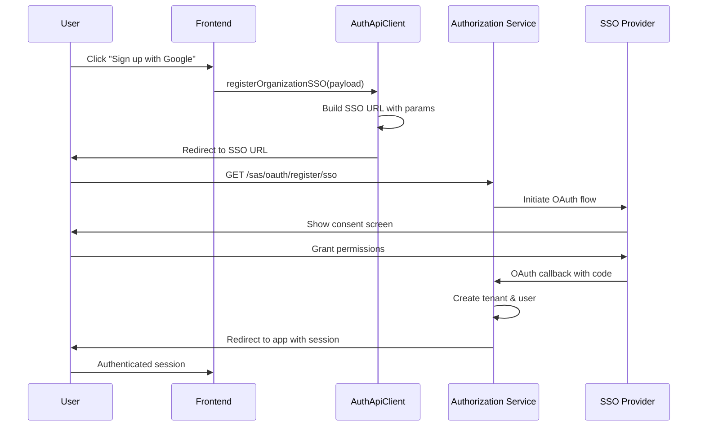

---

### 3. FleetApiClient (Fleet MDM Client)

**Location:** `openframe/services/openframe-frontend/src/lib/fleet-api-client.ts`

Specialized client for Fleet MDM (osquery-based device management) operations.

#### Key Features

- **Policy Management**: CRUD operations for security policies
- **Query Management**: Create and execute osquery queries
- **Host Management**: Device inventory and status tracking
- **Live Queries**: Execute ad-hoc queries on devices
- **Team Management**: Multi-team device organization

#### Fleet API Structure

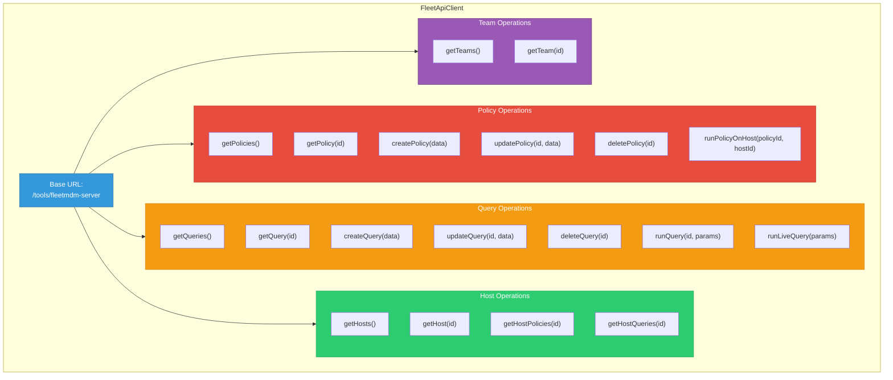

#### Core Methods

```typescript
class FleetApiClient {
  // Policy management
  async getPolicies(params?: { team_id?: number, query?: string }): Promise<ApiResponse<{ policies: Policy[] }>>
  async getPolicy(policyId: number): Promise<ApiResponse<Policy>>
  async createPolicy(policyData: PolicyData): Promise<ApiResponse<Policy>>
  async updatePolicy(policyId: number, policyData: Partial<PolicyData>): Promise<ApiResponse<Policy>>
  async deletePolicy(policyId: number): Promise<ApiResponse<void>>
  async runPolicyOnHost(policyId: number, hostId: number): Promise<ApiResponse<any>>
  
  // Query management
  async getQueries(params?: QueryParams): Promise<ApiResponse<{ queries: Query[] }>>
  async getQuery(queryId: number): Promise<ApiResponse<Query>>
  async createQuery(queryData: QueryData): Promise<ApiResponse<Query>>
  async updateQuery(queryId: number, queryData: Partial<QueryData>): Promise<ApiResponse<Query>>
  async deleteQuery(queryId: number): Promise<ApiResponse<void>>
  async runQuery(queryId: number, params?: RunQueryParams): Promise<ApiResponse<any>>
  async runLiveQuery(params: LiveQueryParams): Promise<ApiResponse<any>>
  
  // Host management
  async getHosts(params?: HostParams): Promise<ApiResponse<{ hosts: Host[] }>>
  async getHost(hostId: number): Promise<ApiResponse<FleetHostResponse>>
  async getHostPolicies(hostId: number): Promise<ApiResponse<Policy[]>>
  async getHostQueries(hostId: number): Promise<ApiResponse<Query[]>>
  
  // Team management
  async getTeams(): Promise<ApiResponse<any[]>>
  async getTeam(teamId: number): Promise<ApiResponse<any>>
  
  // Label management
  async getLabels(): Promise<ApiResponse<any[]>>
  async getLabel(labelId: number): Promise<ApiResponse<any>>
  
  // Pack management
  async getPacks(): Promise<ApiResponse<any[]>>
  async getPack(packId: number): Promise<ApiResponse<any>>
}
```

#### URL Construction

Fleet client builds URLs with the Fleet MDM tool prefix:

```typescript
private buildFleetUrl(path: string): string {
  // Absolute URLs pass through
  if (path.startsWith('http://') || path.startsWith('https://')) {
    return path
  }
  
  const cleanPath = path.startsWith('/') ? path : `/${path}`
  return `${this.baseUrl}${cleanPath}`
}

constructor() {
  const tenantHost = runtimeEnv.tenantHostUrl() || ''
  this.baseUrl = `${tenantHost}/tools/fleetmdm-server`
}
```

#### Policy Execution Flow

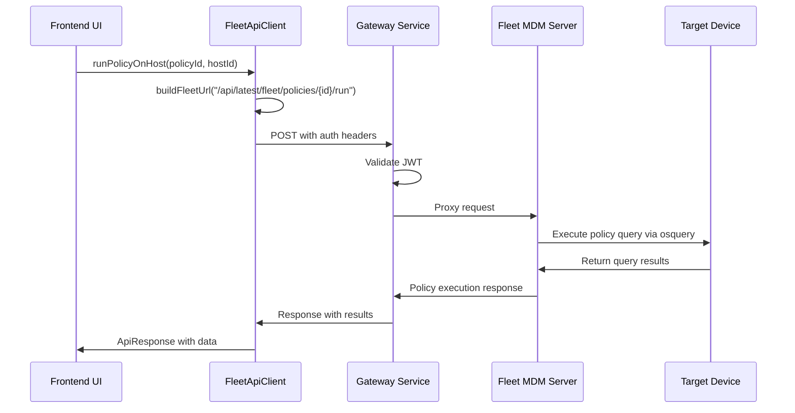

---

### 4. TacticalApiClient (Tactical RMM Client)

**Location:** `openframe/services/openframe-frontend/src/lib/tactical-api-client.ts`

Specialized client for Tactical RMM (Remote Monitoring and Management) operations.

#### Key Features

- **Agent Management**: Device agent inventory and control
- **Script Execution**: Run scripts on remote devices
- **Bulk Actions**: Execute actions across multiple agents
- **System Information**: Retrieve device hardware and software details
- **Service Management**: Control Windows services remotely

#### Tactical API Structure

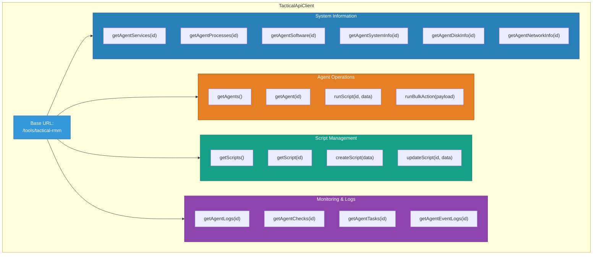

#### Core Methods

```typescript
class TacticalApiClient {
  // Agent management
  async getAgents(): Promise<ApiResponse<any[]>>
  async getAgent(agentId: string): Promise<ApiResponse<any>>
  async runScript(agentId: string, scriptData: ScriptData): Promise<ApiResponse<any>>
  async runBulkAction(payload: any): Promise<ApiResponse<any>>
  
  // Script management
  async getScripts(): Promise<ApiResponse<any[]>>
  async getScript(scriptId: string): Promise<ApiResponse<any>>
  async createScript(scriptData: ScriptData): Promise<ApiResponse<any>>
  async updateScript(scriptId: string, scriptData: ScriptData): Promise<ApiResponse<any>>
  
  // Monitoring and logs
  async getAgentLogs(agentId: string, params?: LogParams): Promise<ApiResponse<any[]>>
  async getAgentChecks(agentId: string): Promise<ApiResponse<any[]>>
  async getAgentTasks(agentId: string): Promise<ApiResponse<any[]>>
  async getAgentEventLogs(agentId: string, params?: EventLogParams): Promise<ApiResponse<any[]>>
  async getAgentChecksHistory(agentId: string, checkId: string, params?: HistoryParams): Promise<ApiResponse<any[]>>
  
  // System information
  async getAgentServices(agentId: string): Promise<ApiResponse<any[]>>
  async getAgentProcesses(agentId: string): Promise<ApiResponse<any[]>>
  async getAgentSoftware(agentId: string): Promise<ApiResponse<any[]>>
  async getAgentWindowsServices(agentId: string): Promise<ApiResponse<any[]>>
  async getAgentSystemInfo(agentId: string): Promise<ApiResponse<any>>
  async getAgentDiskInfo(agentId: string): Promise<ApiResponse<any[]>>
  async getAgentNetworkInfo(agentId: string): Promise<ApiResponse<any[]>>
  async getAgentUsers(agentId: string): Promise<ApiResponse<any[]>>
  async getAgentGroups(agentId: string): Promise<ApiResponse<any[]>>
  async getAgentPolicies(agentId: string): Promise<ApiResponse<any[]>>
}
```

#### Script Execution Flow

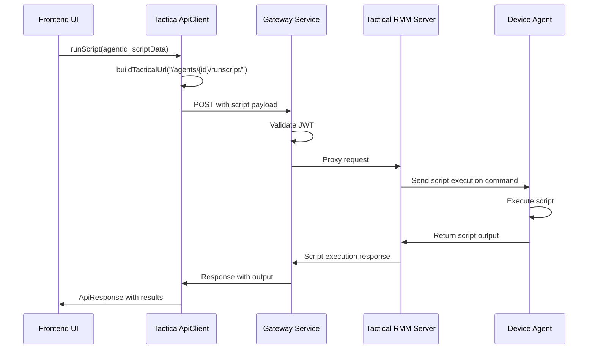

---

## Data Flow

### Request/Response Lifecycle

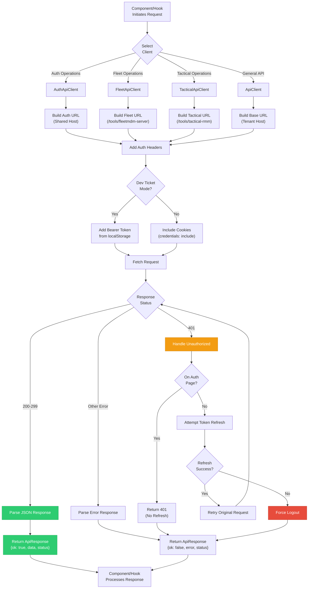

### Token Refresh Flow

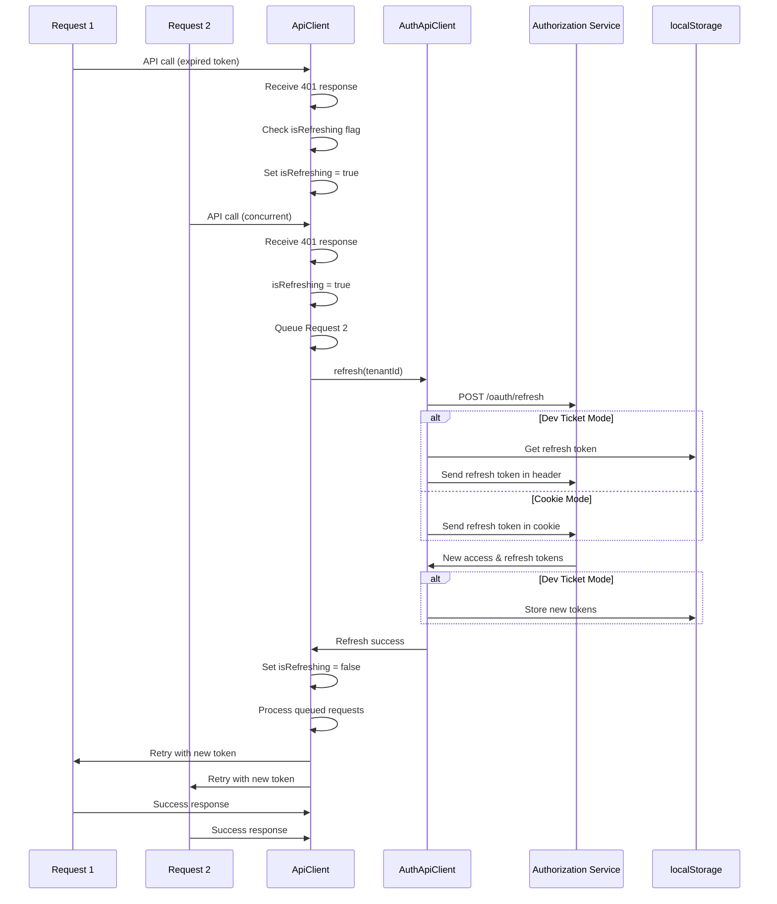

---

## Integration Points

### 1. Frontend Authentication Module

The API clients integrate closely with the [frontend_authentication](./frontend_authentication.md) module:

```typescript
// Auth store integration for tenant ID
const { useAuthStore } = await import('../app/auth/stores/auth-store')
const authState = useAuthStore.getState()
const tenantId = authState.tenantId

// Token storage integration
import { ACCESS_TOKEN_KEY, REFRESH_TOKEN_KEY } from '@app/auth/hooks/use-token-storage'
```

**Related Documentation:**
- [Frontend Authentication Module](./frontend_authentication.md) - Authentication state management
- [Security Core JWT Management](./security_core_jwt_management.md) - JWT token structure and validation

### 2. Gateway Service

All API requests flow through the [Gateway Service](./gateway_service.md):

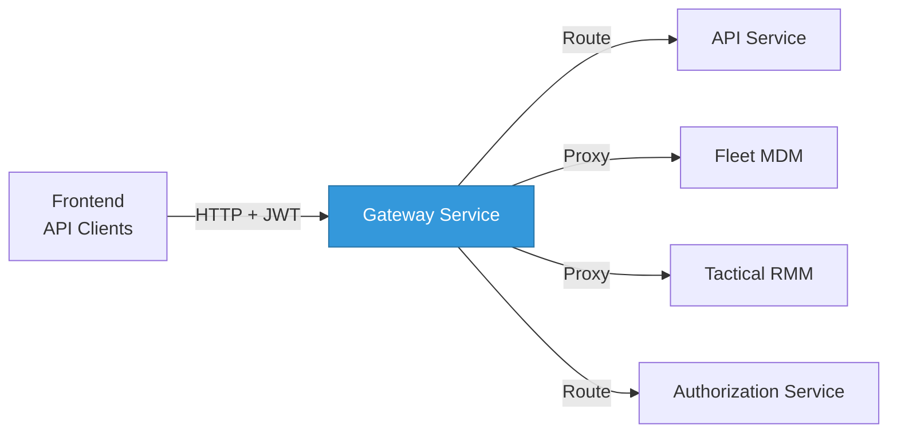

**Related Documentation:**
- [Gateway Service](./gateway_service.md) - Request routing and proxying
- [Gateway Service Security](./gateway_service_security.md) - JWT validation and CORS

### 3. Authorization Service

The AuthApiClient communicates directly with the [Authorization Service](./authorization_service.md):

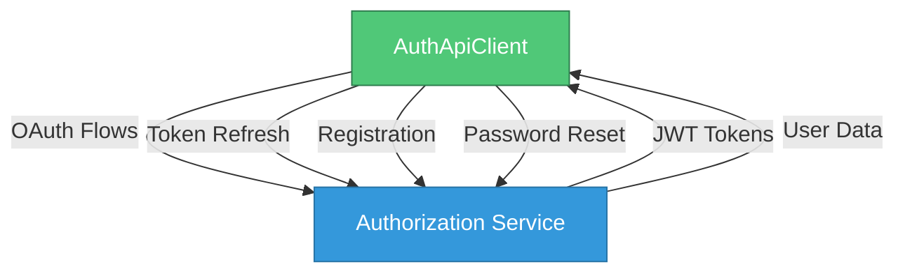

**Related Documentation:**
- [Authorization Service](./authorization_service.md) - OAuth 2.0 server implementation
- [Authorization Service Controllers](./authorization_service_controllers.md) - Auth endpoints

### 4. API Service

The base ApiClient communicates with the [API Service](./api_service.md) for core operations:

**Related Documentation:**
- [API Service](./api_service.md) - REST and GraphQL APIs
- [API Service REST Controllers](./api_service_rest_controllers.md) - REST endpoints
- [API Service GraphQL DataFetchers](./api_service_graphql_datafetchers.md) - GraphQL resolvers

### 5. Integrated Tools

Specialized clients communicate with integrated tools:

**Fleet MDM Integration:**
- [Fleet MDM SDK](./fleet_mdm_sdk.md) - Backend SDK for Fleet MDM

**Tactical RMM Integration:**
- [Tactical RMM SDK](./tactical_rmm_sdk.md) - Backend SDK for Tactical RMM

---

## Configuration

### Runtime Configuration

The API clients use runtime configuration for dynamic URL resolution:

```typescript
import { runtimeEnv } from './runtime-config'

// Tenant-specific host (e.g., https://tenant1.openframe.ai)
const tenantHost = runtimeEnv.tenantHostUrl()

// Shared authentication host (e.g., https://auth.openframe.ai)
const sharedHost = runtimeEnv.sharedHostUrl()

// Dev ticket mode (header-based auth for development)
const isDevTicketEnabled = runtimeEnv.enableDevTicketObserver()
```

### Deployment Modes

The clients support multiple deployment modes:

#### 1. Production (Cookie-Based Auth)

```bash
# Configuration
TENANT_HOST_URL=https://tenant1.openframe.ai
SHARED_HOST_URL=https://auth.openframe.ai
ENABLE_DEV_TICKET_OBSERVER=false

# Behavior
# - Uses cookies for authentication
# - Tokens stored in HTTP-only cookies
# - CSRF protection enabled
# - Suitable for production deployments
```

#### 2. Development (Header-Based Auth)

```bash
# Configuration
TENANT_HOST_URL=http://localhost:3000
SHARED_HOST_URL=http://localhost:8080
ENABLE_DEV_TICKET_OBSERVER=true

# Behavior
# - Uses Bearer tokens in Authorization header
# - Tokens stored in localStorage
# - Dev ticket exchange for initial authentication
# - Suitable for local development
```

#### 3. SaaS Shared Mode

```bash
# Configuration
TENANT_HOST_URL=https://tenant1.openframe.ai
SHARED_HOST_URL=https://auth.openframe.ai
ENABLE_DEV_TICKET_OBSERVER=false

# Behavior
# - Multi-tenant shared authentication
# - Tenant-specific subdomains
# - Shared authentication domain
# - Cookie domain set to parent domain
```

---

## Usage Examples

### Basic API Request

```typescript
import { apiClient } from '@/lib/api-client'

// GET request
const response = await apiClient.get('/api/devices')
if (response.ok) {
  console.log('Devices:', response.data)
}

// POST request
const createResponse = await apiClient.post('/api/devices', {
  name: 'New Device',
  type: 'laptop'
})

// PUT request
const updateResponse = await apiClient.put('/api/devices/123', {
  name: 'Updated Device'
})

// DELETE request
const deleteResponse = await apiClient.delete('/api/devices/123')
```

### Authentication Operations

```typescript
import { authApiClient } from '@/lib/auth-api-client'

// Discover tenants for email
const tenantsResponse = await authApiClient.discoverTenants('user@example.com')
if (tenantsResponse.ok) {
  console.log('User tenants:', tenantsResponse.data)
}

// Register new organization
const registerResponse = await authApiClient.registerOrganization({
  email: 'admin@example.com',
  firstName: 'John',
  lastName: 'Doe',
  password: 'securePassword123',
  tenantName: 'Acme Corp',
  tenantDomain: 'acme.openframe.ai',
  accessCode: 'ABC123'
})

// Request password reset
const resetResponse = await authApiClient.requestPasswordReset({
  email: 'user@example.com'
})

// Refresh token
const refreshResponse = await authApiClient.refresh('tenant-id-123')
```

### Fleet MDM Operations

```typescript
import { fleetApiClient } from '@/lib/fleet-api-client'

// Get all policies
const policiesResponse = await fleetApiClient.getPolicies()
if (policiesResponse.ok) {
  console.log('Policies:', policiesResponse.data.policies)
}

// Create new policy
const policyResponse = await fleetApiClient.createPolicy({
  name: 'Firewall Enabled',
  query: 'SELECT * FROM firewall WHERE enabled = 1',
  description: 'Ensure firewall is enabled',
  platform: 'windows',
  critical: true
})

// Run live query
const queryResponse = await fleetApiClient.runLiveQuery({
  query: 'SELECT * FROM system_info',
  host_ids: [1, 2, 3]
})

// Get host details
const hostResponse = await fleetApiClient.getHost(123)
if (hostResponse.ok) {
  console.log('Host:', hostResponse.data.host)
}
```

### Tactical RMM Operations

```typescript
import { tacticalApiClient } from '@/lib/tactical-api-client'

// Get all agents
const agentsResponse = await tacticalApiClient.getAgents()
if (agentsResponse.ok) {
  console.log('Agents:', agentsResponse.data)
}

// Run script on agent
const scriptResponse = await tacticalApiClient.runScript('agent-123', {
  output: 'console',
  emails: [],
  emailMode: 'default',
  custom_field: null,
  save_all_output: true,
  script: 456,
  args: ['--verbose'],
  env_vars: [],
  timeout: 300,
  run_as_user: false,
  run_on_server: false
})

// Get agent system info
const systemInfoResponse = await tacticalApiClient.getAgentSystemInfo('agent-123')
if (systemInfoResponse.ok) {
  console.log('System Info:', systemInfoResponse.data)
}

// Get agent logs
const logsResponse = await tacticalApiClient.getAgentLogs('agent-123', {
  limit: 50,
  offset: 0,
  search: 'error'
})
```

---

## Related Documentation

### Frontend Modules
- [Frontend Main Module](./frontend_main.md) - Frontend application overview
- [Frontend Authentication](./frontend_authentication.md) - Authentication state management

### Backend Services
- [API Service](./api_service.md) - REST and GraphQL APIs
- [Authorization Service](./authorization_service.md) - OAuth 2.0 server
- [Gateway Service](./gateway_service.md) - API gateway and routing
- [External API](./external_api.md) - Public API endpoints

### Security
- [Security Core](./security_core.md) - Security infrastructure
- [Security Core JWT Management](./security_core_jwt_management.md) - JWT handling
- [Gateway Service Security](./gateway_service_security.md) - Gateway security

### Integrated Tools
- [Fleet MDM SDK](./fleet_mdm_sdk.md) - Fleet MDM backend SDK
- [Tactical RMM SDK](./tactical_rmm_sdk.md) - Tactical RMM backend SDK

---

## Summary

The Frontend API Clients module provides a robust, type-safe HTTP client layer for the OpenFrame frontend application. Key features include:

✅ **Unified API Interface** - Consistent request/response handling across all services  
✅ **Automatic Authentication** - Transparent token management and refresh  
✅ **Multi-Tenancy Support** - Dynamic URL resolution for tenant-specific deployments  
✅ **Specialized Clients** - Purpose-built clients for Auth, Fleet MDM, and Tactical RMM  
✅ **Error Handling** - Comprehensive error handling with graceful degradation  
✅ **Request Queueing** - Prevents race conditions during token refresh  
✅ **Type Safety** - Full TypeScript support with typed responses  

This module serves as the foundation for all frontend-backend communication in OpenFrame, ensuring secure, reliable, and maintainable API interactions.

---

**For questions or issues, please visit the [OpenMSP Slack Community](https://join.slack.com/t/openmsp/shared_invite/zt-36bl7mx0h-3~U2nFH6nqHqoTPXMaHEHA).**
