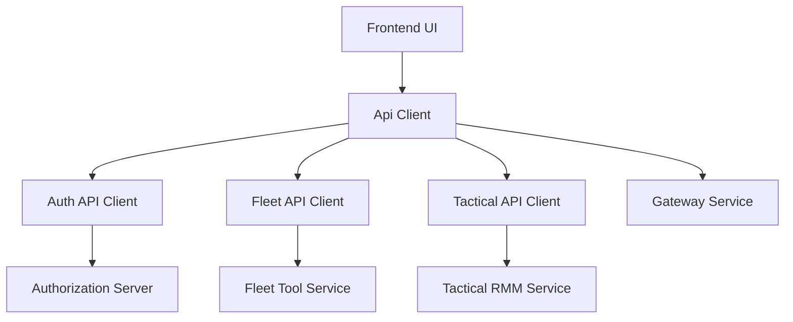
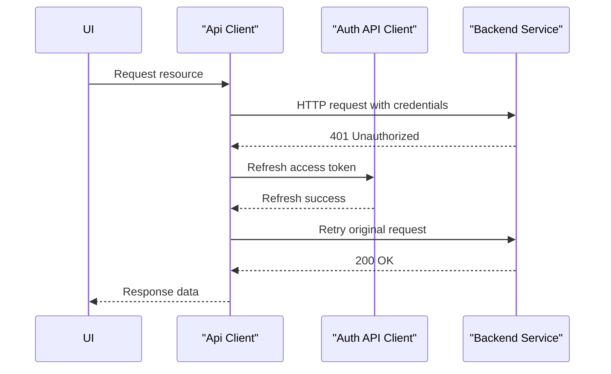

# Frontend App

## Overview

The **Frontend App** module provides the client-side API abstraction layer for OpenFrame. It centralizes HTTP communication, authentication handling, token refresh logic, and tool-specific integrations so that UI features can interact with backend services through a consistent, resilient interface.

Rather than embedding networking and authentication logic directly into UI components, the Frontend App exposes a small set of strongly-typed API clients:

- **Api Client** – a shared, authentication-aware HTTP client
- **Auth API Client** – a dedicated client for authentication, SSO, and tenant lifecycle flows
- **Fleet API Client** – a FleetDM-focused client for device posture, policies, and queries
- **Tactical API Client** – a Tactical RMM-focused client for remote management actions

Together, these clients act as the boundary between the frontend UI and the OpenFrame backend platform.

---

## Role in the OpenFrame Platform

The Frontend App sits at the very edge of the OpenFrame architecture:

- It communicates with **Gateway**, **Authorization**, **API**, and **Tool backends** through HTTP and cookies
- It abstracts multi-tenant routing and SaaS vs self-hosted behavior
- It enforces consistent authentication and refresh semantics across all frontend features

From the perspective of backend services, the Frontend App behaves like a well-behaved, stateful API consumer that understands OpenFrame’s authentication and tenancy model.

---

## High-Level Architecture

**Key architectural principles:**

- A **single source of truth** for authentication and retry logic
- Tool-specific clients extend the base client instead of re-implementing logic
- Runtime configuration determines tenant routing and shared-host behavior

---

## Core Components

### Api Client

The **Api Client** is the foundational HTTP client used by all other frontend API clients.

**Primary responsibilities:**

- Constructing request URLs using runtime tenant configuration
- Automatically attaching authentication credentials
- Supporting both cookie-based auth and header-based tokens
- Handling `401 Unauthorized` responses with a single refresh flow
- Queuing in-flight requests during token refresh
- Forcing logout on unrecoverable authentication failures

**Key behaviors:**

- Uses `credentials: include` to support secure cookie-based sessions
- Optionally injects `Authorization: Bearer` headers when developer ticket mode is enabled
- Guarantees **only one refresh request at a time**, preventing token storms
- Retries failed requests transparently after a successful refresh

This client ensures that UI code never needs to worry about token expiration or authentication edge cases.

---

### Auth API Client

The **Auth API Client** is a specialized client dedicated to authentication, onboarding, and tenant lifecycle operations.

**Primary responsibilities:**

- OAuth login and logout flows
- Access and refresh token exchange
- Developer ticket exchange for local and SaaS testing
- Tenant discovery and domain availability checks
- Organization registration (password and SSO)
- Invitation acceptance and SSO invitation flows
- Password reset workflows

**Design characteristics:**

- Can operate against a **shared SaaS host** or tenant-relative URLs
- Handles refresh logic independently for auth endpoints
- Performs browser redirects for SSO flows when required
- Clears stored tokens immediately on unrecoverable failures

This separation prevents authentication complexity from leaking into the general-purpose API client.

---

### Fleet API Client

The **Fleet API Client** provides a typed interface to FleetDM-backed device management features.

**Primary responsibilities:**

- Policy lifecycle management
- Query creation and execution
- Host inventory access
- Team, label, and pack retrieval

**Design characteristics:**

- Builds its base URL from the tenant host and Fleet tool path
- Delegates all request execution to the shared Api Client
- Exposes Fleet concepts directly as first-class methods

By extending the base client, it inherits consistent authentication, retries, and error handling without duplication.

---

### Tactical API Client

The **Tactical API Client** integrates Tactical RMM functionality into the frontend.

**Primary responsibilities:**

- Agent inventory and detail retrieval
- Script execution and bulk actions
- Monitoring checks, services, processes, and logs
- Scheduled task management

**Design characteristics:**

- Uses a tool-specific base URL derived from tenant configuration
- Relies entirely on the shared Api Client for networking behavior
- Encapsulates Tactical RMM’s REST structure behind frontend-friendly methods

This client allows the UI to interact with Tactical RMM without embedding tool-specific HTTP logic.

---

## Authentication and Refresh Flow

**Important guarantees:**

- Only one refresh request can run at a time
- Concurrent requests wait on the same refresh promise
- Failed refresh always results in a forced logout

---

## Runtime Configuration

The Frontend App relies on runtime configuration to adapt to different deployment modes:

- Tenant-hosted vs shared SaaS domains
- Developer ticket authentication
- Tool base URL resolution

This allows the same frontend build to operate across local development, SaaS, and self-hosted environments without code changes.

---

## Design Principles

- **Centralization:** All HTTP and auth logic lives in one place
- **Composability:** Tool clients build on top of the base client
- **Safety:** Automatic retries and forced logout prevent undefined auth states
- **Portability:** Runtime configuration avoids environment-specific branching in UI code

---

## Summary

The **Frontend App** module is the networking and authentication backbone of the OpenFrame frontend. By consolidating API access, authentication flows, and tool integrations into a small set of well-defined clients, it enables the rest of the frontend to focus on user experience rather than infrastructure concerns.

This module is critical for maintaining security, consistency, and reliability across all frontend interactions with the OpenFrame platform.
