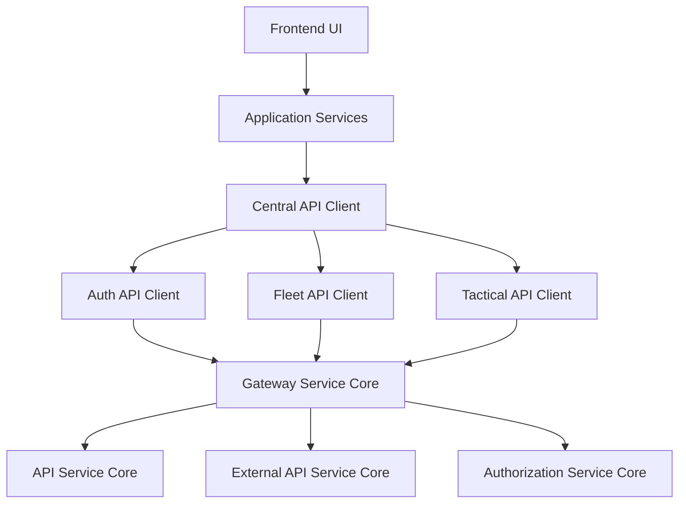
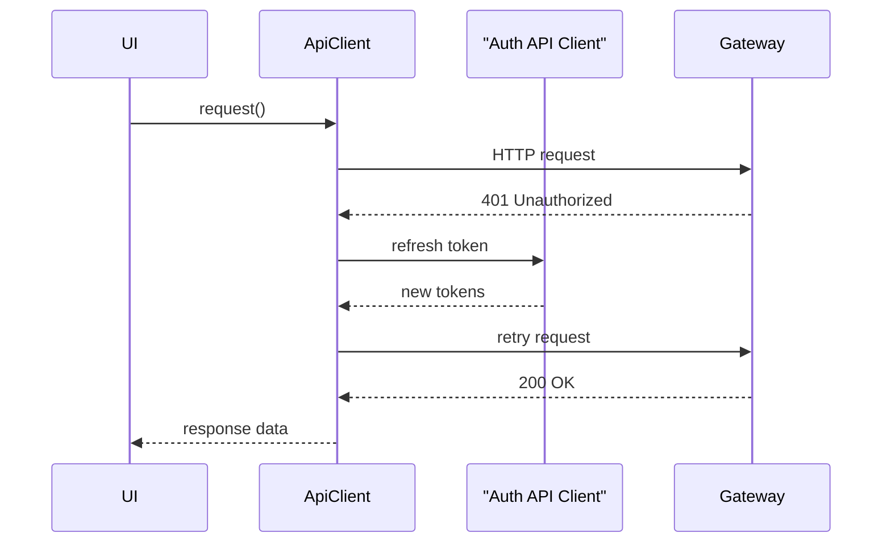

# Frontend App Openframe

## Overview

Frontend App Openframe is the primary web application for the OpenFrame platform. It provides the user interface used by technicians, administrators, and operators to interact with OpenFrame services such as authentication, device and fleet management, Tactical RMM, and AI-powered chat experiences (Mingo).

The module is responsible for:
- Centralized and consistent API communication with backend services
- Authentication and token lifecycle handling in the browser
- Domain-specific API clients for integrated tools
- State management for chat, tickets, and dialogs
- Real-time and streaming message handling for AI-driven workflows

This module acts as the **frontend aggregation layer** that ties together multiple backend services exposed through the OpenFrame Gateway and Authorization infrastructure.

---

## Architecture Overview

Frontend App Openframe is structured around a layered client-side architecture:

- **API Client Layer**: Centralized HTTP handling, authentication, token refresh, and retries
- **Domain API Clients**: Tool-specific clients (Fleet, Tactical RMM, Auth)
- **Application Services**: Higher-level services encapsulating business logic (for example, Mingo chat)
- **State Stores**: Zustand-based stores for dialogs, messages, and UI state

---

## Core Responsibilities

### Centralized API Communication

All HTTP communication from the frontend flows through a single, resilient API abstraction. This ensures:
- Consistent headers and credentials
- Automatic handling of cookie-based and header-based authentication
- Unified error handling
- Automatic token refresh and request retry

This design significantly reduces duplication and prevents inconsistent authentication behavior across the application.

### Authentication and Session Handling

Frontend App Openframe supports:
- Cookie-based authentication for standard SaaS deployments
- Header-based authentication using access and refresh tokens for development and special modes
- Automatic refresh of expired access tokens
- Forced logout and cleanup on unrecoverable authentication failures

The authentication flow is tightly aligned with the **Authorization Service Core** and **Security OAuth Shared** modules.

### Tool and Domain Integration

The frontend integrates multiple backend tools and services:
- Fleet MDM for device compliance, policies, and queries
- Tactical RMM for agent management and remote operations
- Chat and ticketing services for AI-assisted workflows

Each integration is encapsulated in its own API client, ensuring clean separation of concerns.

---

## Key Components

### API Client

**Purpose**: Acts as the single entry point for all HTTP requests.

**Responsibilities**:
- Builds tenant-aware URLs
- Injects authentication headers when required
- Handles 401 responses with controlled token refresh
- Queues concurrent requests during refresh to avoid race conditions
- Exposes convenience methods for common HTTP verbs

This component is the foundation upon which all other API clients are built.

---

### Auth API Client

**Purpose**: Handles all authentication and authorization-related endpoints.

**Responsibilities**:
- OAuth login, logout, and refresh flows
- Tenant discovery and domain availability checks
- Invitation acceptance and organization registration
- SSO redirects for Google and Microsoft providers

This client communicates primarily with the **Authorization Service Core** via the Gateway.

---

### Fleet API Client

**Purpose**: Provides access to Fleet MDM functionality.

**Responsibilities**:
- Policy management (create, update, run, delete)
- Query management and live queries
- Host, team, label, and pack retrieval

The Fleet API Client extends the base API Client while transparently targeting the Fleet backend.

---

### Tactical API Client

**Purpose**: Integrates Tactical RMM capabilities into the frontend.

**Responsibilities**:
- Agent inventory and details
- Script execution and bulk actions
- Scheduled tasks and monitoring data
- System, process, and service inspection

Like the Fleet client, this client builds on the centralized API Client.

---

### Mingo API Service

**Purpose**: Provides a high-level API for interacting with Mingo AI chat.

**Responsibilities**:
- Creating chat dialogs
- Sending messages to AI agents
- Handling approval and rejection workflows

This service uses React Query mutations to provide robust loading, error, and retry handling for chat interactions.

---

## State Management

Frontend App Openframe relies heavily on **Zustand** for predictable and efficient state management.

### Mingo Messages Store

**Responsibilities**:
- Store messages per dialog
- Track streaming messages and typing indicators
- Accumulate and process segmented AI responses
- Maintain unread counts and pagination state

This store enables real-time AI chat experiences with incremental rendering of assistant responses.

---

### Dialog Details Store

**Responsibilities**:
- Fetch and cache dialog metadata
- Load and paginate dialog messages via GraphQL
- Merge real-time messages with existing history
- Track typing indicators for client and admin chats

This store focuses on the detailed view of a single dialog or ticket.

---

### Dialogs Store

**Responsibilities**:
- Manage lists of active and archived dialogs
- Support cursor-based pagination
- Apply search and status filters
- Maintain independent state for current and archived views

This store powers the dialog and ticket listing views in the application.

---

## Interaction Flow Example

The following diagram illustrates a typical authenticated API request flow:

---

## Relationship to Other Modules

Frontend App Openframe depends on several backend modules but does not reimplement their logic:

- **Gateway Service Core**: Acts as the single backend entry point
- **Authorization Service Core**: Handles authentication, SSO, and OAuth flows
- **API Service Core**: Provides core platform APIs (users, devices, organizations)
- **External API Service Core**: Exposes third-party and integration APIs

For details on these services, refer to their respective module documentation.

---

## Summary

Frontend App Openframe is the cohesive frontend layer of the OpenFrame platform. By combining a centralized API client, specialized domain clients, robust authentication handling, and scalable state management, it provides a resilient and extensible foundation for OpenFrame’s user experiences.

Its architecture emphasizes consistency, separation of concerns, and alignment with the backend service ecosystem, making it easier to evolve both frontend features and backend capabilities independently.