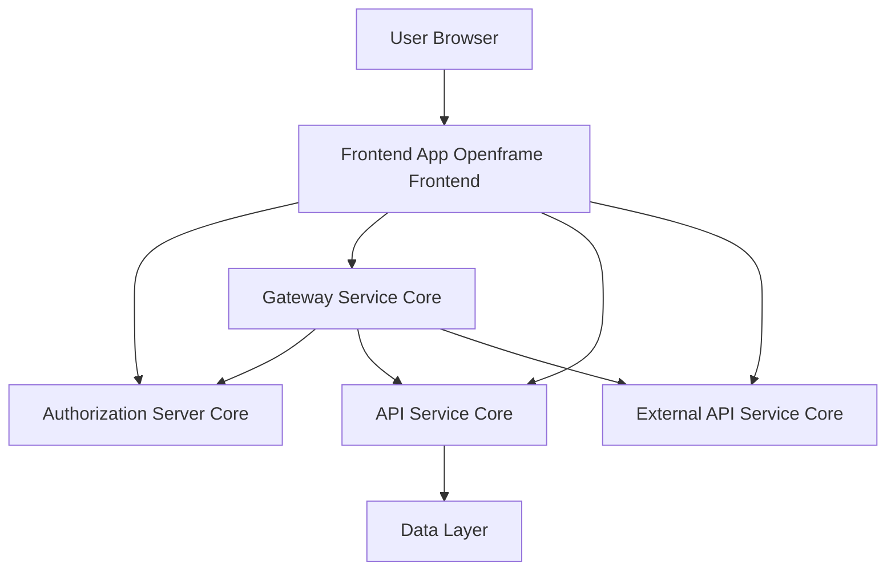
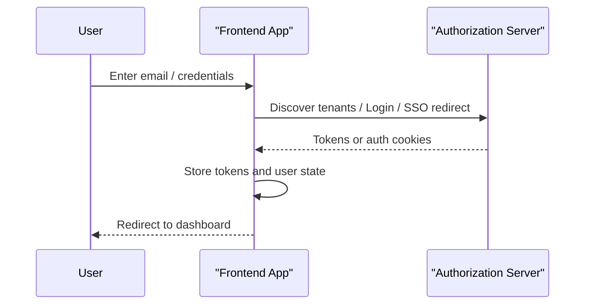
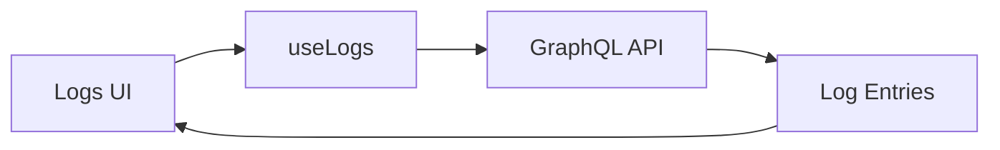
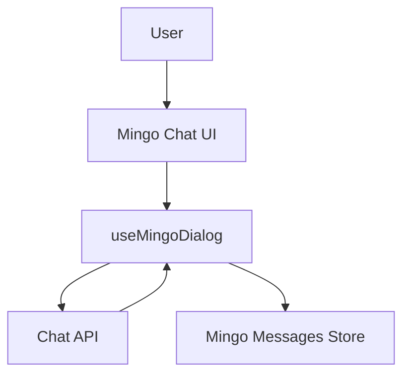

# Frontend App Openframe Frontend

## Overview

Frontend App Openframe Frontend is the primary web user interface for the OpenFrame platform. It is a modern React and Next.js application that provides technicians and administrators with a unified experience across authentication, device management, logs, tickets, AI-powered Mingo chat, integrations, and remote access.

This module acts as the **presentation and interaction layer** of OpenFrame, orchestrating communication with multiple backend services through REST and GraphQL APIs, while maintaining rich client-side state with hooks, stores, and typed models.

---

## Role in the OpenFrame Platform

Frontend App Openframe Frontend sits at the top of the OpenFrame stack:

- It consumes APIs exposed by Gateway Service Core, API Service Core, Authorization Server Core, and External API Service Core.
- It unifies data from Fleet, Tactical RMM, MeshCentral, and internal OpenFrame services.
- It exposes AI-driven workflows (Mingo) and operational workflows (tickets, logs, devices) in a single UI.

In short, this module is **where users interact with OpenFrame**.

---

## High-Level Architecture

**Key points:**
- The frontend never talks directly to databases.
- Authentication flows are mediated by the Authorization Server Core.
- Most business data flows through the Gateway Service Core and API Service Core.

---

## Core Functional Areas

### Authentication and Tenant Onboarding

Authentication in Frontend App Openframe Frontend is handled through a combination of custom hooks, centralized API clients, and global state.

**Key responsibilities:**
- Tenant discovery by email
- Password and SSO-based authentication
- Organization registration (standard and SSO)
- Token lifecycle management (access and refresh tokens)
- Automatic session refresh and logout

**Key components:**
- `useAuth` hook and `TenantInfo`
- `AuthApiClient`
- Token storage and refresh logic

---

### API Communication Layer

All network communication is centralized to ensure consistent authentication, error handling, and retries.

**Core clients:**
- `ApiClient`: Base client handling cookies, headers, refresh, and retries
- `AuthApiClient`: Dedicated client for authentication and OAuth flows
- `FleetApiClient`: Fleet-specific REST API wrapper
- `TacticalApiClient`: Tactical RMM REST API wrapper

This design prevents duplicated logic and ensures consistent behavior across the application.

---

### Deployment Awareness

The frontend dynamically adapts behavior based on where it is deployed.

**Deployment detection supports:**
- Cloud (SaaS)
- Self-hosted
- Local development

The `useDeployment` hook exposes deployment metadata and convenience flags to the rest of the application.

---

### Device Management

Device data is represented using a **unified device model** that merges information from multiple tools.

**Highlights:**
- Single `Device` type as source of truth
- Unified representation of hardware, OS, software, users, tags, and agents
- GraphQL response normalization into flat device structures

This abstraction allows UI components to remain agnostic of the underlying data source.

---

### Logs and Observability

The logs subsystem provides real-time and historical visibility into events across the fleet.

**Capabilities:**
- Cursor-based pagination
- Server-side filtering and search
- Detailed log inspection
- Device- and organization-level scoping

**Key building blocks:**
- `useLogs` and `useLogFilters` hooks
- Logs table components with imperative refresh support
- GraphQL-based log queries

---

### Tickets and Dialogs

Tickets represent conversations between clients, administrators, and AI agents.

**Features:**
- Dialog listing with pagination
- Dialog details and message history
- Real-time updates and typing indicators
- Separation of client and admin messages

State is managed through a combination of hooks and Zustand stores to support both page-level and global interactions.

---

### Mingo AI Chat

Mingo is the AI assistant embedded directly into Frontend App Openframe Frontend.

**Key concepts:**
- Dialog-based AI conversations
- Streaming messages and partial responses
- Approval workflows embedded in chat
- Centralized message store with segment accumulators

---

### Policies, Scripts, and Integrations

Frontend App Openframe Frontend also exposes advanced operational tooling:

- **Policies and Queries**: Viewing and managing compliance and detection logic
- **Scripts**: Inspecting and executing Tactical RMM scripts
- **Integrated Tools**: Discovering and managing third-party tool integrations

Each area uses strongly typed models and dedicated hooks to isolate concerns.

---

### Remote Access and File Management

The frontend integrates deeply with MeshCentral for remote access.

**Capabilities include:**
- Remote desktop rendering
- Keyboard and mouse event forwarding
- Multi-display support
- File browsing and transfer

These features are implemented entirely client-side, with binary protocol handling encapsulated in dedicated classes.

---

## State Management Strategy

Frontend App Openframe Frontend uses a layered state approach:

- **React state** for local UI concerns
- **Zustand stores** for cross-page and real-time state
- **React Query** for server state and mutations

This combination balances simplicity, performance, and scalability.

---

## Error Handling and User Feedback

Across the application:
- Errors are surfaced consistently via toast notifications
- Authentication failures trigger automatic logout and redirect
- Network and GraphQL errors are normalized before reaching UI components

This ensures predictable behavior even in partial failure scenarios.

---

## Summary

Frontend App Openframe Frontend is a comprehensive, production-grade frontend that:

- Unifies multiple backend services into a single UI
- Provides robust authentication and tenant management
- Exposes advanced observability, automation, and AI features
- Scales across cloud, self-hosted, and development deployments

It is a cornerstone of the OpenFrame platform, translating powerful backend capabilities into an intuitive and efficient user experience.