# Frontend Authentication Module

## Overview

The **Frontend Authentication Module** provides comprehensive authentication and authorization capabilities for the OpenFrame frontend application. It implements a flexible authentication system that supports multiple deployment modes (SaaS shared, SaaS tenant, self-hosted), OAuth 2.0 flows, SSO integration, and secure token management.

This module serves as the client-side authentication layer, coordinating with the [authorization_service](authorization_service.md) backend and [gateway_service](gateway_service.md) for secure API access.

**Key Capabilities:**
- Multi-tenant authentication with tenant discovery
- OAuth 2.0 Authorization Code flow with PKCE
- SSO integration (Google, Microsoft, custom providers)
- Automatic token refresh and session management
- Organization registration and user invitation flows
- Password reset and email verification
- Cookie-based and token-based authentication modes
- Seamless integration with backend services

---

## Architecture Overview

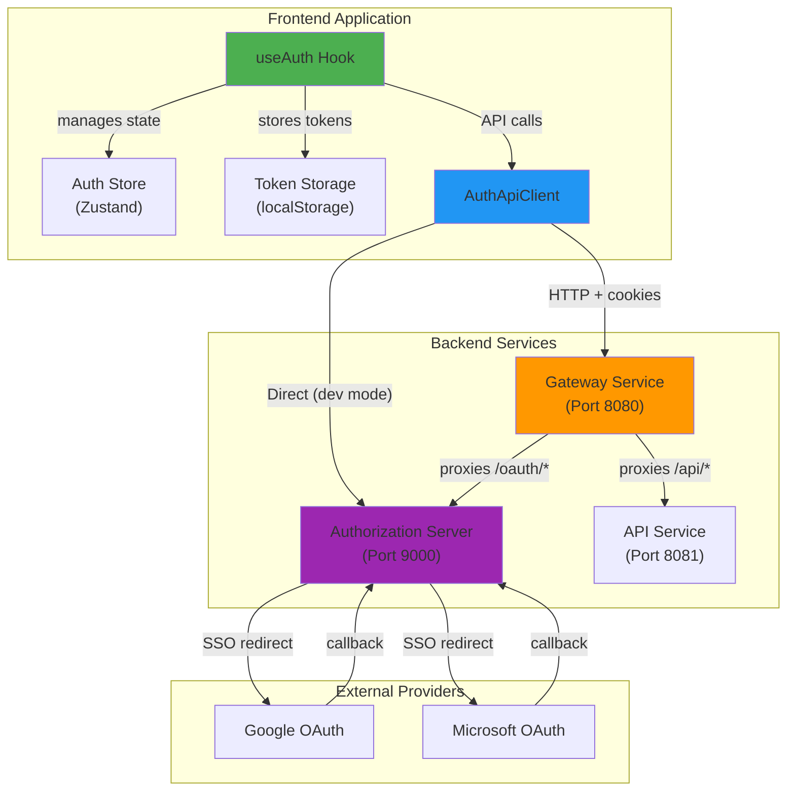

---

## Core Components

### 1. useAuth Hook

**Location:** `openframe/services/openframe-frontend/src/app/auth/hooks/use-auth.ts`

The primary React hook that provides authentication functionality to components.

**Key Features:**
- Tenant discovery and multi-tenant support
- Organization registration (password and SSO)
- User login (password and SSO)
- Session management and automatic refresh
- Invitation acceptance
- Password reset flows

**State Management:**

```typescript
interface TenantInfo {
  tenantId?: string
  tenantName: string
  tenantDomain: string
}

interface TenantDiscoveryResponse {
  email: string
  has_existing_accounts: boolean
  tenant_id?: string | null
  auth_providers?: string[] | null
}
```

**Usage Example:**

```typescript
import { useAuth } from '@app/auth/hooks/use-auth'

function LoginPage() {
  const {
    email,
    tenantInfo,
    hasDiscoveredTenants,
    availableProviders,
    isLoading,
    discoverTenants,
    loginWithSSO,
    logout
  } = useAuth()
  
  const handleEmailSubmit = async (email: string) => {
    const result = await discoverTenants(email)
    if (result?.has_existing_accounts) {
      // Show login options
    } else {
      // Show registration form
    }
  }
  
  return (
    // UI implementation
  )
}
```

---

### 2. AuthApiClient

**Location:** `openframe/services/openframe-frontend/src/lib/auth-api-client.ts`

Dedicated HTTP client for authentication endpoints with automatic token refresh and error handling.

**Architecture:**

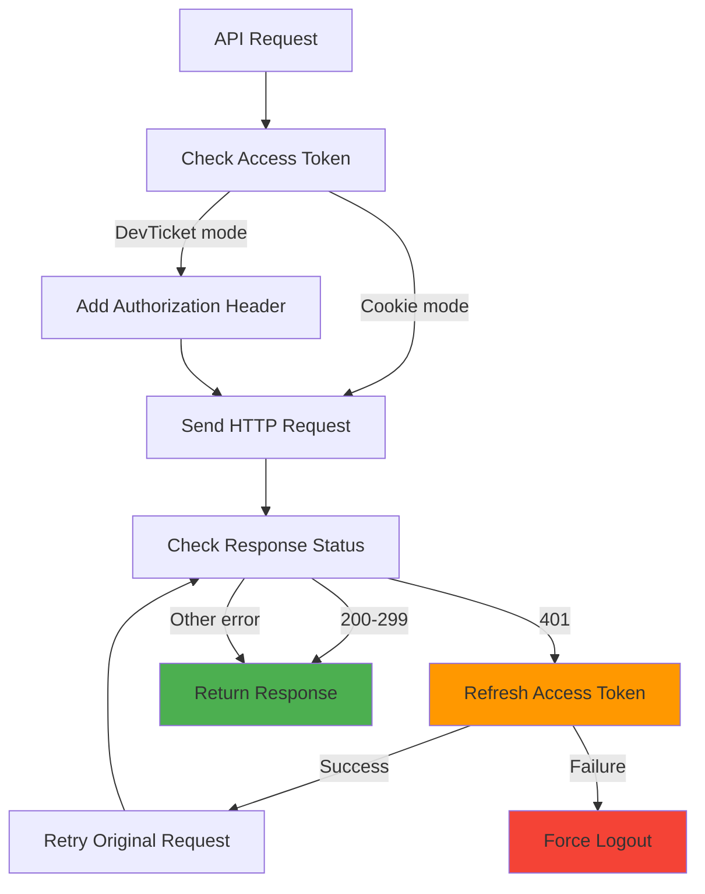

**Key Methods:**

| Method | Endpoint | Purpose |
|--------|----------|---------|
| `discoverTenants(email)` | `GET /sas/tenant/discover` | Find existing accounts for email |
| `registerOrganization(data)` | `POST /sas/oauth/register` | Create new organization |
| `registerOrganizationSSO(data)` | `GET /sas/oauth/register/sso` | Register via SSO redirect |
| `loginUrl(tenantId, redirectTo, provider)` | `GET /oauth/login` | Generate OAuth login URL |
| `logout(tenantId)` | `GET /oauth/logout` | End user session |
| `refresh(tenantId)` | `POST /oauth/refresh` | Refresh access token |
| `acceptInvitation(data)` | `POST /sas/invitations/accept` | Accept user invitation |
| `requestPasswordReset(email)` | `POST /sas/password-reset/request` | Initiate password reset |
| `confirmPasswordReset(token, password)` | `POST /sas/password-reset/confirm` | Complete password reset |

**Token Refresh Flow:**

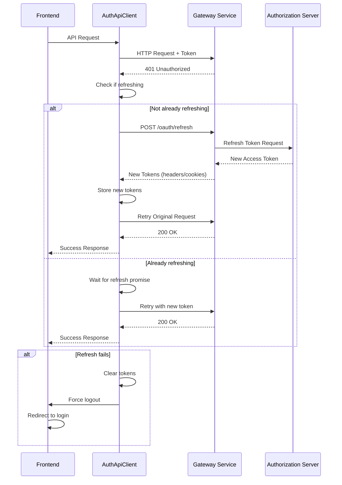

---

### 3. Token Storage

**Location:** `openframe/services/openframe-frontend/src/app/auth/hooks/use-token-storage.ts`

Manages secure storage of authentication tokens in browser localStorage.

**Storage Keys:**

```typescript
const ACCESS_TOKEN_KEY = 'of_access_token'
const REFRESH_TOKEN_KEY = 'of_refresh_token'
```

**API:**

```typescript
interface TokenStorage {
  storeAccessToken(token: string): boolean
  storeRefreshToken(token: string): boolean
  storeTokensFromHeaders(headers: Headers): { accessToken, refreshToken }
  getAccessToken(): string | null
  getRefreshToken(): string | null
  clearTokens(): boolean
}
```

**Security Considerations:**
- Tokens stored in localStorage (XSS vulnerable but necessary for SPA)
- Automatic cleanup on logout
- Fallback to cookie-based auth when DevTicket mode disabled
- Tokens cleared on 401 responses after failed refresh

---

## Authentication Flows

### 1. Tenant Discovery Flow

Used to determine if a user has existing accounts and which authentication providers are available.

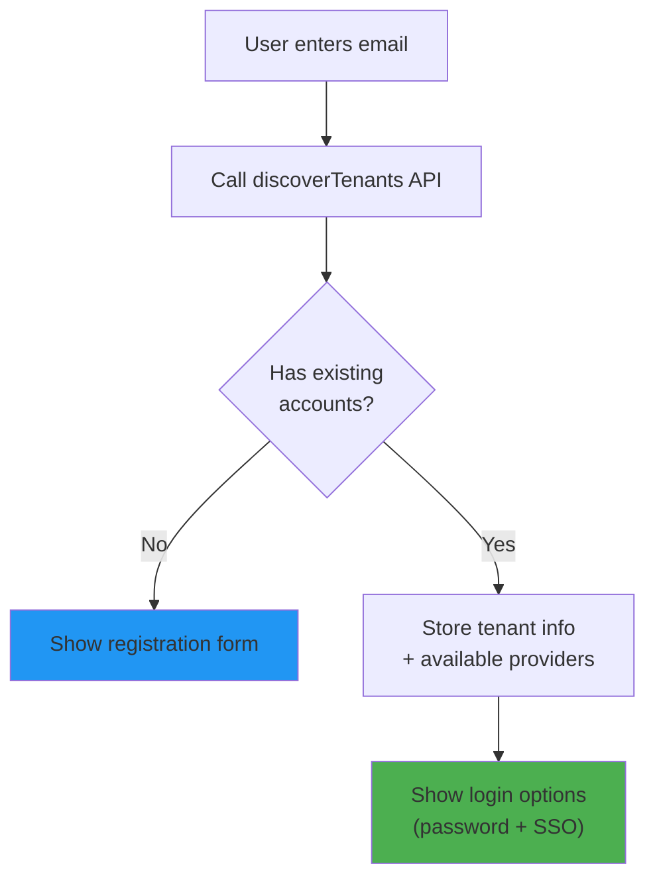

**Implementation:**

```typescript
const discoverTenants = async (userEmail: string) => {
  setIsLoading(true)
  setEmail(userEmail)
  
  const response = await authApiClient.discoverTenants(userEmail)
  
  if (response.ok && response.data) {
    const data = response.data as TenantDiscoveryResponse
    
    if (data.has_existing_accounts && data.tenant_id) {
      // Store tenant information
      setTenantInfo({
        tenantId: data.tenant_id,
        tenantName: '',
        tenantDomain: 'localhost'
      })
      setAvailableProviders(data.auth_providers || ['openframe-sso'])
      setHasDiscoveredTenants(true)
      setTenantId(data.tenant_id) // Store in auth store
    } else {
      setHasDiscoveredTenants(false)
    }
    
    setDiscoveryAttempted(true)
    return data
  }
  
  setIsLoading(false)
  return null
}
```

---

### 2. Organization Registration Flow

#### Password-Based Registration

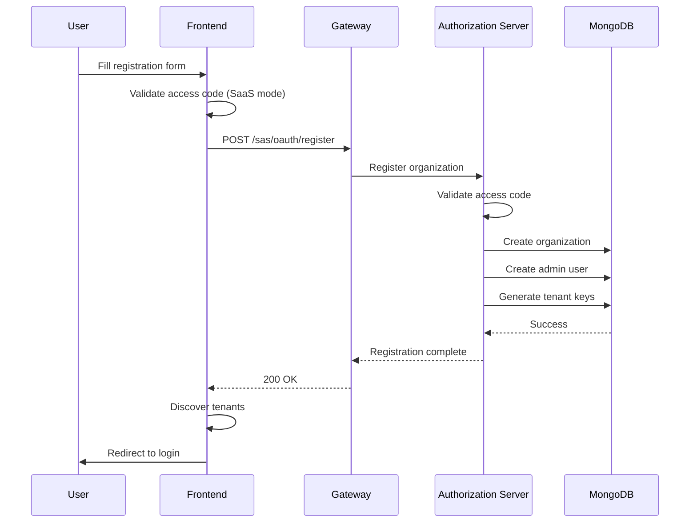

**Code Example:**

```typescript
const registerOrganization = async (data: RegisterRequest) => {
  const response = await authApiClient.registerOrganization({
    email: data.email,
    firstName: data.firstName,
    lastName: data.lastName,
    password: data.password,
    tenantName: data.tenantName,
    tenantDomain: data.tenantDomain,
    accessCode: isSaasSharedMode() ? data.accessCode : undefined
  })
  
  if (response.ok) {
    toast({ title: "Success!", description: "Organization created" })
    await discoverTenants(data.email)
    window.location.href = '/auth/login'
  }
}
```

#### SSO-Based Registration

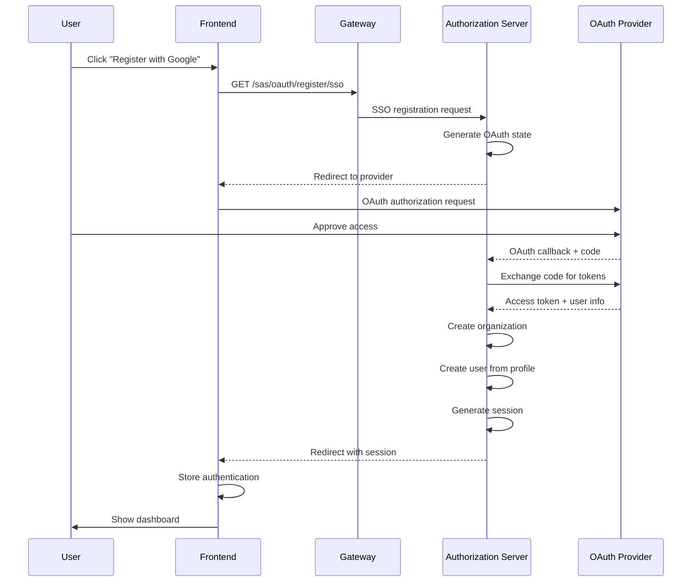

---

### 3. Login Flow

#### SSO Login

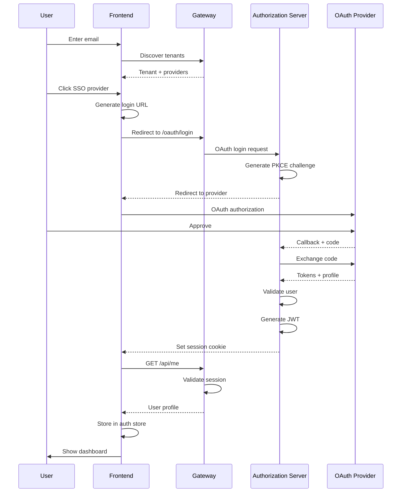

**Implementation:**

```typescript
const loginWithSSO = async (provider: string) => {
  if (!tenantInfo?.tenantId) {
    throw new Error('No tenant information available')
  }
  
  // Store tenant ID for token refresh
  setTenantId(tenantInfo.tenantId)
  
  // Generate return URL
  const returnUrl = encodeURIComponent(`${window.location.origin}/dashboard`)
  
  // Build login URL
  const loginUrl = authApiClient.loginUrl(
    tenantInfo.tenantId,
    returnUrl,
    provider
  )
  
  // Redirect to OAuth flow
  window.location.href = loginUrl
}
```

---

### 4. Session Management Flow

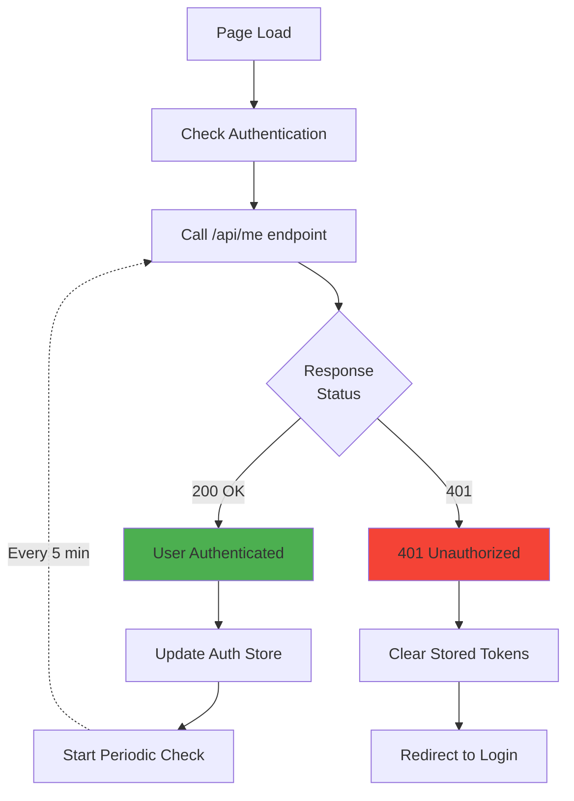

**Periodic Authentication Check:**

```typescript
useEffect(() => {
  const checkExistingAuth = async (isPeriodicCheck = false) => {
    try {
      const response = await apiClient.me()
      
      if (response.ok && response.data?.authenticated) {
        const userData = response.data.user
        const token = getAccessToken() || 'cookie-auth'
        
        if (!isPeriodicCheck || !isAuthenticated) {
          await handleAuthenticationSuccess(token, userData)
        }
      } else if (response.status === 401) {
        if (isPeriodicCheck && isAuthenticated) {
          logout()
          toast({
            title: 'Session Expired',
            description: 'Please sign in again.',
            variant: 'destructive'
          })
          router.push('/auth')
        }
      }
    } catch (error) {
      console.error('Auth check failed:', error)
    }
  }
  
  // Initial check
  setTimeout(() => checkExistingAuth(false), 100)
  
  // Periodic check (default: 5 minutes)
  const interval = setInterval(() => {
    if (isAuthenticated) {
      checkExistingAuth(true)
    }
  }, 5 * 60 * 1000)
  
  return () => clearInterval(interval)
}, [isAuthenticated])
```

---

### 5. Invitation Acceptance Flow

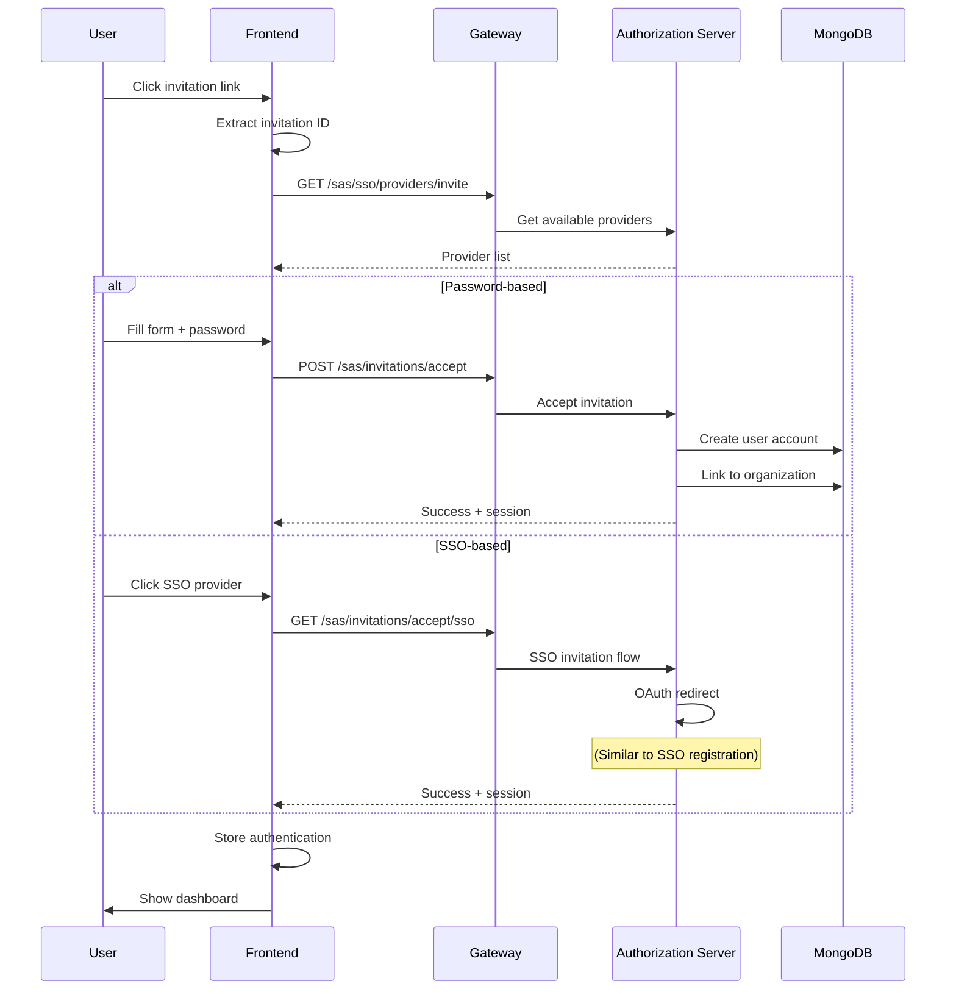

---

## Deployment Modes

The authentication module supports three deployment modes, each with different behavior:

### 1. SaaS Shared Mode

**Configuration:**
- `NEXT_PUBLIC_APP_MODE=saas-shared`
- `NEXT_PUBLIC_SHARED_HOST_URL=https://shared.openframe.ai`

**Characteristics:**
- All tenants share a common authentication domain
- Requires access codes for registration
- Tenant discovery via email
- Cross-tenant SSO support
- Centralized session management

**URL Structure:**
```text
https://shared.openframe.ai/auth/login
https://shared.openframe.ai/oauth/login?tenantId=abc123
https://tenant1.openframe.ai/dashboard (redirects after auth)
```

---

### 2. SaaS Tenant Mode

**Configuration:**
- `NEXT_PUBLIC_APP_MODE=saas-tenant`
- `NEXT_PUBLIC_SHARED_HOST_URL=https://shared.openframe.ai`

**Characteristics:**
- Each tenant has dedicated subdomain
- Authentication via shared host
- Automatic tenant detection from subdomain
- Isolated tenant sessions

**URL Structure:**
```text
https://tenant1.openframe.ai/auth (redirects to shared)
https://shared.openframe.ai/oauth/login?tenantId=tenant1
https://tenant1.openframe.ai/dashboard (after auth)
```

---

### 3. Self-Hosted Mode

**Configuration:**
- `NEXT_PUBLIC_APP_MODE=self-hosted`
- No `SHARED_HOST_URL` required

**Characteristics:**
- Single tenant deployment
- Direct authentication (no shared host)
- Simplified configuration
- Local session management

**URL Structure:**
```text
https://company.example.com/auth/login
https://company.example.com/oauth/login
https://company.example.com/dashboard
```

---

## Security Features

### 1. Token Management

**Access Token:**
- Short-lived JWT (default: 15 minutes)
- Stored in localStorage (DevTicket mode) or HTTP-only cookie
- Included in Authorization header for API requests
- Automatically refreshed before expiration

**Refresh Token:**
- Long-lived token (default: 7 days)
- Stored in localStorage (DevTicket mode) or HTTP-only cookie
- Used to obtain new access tokens
- Rotated on each refresh

**Token Refresh Strategy:**

```typescript
class AuthApiClient {
  private isRefreshing: boolean = false
  private refreshPromise: Promise<boolean> | null = null
  
  private async refreshAccessToken(): Promise<boolean> {
    // Prevent concurrent refresh requests
    if (this.isRefreshing && this.refreshPromise) {
      return this.refreshPromise
    }
    
    this.isRefreshing = true
    
    this.refreshPromise = (async () => {
      try {
        const refreshResponse = await this.refresh(tenantId)
        
        if (refreshResponse.ok) {
          // Store new tokens
          const newAccessToken = refreshResponse.data?.access_token
          const newRefreshToken = refreshResponse.data?.refresh_token
          
          if (newAccessToken) {
            localStorage.setItem(ACCESS_TOKEN_KEY, newAccessToken)
          }
          if (newRefreshToken) {
            localStorage.setItem(REFRESH_TOKEN_KEY, newRefreshToken)
          }
          
          return true
        } else {
          clearStoredTokens()
          return false
        }
      } finally {
        this.isRefreshing = false
        this.refreshPromise = null
      }
    })()
    
    return this.refreshPromise
  }
}
```

---

### 2. PKCE (Proof Key for Code Exchange)

Used for OAuth 2.0 flows to prevent authorization code interception attacks.

**Flow:**

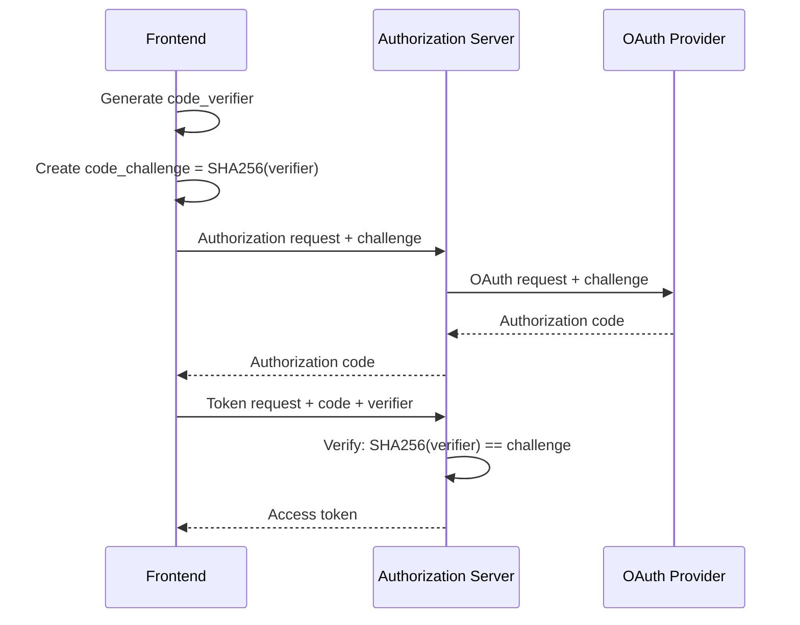

**Implementation:** Handled by [authorization_service](authorization_service.md) backend.

---

### 3. CSRF Protection

**Mechanisms:**
- SameSite cookie attribute (`Lax` or `Strict`)
- State parameter in OAuth flows
- Origin validation on backend
- Referer header checking

---

### 4. XSS Mitigation

**Strategies:**
- Content Security Policy (CSP) headers
- Input sanitization in forms
- React's built-in XSS protection
- HTTP-only cookies for sensitive data (when possible)
- Token expiration and rotation

---

## Integration with Backend Services

### 1. Authorization Service Integration

The frontend authentication module communicates with the [authorization_service](authorization_service.md) for:

- User registration and login
- OAuth 2.0 flows
- Token issuance and refresh
- Session management
- Password reset

**Key Endpoints:**

| Endpoint | Method | Purpose |
|----------|--------|---------|
| `/oauth/login` | GET | Initiate OAuth login |
| `/oauth/logout` | GET | End user session |
| `/oauth/refresh` | POST | Refresh access token |
| `/oauth/dev-exchange` | GET | Exchange dev ticket for token |
| `/sas/oauth/register` | POST | Register organization |
| `/sas/tenant/discover` | GET | Discover user tenants |

See [authorization_service](authorization_service.md) for detailed backend implementation.

---

### 2. Gateway Service Integration

The [gateway_service](gateway_service.md) acts as the entry point for all API requests:

**Authentication Flow:**

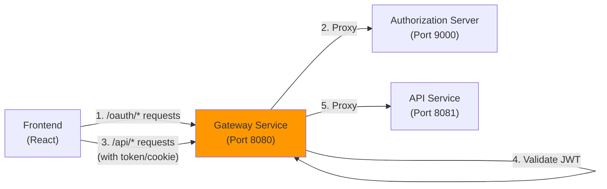

**Security Features:**
- JWT validation
- CORS configuration
- Rate limiting
- Request logging

See [gateway_service_security](gateway_service.md#security) for details.

---

### 3. API Service Integration

After authentication, the frontend calls the [api_service](api_service.md) for business operations:

**Request Flow:**

```typescript
// Frontend makes authenticated request
const response = await apiClient.getDevices()

// Gateway validates JWT and forwards to API service
// API service extracts user context from JWT claims
// API service performs authorization checks
// API service returns data
```

**User Context Extraction:**

The API service receives authenticated requests with JWT claims:

```json
{
  "sub": "user-id",
  "email": "user@example.com",
  "tenantId": "org-123",
  "roles": ["ADMIN"],
  "exp": 1234567890
}
```

See [api_service_configuration](api_service.md#authentication-config) for backend security configuration.

---

## Configuration

### Environment Variables

**Required:**

| Variable | Description | Example |
|----------|-------------|---------|
| `NEXT_PUBLIC_APP_MODE` | Deployment mode | `saas-shared`, `saas-tenant`, `self-hosted` |

**Optional:**

| Variable | Description | Default |
|----------|-------------|---------|
| `NEXT_PUBLIC_SHARED_HOST_URL` | Shared authentication host (SaaS modes) | `undefined` |
| `NEXT_PUBLIC_ENABLE_DEV_TICKET_OBSERVER` | Enable DevTicket mode for local development | `false` |
| `NEXT_PUBLIC_AUTH_CHECK_INTERVAL_MS` | Session check interval | `300000` (5 min) |

**Example Configuration:**

```bash
# SaaS Shared Mode
NEXT_PUBLIC_APP_MODE=saas-shared
NEXT_PUBLIC_SHARED_HOST_URL=https://shared.openframe.ai

# SaaS Tenant Mode
NEXT_PUBLIC_APP_MODE=saas-tenant
NEXT_PUBLIC_SHARED_HOST_URL=https://shared.openframe.ai

# Self-Hosted Mode
NEXT_PUBLIC_APP_MODE=self-hosted
```

---

### Runtime Configuration

**Location:** `openframe/services/openframe-frontend/src/lib/runtime-config.ts`

```typescript
export const runtimeEnv = {
  sharedHostUrl: () => process.env.NEXT_PUBLIC_SHARED_HOST_URL,
  enableDevTicketObserver: () => 
    process.env.NEXT_PUBLIC_ENABLE_DEV_TICKET_OBSERVER === 'true',
  authCheckIntervalMs: () => 
    parseInt(process.env.NEXT_PUBLIC_AUTH_CHECK_INTERVAL_MS || '300000')
}
```

---

## Error Handling

### Common Error Scenarios

#### 1. Invalid Credentials

```typescript
// Response from backend
{
  "error": "invalid_grant",
  "error_description": "Invalid username or password"
}

// Frontend handling
toast({
  title: "Login Failed",
  description: "Invalid email or password",
  variant: "destructive"
})
```

---

#### 2. Session Expired

```typescript
// Detected during periodic auth check
if (response.status === 401 && isAuthenticated) {
  logout()
  toast({
    title: 'Session Expired',
    description: 'Your session has expired. Please sign in again.',
    variant: 'destructive'
  })
  router.push('/auth')
}
```

---

#### 3. Token Refresh Failure

```typescript
// AuthApiClient handles automatically
const refreshSuccess = await this.refreshAccessToken()

if (!refreshSuccess) {
  // Force logout and redirect
  await forceLogout({
    reason: 'Token refresh failed',
    shouldRedirect: true
  })
}
```

---

#### 4. Network Errors

```typescript
try {
  const response = await authApiClient.discoverTenants(email)
} catch (error) {
  toast({
    title: "Connection Error",
    description: "Unable to connect to authentication service",
    variant: "destructive"
  })
}
```

---

## Testing

### Unit Tests

**Test useAuth Hook:**

```typescript
import { renderHook, act } from '@testing-library/react'
import { useAuth } from '@app/auth/hooks/use-auth'

describe('useAuth', () => {
  it('should discover tenants for existing user', async () => {
    const { result } = renderHook(() => useAuth())
    
    await act(async () => {
      const response = await result.current.discoverTenants('user@example.com')
      expect(response?.has_existing_accounts).toBe(true)
      expect(result.current.hasDiscoveredTenants).toBe(true)
    })
  })
  
  it('should handle registration for new user', async () => {
    const { result } = renderHook(() => useAuth())
    
    await act(async () => {
      await result.current.registerOrganization({
        email: 'newuser@example.com',
        firstName: 'John',
        lastName: 'Doe',
        password: 'SecurePass123!',
        tenantName: 'Acme Corp',
        tenantDomain: 'acme',
        accessCode: 'VALID-CODE'
      })
    })
    
    expect(result.current.isLoading).toBe(false)
  })
})
```

---

### Integration Tests

**Test Complete Login Flow:**

```typescript
import { render, screen, fireEvent, waitFor } from '@testing-library/react'
import LoginPage from '@app/auth/login/page'

describe('Login Flow', () => {
  it('should complete SSO login', async () => {
    render(<LoginPage />)
    
    // Enter email
    const emailInput = screen.getByLabelText('Email')
    fireEvent.change(emailInput, { target: { value: 'user@example.com' } })
    fireEvent.click(screen.getByText('Continue'))
    
    // Wait for tenant discovery
    await waitFor(() => {
      expect(screen.getByText('Sign in with Google')).toBeInTheDocument()
    })
    
    // Click SSO button
    fireEvent.click(screen.getByText('Sign in with Google'))
    
    // Should redirect to OAuth provider
    await waitFor(() => {
      expect(window.location.href).toContain('/oauth/login')
    })
  })
})
```

---

## Troubleshooting

### Issue: "Session Expired" appears immediately after login

**Cause:** Token not properly stored or retrieved.

**Solution:**
1. Check browser localStorage for `of_access_token`
2. Verify `NEXT_PUBLIC_ENABLE_DEV_TICKET_OBSERVER` is set correctly
3. Check browser console for token storage errors
4. Ensure cookies are enabled for cookie-based auth

---

### Issue: OAuth callback fails with "Invalid state"

**Cause:** State parameter mismatch or expired.

**Solution:**
1. Check [authorization_service](authorization_service.md) logs for state validation errors
2. Verify clock synchronization between services
3. Ensure OAuth state timeout is sufficient (default: 5 minutes)
4. Clear browser cookies and retry

---

### Issue: Token refresh fails repeatedly

**Cause:** Refresh token expired or invalid.

**Solution:**
1. Check refresh token expiration in JWT payload
2. Verify refresh token is stored correctly
3. Check [authorization_service](authorization_service.md) logs for validation errors
4. Force logout and re-authenticate

---

### Issue: CORS errors on authentication requests

**Cause:** Gateway CORS configuration mismatch.

**Solution:**
1. Verify `CORS_ALLOWED_ORIGINS` in [gateway_service](gateway_service.md)
2. Check `NEXT_PUBLIC_SHARED_HOST_URL` matches allowed origins
3. Ensure credentials are included in requests (`credentials: 'include'`)
4. Review gateway logs for CORS rejections

---

## Best Practices

### 1. Token Storage

✅ **DO:**
- Use HTTP-only cookies for production (when possible)
- Clear tokens on logout
- Implement token rotation
- Set appropriate expiration times

❌ **DON'T:**
- Store tokens in sessionStorage (lost on tab close)
- Log tokens to console in production
- Share tokens between domains without proper validation

---

### 2. Error Handling

✅ **DO:**
- Show user-friendly error messages
- Log detailed errors for debugging
- Implement retry logic for network errors
- Handle token expiration gracefully

❌ **DON'T:**
- Expose sensitive error details to users
- Ignore authentication errors
- Allow infinite retry loops

---

### 3. Session Management

✅ **DO:**
- Implement periodic session checks
- Provide clear session expiration warnings
- Allow users to extend sessions
- Log out inactive users

❌ **DON'T:**
- Keep sessions alive indefinitely
- Ignore 401 responses
- Skip session validation on sensitive operations

---

## Related Documentation

- **[authorization_service](authorization_service.md)** - Backend OAuth 2.0 server implementation
- **[gateway_service](gateway_service.md)** - API gateway and request routing
- **[api_service](api_service.md)** - Business logic API with JWT validation
- **[security_core](security_core.md)** - Shared security utilities and JWT handling
- **[frontend_api_clients](frontend_api_clients.md)** - HTTP clients for API communication

---

## Additional Resources

### OAuth 2.0 & PKCE
- [OAuth 2.0 RFC 6749](https://datatracker.ietf.org/doc/html/rfc6749)
- [PKCE RFC 7636](https://datatracker.ietf.org/doc/html/rfc7636)
- [OAuth 2.0 Security Best Practices](https://datatracker.ietf.org/doc/html/draft-ietf-oauth-security-topics)

### JWT
- [JWT RFC 7519](https://datatracker.ietf.org/doc/html/rfc7519)
- [JWT Best Practices](https://datatracker.ietf.org/doc/html/rfc8725)

### React Authentication
- [React Authentication Patterns](https://reactjs.org/docs/context.html)
- [Next.js Authentication](https://nextjs.org/docs/authentication)

---

**Questions or Issues?**

For authentication-related questions or issues, please consult:
- OpenMSP Slack Community: https://www.openmsp.ai/
- Join Slack: https://join.slack.com/t/openmsp/shared_invite/zt-36bl7mx0h-3~U2nFH6nqHqoTPXMaHEHA

---

**Last Updated:** 2024  
**Module Version:** 1.0  
**Maintainers:** Flamingo Platform Team
