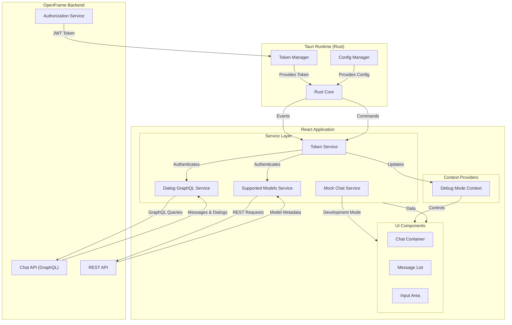
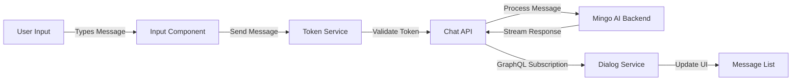
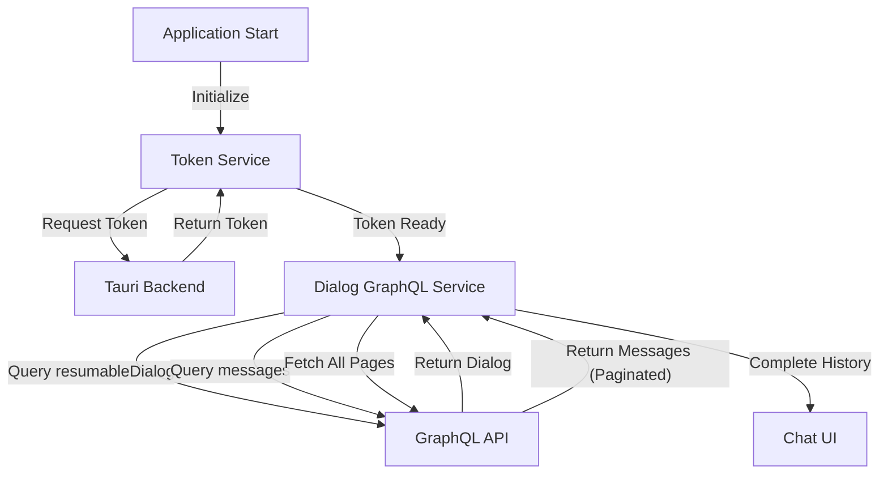
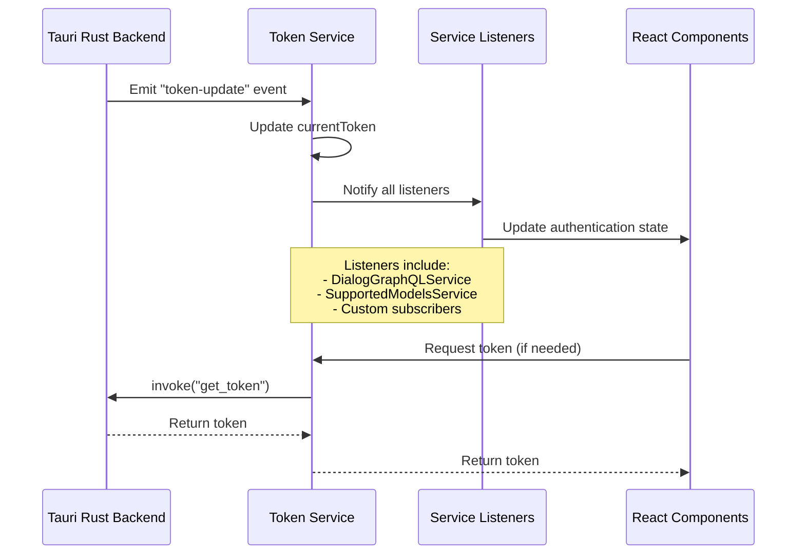
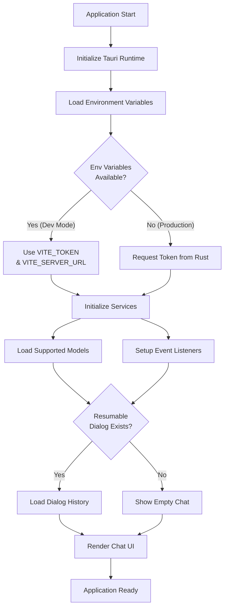
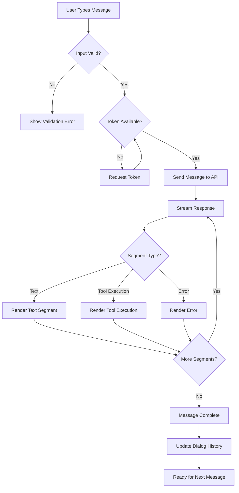
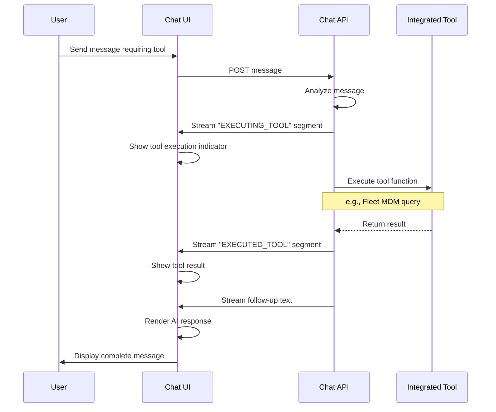

# Frontend Chat Module

## Overview

The **Frontend Chat Module** is a standalone Tauri-based desktop application that provides a dedicated chat interface for the OpenFrame platform. Built with React and TypeScript, it enables real-time communication with AI assistants (Mingo AI) and support technicians through a native desktop experience.

This module serves as a lightweight, always-available chat client that integrates with the OpenFrame backend services, providing users with instant access to support and AI-powered assistance without requiring a web browser.

### Key Features

- **Native Desktop Application**: Built with Tauri for cross-platform desktop support (Windows, macOS, Linux)
- **Real-time Chat Interface**: Streaming message support with tool execution visualization
- **GraphQL Integration**: Efficient data fetching for dialog history and messages
- **Token-based Authentication**: Secure authentication via JWT tokens from the authorization service
- **Debug Mode Support**: Developer-friendly debugging capabilities
- **Mock Service Layer**: Testing and development support with simulated responses
- **AI Model Management**: Support for multiple AI providers (Anthropic, OpenAI, Google Gemini)

### Technology Stack

- **Framework**: React 18+ with TypeScript
- **Desktop Runtime**: Tauri (Rust-based)
- **API Communication**: GraphQL (graphql-request), REST APIs
- **State Management**: React Context API
- **UI Components**: Shared components from `@flamingo-stack/openframe-frontend-core`

---

## Architecture Overview

The frontend_chat module follows a service-oriented architecture with clear separation between UI components, business logic, and external communication layers.



### Architecture Layers

1. **Tauri Runtime Layer** (Rust)
   - Native OS integration
   - Token and configuration management
   - Event system for Rust ↔ JavaScript communication

2. **Service Layer** (TypeScript)
   - Token management and authentication
   - GraphQL communication for chat operations
   - REST API integration for configuration
   - Mock services for development/testing

3. **Context Layer** (React)
   - Debug mode state management
   - Global application state

4. **UI Layer** (React Components)
   - Chat interface components
   - Message rendering
   - User input handling

---

## Module Components

The frontend_chat module is organized into the following sub-modules:

### 1. [Context Management](./frontend_chat_contexts.md)

Provides React Context providers for global state management across the application.

**Core Components:**
- `DebugModeContext`: Manages debug mode state and provides debugging capabilities

**Key Features:**
- Debug mode toggle functionality
- Integration with Tauri backend for debug state persistence
- Global debug state access via React hooks

### 2. [Service Layer](./frontend_chat_services.md)

Implements business logic and external communication services for the chat application.

**Core Services:**
- `TokenService`: Authentication token management and API URL configuration
- `DialogGraphQLService`: GraphQL client for dialog and message operations
- `SupportedModelsService`: AI model metadata and configuration management
- `MockChatService`: Development and testing mock service

**Key Features:**
- Secure token handling with event-driven updates
- Efficient GraphQL queries with pagination support
- AI model display name resolution
- Realistic mock responses for development

---

## Data Flow

### Message Sending Flow



### Dialog History Loading Flow



### Token Update Flow



---

## Integration Points

### Backend Service Integration

The frontend_chat module integrates with multiple OpenFrame backend services:

| Service | Purpose | Integration Method | Documentation |
|---------|---------|-------------------|---------------|
| **Authorization Service** | JWT token generation and validation | Tauri backend → Token events | [authorization_service.md](./authorization_service.md) |
| **Chat API (GraphQL)** | Dialog and message management | GraphQL queries/subscriptions | [api_service_graphql_datafetchers.md](./api_service_graphql_datafetchers.md) |
| **External API** | AI model configuration | REST API | [external_api.md](./external_api.md) |
| **Gateway Service** | API routing and WebSocket support | HTTP/WebSocket | [gateway_service.md](./gateway_service.md) |

### Frontend Core Components

The module leverages shared UI components from the `@flamingo-stack/openframe-frontend-core` library:

- **Chat Components**: `ChatContainer`, `MessageList`, `MessageBubble`
- **Type Definitions**: `Message`, `MessageContent`, `ChatAPIRequest`, `ChatAPIResponse`
- **Utilities**: Message formatting, timestamp handling, avatar management

See [frontend_core_components.md](./frontend_core_components.md) for detailed component documentation.

### Tauri Backend Integration

The Rust backend provides native OS integration and secure credential management:

**Tauri Commands** (Rust → JavaScript):
```typescript
// Get current authentication token
invoke<string>('get_token'): Promise<string | null>

// Get API server URL
invoke<string>('get_server_url'): Promise<string>

// Get debug mode state
invoke<boolean>('get_debug_mode'): Promise<boolean>
```

**Tauri Events** (Rust → JavaScript):
```typescript
// Token update notification
listen<{token: string}>('token-update', callback)
```

---

## Key Workflows

### 1. Application Initialization



### 2. Sending a Message



### 3. Tool Execution Visualization



---

## Configuration

### Environment Variables

The application supports environment-based configuration for development:

```bash
# Development mode configuration
VITE_TOKEN=eyJhbGciOiJSUzI1NiIsInR5cCI6IkpXVCJ9...
VITE_SERVER_URL=https://api.openframe.example.com
```

**Configuration Priority:**
1. Environment variables (`VITE_*`) - Development only
2. Tauri backend commands - Production
3. Fallback to defaults

### Debug Mode

Debug mode can be enabled to show additional logging and development tools:

```typescript
import { useDebugMode } from './contexts/DebugModeContext'

function MyComponent() {
  const { debugMode, setDebugMode } = useDebugMode()
  
  // Enable debug mode
  setDebugMode(true)
  
  // Check debug state
  if (debugMode) {
    console.log('Debug information...')
  }
}
```

---

## Development Guide

### Running in Development Mode

```bash
# Install dependencies
npm install

# Set environment variables
export VITE_TOKEN="your-jwt-token"
export VITE_SERVER_URL="https://api.openframe.example.com"

# Start development server
npm run tauri dev
```

### Using Mock Services

For development without backend connectivity:

```typescript
import { MockChatService } from './services/mockChatService'

const mockService = new MockChatService()

// Stream mock response
for await (const segment of mockService.streamResponse(userMessage)) {
  if (segment.type === 'text') {
    console.log(segment.text)
  } else if (segment.type === 'tool_execution') {
    console.log('Tool:', segment.data)
  }
}
```

### Testing Tool Execution

The mock service simulates tool execution for testing:

```typescript
// Trigger tool execution in mock
const message = "Check system processes"
for await (const segment of mockService.streamResponse(message)) {
  // Will include EXECUTING_TOOL and EXECUTED_TOOL segments
}
```

---

## Security Considerations

### Token Management

- **Secure Storage**: Tokens are managed by the Tauri Rust backend, not stored in JavaScript
- **Event-Driven Updates**: Token updates are pushed from Rust to JavaScript via events
- **Automatic Refresh**: Token service handles token expiration and refresh
- **Masked Logging**: Tokens are masked in logs (first 4 + last 4 characters only)

### API Communication

- **HTTPS Only**: All API communication uses HTTPS in production
- **Bearer Authentication**: JWT tokens sent in Authorization header
- **CORS Protection**: Gateway service enforces CORS policies
- **Request Validation**: All requests validated on backend

### Debug Mode

- **Development Only**: Debug mode should be disabled in production builds
- **No Sensitive Data**: Debug logs should not contain tokens or passwords
- **Controlled Access**: Debug mode state managed by Tauri backend

---

## Error Handling

### Token Errors

```typescript
try {
  await tokenService.ensureTokenReady()
} catch (error) {
  if (error.message.includes('token not available')) {
    // Redirect to login or show authentication error
  } else if (error.message.includes('API server URL not configured')) {
    // Show configuration error
  }
}
```

### GraphQL Errors

```typescript
const dialog = await dialogGraphQLService.getResumableDialog()
if (!dialog) {
  // Handle no resumable dialog (show empty state)
}

const messages = await dialogGraphQLService.getDialogMessages(dialogId)
if (!messages) {
  // Handle failed message fetch (show error, retry option)
}
```

### Network Errors

```typescript
try {
  for await (const segment of chatService.streamResponse(message)) {
    // Process segment
  }
} catch (error) {
  // Handle connection errors, timeouts, etc.
  console.error('Stream error:', error)
  // Show user-friendly error message
}
```

---

## Performance Considerations

### Message Pagination

The Dialog GraphQL Service automatically fetches all message pages:

```typescript
// Fetches all pages automatically
const messages = await dialogGraphQLService.getDialogMessages(dialogId)
// Returns complete message history
```

**Optimization**: Consider implementing virtual scrolling for large message histories.

### Token Caching

Tokens are cached in memory to avoid repeated Tauri command invocations:

```typescript
// First call: fetches from Rust
const token1 = await tokenService.requestToken()

// Subsequent calls: returns cached token
const token2 = tokenService.getCurrentToken()
```

### Model Metadata Caching

Supported models are loaded once and cached:

```typescript
// Load once on app start
await supportedModelsService.loadSupportedModels()

// Fast lookups from cache
const displayName = supportedModelsService.getModelDisplayName('claude-3-opus')
```

---

## Future Enhancements

### Planned Features

1. **Offline Support**: Queue messages when offline, sync when reconnected
2. **Message Search**: Full-text search across dialog history
3. **File Attachments**: Support for sending files and images
4. **Voice Input**: Speech-to-text for message input
5. **Notifications**: Desktop notifications for new messages
6. **Multi-Dialog Support**: Switch between multiple active dialogs
7. **Message Reactions**: React to messages with emojis
8. **Rich Text Formatting**: Markdown support in user messages

### Technical Improvements

1. **Virtual Scrolling**: Improve performance for large message lists
2. **Message Caching**: Local storage for offline access
3. **Optimistic Updates**: Show messages immediately, sync in background
4. **WebSocket Support**: Real-time message updates without polling
5. **Error Recovery**: Automatic retry with exponential backoff
6. **Analytics Integration**: Track usage patterns and errors

---

## Related Documentation

### Backend Services
- [Authorization Service](./authorization_service.md) - JWT token generation
- [API Service GraphQL](./api_service_graphql_datafetchers.md) - Chat data fetchers
- [Gateway Service](./gateway_service.md) - API routing and WebSocket

### Frontend Modules
- [Frontend Main](./frontend_main.md) - Main web application
- [Frontend Core Components](./frontend_core_components.md) - Shared UI components
- [Frontend Mingo AI](./frontend_mingo_ai.md) - AI assistant integration

### Security
- [Security Core](./security_core.md) - JWT and authentication
- [Security OAuth](./security_oauth.md) - OAuth 2.0 flows

---

## Support and Community

For questions, issues, or contributions related to the frontend_chat module:

- **OpenMSP Slack Community**: [Join here](https://join.slack.com/t/openmsp/shared_invite/zt-36bl7mx0h-3~U2nFH6nqHqoTPXMaHEHA)
- **Website**: [https://www.openmsp.ai/](https://www.openmsp.ai/)
- **OpenFrame Platform**: [https://openframe.ai](https://openframe.ai)
- **Flamingo Platform**: [https://flamingo.run](https://flamingo.run)

**Note**: We manage all discussions and issues through our OpenMSP Slack community, not GitHub Issues.

---

## Conclusion

The frontend_chat module provides a robust, secure, and user-friendly desktop chat interface for the OpenFrame platform. Its service-oriented architecture, integration with Tauri for native capabilities, and comprehensive error handling make it a reliable tool for users to access AI-powered support and communicate with technicians.

The module's design emphasizes security, performance, and developer experience, with clear separation of concerns and extensive mock support for testing and development.
