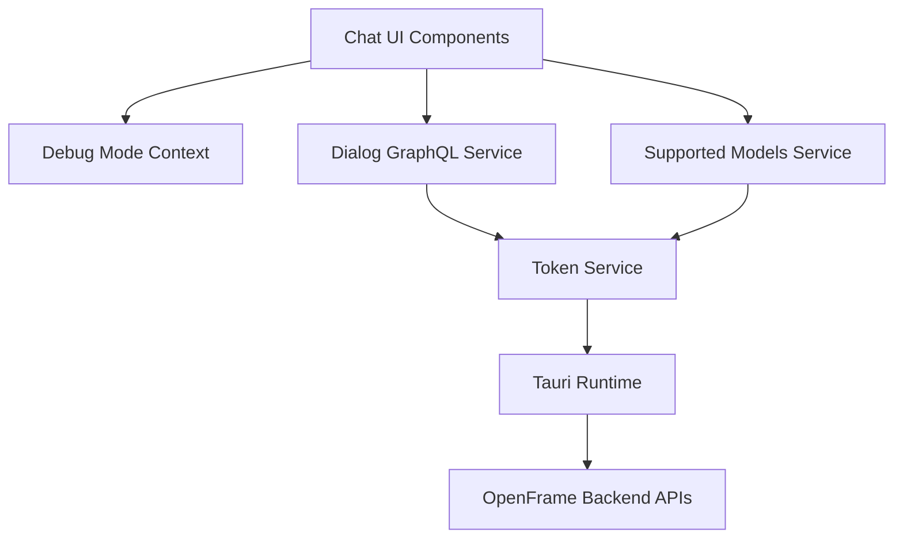
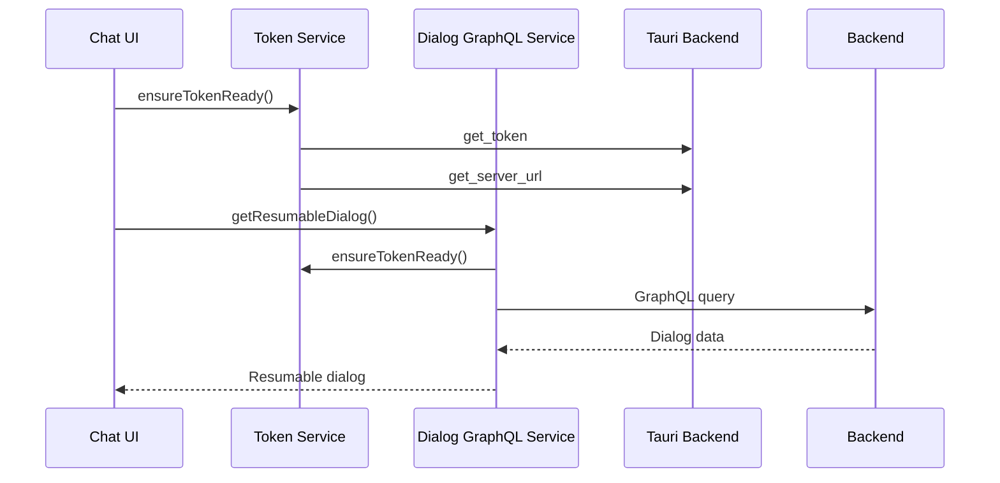

# Frontend Chat Client

## Overview

The **Frontend Chat Client** module provides the client-side infrastructure for OpenFrame's interactive chat experience. It is responsible for:

- Managing authentication tokens and API endpoint discovery in a desktop (Tauri) environment
- Fetching and rendering chat dialogs and messages via GraphQL
- Loading and caching supported AI model metadata for the chat experience
- Exposing runtime debug mode state to the React component tree

This module is designed to run inside the OpenFrame desktop client and acts as the bridge between the user interface and the backend chat APIs exposed through the OpenFrame platform.

---

## Position in the System

The Frontend Chat Client sits at the edge of the system and communicates with multiple backend layers indirectly:

- **Gateway and API services** for authenticated chat and configuration requests
- **Authorization and OAuth services** for token issuance and validation (handled transparently via Tauri and backend)
- **Stream and management services** that ultimately power chat history, AI responses, and tool execution

From the frontend perspective, these backend details are abstracted behind HTTP and GraphQL endpoints.

---

## High-Level Architecture

**Key ideas:**
- UI components never talk directly to Tauri or backend APIs
- All authentication and endpoint resolution flows through the Token Service
- Services are singleton-style utilities reused across the chat client

---

## Core Components

### Debug Mode Context

**Component:** Debug Mode Context Type

The Debug Mode Context provides a global React context that exposes whether the application is running in debug mode.

**Responsibilities:**
- Query the Tauri backend for the current debug mode flag on startup
- Store debug mode state in React context
- Allow any component in the tree to read or update debug mode

**Key behaviors:**
- Uses a Tauri command to retrieve the debug mode value
- Falls back to `false` if the value cannot be retrieved
- Enforces correct usage via a provider hook pattern

This context is typically consumed by UI components that need to enable verbose logging, developer tooling, or experimental features.

---

### Token Service

**Component:** Token Service

The Token Service is the foundational dependency for all network communication in the Frontend Chat Client.

**Responsibilities:**
- Receive authentication tokens from the Tauri backend
- Resolve and normalize the API base URL
- Expose subscription-based updates for token and API URL changes
- Guarantee that a valid token and API URL are available before API calls

**Token sources:**
- Tauri events emitted by the Rust backend
- Direct Tauri command invocation when a token is not yet available
- Optional environment-based initialization for development

**Why this matters:**
All other services depend on the Token Service to ensure that requests are authenticated and correctly routed. This centralization avoids duplicated logic and inconsistent authentication state.

---

### Dialog GraphQL Service

**Component:** Dialog GraphQL Service

The Dialog GraphQL Service handles all chat-related data retrieval using GraphQL.

**Responsibilities:**
- Initialize and manage a GraphQL client instance
- Attach authentication headers dynamically using the Token Service
- Fetch resumable dialogs for restoring chat sessions
- Fetch complete dialog message history with cursor-based pagination

**Key characteristics:**
- Lazily initializes the GraphQL client
- Automatically refreshes headers when the token changes
- Transparently handles multi-page message retrieval

**Data handled:**
- Dialog metadata (status, timestamps, ratings)
- Message history including text, tool execution, approvals, and errors

This service is the primary data source for rendering the chat conversation timeline.

---

### Supported Models Service

**Component:** Supported Models Service

The Supported Models Service loads and caches metadata about AI models available for chat interactions.

**Responsibilities:**
- Fetch supported AI models from the backend configuration endpoint
- Normalize models across providers into a single lookup structure
- Expose helper methods for model display names and capabilities
- Cache results to avoid redundant network requests

**Design notes:**
- Uses lazy loading with an internal promise to prevent duplicate fetches
- Resets cleanly when authentication or environment changes
- Decouples UI components from backend response structure

This service enables the UI to present friendly model names and validate model availability without hardcoding provider details.

---

## Runtime Flow Example

The following diagram illustrates a typical startup and message-loading flow:

---

## Design Principles

- **Single source of truth for authentication**: All token and API URL logic lives in the Token Service
- **Lazy initialization**: Services initialize only when needed to reduce startup overhead
- **Context-driven state**: Cross-cutting concerns like debug mode use React context
- **Backend abstraction**: UI components remain unaware of backend topology and protocols

---

## Summary

The Frontend Chat Client module provides a clean, well-structured foundation for OpenFrame's chat experience. By separating concerns into focused services and contexts, it ensures:

- Reliable authentication handling in a desktop environment
- Efficient and scalable chat data retrieval
- Flexibility to evolve backend APIs without tightly coupling UI code

This module is a critical integration point between the OpenFrame frontend experience and the broader OpenFrame platform ecosystem.