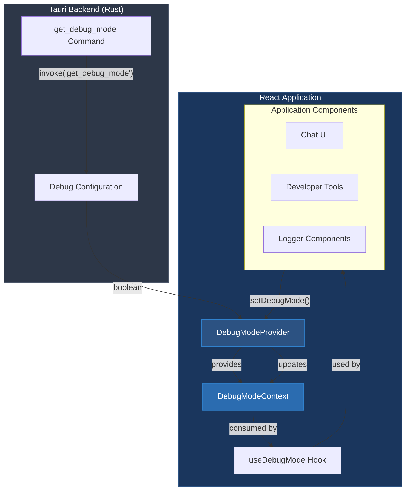
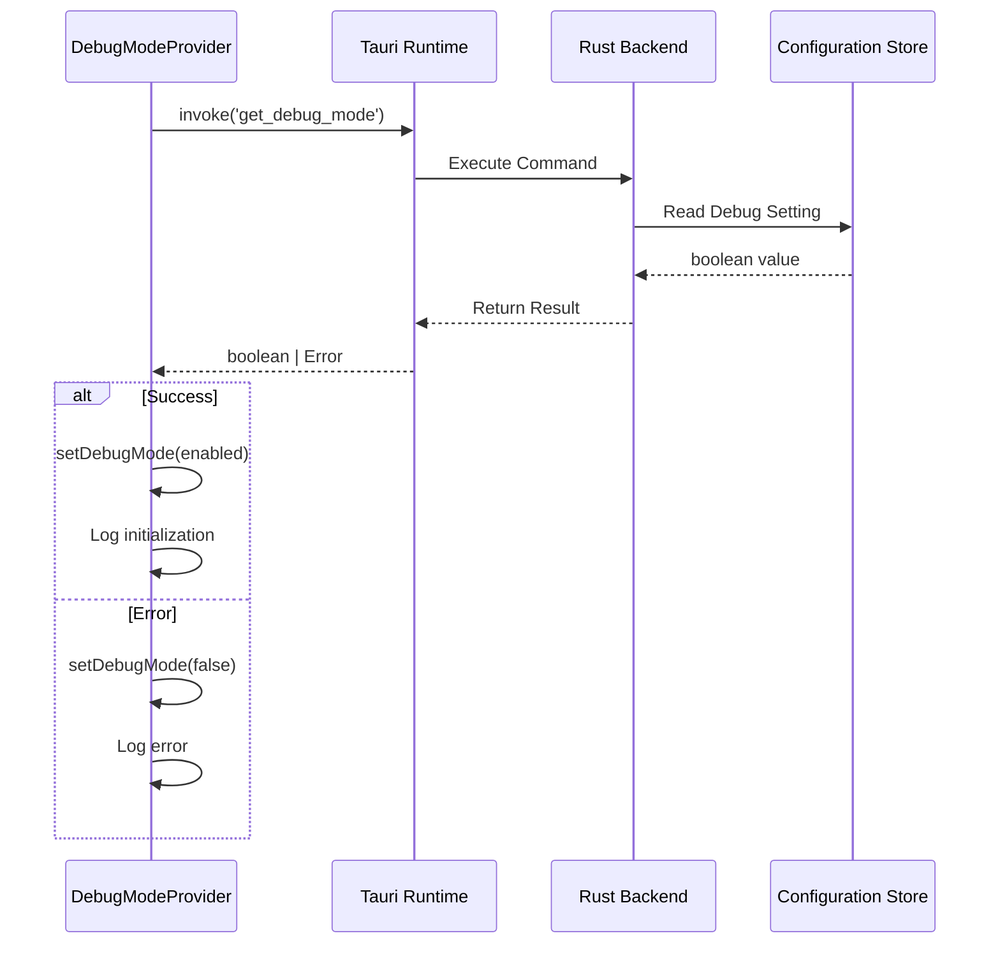
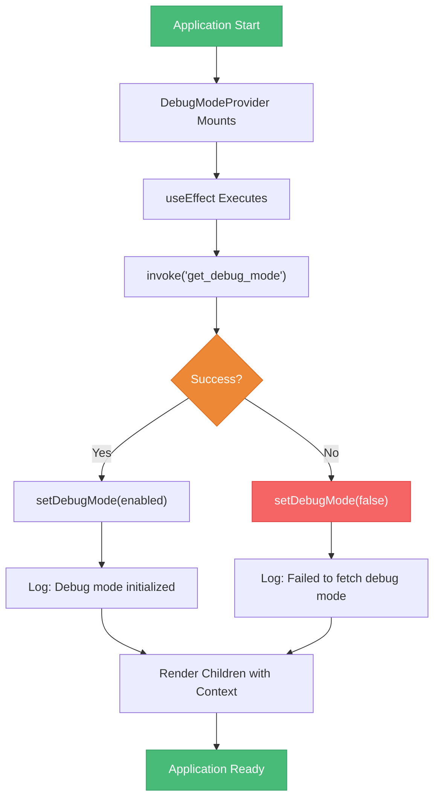
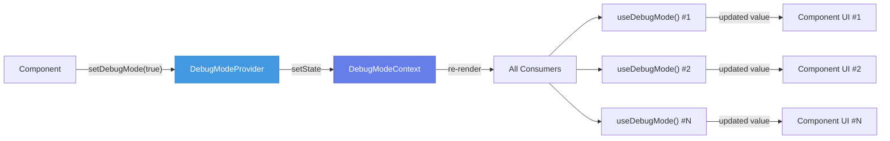
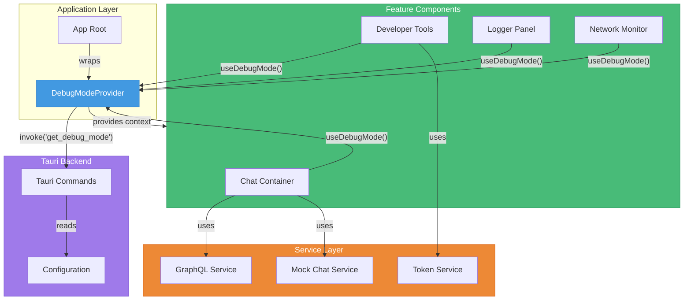

# Frontend Chat Contexts Module

## Overview

The **frontend_chat_contexts** module provides React context providers and hooks for managing global application state in the OpenFrame Chat desktop client. This module is part of the [frontend_chat](frontend_chat.md) system and serves as the state management layer for cross-cutting concerns like debug mode configuration.

**Key Responsibilities:**
- Global state management using React Context API
- Debug mode configuration and persistence
- Integration with Tauri native backend for state synchronization
- Type-safe context consumption through custom hooks

**Related Modules:**
- [frontend_chat_services](frontend_chat_services.md) - Service layer for API communication
- [frontend_core_components](frontend_core_components.md) - Reusable UI components
- [frontend_authentication](frontend_authentication.md) - Authentication state management

---

## Architecture Overview



---

## Core Components

### DebugModeContext

**Purpose:** Provides global debug mode state management across the application.

**Type Definition:**

```typescript
interface DebugModeContextType {
  debugMode: boolean
  setDebugMode: (enabled: boolean) => void
}
```

**Properties:**

| Property | Type | Description |
|----------|------|-------------|
| `debugMode` | `boolean` | Current debug mode state (enabled/disabled) |
| `setDebugMode` | `(enabled: boolean) => void` | Function to update debug mode state |

**Context Creation:**

```typescript
const DebugModeContext = createContext<DebugModeContextType | undefined>(undefined)
```

The context is initialized as `undefined` to enforce usage within the provider boundary, enabling compile-time safety checks.

---

### DebugModeProvider

**Purpose:** React context provider that manages debug mode state and synchronizes with Tauri backend.

**Component Signature:**

```typescript
function DebugModeProvider({ children }: { children: ReactNode }): JSX.Element
```

**Implementation Details:**

```typescript
export function DebugModeProvider({ children }: { children: ReactNode }) {
  const [debugMode, setDebugMode] = useState(false)

  useEffect(() => {
    const fetchDebugMode = async () => {
      try {
        const enabled = await invoke<boolean>('get_debug_mode')
        setDebugMode(enabled)
        console.log('[DebugModeContext] Debug mode initialized:', enabled)
      } catch (error) {
        console.error('[DebugModeContext] Failed to fetch debug mode:', error)
        setDebugMode(false)
      }
    }

    fetchDebugMode()
  }, [])

  return (
    <DebugModeContext.Provider value={{ debugMode, setDebugMode }}>
      {children}
    </DebugModeContext.Provider>
  )
}
```

**Lifecycle:**

1. **Initialization:** On mount, fetches debug mode state from Tauri backend
2. **State Management:** Maintains local React state for debug mode
3. **Error Handling:** Falls back to `false` if backend communication fails
4. **Provider:** Exposes state and setter through context value

**Tauri Integration:**



---

### useDebugMode Hook

**Purpose:** Custom React hook for consuming debug mode context with type safety.

**Hook Signature:**

```typescript
function useDebugMode(): DebugModeContextType
```

**Implementation:**

```typescript
export function useDebugMode() {
  const context = useContext(DebugModeContext)
  if (context === undefined) {
    throw new Error('useDebugMode must be used within a DebugModeProvider')
  }
  return context
}
```

**Usage Pattern:**

```typescript
import { useDebugMode } from '@/contexts/DebugModeContext'

function MyComponent() {
  const { debugMode, setDebugMode } = useDebugMode()
  
  return (
    <div>
      <p>Debug Mode: {debugMode ? 'Enabled' : 'Disabled'}</p>
      <button onClick={() => setDebugMode(!debugMode)}>
        Toggle Debug Mode
      </button>
    </div>
  )
}
```

**Error Handling:**

The hook throws a runtime error if used outside the provider boundary:

```typescript
// ❌ This will throw an error
function App() {
  const { debugMode } = useDebugMode() // Error: must be used within provider
  return <div>{debugMode}</div>
}

// ✅ Correct usage
function App() {
  return (
    <DebugModeProvider>
      <MyComponent /> {/* Can safely use useDebugMode */}
    </DebugModeProvider>
  )
}
```

---

## Data Flow

### State Initialization Flow



### State Update Flow



---

## Integration with Services

### Token Service Integration

The debug mode context works alongside the [TokenService](frontend_chat_services.md#tokenservice) for authentication state:

```typescript
import { useDebugMode } from '@/contexts/DebugModeContext'
import { tokenService } from '@/services/tokenService'

function DebugPanel() {
  const { debugMode } = useDebugMode()
  
  if (!debugMode) return null
  
  return (
    <div>
      <h3>Debug Information</h3>
      <p>Token: {tokenService.getCurrentToken()}</p>
      <p>API URL: {tokenService.getCurrentApiBaseUrl()}</p>
    </div>
  )
}
```

### GraphQL Service Integration

Debug mode can control verbose logging in [DialogGraphQLService](frontend_chat_services.md#dialoggraphqlservice):

```typescript
import { useDebugMode } from '@/contexts/DebugModeContext'
import { dialogGraphQLService } from '@/services/dialogGraphQLService'

function ChatContainer() {
  const { debugMode } = useDebugMode()
  
  useEffect(() => {
    if (debugMode) {
      console.log('[ChatContainer] Fetching resumable dialog...')
    }
    
    dialogGraphQLService.getResumableDialog()
      .then(dialog => {
        if (debugMode) {
          console.log('[ChatContainer] Dialog fetched:', dialog)
        }
      })
  }, [debugMode])
}
```

---

## Usage Examples

### Basic Setup

**Application Root:**

```typescript
import { DebugModeProvider } from '@/contexts/DebugModeContext'
import { ChatApp } from '@/components/ChatApp'

function App() {
  return (
    <DebugModeProvider>
      <ChatApp />
    </DebugModeProvider>
  )
}

export default App
```

### Consuming Debug Mode

**Developer Tools Component:**

```typescript
import { useDebugMode } from '@/contexts/DebugModeContext'

function DeveloperTools() {
  const { debugMode, setDebugMode } = useDebugMode()
  
  return (
    <div className="dev-tools">
      <label>
        <input
          type="checkbox"
          checked={debugMode}
          onChange={(e) => setDebugMode(e.target.checked)}
        />
        Enable Debug Mode
      </label>
      
      {debugMode && (
        <div className="debug-panel">
          <h3>Debug Information</h3>
          <pre>{JSON.stringify(window.performance.memory, null, 2)}</pre>
        </div>
      )}
    </div>
  )
}
```

### Conditional Logging

**Chat Message Component:**

```typescript
import { useDebugMode } from '@/contexts/DebugModeContext'
import { useEffect } from 'react'

function ChatMessage({ message }) {
  const { debugMode } = useDebugMode()
  
  useEffect(() => {
    if (debugMode) {
      console.log('[ChatMessage] Rendering message:', {
        id: message.id,
        type: message.type,
        timestamp: message.timestamp,
        content: message.content.substring(0, 50) + '...'
      })
    }
  }, [message, debugMode])
  
  return (
    <div className="message">
      {message.content}
      {debugMode && (
        <span className="debug-badge">ID: {message.id}</span>
      )}
    </div>
  )
}
```

### Network Request Debugging

**API Client Wrapper:**

```typescript
import { useDebugMode } from '@/contexts/DebugModeContext'
import { tokenService } from '@/services/tokenService'

function useApiClient() {
  const { debugMode } = useDebugMode()
  
  const fetchWithDebug = async (url: string, options?: RequestInit) => {
    if (debugMode) {
      console.log('[API] Request:', { url, options })
    }
    
    const token = tokenService.getCurrentToken()
    const response = await fetch(url, {
      ...options,
      headers: {
        ...options?.headers,
        'Authorization': `Bearer ${token}`
      }
    })
    
    if (debugMode) {
      console.log('[API] Response:', {
        status: response.status,
        statusText: response.statusText,
        headers: Object.fromEntries(response.headers.entries())
      })
    }
    
    return response
  }
  
  return { fetchWithDebug }
}
```

---

## Component Interaction Diagram



---

## Error Handling

### Provider Error Handling

The provider implements graceful degradation when Tauri backend is unavailable:

```typescript
useEffect(() => {
  const fetchDebugMode = async () => {
    try {
      const enabled = await invoke<boolean>('get_debug_mode')
      setDebugMode(enabled)
      console.log('[DebugModeContext] Debug mode initialized:', enabled)
    } catch (error) {
      // Graceful fallback - assume debug mode is disabled
      console.error('[DebugModeContext] Failed to fetch debug mode:', error)
      setDebugMode(false)
    }
  }

  fetchDebugMode()
}, [])
```

**Error Scenarios:**

| Scenario | Behavior | Fallback |
|----------|----------|----------|
| Tauri command not found | Logs error, sets `debugMode = false` | Application continues normally |
| Backend timeout | Logs error, sets `debugMode = false` | Application continues normally |
| Invalid response type | Logs error, sets `debugMode = false` | Application continues normally |
| Provider not mounted | Hook throws error | Developer must fix component tree |

### Hook Error Handling

The `useDebugMode` hook enforces provider boundary:

```typescript
export function useDebugMode() {
  const context = useContext(DebugModeContext)
  if (context === undefined) {
    throw new Error('useDebugMode must be used within a DebugModeProvider')
  }
  return context
}
```

**Error Prevention:**

```typescript
// ❌ BAD: Hook used outside provider
function BadComponent() {
  const { debugMode } = useDebugMode() // Throws error!
  return <div>{debugMode}</div>
}

// ✅ GOOD: Hook used inside provider
function App() {
  return (
    <DebugModeProvider>
      <GoodComponent /> {/* Safe to use hook */}
    </DebugModeProvider>
  )
}

function GoodComponent() {
  const { debugMode } = useDebugMode() // Works correctly
  return <div>{debugMode}</div>
}
```

---

## Testing Considerations

### Unit Testing

**Testing the Provider:**

```typescript
import { render, screen, waitFor } from '@testing-library/react'
import { DebugModeProvider, useDebugMode } from '@/contexts/DebugModeContext'
import { invoke } from '@tauri-apps/api/core'

jest.mock('@tauri-apps/api/core')

describe('DebugModeProvider', () => {
  it('initializes debug mode from Tauri backend', async () => {
    (invoke as jest.Mock).mockResolvedValue(true)
    
    function TestComponent() {
      const { debugMode } = useDebugMode()
      return <div>{debugMode ? 'Enabled' : 'Disabled'}</div>
    }
    
    render(
      <DebugModeProvider>
        <TestComponent />
      </DebugModeProvider>
    )
    
    await waitFor(() => {
      expect(screen.getByText('Enabled')).toBeInTheDocument()
    })
  })
  
  it('falls back to false on error', async () => {
    (invoke as jest.Mock).mockRejectedValue(new Error('Backend error'))
    
    function TestComponent() {
      const { debugMode } = useDebugMode()
      return <div>{debugMode ? 'Enabled' : 'Disabled'}</div>
    }
    
    render(
      <DebugModeProvider>
        <TestComponent />
      </DebugModeProvider>
    )
    
    await waitFor(() => {
      expect(screen.getByText('Disabled')).toBeInTheDocument()
    })
  })
})
```

**Testing the Hook:**

```typescript
import { renderHook } from '@testing-library/react'
import { DebugModeProvider, useDebugMode } from '@/contexts/DebugModeContext'

describe('useDebugMode', () => {
  it('throws error when used outside provider', () => {
    expect(() => {
      renderHook(() => useDebugMode())
    }).toThrow('useDebugMode must be used within a DebugModeProvider')
  })
  
  it('returns context value when used inside provider', () => {
    const wrapper = ({ children }) => (
      <DebugModeProvider>{children}</DebugModeProvider>
    )
    
    const { result } = renderHook(() => useDebugMode(), { wrapper })
    
    expect(result.current).toHaveProperty('debugMode')
    expect(result.current).toHaveProperty('setDebugMode')
  })
})
```

### Integration Testing

**Testing with Services:**

```typescript
import { render, screen, fireEvent } from '@testing-library/react'
import { DebugModeProvider } from '@/contexts/DebugModeContext'
import { tokenService } from '@/services/tokenService'
import { DebugPanel } from '@/components/DebugPanel'

describe('DebugPanel Integration', () => {
  it('displays token information when debug mode is enabled', async () => {
    tokenService.setToken('test-token-123')
    
    render(
      <DebugModeProvider>
        <DebugPanel />
      </DebugModeProvider>
    )
    
    const toggleButton = screen.getByRole('checkbox')
    fireEvent.click(toggleButton)
    
    expect(screen.getByText(/test-token-123/)).toBeInTheDocument()
  })
})
```

---

## Performance Considerations

### Context Re-rendering

The context uses React's built-in optimization for context updates:

```typescript
// Only components that consume the context will re-render
const value = { debugMode, setDebugMode }

return (
  <DebugModeContext.Provider value={value}>
    {children}
  </DebugModeContext.Provider>
)
```

**Optimization Tip:** If the context grows to include more state, consider splitting into multiple contexts:

```typescript
// ❌ Single large context causes unnecessary re-renders
interface AppContextType {
  debugMode: boolean
  theme: string
  locale: string
  user: User
  // ... many more properties
}

// ✅ Split into focused contexts
interface DebugModeContextType {
  debugMode: boolean
  setDebugMode: (enabled: boolean) => void
}

interface ThemeContextType {
  theme: string
  setTheme: (theme: string) => void
}
```

### Memoization

For expensive computations based on debug mode:

```typescript
import { useDebugMode } from '@/contexts/DebugModeContext'
import { useMemo } from 'react'

function PerformanceMonitor() {
  const { debugMode } = useDebugMode()
  
  const metrics = useMemo(() => {
    if (!debugMode) return null
    
    // Expensive computation only when debug mode is enabled
    return {
      memory: window.performance.memory,
      timing: window.performance.timing,
      navigation: window.performance.navigation
    }
  }, [debugMode])
  
  if (!metrics) return null
  
  return <div>{JSON.stringify(metrics, null, 2)}</div>
}
```

---

## Future Enhancements

### Planned Features

1. **Persistent Debug Mode:**
   - Store debug mode preference in local storage
   - Sync with Tauri backend configuration file
   - Persist across application restarts

2. **Debug Levels:**
   - Extend from boolean to enum: `OFF`, `INFO`, `DEBUG`, `TRACE`
   - Granular control over logging verbosity
   - Per-module debug level configuration

3. **Remote Debug Control:**
   - Enable/disable debug mode via API endpoint
   - Support for remote debugging sessions
   - Integration with monitoring tools

4. **Debug Event Streaming:**
   - Real-time debug event broadcasting
   - WebSocket connection for live debugging
   - Integration with external debugging tools

### Extensibility Pattern

**Adding New Context Providers:**

```typescript
// Follow the same pattern for new contexts
interface FeatureFlagContextType {
  flags: Record<string, boolean>
  isEnabled: (flag: string) => boolean
  setFlag: (flag: string, enabled: boolean) => void
}

const FeatureFlagContext = createContext<FeatureFlagContextType | undefined>(undefined)

export function FeatureFlagProvider({ children }: { children: ReactNode }) {
  const [flags, setFlags] = useState<Record<string, boolean>>({})
  
  useEffect(() => {
    // Fetch from Tauri backend
    invoke<Record<string, boolean>>('get_feature_flags')
      .then(setFlags)
      .catch(console.error)
  }, [])
  
  const isEnabled = (flag: string) => flags[flag] ?? false
  
  const setFlag = (flag: string, enabled: boolean) => {
    setFlags(prev => ({ ...prev, [flag]: enabled }))
  }
  
  return (
    <FeatureFlagContext.Provider value={{ flags, isEnabled, setFlag }}>
      {children}
    </FeatureFlagContext.Provider>
  )
}

export function useFeatureFlags() {
  const context = useContext(FeatureFlagContext)
  if (context === undefined) {
    throw new Error('useFeatureFlags must be used within a FeatureFlagProvider')
  }
  return context
}
```

---

## Related Documentation

- **[Frontend Chat Services](frontend_chat_services.md)** - Service layer for API communication
- **[Frontend Chat](frontend_chat.md)** - Parent module overview
- **[Frontend Core Components](frontend_core_components.md)** - Reusable UI components
- **[Frontend Authentication](frontend_authentication.md)** - Authentication state management
- **[Security Core](security_core.md)** - Security primitives and JWT handling

---

## Best Practices

### Context Provider Organization

```typescript
// ✅ GOOD: Compose multiple providers at app root
function App() {
  return (
    <DebugModeProvider>
      <ThemeProvider>
        <AuthProvider>
          <Router>
            <AppRoutes />
          </Router>
        </AuthProvider>
      </ThemeProvider>
    </DebugModeProvider>
  )
}

// ❌ BAD: Deeply nested providers scattered throughout app
function SomeComponent() {
  return (
    <DebugModeProvider> {/* Should be at root */}
      <div>...</div>
    </DebugModeProvider>
  )
}
```

### Hook Usage

```typescript
// ✅ GOOD: Use hook at component level
function MyComponent() {
  const { debugMode } = useDebugMode()
  return <div>{debugMode && <DebugInfo />}</div>
}

// ❌ BAD: Conditional hook usage
function MyComponent({ showDebug }) {
  if (showDebug) {
    const { debugMode } = useDebugMode() // Violates Rules of Hooks
    return <div>{debugMode && <DebugInfo />}</div>
  }
  return null
}
```

### Type Safety

```typescript
// ✅ GOOD: Explicit type annotations
const DebugModeContext = createContext<DebugModeContextType | undefined>(undefined)

// ❌ BAD: Implicit any types
const DebugModeContext = createContext(undefined)
```

---

## Troubleshooting

### Common Issues

**Issue: "useDebugMode must be used within a DebugModeProvider"**

**Cause:** Hook is called outside the provider boundary.

**Solution:**
```typescript
// Ensure provider wraps all components using the hook
function App() {
  return (
    <DebugModeProvider>
      <YourComponent /> {/* Now safe to use useDebugMode */}
    </DebugModeProvider>
  )
}
```

**Issue: Debug mode always returns `false`**

**Cause:** Tauri backend command failing or not implemented.

**Solution:**
1. Check Tauri backend logs for errors
2. Verify `get_debug_mode` command is registered in Rust
3. Check browser console for error messages from provider

**Issue: Debug mode state not persisting**

**Cause:** State is only stored in React memory, not persisted.

**Solution:**
```typescript
// Add persistence with localStorage
const [debugMode, setDebugMode] = useState(() => {
  const stored = localStorage.getItem('debugMode')
  return stored ? JSON.parse(stored) : false
})

useEffect(() => {
  localStorage.setItem('debugMode', JSON.stringify(debugMode))
}, [debugMode])
```

---

## Summary

The **frontend_chat_contexts** module provides a robust, type-safe foundation for global state management in the OpenFrame Chat desktop application. By leveraging React Context API and Tauri integration, it enables seamless synchronization between frontend state and native backend configuration while maintaining excellent developer experience through custom hooks and comprehensive error handling.

**Key Takeaways:**
- ✅ Type-safe context consumption with custom hooks
- ✅ Graceful error handling and fallback behavior
- ✅ Integration with Tauri native backend
- ✅ Extensible pattern for additional contexts
- ✅ Performance-optimized with minimal re-renders

For questions or contributions, join the [OpenMSP Slack Community](https://join.slack.com/t/openmsp/shared_invite/zt-36bl7mx0h-3~U2nFH6nqHqoTPXMaHEHA).
