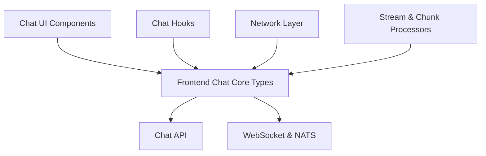
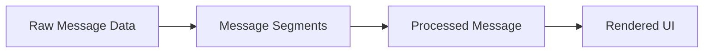
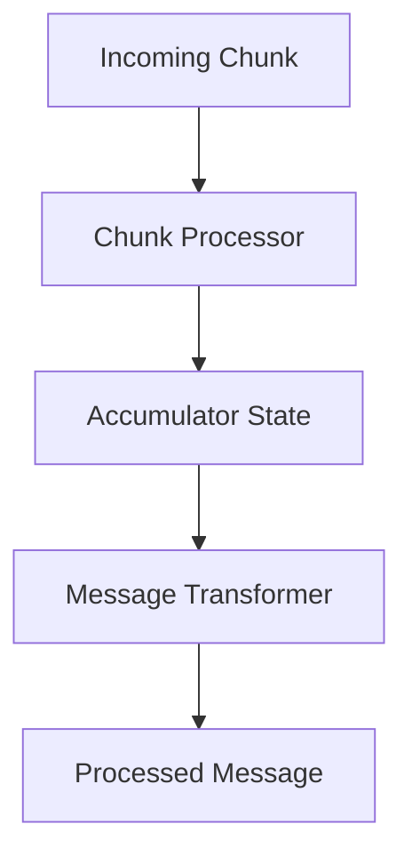

# Frontend Chat Core Types

## Overview

The **Frontend Chat Core Types** module defines the foundational TypeScript types that power the OpenFrame and Flamingo chat user experience on the frontend. Rather than containing runtime logic, this module acts as a **shared contract layer** between:

- Chat UI components
- Network and streaming layers (HTTP, WebSocket, NATS)
- Message processing and transformation pipelines
- Backend-facing API integrations

By centralizing these definitions, the module ensures **type safety, consistency, and extensibility** across all chat-related frontend features, including real-time streaming responses, tool execution feedback, and approval workflows.

This module is consumed heavily by:
- Chat UI components
- Chat hooks and services
- Realtime streaming processors
- API and WebSocket clients

---

## High-Level Responsibilities

- Define API request and response contracts for chat operations
- Standardize message, chunk, and segment structures
- Provide strongly typed props for chat UI components
- Describe network, buffering, and streaming abstractions
- Enable complex workflows such as approvals and tool execution

---

## Architecture Overview

The Frontend Chat Core Types module sits at the center of the frontend chat stack, acting as a schema layer that connects UI, network transport, and processing logic.

---

## Module Structure

The module is organized into five conceptual groups:

1. **API Types** – Contracts for HTTP and GraphQL chat APIs
2. **Component Types** – Props and refs for React chat components
3. **Message Types** – Message payloads, segments, and processed forms
4. **Network Types** – WebSocket, NATS, and pagination abstractions
5. **Processing Types** – Streaming, buffering, and transformation contracts

Each group is described below.

---

## API Types

API types define the request and response shapes used when interacting with backend chat endpoints.

### Key Responsibilities

- Sending user messages to the backend
- Creating and listing dialogs
- Updating chat settings
- Handling approval actions

### Core Types

- **ChatAPIRequest / ChatAPIResponse** – Send messages and receive acknowledgements
- **DialogCreateRequest / DialogCreateResponse** – Create new chat dialogs
- **DialogListRequest / DialogListResponse** – Paginated dialog listing
- **ApprovalRequest / ApprovalResponse** – Approve or reject tool or command actions
- **UpdateSettingsRequest / UpdateSettingsResponse** – Persist chat UI preferences

### Design Notes

- Responses consistently include a `success` flag and optional `error`
- Dialog list responses are paginated and sortable
- Settings updates are partial and non-destructive

---

## Component Types

Component types define the props and refs used by React-based chat UI components. These types ensure consistent behavior and styling across different chat views.

### Key Areas

#### Container and Layout
- **ChatContainerProps** – Root chat layout wrapper
- **ChatSidebarProps** – Dialog list and navigation
- **DialogListItemProps** – Individual dialog entries

#### Messaging
- **ChatMessageEnhancedProps** – Rich message rendering with segments
- **ChatMessageListProps / ChatMessageListRef** – Scrollable message history
- **ChatTypingIndicatorProps** – Typing feedback UI

#### Input and Actions
- **ChatInputProps / ChatInputRef** – Message input handling
- **ChatQuickActionProps** – Suggested or shortcut actions

#### Metadata and Status
- **ChatHeaderProps** – User and connection context
- **ConnectionIndicatorProps** – Realtime connection state
- **ModelDisplayProps** – AI model and provider metadata

#### Advanced Interactions
- **ApprovalRequestMessageProps** – Approval UI for sensitive actions
- **ToolExecutionDisplayProps** – Tool execution progress and results

---

## Message Types

Message types describe how chat content is represented, transmitted, and rendered.

### Message Lifecycle

Messages flow through multiple representations:

### Core Concepts

#### Message Data (Backend-Oriented)

- **TextMessageData** – Plain text output
- **ExecutingToolMessageData / ExecutedToolMessageData** – Tool lifecycle
- **ApprovalRequestMessageData / ApprovalResultMessageData** – Approval workflows
- **AIMetadataMessageData** – Model and provider context
- **ErrorMessageData** – Error propagation

#### Message Segments (UI-Oriented)

- Text segments
- Tool execution segments
- Approval request segments with callbacks and status

Segments allow **incremental rendering** during streaming responses.

#### Processed Messages

Processed messages normalize content into a UI-friendly format:

- Unified role model (`user`, `assistant`, `error`)
- Timestamp normalization
- Optional avatars and assistant metadata

---

## Network Types

Network types define how the frontend communicates with real-time and request-based backends.

### Supported Transports

- HTTP APIs
- WebSockets
- NATS over WebSocket

### Key Types

- **ChunkData** – Atomic units of streamed chat output
- **NatsMessageType / NatsConnectionStatus** – Realtime messaging semantics
- **WebSocketConfig / WebSocketMessage** – WebSocket lifecycle configuration
- **NetworkResponse / PaginatedResponse** – Standardized API responses

### Design Considerations

- Chunk data is intentionally flexible to support evolving backend schemas
- Network configuration constants are centralized for consistency
- Pagination is standardized across list endpoints

---

## Processing Types

Processing types describe how streamed chunks are parsed, buffered, transformed, and accumulated into messages.

### Streaming Pipeline

### Key Abstractions

#### Chunk Processing

- **ChunkProcessor** – Converts raw chunks into semantic actions
- **ParsedChunkAction** – Normalized representation of chunk intent

#### Accumulation

- Maintains partial text buffers
- Tracks executing tools and pending approvals
- Supports reconnection and resume scenarios

#### Transformation

- **MessageTransformer** – Converts accumulated state into display messages
- **TransformationOptions** – Control merging, formatting, and metadata inclusion

#### Stream Control

- **StreamProcessor** – Start, stop, pause, resume streaming
- **StreamState** – Introspection into processing health and progress

#### Buffer Management

- **BufferManager** – Backpressure and batching control
- **BufferOptions** – Overflow handling and flush strategies

---

## How This Module Fits Into the System

The Frontend Chat Core Types module acts as the **schema backbone** of the chat frontend:

- UI components rely on it for strongly typed props
- Hooks and services use it to coordinate streaming and API calls
- Network layers depend on it for safe message handling
- Processing pipelines use it to maintain deterministic state transitions

Because it contains **no runtime logic**, it can evolve independently while providing strong guarantees to all consumers.

---

## Summary

The **Frontend Chat Core Types** module:

- Centralizes all chat-related frontend type definitions
- Enables complex real-time chat workflows with strong typing
- Bridges UI, network, and processing layers safely
- Serves as a stable contract between frontend and backend systems

This module is critical for maintaining scalability, correctness, and developer velocity across the OpenFrame chat experience.
