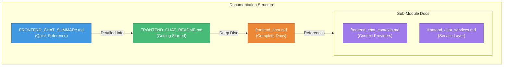

# Frontend Chat Module - Complete Documentation Index

## 📚 Documentation Overview

This index provides a complete guide to the **Frontend Chat Module** documentation. The module is a standalone Tauri-based desktop application that provides a dedicated chat interface for the OpenFrame platform.

---

## 🚀 Getting Started

### New to Frontend Chat?
Start here to understand the module:

1. **[Summary](./FRONTEND_CHAT_SUMMARY.md)** - Quick overview and key features
2. **[README](./FRONTEND_CHAT_README.md)** - Getting started guide with setup instructions
3. **[Complete Documentation](./frontend_chat.md)** - Full module documentation

### Quick Navigation

| Document | Purpose | Audience |
|----------|---------|----------|
| [FRONTEND_CHAT_SUMMARY.md](./FRONTEND_CHAT_SUMMARY.md) | Quick reference and overview | All users |
| [FRONTEND_CHAT_README.md](./FRONTEND_CHAT_README.md) | Setup and API reference | Developers |
| [frontend_chat.md](./frontend_chat.md) | Complete architecture and design | Architects, Senior Devs |
| [frontend_chat_contexts.md](./frontend_chat_contexts.md) | Context providers details | Frontend Developers |
| [frontend_chat_services.md](./frontend_chat_services.md) | Service layer implementation | Backend/Frontend Devs |

---

## 📖 Core Documentation

### Main Module Documentation

#### [frontend_chat.md](./frontend_chat.md)
**Complete Frontend Chat Module Documentation**

Comprehensive documentation covering:
- Module overview and purpose
- Architecture with detailed diagrams
- Component structure and relationships
- Data flow and integration points
- Configuration and deployment
- Development guide and best practices
- Security considerations
- Error handling strategies
- Performance optimization
- Future enhancements

**Recommended for**: System architects, senior developers, technical leads

---

### Sub-Module Documentation

#### [frontend_chat_contexts.md](./frontend_chat_contexts.md)
**Context Management Sub-Module**

Detailed documentation for React context providers:
- **DebugModeContext**: Debug mode state management
- Tauri backend integration
- Context provider patterns
- Custom hooks usage
- State synchronization

**Key Topics**:
- React Context API implementation
- Tauri event system integration
- Debug mode configuration
- Global state management patterns

**Recommended for**: Frontend developers working with React contexts

---

#### [frontend_chat_services.md](./frontend_chat_services.md)
**Service Layer Sub-Module**

Comprehensive service layer documentation:
- **TokenService**: Authentication token management
- **DialogGraphQLService**: GraphQL client for chat operations
- **SupportedModelsService**: AI model configuration
- **MockChatService**: Development and testing support

**Key Topics**:
- Token lifecycle management
- GraphQL query patterns
- API client implementation
- Mock service strategies
- Error handling and retry logic

**Recommended for**: Backend and frontend developers, API integrators

---

## 🎯 Quick Reference Guides

### [FRONTEND_CHAT_README.md](./FRONTEND_CHAT_README.md)
**Documentation Index and Quick Start**

Your go-to guide for:
- Module structure overview
- Quick links to all documentation
- Architecture diagrams
- Component overview tables
- Integration points summary
- Getting started instructions
- Configuration examples
- API reference
- Testing guide
- Troubleshooting tips
- Performance optimization
- Security best practices

**Recommended for**: All developers, especially those new to the module

---

### [FRONTEND_CHAT_SUMMARY.md](./FRONTEND_CHAT_SUMMARY.md)
**Quick Reference Summary**

One-page summary including:
- Key characteristics table
- Core components list
- Architecture highlights
- Key features checklist
- Integration points
- Data flow diagrams
- Technology stack
- Configuration snippets
- Security features
- API quick reference

**Recommended for**: Quick lookups, presentations, onboarding

---

## 🏗️ Architecture Documentation

### System Architecture

### Component Architecture

Detailed in [frontend_chat.md](./frontend_chat.md#architecture-overview):
- Tauri Runtime Layer (Rust)
- Service Layer (TypeScript)
- Context Layer (React)
- UI Layer (React Components)

### Data Flow

Detailed in [frontend_chat.md](./frontend_chat.md#data-flow):
- Message sending flow
- Dialog history loading
- Token update flow
- Tool execution flow

---

## 🔗 Integration Documentation

### Backend Service Integration

| Service | Documentation | Integration Details |
|---------|---------------|---------------------|
| **Authorization Service** | [authorization_service.md](./authorization_service.md) | JWT token generation and validation |
| **Chat API (GraphQL)** | [api_service_graphql_datafetchers.md](./api_service_graphql_datafetchers.md) | Dialog and message management |
| **External API** | [external_api.md](./external_api.md) | AI model configuration |
| **Gateway Service** | [gateway_service.md](./gateway_service.md) | API routing and WebSocket |

### Frontend Module Integration

| Module | Documentation | Integration Details |
|--------|---------------|---------------------|
| **Frontend Core Components** | [frontend_core_components.md](./frontend_core_components.md) | Shared UI components |
| **Frontend Main** | [frontend_main.md](./frontend_main.md) | Web application integration |
| **Frontend Mingo AI** | [frontend_mingo_ai.md](./frontend_mingo_ai.md) | AI assistant integration |
| **Frontend Authentication** | [frontend_authentication.md](./frontend_authentication.md) | Authentication flows |

---

## 📋 Component Reference

### Context Providers

| Component | File | Documentation |
|-----------|------|---------------|
| **DebugModeContext** | `contexts/DebugModeContext.tsx` | [frontend_chat_contexts.md](./frontend_chat_contexts.md#debugmodecontext) |

### Services

| Service | File | Documentation |
|---------|------|---------------|
| **TokenService** | `services/tokenService.ts` | [frontend_chat_services.md](./frontend_chat_services.md#tokenservice) |
| **DialogGraphQLService** | `services/dialogGraphQLService.ts` | [frontend_chat_services.md](./frontend_chat_services.md#dialoggraphqlservice) |
| **SupportedModelsService** | `services/supportedModelsService.ts` | [frontend_chat_services.md](./frontend_chat_services.md#supportedmodelsservice) |
| **MockChatService** | `services/mockChatService.ts` | [frontend_chat_services.md](./frontend_chat_services.md#mockchatservice) |

---

## 🛠️ Developer Guides

### Setup and Configuration

**Location**: [FRONTEND_CHAT_README.md - Getting Started](./FRONTEND_CHAT_README.md#getting-started)

Topics covered:
- Prerequisites
- Development setup
- Environment variables
- Tauri configuration
- Building for production

### API Reference

**Location**: [FRONTEND_CHAT_README.md - API Reference](./FRONTEND_CHAT_README.md#api-reference)

Complete API documentation for:
- TokenService methods
- DialogGraphQLService methods
- SupportedModelsService methods
- MockChatService methods

### Testing Guide

**Location**: [FRONTEND_CHAT_README.md - Testing](./FRONTEND_CHAT_README.md#testing)

Covers:
- Unit testing
- Integration testing
- E2E testing with Tauri
- Manual testing with mock service

### Troubleshooting

**Location**: [FRONTEND_CHAT_README.md - Troubleshooting](./FRONTEND_CHAT_README.md#troubleshooting)

Common issues and solutions:
- Token not available
- GraphQL connection failed
- Messages not loading
- Performance issues

---

## 🔐 Security Documentation

### Security Best Practices

**Location**: [FRONTEND_CHAT_README.md - Security Best Practices](./FRONTEND_CHAT_README.md#security-best-practices)

Topics:
- Token security
- API communication security
- Debug mode security
- Data protection

### Security Considerations

**Location**: [frontend_chat.md - Security Considerations](./frontend_chat.md#security-considerations)

Detailed coverage:
- Token management
- API communication
- Debug mode controls
- Secure storage patterns

---

## 📊 Performance Documentation

### Performance Optimization

**Location**: [FRONTEND_CHAT_README.md - Performance Optimization](./FRONTEND_CHAT_README.md#performance-optimization)

Optimization strategies:
- Message pagination
- Token caching
- Model metadata caching
- Virtual scrolling recommendations

### Performance Considerations

**Location**: [frontend_chat.md - Performance Considerations](./frontend_chat.md#performance-considerations)

Technical details:
- Message pagination implementation
- Token caching mechanism
- Model metadata caching
- Optimization recommendations

---

## 🚀 Deployment Documentation

### Building for Production

**Location**: [FRONTEND_CHAT_README.md - Building for Production](./FRONTEND_CHAT_README.md#building-for-production)

Build instructions for:
- Windows (x86_64-pc-windows-msvc)
- macOS (x86_64-apple-darwin)
- Linux (x86_64-unknown-linux-gnu)

### Configuration

**Location**: [frontend_chat.md - Configuration](./frontend_chat.md#configuration)

Configuration topics:
- Environment variables
- Debug mode
- Tauri configuration
- Production settings

---

## 📈 Future Roadmap

### Planned Features

**Location**: [frontend_chat.md - Future Enhancements](./frontend_chat.md#future-enhancements)

Upcoming features:
- Offline support
- Message search
- File attachments
- Voice input
- Desktop notifications
- Multi-dialog support
- Message reactions
- Rich text formatting

### Technical Improvements

**Location**: [frontend_chat.md - Future Enhancements](./frontend_chat.md#future-enhancements)

Technical enhancements:
- Virtual scrolling
- Message caching
- Optimistic updates
- WebSocket support
- Error recovery
- Analytics integration

---

## 🎓 Learning Path

### For New Developers

1. **Start**: [FRONTEND_CHAT_SUMMARY.md](./FRONTEND_CHAT_SUMMARY.md) - Get overview
2. **Setup**: [FRONTEND_CHAT_README.md](./FRONTEND_CHAT_README.md) - Set up environment
3. **Learn**: [frontend_chat.md](./frontend_chat.md) - Understand architecture
4. **Explore**: [frontend_chat_contexts.md](./frontend_chat_contexts.md) - Study contexts
5. **Deep Dive**: [frontend_chat_services.md](./frontend_chat_services.md) - Master services

### For Frontend Developers

1. **Context Patterns**: [frontend_chat_contexts.md](./frontend_chat_contexts.md)
2. **Service Integration**: [frontend_chat_services.md](./frontend_chat_services.md)
3. **API Reference**: [FRONTEND_CHAT_README.md - API Reference](./FRONTEND_CHAT_README.md#api-reference)
4. **Testing**: [FRONTEND_CHAT_README.md - Testing](./FRONTEND_CHAT_README.md#testing)

### For Backend Developers

1. **Integration Points**: [frontend_chat.md - Integration Points](./frontend_chat.md#integration-points)
2. **Service Layer**: [frontend_chat_services.md](./frontend_chat_services.md)
3. **API Communication**: [frontend_chat_services.md - DialogGraphQLService](./frontend_chat_services.md#dialoggraphqlservice)
4. **Security**: [frontend_chat.md - Security Considerations](./frontend_chat.md#security-considerations)

### For Architects

1. **Architecture**: [frontend_chat.md - Architecture Overview](./frontend_chat.md#architecture-overview)
2. **Data Flow**: [frontend_chat.md - Data Flow](./frontend_chat.md#data-flow)
3. **Integration**: [frontend_chat.md - Integration Points](./frontend_chat.md#integration-points)
4. **Performance**: [frontend_chat.md - Performance Considerations](./frontend_chat.md#performance-considerations)

---

## 🔍 Search Guide

### Find Information By Topic

| Topic | Primary Location | Additional References |
|-------|------------------|----------------------|
| **Architecture** | [frontend_chat.md](./frontend_chat.md#architecture-overview) | [FRONTEND_CHAT_README.md](./FRONTEND_CHAT_README.md#architecture-diagram) |
| **Setup** | [FRONTEND_CHAT_README.md](./FRONTEND_CHAT_README.md#getting-started) | [frontend_chat.md](./frontend_chat.md#development-guide) |
| **API Reference** | [FRONTEND_CHAT_README.md](./FRONTEND_CHAT_README.md#api-reference) | [frontend_chat_services.md](./frontend_chat_services.md) |
| **Security** | [frontend_chat.md](./frontend_chat.md#security-considerations) | [FRONTEND_CHAT_README.md](./FRONTEND_CHAT_README.md#security-best-practices) |
| **Testing** | [FRONTEND_CHAT_README.md](./FRONTEND_CHAT_README.md#testing) | [frontend_chat.md](./frontend_chat.md#development-guide) |
| **Performance** | [frontend_chat.md](./frontend_chat.md#performance-considerations) | [FRONTEND_CHAT_README.md](./FRONTEND_CHAT_README.md#performance-optimization) |
| **Troubleshooting** | [FRONTEND_CHAT_README.md](./FRONTEND_CHAT_README.md#troubleshooting) | [frontend_chat.md](./frontend_chat.md#error-handling) |
| **Integration** | [frontend_chat.md](./frontend_chat.md#integration-points) | [FRONTEND_CHAT_README.md](./FRONTEND_CHAT_README.md#integration-points) |

---

## 📞 Support and Community

### Getting Help

For questions, issues, or contributions:

- **OpenMSP Slack Community**: [Join here](https://join.slack.com/t/openmsp/shared_invite/zt-36bl7mx0h-3~U2nFH6nqHqoTPXMaHEHA)
- **Website**: [https://www.openmsp.ai/](https://www.openmsp.ai/)
- **OpenFrame Platform**: [https://openframe.ai](https://openframe.ai)
- **Flamingo Platform**: [https://flamingo.run](https://flamingo.run)

**Important**: We manage all discussions and issues through our OpenMSP Slack community, not GitHub Issues.

### Contributing

See [FRONTEND_CHAT_README.md - Contributing](./FRONTEND_CHAT_README.md#contributing) for:
- Code style guidelines
- Pull request process
- Reporting issues
- Community guidelines

---

## 📝 Documentation Maintenance

### Last Updated
- **Date**: 2024
- **Version**: 1.0.0
- **Maintainers**: OpenFrame Team

### Documentation Status

| Document | Status | Last Review |
|----------|--------|-------------|
| frontend_chat.md | ✅ Complete | 2024 |
| frontend_chat_contexts.md | ✅ Complete | 2024 |
| frontend_chat_services.md | ✅ Complete | 2024 |
| FRONTEND_CHAT_README.md | ✅ Complete | 2024 |
| FRONTEND_CHAT_SUMMARY.md | ✅ Complete | 2024 |
| frontend_chat_index.md | ✅ Complete | 2024 |

---

## 🎯 Quick Links Summary

### Essential Documents
- 📄 [Complete Documentation](./frontend_chat.md)
- 📚 [README & Getting Started](./FRONTEND_CHAT_README.md)
- 📋 [Quick Summary](./FRONTEND_CHAT_SUMMARY.md)

### Sub-Modules
- 🎨 [Context Providers](./frontend_chat_contexts.md)
- ⚙️ [Service Layer](./frontend_chat_services.md)

### Related Modules
- 🌐 [Frontend Main](./frontend_main.md)
- 🧩 [Frontend Core Components](./frontend_core_components.md)
- 🤖 [Frontend Mingo AI](./frontend_mingo_ai.md)
- 🔐 [Authorization Service](./authorization_service.md)
- 📡 [API Service GraphQL](./api_service_graphql_datafetchers.md)

---

**This index is your complete guide to the Frontend Chat Module documentation. Use it to navigate to the specific information you need.**
