# Frontend Chat Services Module

## Overview

The **Frontend Chat Services** module provides the core service layer for the OpenFrame Chat client application. It manages authentication tokens, GraphQL communication with the backend chat service, AI model configuration, and mock chat functionality for development and testing. This module acts as the bridge between the Tauri-based desktop application and the OpenFrame backend services.

**Key Responsibilities:**
- **Token Management**: Secure handling of authentication tokens from Tauri runtime
- **GraphQL Communication**: Dialog and message retrieval via GraphQL API
- **Model Configuration**: Dynamic loading and management of supported AI models
- **Mock Services**: Development and testing support with simulated chat responses

**Related Modules:**
- [Frontend Chat](./frontend_chat.md) - Parent module containing contexts and UI components
- [Frontend Chat Contexts](./frontend_chat_contexts.md) - React contexts for state management
- [Frontend API Clients](./frontend_api_clients.md) - REST API client implementations
- [API Service GraphQL DataFetchers](./api_service_graphql_datafetchers.md) - Backend GraphQL resolvers

---

## Architecture Overview

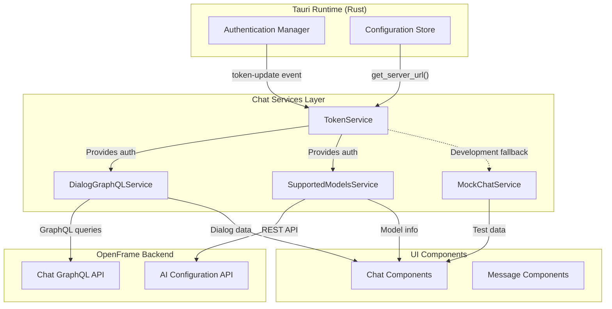

---

## Core Components

### 1. TokenService

**Purpose**: Manages authentication tokens and API base URLs, bridging Tauri runtime and frontend services.

**Key Features:**
- Listens for token updates from Tauri events
- Requests tokens via Tauri commands
- Manages API base URL configuration
- Provides subscription mechanism for token/URL changes
- Environment variable fallback for development

**Architecture:**

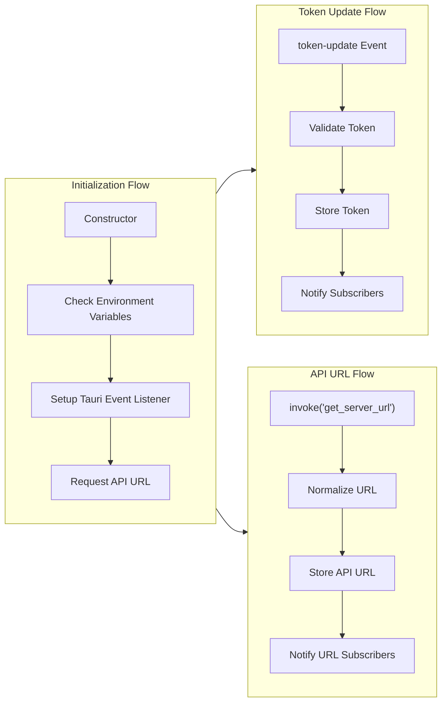

**Token Management:**

```typescript
class TokenService {
  private currentToken: string | null = null
  private currentApiBaseUrl: string | null = null
  private listeners: Set<(token: string) => void> = new Set()
  private apiUrlListeners: Set<(apiUrl: string) => void> = new Set()

  // Subscribe to token updates
  onTokenUpdate(callback: (token: string) => void): () => void

  // Subscribe to API URL updates
  onApiUrlUpdate(callback: (apiUrl: string) => void): () => void

  // Ensure token and API URL are ready
  async ensureTokenReady(): Promise<void>
}
```

**Tauri Integration:**

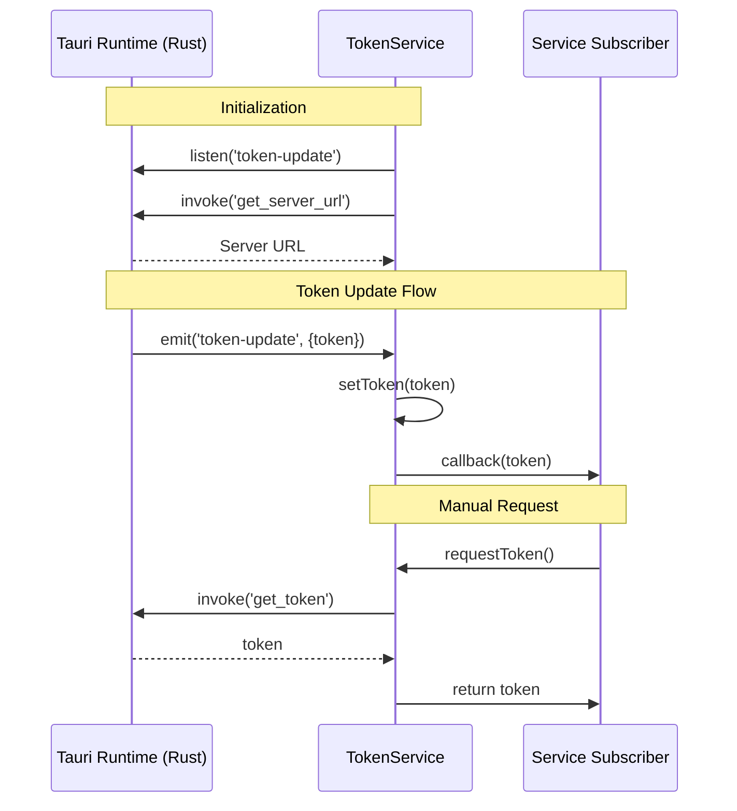

**Environment Variable Support:**

```typescript
// Development fallback configuration
private initFromEnv() {
  const token = import.meta.env.VITE_TOKEN as string | undefined
  const serverUrl = import.meta.env.VITE_SERVER_URL as string | undefined

  if (serverUrl && !this.currentApiBaseUrl) {
    this.setApiBaseUrl(this.normalizeApiUrl(serverUrl))
  }
  if (token && !this.currentToken) {
    this.setToken(token)
  }
}
```

**URL Normalization:**

```typescript
// Ensures URLs have proper protocol
private normalizeApiUrl(serverUrl: string): string {
  const trimmed = serverUrl.trim()
  return trimmed.startsWith('http://') || trimmed.startsWith('https://') 
    ? trimmed 
    : `https://${trimmed}`
}
```

---

### 2. DialogGraphQLService

**Purpose**: Provides GraphQL-based communication with the backend chat service for dialog and message management.

**Key Features:**
- Lazy GraphQL client initialization
- Automatic token injection
- Resumable dialog retrieval
- Paginated message fetching with automatic pagination
- Type-safe GraphQL queries

**Architecture:**

```mermaid
flowchart TD
    subgraph ClientInit["Client Initialization"]
        CheckClient["Check Existing Client"]
        GetToken["Get Token from TokenService"]
        GetURL["Get API URL from TokenService"]
        CreateClient["Create GraphQLClient"]
        SetHeaders["Set Authorization Headers"]
    end
    
    subgraph QueryExecution["Query Execution"]
        InitClient["Initialize Client"]
        BuildQuery["Build GraphQL Query"]
        Execute["Execute Request"]
        HandleResponse["Handle Response"]
        HandleError["Handle Error"]
    end
    
    subgraph MessagePagination["Message Pagination"]
        FetchPage["Fetch Page"]
        CheckNext["Has Next Page?"]
        AccumulateEdges["Accumulate Edges"]
        ReturnAll["Return All Messages"]
    end
    
    CheckClient -->|"Not initialized"| GetToken
    CheckClient -->|"Exists"| SetHeaders
    GetToken --> GetURL
    GetURL --> CreateClient
    CreateClient --> SetHeaders
    
    InitClient --> BuildQuery
    BuildQuery --> Execute
    Execute --> HandleResponse
    Execute --> HandleError
    
    FetchPage --> CheckNext
    CheckNext -->|"Yes"| AccumulateEdges
    AccumulateEdges --> FetchPage
    CheckNext -->|"No"| ReturnAll
```

**GraphQL Queries:**

```typescript
// Get resumable dialog
const GET_RESUMABLE_DIALOG_QUERY = gql`
  query GetDialog {
    resumableDialog {
      id
      title
      status
      createdAt
      statusUpdatedAt
      resolvedAt
      aiResolutionSuggestedAt
      rating {
        id
        dialogId
        createdAt
      }
    }
  }
`

// Get dialog messages with pagination
const GET_DIALOG_MESSAGES_QUERY = gql`
  query GetAllMessages($dialogId: ID!, $chatType: ChatType, $cursor: String, $limit: Int) {
    messages(
      dialogId: $dialogId
      chatType: $chatType
      pagination: { cursor: $cursor, limit: $limit }
    ) {
      edges {
        cursor
        node {
          id
          dialogId
          chatType
          dialogMode
          createdAt
          owner {
            type
          }
          messageData {
            type
            ... on TextData {
              text
            }
            ... on ExecutingToolData {
              type
              integratedToolType
              toolFunction
              parameters
              requiresApproval
              approvalStatus
            }
            ... on ExecutedToolData {
              type
              integratedToolType
              toolFunction
              result
              success
              requiredApproval
              approvalStatus
            }
            ... on ApprovalRequestData {
              type  
              approvalRequestId
              approvalType
              command
              explanation
            }
            ... on ApprovalResultData {
              type
              approvalRequestId
              approved
              approvalType
            }
            ... on ErrorData {
              error
              details
            }
          }
        }
      }
      pageInfo {
        hasNextPage
        hasPreviousPage
        startCursor
        endCursor
      }
    }
  }
`
```

**Message Type System:**

```mermaid
flowchart TD
    MessageData["MessageData (Union Type)"]
    
    MessageData --> TextData["TextData"]
    MessageData --> ExecutingTool["ExecutingToolData"]
    MessageData --> ExecutedTool["ExecutedToolData"]
    MessageData --> ApprovalReq["ApprovalRequestData"]
    MessageData --> ApprovalRes["ApprovalResultData"]
    MessageData --> ErrorData["ErrorData"]
    
    TextData --> TextContent["text: string"]
    
    ExecutingTool --> ExecType["integratedToolType"]
    ExecutingTool --> ExecFunc["toolFunction"]
    ExecutingTool --> ExecParams["parameters"]
    ExecutingTool --> ExecApproval["requiresApproval"]
    
    ExecutedTool --> ExecResult["result: string"]
    ExecutedTool --> ExecSuccess["success: boolean"]
    ExecutedTool --> ExecApprovalStatus["approvalStatus"]
    
    ApprovalReq --> ReqID["approvalRequestId"]
    ApprovalReq --> ReqType["approvalType"]
    ApprovalReq --> ReqCmd["command"]
    ApprovalReq --> ReqExplain["explanation"]
    
    ApprovalRes --> ResID["approvalRequestId"]
    ApprovalRes --> ResApproved["approved: boolean"]
    
    ErrorData --> ErrMsg["error: string"]
    ErrorData --> ErrDetails["details: string"]
```

**Automatic Pagination:**

```typescript
async getDialogMessages(
  dialogId: string,
  cursor?: string | null,
  limit: number = 5
): Promise<MessagesConnection | null> {
  await tokenService.ensureTokenReady()
  
  const allEdges: MessageEdge[] = []
  let currentCursor = cursor
  let hasNextPage = true
  let pageInfo: PageInfo | null = null
  
  // Automatically fetch all pages
  while (hasNextPage) {
    const data = await this.request<{ messages: MessagesConnection }>(
      GET_DIALOG_MESSAGES_QUERY,
      { dialogId, chatType: 'CLIENT_CHAT', cursor: currentCursor, limit }
    )
    
    if (!data.messages) break
    
    allEdges.push(...data.messages.edges)
    pageInfo = data.messages.pageInfo
    hasNextPage = data.messages.pageInfo.hasNextPage
    currentCursor = data.messages.pageInfo.endCursor
  }
  
  return {
    edges: allEdges,
    pageInfo: pageInfo || {
      hasNextPage: false,
      hasPreviousPage: false,
      startCursor: null,
      endCursor: null
    }
  }
}
```

**Client Lifecycle:**

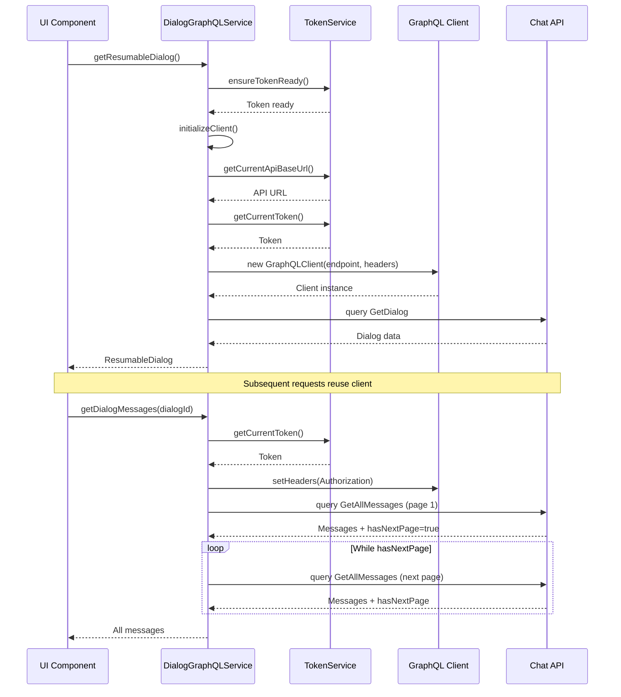

---

### 3. SupportedModelsService

**Purpose**: Manages the catalog of supported AI models, providing display names and metadata for model selection.

**Key Features:**
- Lazy loading of model catalog
- Provider-based model organization (Anthropic, OpenAI, Google Gemini)
- Model metadata caching
- Display name resolution

**Architecture:**

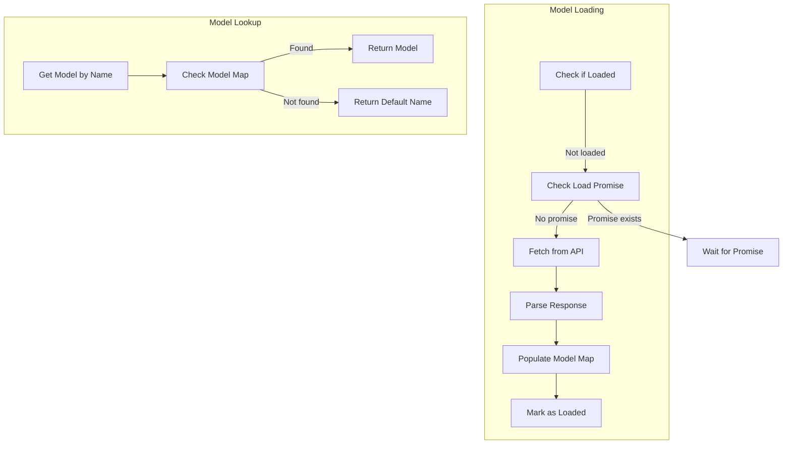

**Model Data Structure:**

```typescript
interface SupportedModel {
  modelName: string        // e.g., "claude-3-5-sonnet-20241022"
  displayName: string      // e.g., "Claude 3.5 Sonnet"
  provider: string         // e.g., "anthropic"
  contextWindow: number    // e.g., 200000
}

interface SupportedModelsResponse {
  anthropic: SupportedModel[]
  openai: SupportedModel[]
  'google-gemini': SupportedModel[]
}
```

**Loading Flow:**

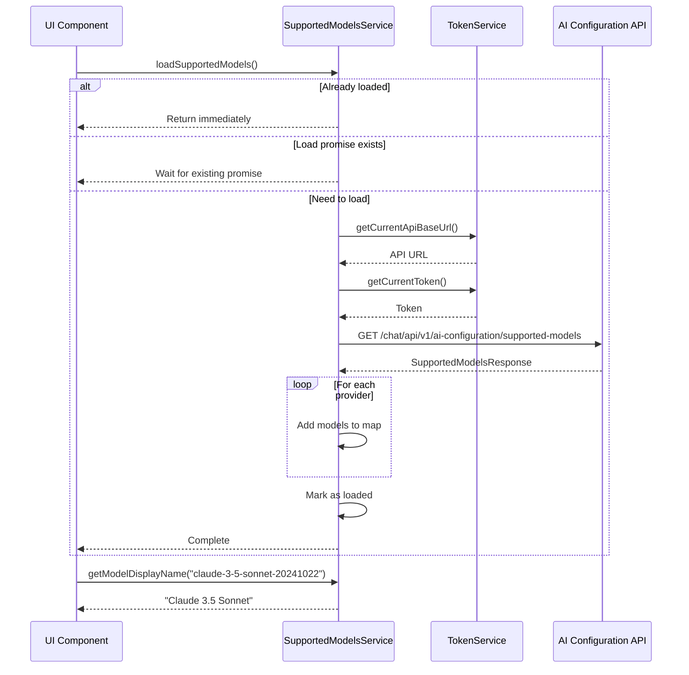

**API Integration:**

```typescript
private async fetchModels(): Promise<void> {
  try {
    const apiBaseUrl = tokenService.getCurrentApiBaseUrl()
    const token = tokenService.getCurrentToken()
    
    if (!apiBaseUrl || !token) return

    const response = await fetch(
      `${apiBaseUrl}/chat/api/v1/ai-configuration/supported-models`,
      {
        method: 'GET',
        headers: {
          'Authorization': `Bearer ${token}`,
          'Content-Type': 'application/json'
        }
      }
    )

    if (!response.ok) {
      console.warn('[SupportedModelsService] Failed to fetch:', response.status)
      return
    }

    const data: SupportedModelsResponse = await response.json()
    
    // Flatten all provider models into single map
    this.models.clear()
    Object.values(data).forEach(providerModels => {
      providerModels.forEach(model => {
        this.models.set(model.modelName, model)
      })
    })

    this.isLoaded = true
  } catch (error) {
    console.error('[SupportedModelsService] Error:', error)
  }
}
```

**Usage Patterns:**

```typescript
// Load models on app initialization
await supportedModelsService.loadSupportedModels()

// Get display name for UI
const displayName = supportedModelsService.getModelDisplayName(
  'claude-3-5-sonnet-20241022'
)
// Returns: "Claude 3.5 Sonnet"

// Get full model metadata
const model = supportedModelsService.getModel('gpt-4-turbo')
// Returns: { modelName, displayName, provider, contextWindow }

// Check if model is supported
if (supportedModelsService.isModelSupported('claude-3-opus')) {
  // Model is available
}

// Get all models for selection UI
const allModels = supportedModelsService.getAllModels()
```

---

### 4. MockChatService

**Purpose**: Provides simulated chat responses for development, testing, and demo purposes.

**Key Features:**
- Streaming response simulation
- Tool execution mocking
- Realistic typing delays
- Error simulation
- Context-aware responses

**Architecture:**

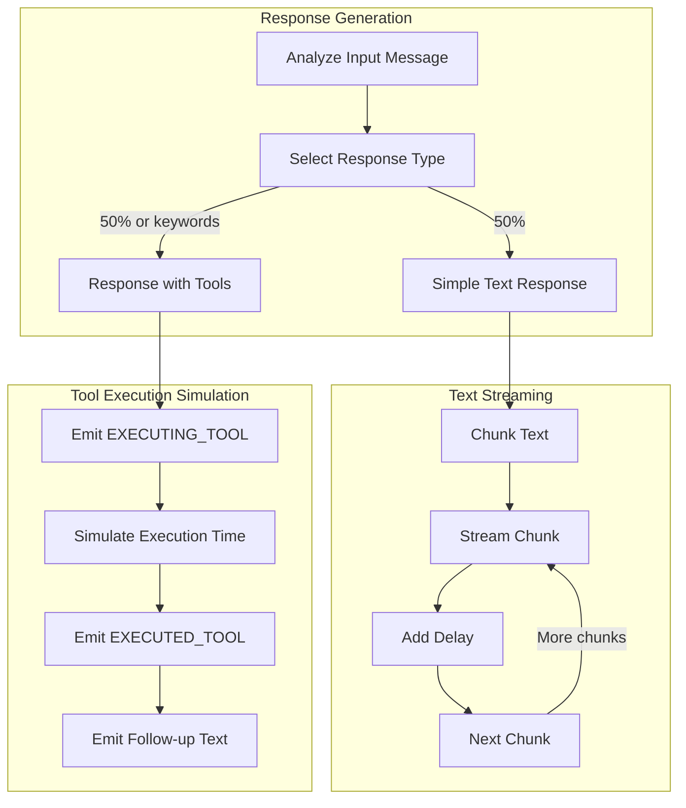

**Message Segment Types:**

```typescript
type MessageSegment = 
  | { type: 'text'; text: string }
  | { type: 'tool_execution'; data: ToolExecutionData }

type ToolExecutionData = 
  | ExecutingToolData
  | ExecutedToolData
```

**Streaming Response Flow:**

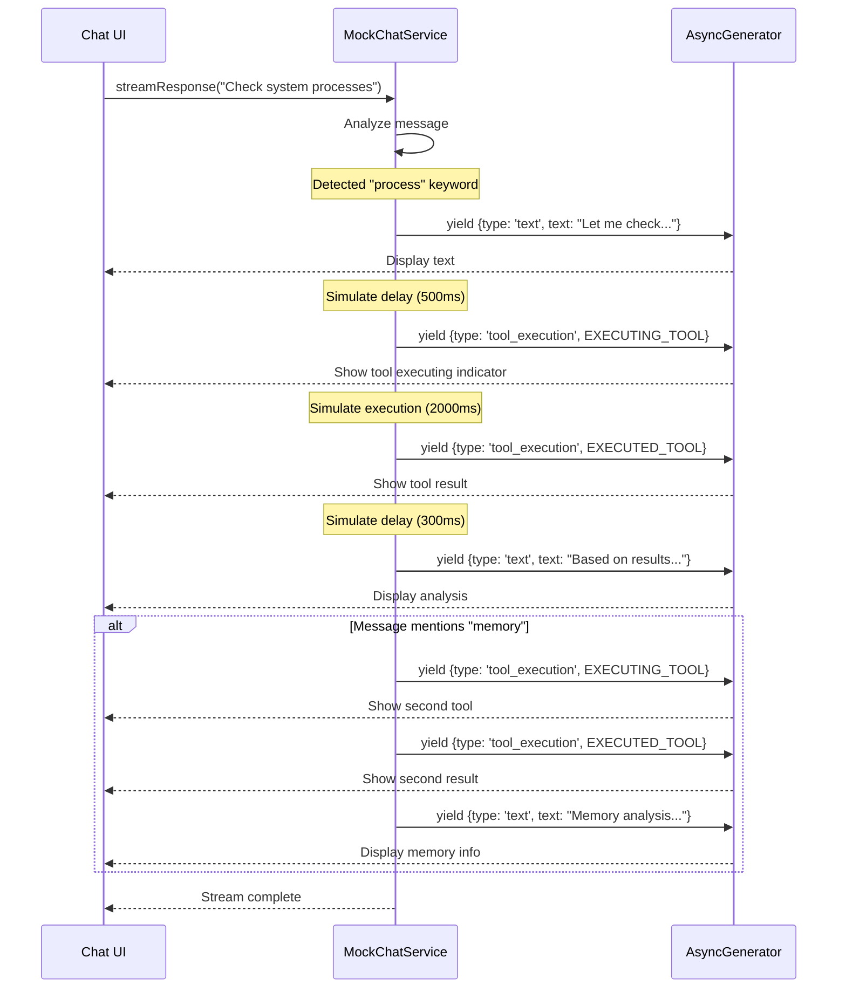

**Tool Execution Simulation:**

```typescript
private async *streamResponseWithTool(message: string): AsyncGenerator<MessageSegment> {
  // Initial text
  yield { type: 'text', text: "Let me check the system processes for you. " }
  
  await new Promise(resolve => setTimeout(resolve, 500))
  
  // Tool execution starting
  yield {
    type: 'tool_execution',
    data: {
      type: 'EXECUTING_TOOL',
      integratedToolType: 'FLEET_MDM',
      toolFunction: 'executeQuery',
      parameters: {
        query: "SELECT name, user_time + system_time as cpu_time FROM processes ORDER BY cpu_time DESC LIMIT 5;"
      }
    }
  }
  
  // Simulate execution time
  await new Promise(resolve => setTimeout(resolve, 2000))
  
  // Tool execution completed
  yield {
    type: 'tool_execution',
    data: {
      type: 'EXECUTED_TOOL',
      integratedToolType: 'FLEET_MDM',
      toolFunction: 'executeQuery',
      result: "Query executed successfully:\n```\n{cpu_time=67155621, name=kernel_task}\n...\n```",
      success: true
    }
  }
  
  // Follow-up analysis
  yield { 
    type: 'text', 
    text: "\n\nBased on the results, your top CPU-consuming processes are..." 
  }
}
```

**Context-Aware Responses:**

```typescript
private responses = [
  "I'll help you diagnose why your computer is running slow...",
  "I'm checking for available updates on your system...",
  "Let me troubleshoot your internet connection...",
  "I'll help you access your files...",
  "I can help you reset your password..."
]

// Match responses to keywords
if (message.toLowerCase().includes('slow')) {
  response = this.responses[0]
} else if (message.toLowerCase().includes('update')) {
  response = this.responses[1]
} else if (message.toLowerCase().includes('internet')) {
  response = this.responses[2]
}
```

**Error Simulation:**

```typescript
async *streamResponseWithError(message: string): AsyncGenerator<MessageSegment> {
  const shouldError = Math.random() > 0.8 // 20% chance of error
  
  if (shouldError) {
    await new Promise(resolve => setTimeout(resolve, 1000))
    throw new Error('Connection lost. Please check your network and try again.')
  }
  
  yield* this.streamResponse(message)
}
```

---

## Service Integration Patterns

### Token-Aware Service Pattern

All services that communicate with the backend follow this pattern:

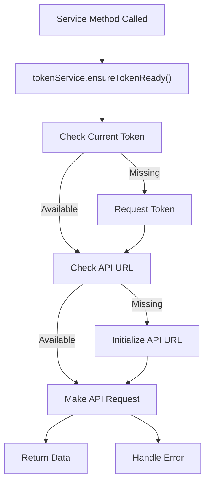

**Implementation:**

```typescript
async getResumableDialog(): Promise<ResumableDialog | null> {
  try {
    // Ensure token and API URL are ready
    await tokenService.ensureTokenReady()
    
    // Proceed with request
    const data = await this.request<{ resumableDialog: ResumableDialog | null }>(
      GET_RESUMABLE_DIALOG_QUERY
    )
    return data.resumableDialog
  } catch (error) {
    console.error('Failed to fetch resumable dialog:', error)
    return null
  }
}
```

### Lazy Initialization Pattern

Services initialize their clients lazily to avoid startup overhead:

```typescript
class DialogGraphQLService {
  private graphQLClient: GraphQLClient | null = null
  private currentEndpoint: string | null = null

  private async initializeClient(): Promise<GraphQLClient> {
    // Reuse existing client if available
    if (this.graphQLClient && this.currentEndpoint) {
      const token = tokenService.getCurrentToken()
      if (token) {
        this.graphQLClient.setHeaders({
          'Authorization': `Bearer ${token}`,
        })
      }
      return this.graphQLClient
    }

    // Initialize new client
    const baseUrl = tokenService.getCurrentApiBaseUrl()
    const token = tokenService.getCurrentToken()
    
    if (!baseUrl || !token) {
      throw new Error('API base URL or token not available')
    }

    const endpoint = `${baseUrl}/chat/graphql`
    
    this.graphQLClient = new GraphQLClient(endpoint, {
      headers: {
        'Content-Type': 'application/json',
        'Authorization': `Bearer ${token}`,
      }
    })
    
    this.currentEndpoint = endpoint
    return this.graphQLClient
  }
}
```

### Subscription Pattern

Services use the observer pattern for reactive updates:

```typescript
// TokenService provides subscription mechanism
onTokenUpdate(callback: (token: string) => void): () => void {
  this.listeners.add(callback)
  
  // Immediate callback if token already available
  if (this.currentToken) {
    try {
      callback(this.currentToken)
    } catch (error) {
      console.error('[TOKEN SERVICE] Error in immediate callback:', error)
    }
  }
  
  // Return unsubscribe function
  return () => {
    this.listeners.delete(callback)
  }
}

// Usage in other services
const unsubscribe = tokenService.onTokenUpdate((token) => {
  console.log('Token updated:', token)
  // Reinitialize clients with new token
})

// Cleanup
unsubscribe()
```

---

## Data Flow Diagrams

### Complete Message Retrieval Flow

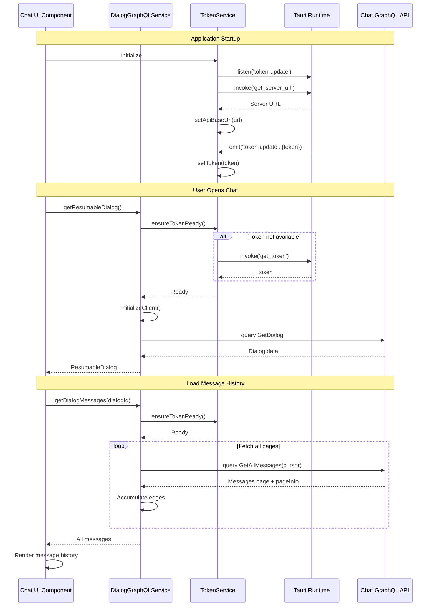

### Model Configuration Flow

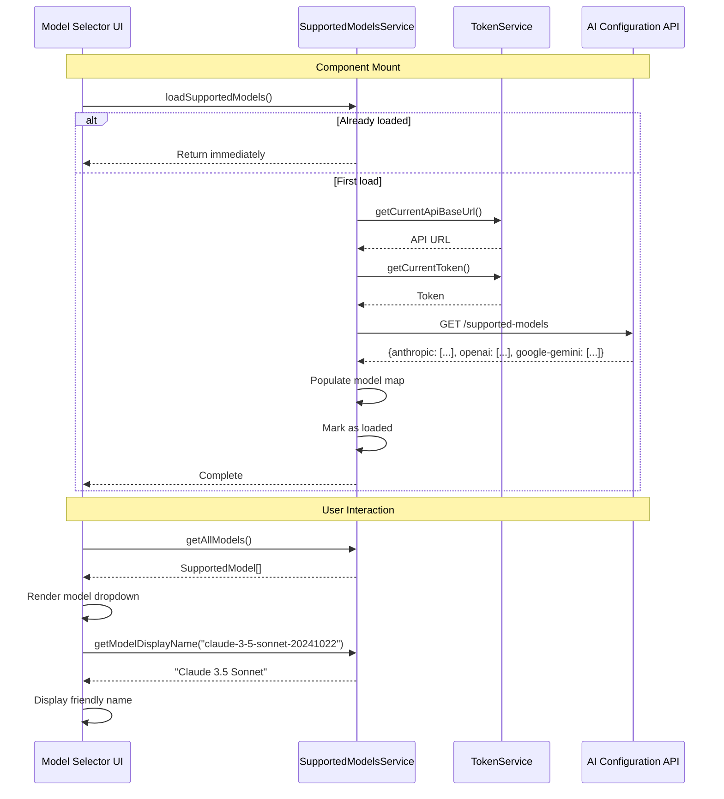

### Mock Chat Streaming Flow

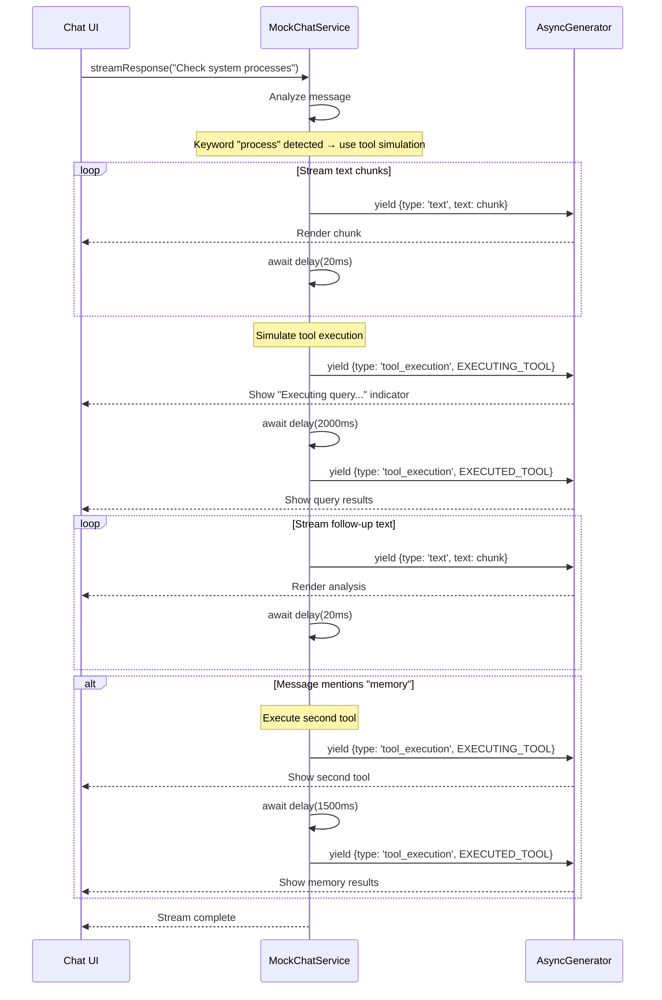

---

## Error Handling

### Token Service Error Handling

```typescript
// Graceful fallback for missing token
async requestToken(): Promise<string | null> {
  if (this.currentToken) return this.currentToken

  try {
    console.log('[TOKEN SERVICE] Requesting token from Rust...')
    const token = await invoke<string | null>('get_token')
    
    if (token) {
      console.log('[TOKEN SERVICE] Token received')
      this.setToken(token)
      return token
    } else {
      // Return cached token if available
      return this.currentToken
    }
  } catch (error) {
    // Silent failure, return cached token
    return this.currentToken
  }
}

// Ensure token is ready before API calls
async ensureTokenReady(): Promise<void> {
  let token = this.getCurrentToken()
  
  if (!token) {
    token = await this.requestToken()
    
    if (!token) {
      throw new Error('Authentication token not available.')
    }
  }
  
  let apiUrl = this.getCurrentApiBaseUrl()
  if (!apiUrl) {
    await this.initApiUrl()
    apiUrl = this.getCurrentApiBaseUrl()
    
    if (!apiUrl) {
      throw new Error('API server URL not configured.')
    }
  }
}
```

### GraphQL Service Error Handling

```typescript
async getResumableDialog(): Promise<ResumableDialog | null> {
  try {
    await tokenService.ensureTokenReady()
    const data = await this.request<{ resumableDialog: ResumableDialog | null }>(
      GET_RESUMABLE_DIALOG_QUERY
    )
    return data.resumableDialog
  } catch (error) {
    console.error('Failed to fetch resumable dialog:', error)
    // Return null instead of throwing to allow graceful degradation
    return null
  }
}

async getDialogMessages(
  dialogId: string,
  cursor?: string | null,
  limit: number = 5
): Promise<MessagesConnection | null> {
  try {
    await tokenService.ensureTokenReady()
    
    // Pagination loop with error handling
    const allEdges: MessageEdge[] = []
    let currentCursor = cursor
    let hasNextPage = true
    
    while (hasNextPage) {
      const data = await this.request<{ messages: MessagesConnection }>(
        GET_DIALOG_MESSAGES_QUERY,
        { dialogId, chatType: 'CLIENT_CHAT', cursor: currentCursor, limit }
      )
      
      if (!data.messages) {
        break // Stop pagination on error
      }
      
      allEdges.push(...data.messages.edges)
      hasNextPage = data.messages.pageInfo.hasNextPage
      currentCursor = data.messages.pageInfo.endCursor
    }
    
    return {
      edges: allEdges,
      pageInfo: pageInfo || {
        hasNextPage: false,
        hasPreviousPage: false,
        startCursor: null,
        endCursor: null
      }
    }
  } catch (error) {
    console.error('Failed to fetch dialog messages:', error)
    return null
  }
}
```

### Models Service Error Handling

```typescript
private async fetchModels(): Promise<void> {
  try {
    const apiBaseUrl = tokenService.getCurrentApiBaseUrl()
    const token = tokenService.getCurrentToken()
    
    // Early return if prerequisites not met
    if (!apiBaseUrl || !token) {
      return
    }

    const response = await fetch(
      `${apiBaseUrl}/chat/api/v1/ai-configuration/supported-models`,
      {
        method: 'GET',
        headers: {
          'Authorization': `Bearer ${token}`,
          'Content-Type': 'application/json'
        }
      }
    )

    if (!response.ok) {
      console.warn('[SupportedModelsService] Failed to fetch:', response.status)
      return // Graceful degradation
    }

    const data: SupportedModelsResponse = await response.json()
    
    this.models.clear()
    Object.values(data).forEach(providerModels => {
      providerModels.forEach(model => {
        this.models.set(model.modelName, model)
      })
    })

    this.isLoaded = true
  } catch (error) {
    console.error('[SupportedModelsService] Error:', error)
    // Service remains in unloaded state, can retry
  } finally {
    this.loadPromise = null
  }
}

// Fallback for missing models
getModelDisplayName(modelName: string): string {
  const model = this.models.get(modelName)
  return model?.displayName || modelName // Return raw name if not found
}
```

---

## Configuration

### Environment Variables

```bash
# Development configuration (optional)
VITE_TOKEN=eyJhbGciOiJSUzI1NiIsInR5cCI6IkpXVCJ9...
VITE_SERVER_URL=https://api.openframe.dev

# Production uses Tauri runtime configuration
```

### Tauri Commands

```rust
// Rust side (Tauri commands)
#[tauri::command]
fn get_token() -> Option<String> {
    // Return current authentication token
}

#[tauri::command]
fn get_server_url() -> String {
    // Return configured API server URL
}

// Emit token updates
app.emit_all("token-update", TokenUpdatePayload { token });
```

### GraphQL Endpoint Configuration

```typescript
// Endpoint construction
const baseUrl = tokenService.getCurrentApiBaseUrl()
// e.g., "https://api.openframe.dev"

const endpoint = `${baseUrl}/chat/graphql`
// Result: "https://api.openframe.dev/chat/graphql"
```

### API Endpoint Configuration

```typescript
// Models API endpoint
const apiBaseUrl = tokenService.getCurrentApiBaseUrl()
const modelsEndpoint = `${apiBaseUrl}/chat/api/v1/ai-configuration/supported-models`
// Result: "https://api.openframe.dev/chat/api/v1/ai-configuration/supported-models"
```

---

## Testing Strategies

### Unit Testing Services

```typescript
import { describe, it, expect, vi, beforeEach } from 'vitest'
import { tokenService } from './tokenService'

describe('TokenService', () => {
  beforeEach(() => {
    // Reset service state
    tokenService['currentToken'] = null
    tokenService['currentApiBaseUrl'] = null
    tokenService['listeners'].clear()
  })

  it('should normalize API URLs', () => {
    const normalized = tokenService['normalizeApiUrl']('api.example.com')
    expect(normalized).toBe('https://api.example.com')
  })

  it('should notify listeners on token update', () => {
    const callback = vi.fn()
    const unsubscribe = tokenService.onTokenUpdate(callback)
    
    tokenService['setToken']('test-token')
    
    expect(callback).toHaveBeenCalledWith('test-token')
    
    unsubscribe()
  })

  it('should call callback immediately if token exists', () => {
    tokenService['currentToken'] = 'existing-token'
    
    const callback = vi.fn()
    tokenService.onTokenUpdate(callback)
    
    expect(callback).toHaveBeenCalledWith('existing-token')
  })
})
```

### Integration Testing with Mock Backend

```typescript
import { describe, it, expect, beforeAll, afterAll } from 'vitest'
import { setupServer } from 'msw/node'
import { graphql, http } from 'msw'
import { dialogGraphQLService } from './dialogGraphQLService'

const server = setupServer(
  graphql.query('GetDialog', () => {
    return {
      data: {
        resumableDialog: {
          id: 'dialog-123',
          title: 'Test Dialog',
          status: 'OPEN',
          createdAt: '2024-01-01T00:00:00Z'
        }
      }
    }
  }),
  
  http.get('*/chat/api/v1/ai-configuration/supported-models', () => {
    return {
      anthropic: [
        {
          modelName: 'claude-3-5-sonnet-20241022',
          displayName: 'Claude 3.5 Sonnet',
          provider: 'anthropic',
          contextWindow: 200000
        }
      ],
      openai: [],
      'google-gemini': []
    }
  })
)

beforeAll(() => server.listen())
afterAll(() => server.close())

describe('DialogGraphQLService Integration', () => {
  it('should fetch resumable dialog', async () => {
    const dialog = await dialogGraphQLService.getResumableDialog()
    
    expect(dialog).toBeDefined()
    expect(dialog?.id).toBe('dialog-123')
    expect(dialog?.title).toBe('Test Dialog')
  })
})
```

### Testing Mock Service

```typescript
import { describe, it, expect } from 'vitest'
import { MockChatService } from './mockChatService'

describe('MockChatService', () => {
  const mockService = new MockChatService()

  it('should stream text responses', async () => {
    const segments: any[] = []
    
    for await (const segment of mockService.streamResponse('Hello')) {
      segments.push(segment)
    }
    
    expect(segments.length).toBeGreaterThan(0)
    expect(segments.every(s => s.type === 'text')).toBe(true)
  })

  it('should include tool execution for process queries', async () => {
    const segments: any[] = []
    
    for await (const segment of mockService.streamResponse('Check system processes')) {
      segments.push(segment)
    }
    
    const toolSegments = segments.filter(s => s.type === 'tool_execution')
    expect(toolSegments.length).toBeGreaterThan(0)
    
    const executingTool = toolSegments.find(
      s => s.data.type === 'EXECUTING_TOOL'
    )
    expect(executingTool).toBeDefined()
    
    const executedTool = toolSegments.find(
      s => s.data.type === 'EXECUTED_TOOL'
    )
    expect(executedTool).toBeDefined()
  })
})
```

---

## Performance Considerations

### Lazy Initialization

```typescript
// Services initialize clients only when needed
private async initializeClient(): Promise<GraphQLClient> {
  // Reuse existing client
  if (this.graphQLClient && this.currentEndpoint) {
    return this.graphQLClient
  }
  
  // Initialize only when first request is made
  this.graphQLClient = new GraphQLClient(endpoint, { ... })
  return this.graphQLClient
}
```

### Caching Strategies

```typescript
// SupportedModelsService caches model data
class SupportedModelsService {
  private models: Map<string, SupportedModel> = new Map()
  private isLoaded = false
  private loadPromise: Promise<void> | null = null

  async loadSupportedModels(): Promise<void> {
    // Return immediately if already loaded
    if (this.isLoaded) return
    
    // Reuse existing load promise
    if (this.loadPromise) return this.loadPromise

    // Fetch only once
    this.loadPromise = this.fetchModels()
    return this.loadPromise
  }
}
```

### Pagination Optimization

```typescript
// Automatic pagination fetches all pages in single call
async getDialogMessages(dialogId: string): Promise<MessagesConnection | null> {
  const allEdges: MessageEdge[] = []
  let currentCursor = cursor
  let hasNextPage = true
  
  // Fetch all pages automatically
  while (hasNextPage) {
    const data = await this.request(GET_DIALOG_MESSAGES_QUERY, {
      dialogId,
      cursor: currentCursor,
      limit: 5
    })
    
    allEdges.push(...data.messages.edges)
    hasNextPage = data.messages.pageInfo.hasNextPage
    currentCursor = data.messages.pageInfo.endCursor
  }
  
  // Return all messages in single response
  return { edges: allEdges, pageInfo }
}
```

### Streaming Performance

```typescript
// Mock service uses small chunks for smooth streaming
const chunkSize = 3 // Characters per chunk
for (let i = 0; i < response.length; i += chunkSize) {
  const chunk = response.slice(i, i + chunkSize)
  yield { type: 'text', text: chunk }
  await new Promise(resolve => setTimeout(resolve, 20)) // 20ms delay
}
```

---

## Security Considerations

### Token Security

```typescript
// Token masking for logs
private maskToken(token: string): string {
  if (token.length <= 8) {
    return '****'
  }
  
  const first = token.substring(0, 4)
  const last = token.substring(token.length - 4)
  return `${first}...${last}`
}

// Usage
console.log('[TOKEN SERVICE] Token received:', this.maskToken(token))
// Output: "eyJh...VCJ9" instead of full token
```

### Authorization Headers

```typescript
// Always include Bearer token in requests
this.graphQLClient = new GraphQLClient(endpoint, {
  headers: {
    'Content-Type': 'application/json',
    'Authorization': `Bearer ${token}`, // Secure token transmission
  }
})
```

### Token Refresh

```typescript
// Update headers when token changes
private async initializeClient(): Promise<GraphQLClient> {
  if (this.graphQLClient && this.currentEndpoint) {
    const token = tokenService.getCurrentToken()
    if (token) {
      // Refresh authorization header
      this.graphQLClient.setHeaders({
        'Authorization': `Bearer ${token}`,
      })
    }
    return this.graphQLClient
  }
  // ... initialize new client
}
```

### Environment Variable Security

```typescript
// Environment variables only used in development
private initFromEnv() {
  // Only applies in development builds
  const token = import.meta.env.VITE_TOKEN as string | undefined
  const serverUrl = import.meta.env.VITE_SERVER_URL as string | undefined

  // Production uses secure Tauri runtime
  if (serverUrl && !this.currentApiBaseUrl) {
    this.setApiBaseUrl(this.normalizeApiUrl(serverUrl))
  }
}
```

---

## Troubleshooting

### Common Issues

#### Token Not Available

**Symptom**: `Authentication token not available` error

**Causes:**
- Tauri runtime not initialized
- Token not emitted from Rust side
- Environment variables not set (development)

**Solutions:**

```typescript
// Check token availability
const token = tokenService.getCurrentToken()
if (!token) {
  console.error('Token not available')
  // Try manual request
  await tokenService.requestToken()
}

// Verify Tauri event listener
console.log('[TOKEN SERVICE] Token listener initialized')
// Should appear in console on startup
```

#### API URL Not Configured

**Symptom**: `API server URL not configured` error

**Causes:**
- `get_server_url` command not implemented
- Environment variable missing (development)

**Solutions:**

```typescript
// Check API URL
const apiUrl = tokenService.getCurrentApiBaseUrl()
if (!apiUrl) {
  console.error('API URL not configured')
  // Try manual initialization
  await tokenService.initApiUrl()
}

// Development fallback
// Set VITE_SERVER_URL in .env file
```

#### GraphQL Request Failures

**Symptom**: `Failed to fetch resumable dialog` error

**Causes:**
- Network connectivity issues
- Invalid token
- Backend service unavailable

**Solutions:**

```typescript
// Enable detailed logging
try {
  const dialog = await dialogGraphQLService.getResumableDialog()
} catch (error) {
  console.error('GraphQL error:', error)
  // Check error details
  if (error.response) {
    console.error('Response:', error.response)
  }
}

// Verify endpoint
const endpoint = `${tokenService.getCurrentApiBaseUrl()}/chat/graphql`
console.log('GraphQL endpoint:', endpoint)
```

#### Model Loading Failures

**Symptom**: Models not loading or display names showing raw model names

**Causes:**
- API endpoint unreachable
- Token expired
- Network timeout

**Solutions:**

```typescript
// Manual reload
supportedModelsService.reset()
await supportedModelsService.loadSupportedModels()

// Check load status
const allModels = supportedModelsService.getAllModels()
console.log('Loaded models:', allModels.length)

// Fallback to raw names
const displayName = supportedModelsService.getModelDisplayName(modelName)
// Returns modelName if not found
```

### Debug Logging

```typescript
// Enable verbose logging in TokenService
console.log('[TOKEN SERVICE] Token listener initialized')
console.log('[TOKEN SERVICE] Token received from Rust event:', this.maskToken(token))
console.log('[TOKEN SERVICE] Requesting token from Rust...')

// Enable logging in DialogGraphQLService
console.error('Failed to fetch resumable dialog:', error)
console.error('Failed to fetch dialog messages:', error)

// Enable logging in SupportedModelsService
console.warn('[SupportedModelsService] Failed to fetch supported models:', response.status)
console.error('[SupportedModelsService] Error fetching supported models:', error)
```

---

## Related Documentation

- **[Frontend Chat](./frontend_chat.md)** - Parent module overview
- **[Frontend Chat Contexts](./frontend_chat_contexts.md)** - React context providers
- **[Frontend API Clients](./frontend_api_clients.md)** - REST API client implementations
- **[API Service GraphQL DataFetchers](./api_service_graphql_datafetchers.md)** - Backend GraphQL resolvers
- **[Frontend Core Components](./frontend_core_components.md)** - Shared UI components and types
- **[Security Core JWT Management](./security_core_jwt_management.md)** - JWT token validation

---

## API Reference

### TokenService

```typescript
class TokenService {
  // Get current token
  getCurrentToken(): string | null
  
  // Get current API base URL
  getCurrentApiBaseUrl(): string | null
  
  // Request token from Tauri
  requestToken(): Promise<string | null>
  
  // Initialize API URL from Tauri
  initApiUrl(): Promise<void>
  
  // Subscribe to token updates
  onTokenUpdate(callback: (token: string) => void): () => void
  
  // Subscribe to API URL updates
  onApiUrlUpdate(callback: (apiUrl: string) => void): () => void
  
  // Ensure token and API URL are ready
  ensureTokenReady(): Promise<void>
}

// Singleton instance
export const tokenService: TokenService
```

### DialogGraphQLService

```typescript
class DialogGraphQLService {
  // Get resumable dialog for current user
  getResumableDialog(): Promise<ResumableDialog | null>
  
  // Get all messages for a dialog (auto-paginated)
  getDialogMessages(
    dialogId: string,
    cursor?: string | null,
    limit?: number
  ): Promise<MessagesConnection | null>
  
  // Cleanup resources
  dispose(): void
}

// Singleton instance
export const dialogGraphQLService: DialogGraphQLService
```

### SupportedModelsService

```typescript
class SupportedModelsService {
  // Load supported models from API
  loadSupportedModels(): Promise<void>
  
  // Get display name for model
  getModelDisplayName(modelName: string): string
  
  // Get full model metadata
  getModel(modelName: string): SupportedModel | undefined
  
  // Get all loaded models
  getAllModels(): SupportedModel[]
  
  // Check if model is supported
  isModelSupported(modelName: string): boolean
  
  // Reset service state
  reset(): void
}

// Singleton instance
export const supportedModelsService: SupportedModelsService
```

### MockChatService

```typescript
class MockChatService {
  // Stream mock response
  streamResponse(message: string): AsyncGenerator<MessageSegment>
  
  // Stream response with random errors
  streamResponseWithError(message: string): AsyncGenerator<MessageSegment>
}

// Create instance
const mockService = new MockChatService()
```

---

## Best Practices

### Service Initialization

```typescript
// ✅ DO: Initialize services early in app lifecycle
async function initializeApp() {
  // Token service initializes automatically
  await tokenService.ensureTokenReady()
  
  // Load models early
  await supportedModelsService.loadSupportedModels()
}

// ❌ DON'T: Initialize on every component mount
function ChatComponent() {
  useEffect(() => {
    // This runs on every mount - inefficient
    supportedModelsService.loadSupportedModels()
  }, [])
}
```

### Error Handling

```typescript
// ✅ DO: Handle errors gracefully with fallbacks
async function loadDialog() {
  try {
    const dialog = await dialogGraphQLService.getResumableDialog()
    if (!dialog) {
      // Graceful fallback
      return createNewDialog()
    }
    return dialog
  } catch (error) {
    console.error('Failed to load dialog:', error)
    // Show user-friendly error
    showErrorNotification('Unable to load conversation')
    return null
  }
}

// ❌ DON'T: Let errors propagate without handling
async function loadDialog() {
  // Unhandled error crashes app
  const dialog = await dialogGraphQLService.getResumableDialog()
  return dialog
}
```

### Token Subscription

```typescript
// ✅ DO: Unsubscribe when component unmounts
useEffect(() => {
  const unsubscribe = tokenService.onTokenUpdate((token) => {
    console.log('Token updated')
    // Handle token update
  })
  
  return () => {
    unsubscribe() // Cleanup
  }
}, [])

// ❌ DON'T: Forget to unsubscribe
useEffect(() => {
  tokenService.onTokenUpdate((token) => {
    // Memory leak - subscription never cleaned up
  })
}, [])
```

### Service Disposal

```typescript
// ✅ DO: Dispose services when no longer needed
function cleanup() {
  dialogGraphQLService.dispose()
  supportedModelsService.reset()
}

// Call on app shutdown or navigation
window.addEventListener('beforeunload', cleanup)
```

---

## Future Enhancements

### Planned Features

1. **Token Refresh Mechanism**
   - Automatic token refresh before expiration
   - Retry failed requests with new token

2. **Offline Support**
   - Cache dialog and message data
   - Queue messages for sending when online

3. **WebSocket Support**
   - Real-time message updates
   - Live typing indicators

4. **Enhanced Error Recovery**
   - Automatic retry with exponential backoff
   - Circuit breaker pattern for failing services

5. **Performance Monitoring**
   - Request timing metrics
   - Error rate tracking
   - Service health indicators

### Potential Improvements

```typescript
// Token refresh
class TokenService {
  private tokenExpiresAt: Date | null = null
  
  async refreshTokenIfNeeded(): Promise<void> {
    if (this.tokenExpiresAt && new Date() > this.tokenExpiresAt) {
      await this.requestToken()
    }
  }
}

// Offline queue
class MessageQueue {
  private queue: Message[] = []
  
  async sendWhenOnline(message: Message): Promise<void> {
    if (navigator.onLine) {
      await this.send(message)
    } else {
      this.queue.push(message)
    }
  }
}

// WebSocket integration
class DialogWebSocketService {
  private ws: WebSocket | null = null
  
  connect(dialogId: string): void {
    const token = tokenService.getCurrentToken()
    this.ws = new WebSocket(`wss://api.openframe.dev/chat/ws?token=${token}`)
  }
  
  onMessage(callback: (message: Message) => void): void {
    this.ws?.addEventListener('message', (event) => {
      const message = JSON.parse(event.data)
      callback(message)
    })
  }
}
```

---

## Conclusion

The Frontend Chat Services module provides a robust, type-safe service layer for the OpenFrame Chat client. By abstracting authentication, GraphQL communication, and model configuration, it enables the UI layer to focus on user experience while maintaining clean separation of concerns.

**Key Takeaways:**
- **Token Management**: Seamless integration with Tauri runtime for secure authentication
- **GraphQL Communication**: Type-safe, paginated data fetching with automatic error handling
- **Model Configuration**: Dynamic loading of AI model metadata for flexible UI
- **Development Support**: Mock services enable rapid development and testing

For questions or contributions, join the [OpenMSP Slack community](https://join.slack.com/t/openmsp/shared_invite/zt-36bl7mx0h-3~U2nFH6nqHqoTPXMaHEHA).
