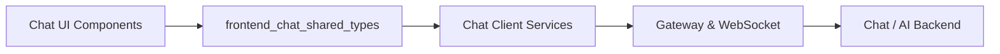
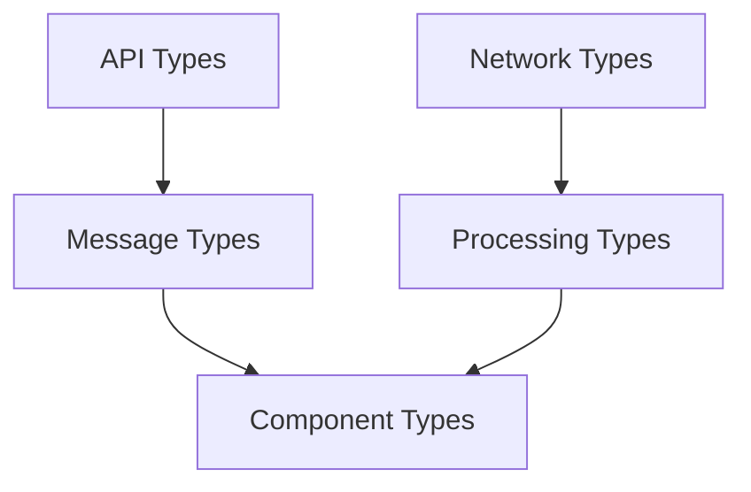
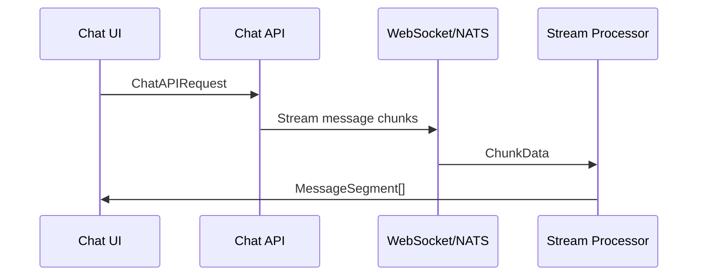

# Frontend Chat Shared Types

## Overview

The **frontend_chat_shared_types** module provides a centralized collection of **TypeScript type definitions** used across OpenFrame's chat-enabled frontend experiences. It acts as the **contract layer** between:

- Chat UI components
- Real-time streaming and buffering logic
- WebSocket / NATS-based message delivery
- REST and GraphQL API integrations

By consolidating these definitions into a shared library, the platform ensures **type safety, consistency, and interoperability** across multiple frontend clients, including the OpenFrame Chat client and tenant-facing UI applications.

This module does **not** contain runtime logic. Instead, it defines the shapes, constraints, and expectations for data flowing through the chat system.

---

## Position in the System

The shared chat types sit between **chat client applications** and **backend messaging infrastructure**, enabling consistent communication semantics.

---

## Architecture Overview

The module is organized into five logical sub-modules, each focused on a specific concern:

---

## Sub-Modules

### 1. API Types

Defines request and response contracts for chat-related API interactions, including dialogs, messages, approvals, and settings updates.

- Chat message submission
- Dialog lifecycle (create, list)
- Approval workflows
- Chat settings persistence

➡️ See: [API Types](api_types.md)

---

### 2. Component Types

Provides strongly-typed React props and refs for all chat UI components. These types ensure consistency between UI rendering and underlying message data.

Includes:
- Chat containers and headers
- Message lists and inputs
- Approval request displays
- Sidebar and dialog list items

➡️ See: [Component Types](component_types.md)

---

### 3. Message Types

Defines the **semantic structure** of chat messages, including:

- Text messages
- Tool execution lifecycle messages
- Approval requests and results
- AI metadata messages

Also includes message segmentation, enabling **incremental streaming updates** and rich message rendering.

➡️ See: [Message Types](message_types.md)

---

### 4. Network Types

Describes network-level data structures used for real-time communication and pagination:

- WebSocket configuration and messages
- NATS message types and connection states
- Chunked streaming payloads
- Generic network and paginated responses

➡️ See: [Network Types](network_types.md)

---

### 5. Processing Types

Defines interfaces for **streaming, buffering, and transforming** incoming message chunks into UI-ready messages.

Covers:
- Chunk parsing and processing
- Message accumulation and transformation
- Stream lifecycle management
- Buffer management strategies

➡️ See: [Processing Types](processing_types.md)

---

## End-to-End Data Flow

The following diagram illustrates how data flows through the chat system using these shared types:

---

## Related Modules

This module is commonly used alongside:

- **chat_client_app_services** – Implements runtime services that consume these types
- **tenant_frontend_core_api_clients_and_types** – Provides higher-level API clients and domain types

Refer to those modules' documentation for service-level and application-level behavior.

---

## Key Design Principles

- **Strict typing over runtime logic**
- **Streaming-first message model**
- **Approval-aware conversation flows**
- **UI and network decoupling via shared contracts**

---

## Summary

The **frontend_chat_shared_types** module is the backbone of OpenFrame's frontend chat architecture. By standardizing how chat data is represented, streamed, processed, and rendered, it enables scalable, maintainable, and feature-rich chat experiences across the OpenFrame platform.
