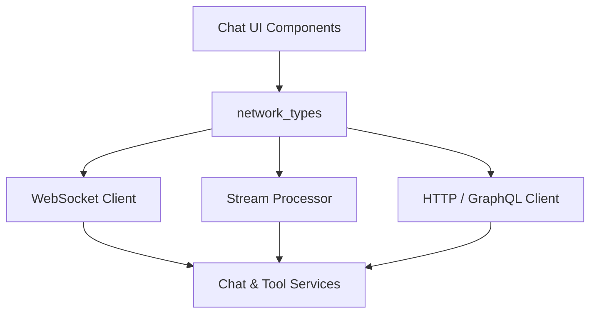
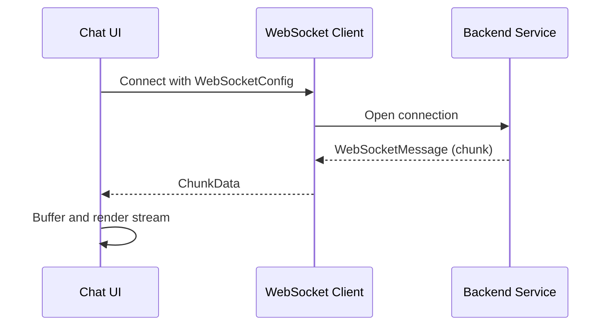

# Network Types Module

## Overview

The **network_types** module defines shared TypeScript types and constants used for network communication within the OpenFrame frontend chat system. It standardizes how the chat UI and supporting services interact with:

- **Real-time transports** (NATS-style messaging and WebSockets)
- **Streaming and chunked message delivery** for AI and tool execution
- **Network configuration and retry behavior**
- **Typed API responses and errors**

This module is intentionally **transport-agnostic**: it does not implement networking logic, but provides strongly typed contracts consumed by higher-level services such as WebSocket clients, stream processors, and API clients.

---

## Responsibilities

- Define reusable **network response contracts** (`NetworkResponse`, `PaginatedResponse`)
- Describe **WebSocket configuration and message envelopes**
- Model **streamed chunk data** exchanged during chat interactions
- Centralize **network timing and retry constants**
- Provide common enums for **connection and message states**

---

## High-Level Architecture



The **network_types** module sits at the boundary between UI logic and transport implementations, ensuring consistent data contracts across all communication paths.

---

## Core Configuration

### Network Timing and Limits

The module exposes a shared configuration object used by WebSocket, polling, and streaming logic:

```typescript
export const NETWORK_CONFIG = {
  SHARED_CLOSE_DELAY_MS: 3000,
  CONNECT_TIMEOUT_MS: 10_000,
  RECONNECT_TIME_WAIT_MS: 2000,
  PING_INTERVAL_MS: 30_000,
  MAX_PING_OUT: 3,
  DEFAULT_MESSAGE_LIMIT: 50,
  POLL_MESSAGE_LIMIT: 10,
} as const
```

**Purpose:**
- Prevent premature socket closures
- Standardize reconnect and ping behavior
- Control batching and pagination sizes

These values are treated as **platform defaults** and should only be overridden in exceptional cases.

---

## Messaging and Streaming Types

### NATS-style Messaging

Although the frontend does not connect directly to NATS, it consumes NATS-inspired message semantics for streamed chat data.

```typescript
export type NatsMessageType = 'message' | 'admin-message'

export type NatsConnectionStatus =
  | 'connecting'
  | 'connected'
  | 'disconnected'
  | 'reconnecting'
  | 'closed'
  | 'error'
```

**Usage:**
- Distinguish between user-visible messages and system/admin messages
- Drive UI connection indicators and retry logic

---

### Chunked Stream Data

Chat responses, tool executions, and AI outputs are delivered incrementally as **chunks**.

```typescript
export interface ChunkData {
  sequenceId?: number
  type: string
  text?: string
  integratedToolType?: string
  toolFunction?: string
  parameters?: Record<string, any>
  result?: string
  success?: boolean
  error?: string
  details?: string
  approvalRequestId?: string
  approval_request_id?: string
  approvalType?: string
  command?: string
  explanation?: string
  approved?: boolean
  modelName?: string
  providerName?: string
  provider?: string
  contextWindow?: number
  [key: string]: any
}
```

**Key characteristics:**
- Supports **AI streaming**, **tool invocation**, and **approval workflows**
- Flexible index signature allows backend evolution without breaking clients
- `sequenceId` enables ordered reassembly

A buffered wrapper associates chunks with their logical channel:

```typescript
export interface BufferedChunk {
  chunk: ChunkData
  messageType: NatsMessageType
}
```

---

## WebSocket Contracts

### WebSocket Message Envelope

```typescript
export interface WebSocketMessage {
  type: string
  payload: any
  timestamp?: string
  id?: string
}
```

This envelope provides:
- Message classification via `type`
- Transport-agnostic payloads
- Optional metadata for tracing and ordering

---

### WebSocket Configuration

```typescript
export interface WebSocketConfig {
  url: string
  protocols?: string | string[]
  reconnect?: boolean
  reconnectInterval?: number
  maxReconnectAttempts?: number
  onOpen?: (event: Event) => void
  onClose?: (event: CloseEvent) => void
  onError?: (event: Event) => void
  onMessage?: (event: MessageEvent) => void
}
```

**Design goals:**
- Declarative socket setup
- Optional lifecycle hooks for UI state updates
- Configurable reconnect behavior aligned with `NETWORK_CONFIG`

---

## Fetch and Polling Contracts

### Chunk Fetch Function

```typescript
export type FetchChunksFunction = (
  dialogId: string,
  chatType: ChatType,
  fromSequenceId?: number | null
) => Promise<ChunkData[]>
```

This abstraction allows the UI to:
- Resume streams after reconnects
- Backfill missed chunks
- Support both polling and push-based transports

---

## Network Response Models

### Standard Response

```typescript
export interface NetworkResponse<T = any> {
  success: boolean
  data?: T
  error?: string
  message?: string
}
```

Used consistently across REST and GraphQL-adjacent APIs to provide:
- Clear success/failure signaling
- Optional payloads
- Human-readable error messages

---

### Paginated Response

```typescript
export interface PaginatedResponse<T = any> extends NetworkResponse<T> {
  page: number
  pageSize: number
  totalCount: number
  totalPages: number
}
```

Supports cursor-less pagination patterns commonly used in:
- Dialog lists
- Message histories
- Audit and activity views

---

## Error Modeling

```typescript
export interface NetworkError {
  code: string
  message: string
  details?: any
  timestamp: string
}
```

This structure enables:
- Consistent error display in the UI
- Easier correlation with backend logs
- Extension for provider-specific error details

---

## Data Flow Example



---

## Design Considerations

- **Loose coupling:** Types avoid hard dependencies on concrete transports
- **Forward compatibility:** Index signatures and optional fields support backend evolution
- **Streaming-first:** Chunk-oriented models are optimized for real-time AI output
- **Consistency:** Shared response and error contracts simplify client logic

---

## Summary

The **network_types** module provides the foundational contracts that make real-time, streaming chat interactions reliable and maintainable across the OpenFrame frontend. By centralizing network configuration and message schemas, it ensures consistent behavior across WebSockets, polling, and future transport mechanisms.
