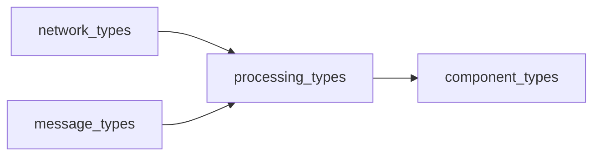
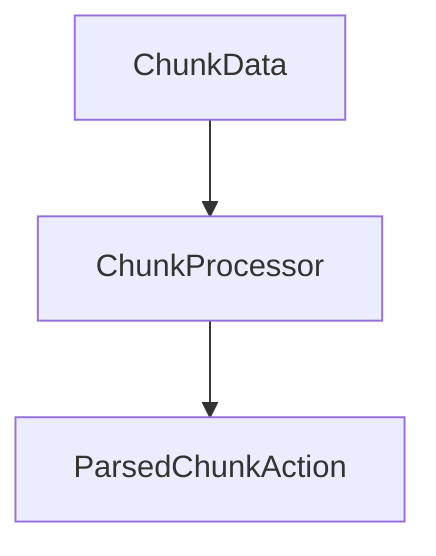
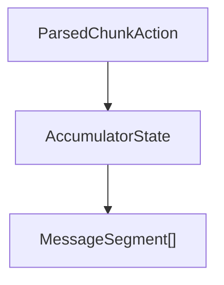
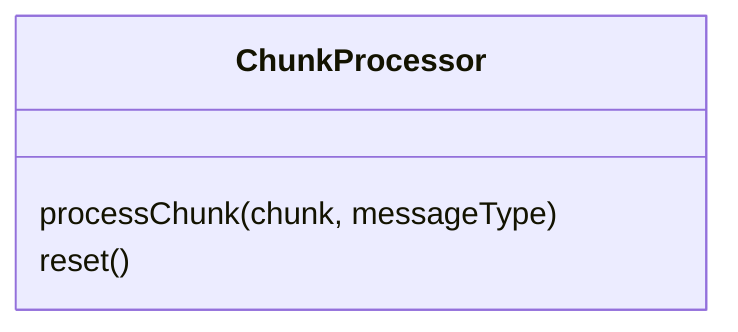
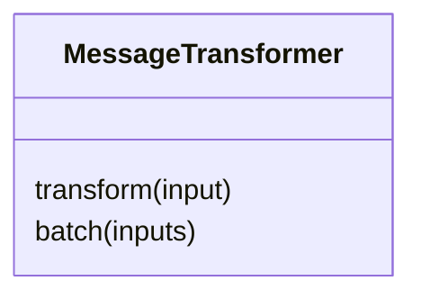
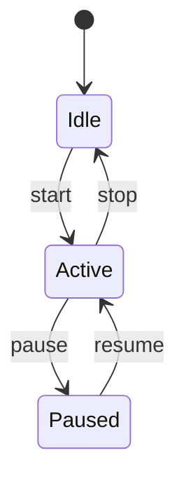
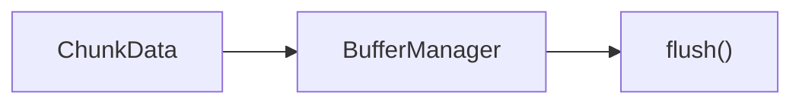
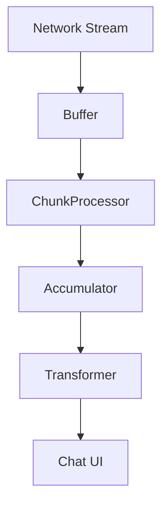

# Processing Types Module

## Overview

The **processing_types** module defines the core type contracts used by the OpenFrame frontend chat system to **process streaming messages** end-to-end. It focuses on:

- Incremental **chunk parsing** from network streams
- **Accumulation** of partial message state (text, tools, approvals)
- **Transformation** of raw inputs into UI-ready messages
- **Stream lifecycle management** (start, pause, resume, reset)
- **Buffering** and backpressure control

This module is intentionally **implementation-agnostic**. It provides interfaces and data shapes that concrete processors implement elsewhere in the chat frontend stack.

It is primarily consumed by:
- Chat stream handlers
- WebSocket / NATS message listeners
- UI state managers rendering incremental assistant output

---

## Position in the System

Within `frontend_chat_shared_types`, this module sits alongside message, network, API, and component type definitions.

- **Inputs**: network chunks and message primitives
- **Outputs**: processed messages and UI-consumable segments

---

## Core Concepts

### 1. Parsed Chunk Actions

At the lowest level, incoming stream data is parsed into **semantic actions**.

`ParsedChunkAction` is a discriminated union describing **what happened** in the stream:

- Message lifecycle: `message_start`, `message_end`
- Content: `text`, `tool_execution`
- Control & metadata: `metadata`, `error`
- Human-in-the-loop flows: `approval_request`, `approval_result`
- Assistant prompts: `message_request`

These actions allow higher layers to remain stateless with respect to transport-level concerns.

---

### 2. Accumulator State

While chunks arrive incrementally, the UI needs a **coherent message model**. This is handled through an accumulator pattern.

`AccumulatorState` tracks:

- `segments`: finalized message segments (text, tools, approvals)
- `currentTextBuffer`: in-progress text accumulation
- `pendingApprovals`: approvals awaiting user action
- `executingTools`: currently running tool executions
- `escalatedApprovals`: approvals deferred from direct display

This structure enables:
- Smooth streaming text rendering
- Interleaved tool execution feedback
- Deferred or escalated approval handling

---

### 3. Message Processing Options

Message processing behavior is configurable via `MessageProcessingOptions`.

Key concerns addressed:

- Assistant identity (`assistantName`, `assistantType`, avatar)
- Approval workflows (`onApprove`, `onReject`)
- Chat scoping (`chatTypeFilter`)
- Approval visibility and escalation rules

These options allow the same processing pipeline to be reused across:
- Client chat
- Technician chat
- Automated agent conversations

---

## Core Interfaces

### ChunkProcessor

Responsible for converting raw chunks into semantic actions.

- Stateless between messages (resettable)
- Aware of transport message type (`NatsMessageType`)
- Emits zero or one `ParsedChunkAction` per chunk

`ChunkProcessorOptions` defines optional callbacks for side effects such as:
- Text streaming
- Tool execution notifications
- Approval lifecycle hooks

---

### MessageTransformer

Transforms accumulated or raw inputs into finalized messages.

Responsibilities:
- Normalize message structures
- Merge or preserve segments
- Attach metadata
- Prepare messages for UI consumption

Transformation behavior can be tuned via `TransformationOptions`.

---

### StreamProcessor

Controls the lifecycle of a streaming session.

`StreamProcessor` exposes:

- Lifecycle control: `start`, `stop`, `pause`, `resume`, `reset`
- Observability via `getState()`

`StreamState` provides runtime insight:
- Active / paused flags
- Messages processed
- Buffered chunks
- Error history with timestamps

---

### BufferManager

Buffers incoming chunks to manage throughput and backpressure.

Capabilities:

- Size tracking and limits
- Explicit flushing
- Overflow handling
- Periodic or event-driven flush callbacks

Configured via `BufferOptions`:
- `maxSize`
- `flushInterval`
- `onFlush`
- `onOverflow`

---

## End-to-End Data Flow

1. Network delivers `ChunkData`
2. `BufferManager` batches chunks
3. `ChunkProcessor` emits semantic actions
4. Accumulator builds message state
5. `MessageTransformer` produces `ProcessedMessage`
6. UI renders incremental updates

---

## Related Modules

- [Message Types](../message_types/message_types.md)
- [Network Types](../network_types/network_types.md)
- [Component Types](../component_types/component_types.md)

(See platform documentation for concrete processor implementations.)

---

## Summary

The **processing_types** module defines the backbone contracts for OpenFrame's streaming chat experience. By separating **transport**, **parsing**, **state accumulation**, **transformation**, and **lifecycle control**, it enables:

- Highly responsive streaming UIs
- Pluggable processing strategies
- Clean separation of concerns
- Consistent behavior across chat surfaces

This design allows OpenFrame to evolve its AI and tool-driven chat capabilities without breaking frontend integrations.