# Frontend Chat Module - Visual Overview

## Complete System Architecture

This document provides comprehensive visual diagrams for the Frontend Chat Module architecture, data flows, and component interactions.

---

## 1. High-Level System Architecture

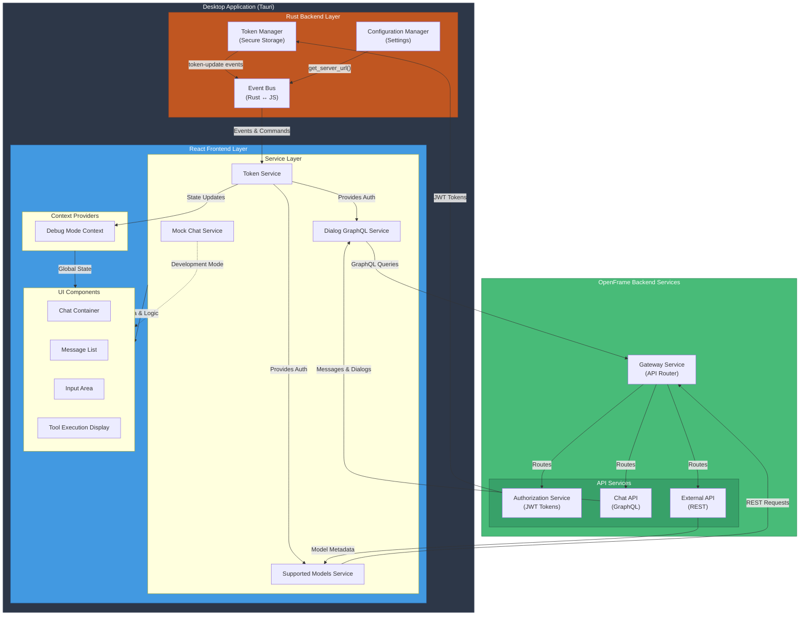

---

## 2. Service Layer Architecture

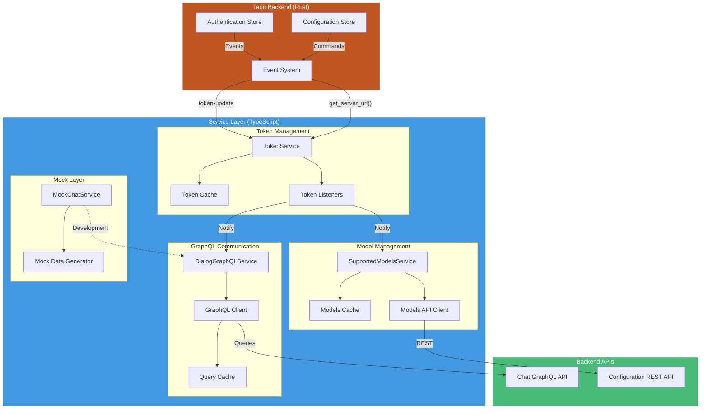

---

## 3. Complete Data Flow - Message Sending

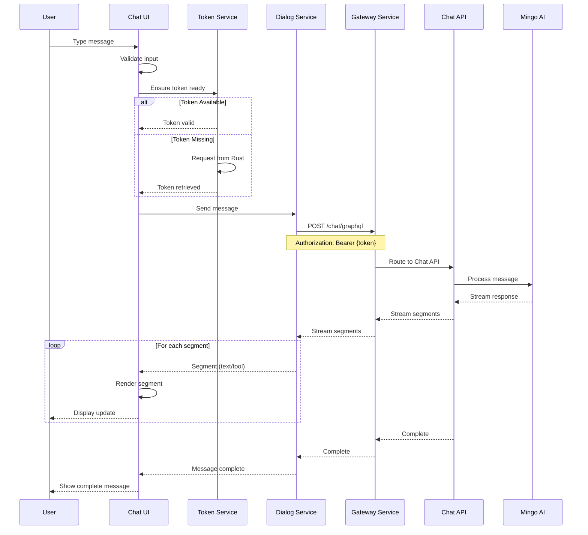

---

## 4. Token Lifecycle Management

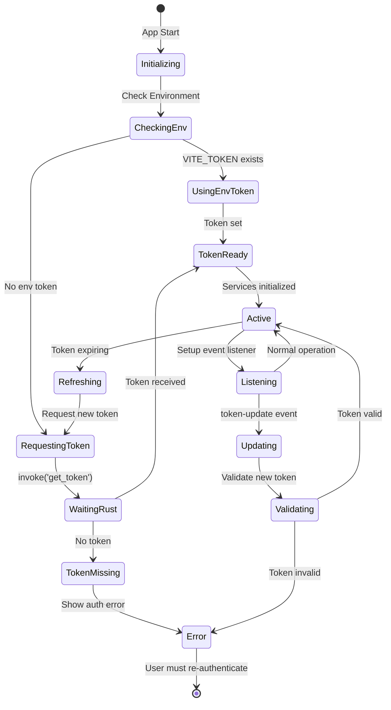

---

## 5. Dialog History Loading Flow

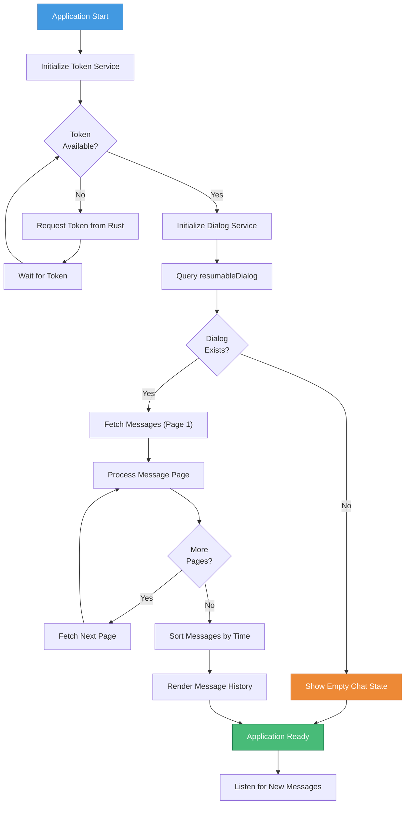

---

## 6. Tool Execution Workflow

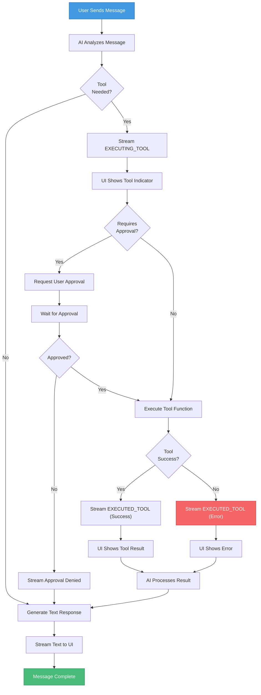

---

## 7. Context Provider Architecture

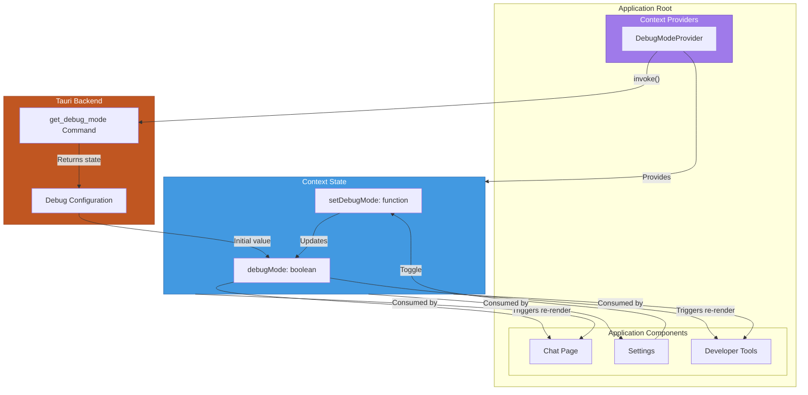

---

## 8. Mock Service Architecture

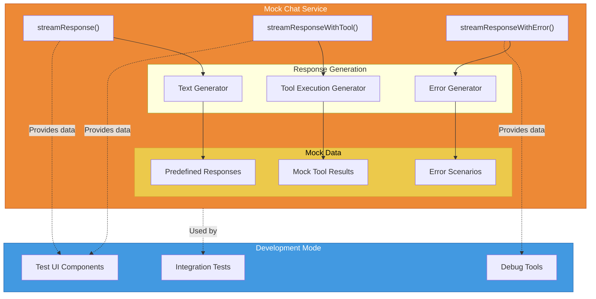

---

## 9. Error Handling Flow

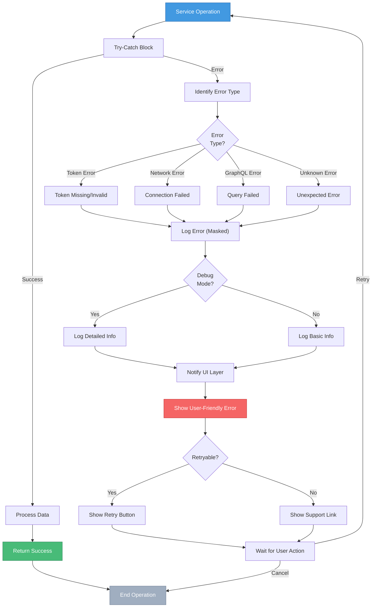

---

## 10. Component Interaction Map

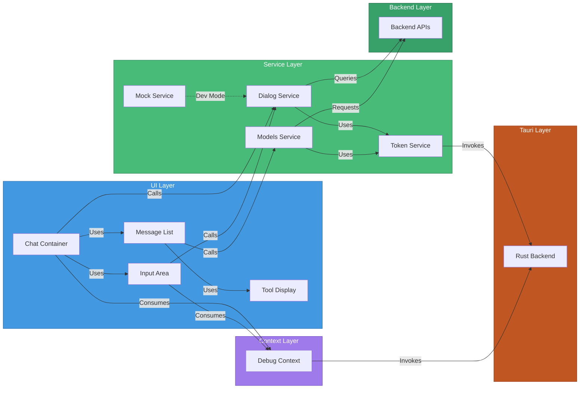

---

## 11. Deployment Architecture

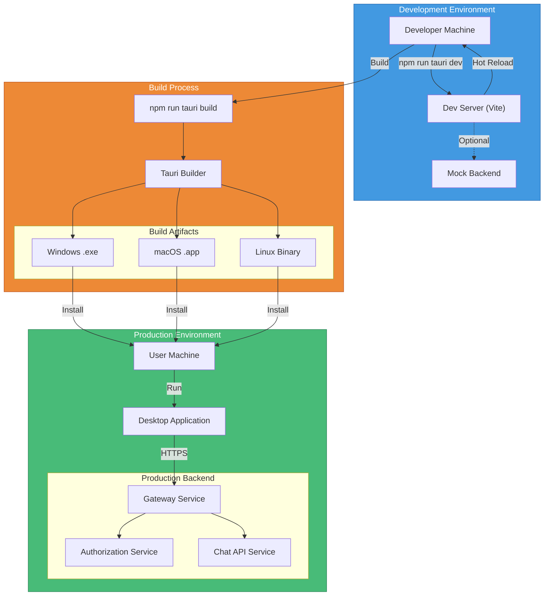

---

## 12. Security Architecture

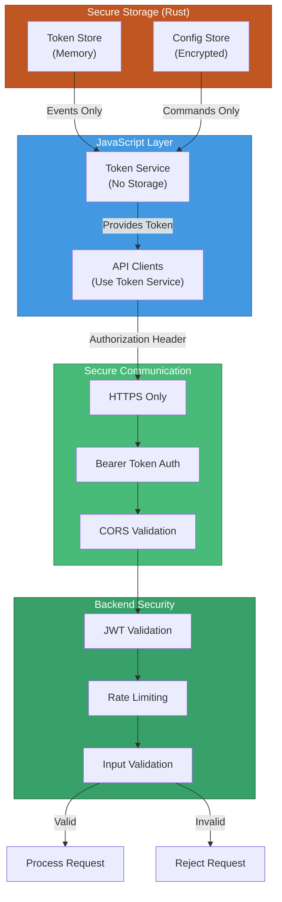

---

## Documentation Navigation

For detailed information on each component, see:

- **[Complete Documentation](./frontend_chat.md)** - Full module documentation
- **[Context Management](./frontend_chat_contexts.md)** - Context providers
- **[Service Layer](./frontend_chat_services.md)** - Service implementations
- **[Getting Started](./FRONTEND_CHAT_README.md)** - Setup and API reference
- **[Quick Reference](./FRONTEND_CHAT_SUMMARY.md)** - One-page summary

---

**Last Updated**: 2024  
**Version**: 1.0.0  
**Maintainers**: OpenFrame Team
