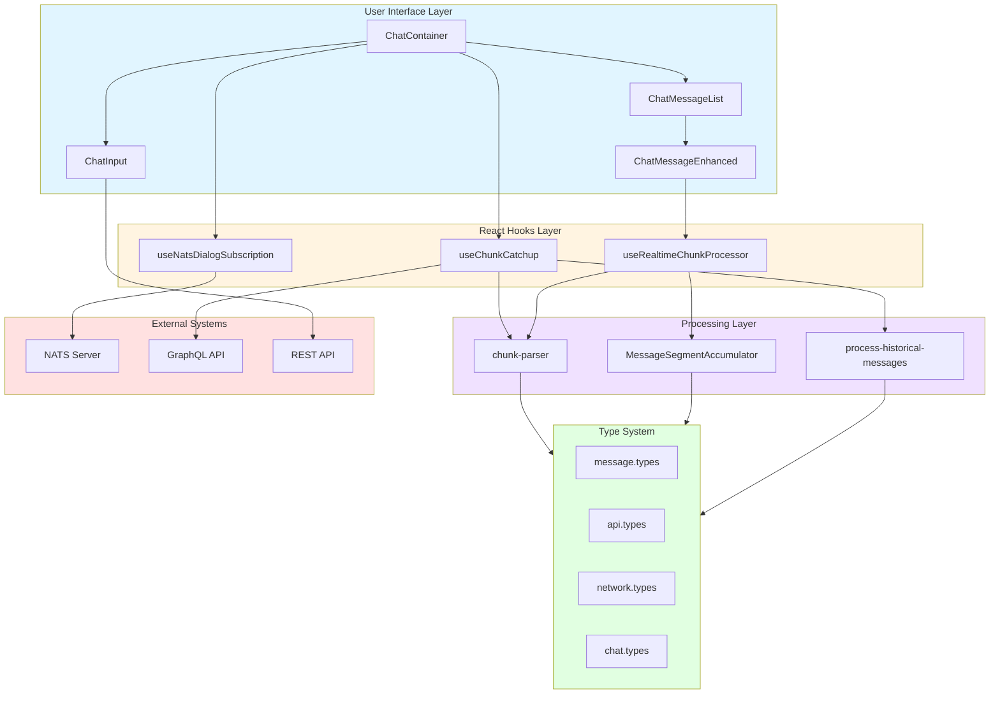
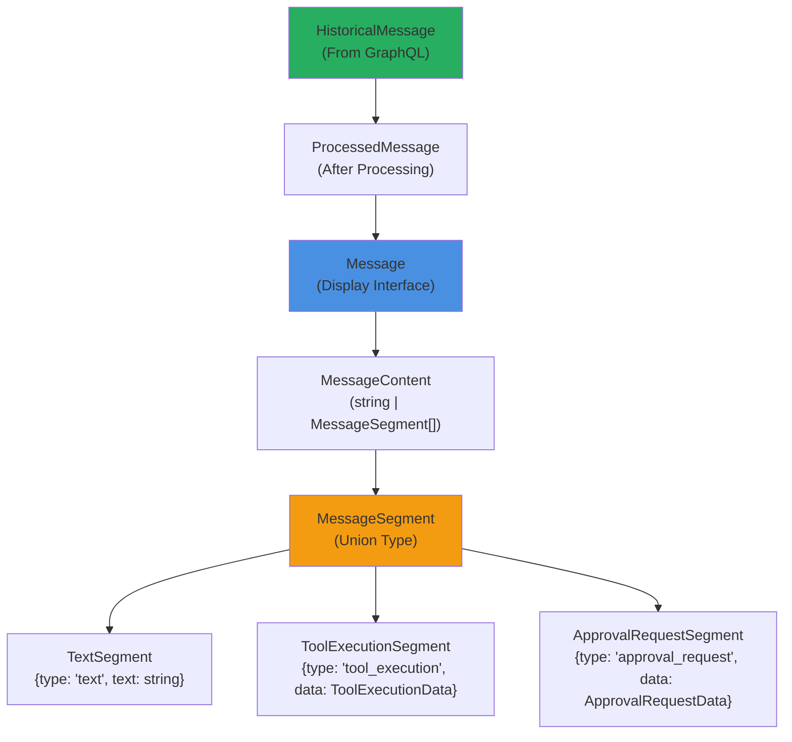
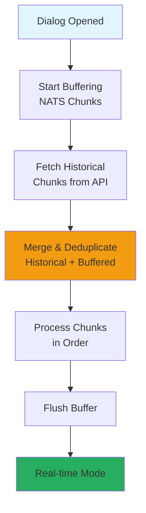
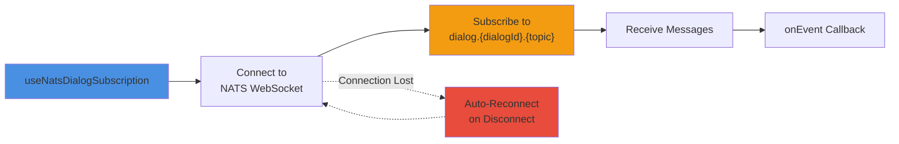
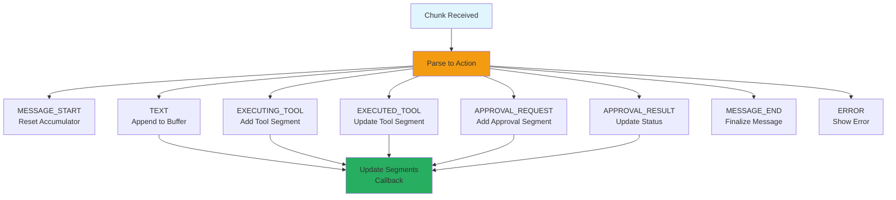
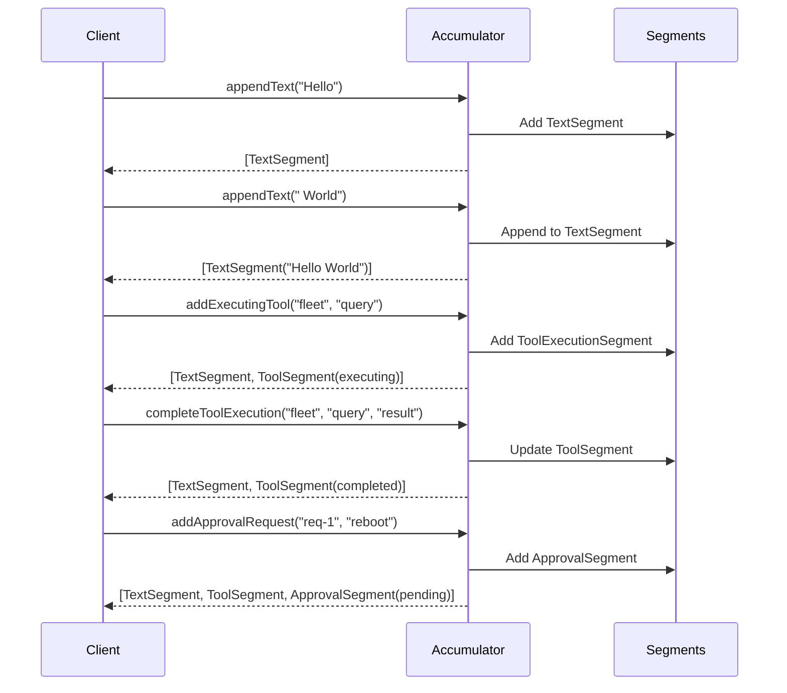
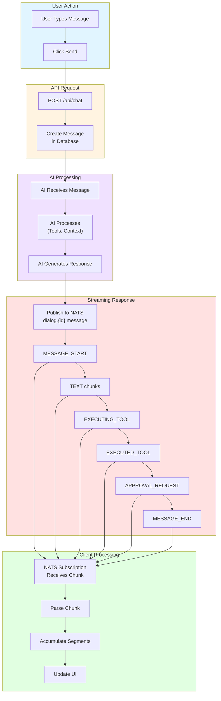
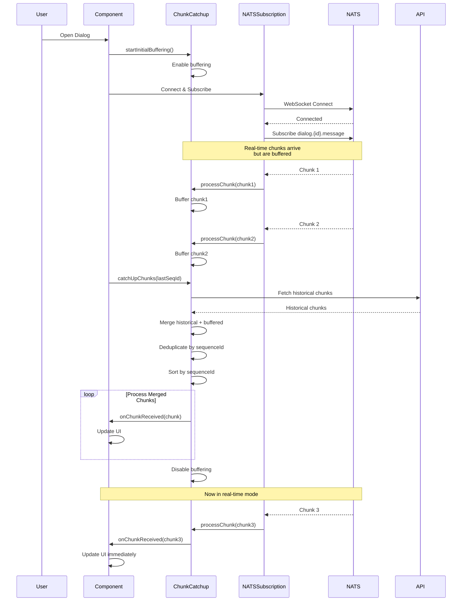
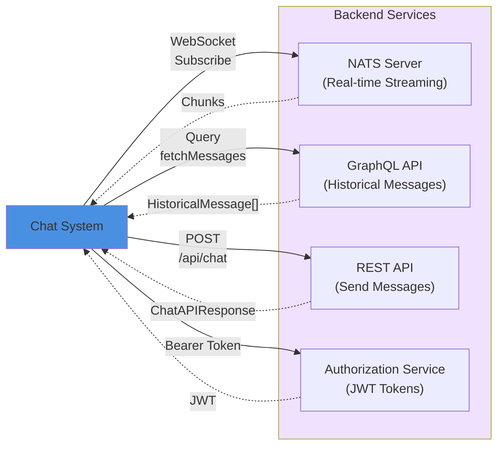
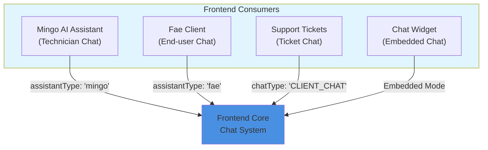

# Frontend Core Chat System

## Overview

The **Frontend Core Chat System** is a comprehensive, real-time messaging framework that powers AI-driven conversational interfaces across the OpenFrame platform. This module provides a complete solution for building interactive chat experiences with support for streaming responses, tool execution visualization, approval workflows, and multi-assistant conversations.

The system is designed to handle complex real-time interactions between users and AI assistants (Fae for clients, Mingo for technicians), with robust support for message streaming, chunk processing, historical message loading, and WebSocket-based communication via NATS.

**Key Capabilities:**
- **Real-time Streaming**: Process AI responses as they arrive via NATS WebSocket subscriptions
- **Message Segmentation**: Break down complex messages into text, tool executions, and approval requests
- **Chunk Catchup**: Synchronize historical messages with real-time streams without duplication
- **Approval Workflows**: Handle interactive approval requests with pending/approved/rejected states
- **Tool Execution Tracking**: Visualize tool invocations and their results in real-time
- **Multi-Assistant Support**: Different styling and behavior for Fae (client assistant) and Mingo (technician assistant)
- **Type-Safe Architecture**: Comprehensive TypeScript types for all message formats and API interactions

---

## Architecture Overview

The chat system follows a layered architecture with clear separation of concerns:



---

## Core Components

### Type System

The chat system is built on a comprehensive type hierarchy that ensures type safety across all operations.

#### Message Types



**Key Type Definitions:**

```typescript
// Core message interface for display
interface Message {
  id: string
  role: 'user' | 'assistant' | 'error'
  content: MessageContent  // string or MessageSegment[]
  name?: string
  assistantType?: 'fae' | 'mingo'
  timestamp?: Date
  avatar?: string | null
}

// Message segments for complex content
type MessageSegment = 
  | { type: 'text'; text: string }
  | { type: 'tool_execution'; data: ToolExecutionData }
  | { type: 'approval_request'; data: ApprovalRequestData; status?: ChatApprovalStatus }

// Tool execution tracking
interface ToolExecutionData {
  type: 'EXECUTING_TOOL' | 'EXECUTED_TOOL'
  integratedToolType: string
  toolFunction: string
  parameters?: Record<string, any>
  result?: string
  success?: boolean
}

// Approval request handling
interface ApprovalRequestData {
  command: string
  explanation?: string
  requestId?: string
  approvalType?: string
}
```

#### Network Types

```typescript
// NATS message types
type NatsMessageType = 'message' | 'admin-message'

// Chunk data from NATS stream
interface ChunkData {
  sequenceId?: number
  type: string  // MESSAGE_START, TEXT, EXECUTING_TOOL, etc.
  text?: string
  integratedToolType?: string
  toolFunction?: string
  parameters?: Record<string, any>
  result?: string
  success?: boolean
  error?: string
  approvalRequestId?: string
  approvalType?: string
  command?: string
  explanation?: string
  approved?: boolean
  modelName?: string
  providerName?: string
  contextWindow?: number
  [key: string]: any
}
```

#### API Types

```typescript
// Send message request
interface ChatAPIRequest {
  dialogId: string
  message: string
  metadata?: Record<string, any>
}

// Send message response
interface ChatAPIResponse {
  success: boolean
  messageId?: string
  error?: string
}

// Approval action
interface ApprovalRequest {
  requestId: string
  approved: boolean
  reason?: string
}
```

---

### React Hooks

The system provides three primary hooks for managing chat functionality:

#### 1. useChunkCatchup

**Purpose**: Synchronizes historical messages with real-time NATS streams during dialog loading.

**Problem Solved**: When a user opens an existing dialog, messages may arrive via NATS before historical messages are fetched from the API. This hook buffers real-time chunks during catchup and merges them with historical data to prevent duplicates and ensure correct ordering.



**Usage:**

```typescript
const {
  catchUpChunks,
  processChunk,
  resetChunkTracking,
  startInitialBuffering,
  isBufferingActive,
  processedCount
} = useChunkCatchup({
  dialogId: 'dialog-123',
  onChunkReceived: (chunk, messageType) => {
    // Process chunk into message segments
  },
  chatTypes: ['CLIENT_CHAT'],
  fetchChunks: async (dialogId, chatType, fromSequenceId) => {
    // Fetch from GraphQL API
    return chunks
  }
})

// Start buffering before NATS subscription
startInitialBuffering()

// After NATS connected, fetch historical chunks
await catchUpChunks(lastSequenceId)
```

**Key Features:**
- **Buffering**: Holds NATS chunks during API fetch
- **Deduplication**: Uses sequence IDs and content hashing to prevent duplicates
- **Ordering**: Processes chunks in correct sequence order
- **Multi-chat Support**: Handles CLIENT_CHAT and ADMIN_AI_CHAT simultaneously

#### 2. useNatsDialogSubscription

**Purpose**: Manages WebSocket connection to NATS server and subscribes to dialog-specific topics.



**Usage:**

```typescript
const { isConnected, isSubscribed } = useNatsDialogSubscription({
  enabled: true,
  dialogId: 'dialog-123',
  topics: ['message', 'admin-message'],
  onEvent: (payload, messageType) => {
    // Handle incoming NATS message
    processChunk(payload as ChunkData, messageType)
  },
  onConnect: () => console.log('NATS connected'),
  onDisconnect: () => console.log('NATS disconnected'),
  getNatsWsUrl: () => 'ws://localhost:4222',
  clientConfig: {
    name: 'chat-client',
    user: 'user',
    pass: 'pass'
  }
})
```

**Key Features:**
- **Auto-Reconnection**: Automatically reconnects on connection loss
- **Topic Multiplexing**: Subscribe to multiple topics per dialog
- **Connection State**: Exposes connection and subscription status
- **Cleanup**: Automatically unsubscribes and closes connection on unmount

#### 3. useRealtimeChunkProcessor

**Purpose**: Processes real-time NATS chunks into message segments with approval workflow support.



**Usage:**

```typescript
const {
  processChunk,
  getSegments,
  reset,
  updateApprovalStatus,
  getPendingApprovals
} = useRealtimeChunkProcessor({
  callbacks: {
    onStreamStart: () => setIsStreaming(true),
    onStreamEnd: () => setIsStreaming(false),
    onMetadata: (metadata) => setModelInfo(metadata),
    onSegmentsUpdate: (segments) => setMessageSegments(segments),
    onError: (error, details) => showError(error),
    onApprove: async (requestId) => {
      await approveAction(requestId)
    },
    onReject: async (requestId) => {
      await rejectAction(requestId)
    },
    onEscalatedApproval: (requestId, data) => {
      // Handle non-client approvals (e.g., ADMIN approvals)
      notifyAdmin(requestId, data)
    }
  },
  displayApprovalTypes: ['CLIENT'],
  approvalStatuses: approvalStatusMap
})

// Process incoming chunk
processChunk(chunkData)

// Get current message segments
const segments = getSegments()

// Update approval status after user action
updateApprovalStatus(requestId, 'approved')
```

**Key Features:**
- **Segment Accumulation**: Builds message segments incrementally
- **Tool State Tracking**: Matches EXECUTING_TOOL with EXECUTED_TOOL
- **Approval Workflows**: Handles approval requests with callbacks
- **Escalation Support**: Routes non-client approvals to appropriate handlers
- **Error Handling**: Captures and displays error chunks

---

### Processing Utilities

#### MessageSegmentAccumulator

**Purpose**: Manages the accumulation of message segments during streaming or historical processing.

**Core Responsibilities:**
1. **Text Accumulation**: Appends text chunks to the current text segment
2. **Tool Execution Tracking**: Tracks executing tools and updates them when results arrive
3. **Approval Management**: Creates approval segments and updates their status
4. **State Management**: Maintains internal state for pending operations

```typescript
class MessageSegmentAccumulator {
  // Append text to current segment
  appendText(text: string): MessageSegment[]
  
  // Add tool execution (EXECUTING_TOOL)
  addExecutingTool(
    integratedToolType: string,
    toolFunction: string,
    parameters?: Record<string, any>
  ): MessageSegment[]
  
  // Complete tool execution (EXECUTED_TOOL)
  completeToolExecution(
    integratedToolType: string,
    toolFunction: string,
    result?: string,
    success?: boolean
  ): MessageSegment[]
  
  // Add approval request
  addApprovalRequest(
    requestId: string,
    command: string,
    explanation?: string,
    approvalType?: string,
    status?: ChatApprovalStatus
  ): MessageSegment[]
  
  // Update approval status
  updateApprovalStatus(
    requestId: string,
    status: ChatApprovalStatus
  ): MessageSegment[]
  
  // Get current segments
  getSegments(): MessageSegment[]
  
  // Reset accumulator
  reset(): void
  resetSegments(): void
}
```

**Example Flow:**



#### chunk-parser

**Purpose**: Parses raw NATS chunks into typed action objects.

```typescript
function parseChunkToAction(chunk: unknown): ParsedChunkAction | null {
  // Returns one of:
  // - { action: 'message_start' }
  // - { action: 'message_end' }
  // - { action: 'text', text: string }
  // - { action: 'tool_execution', segment: ToolExecutionSegment }
  // - { action: 'approval_request', requestId, command, explanation, approvalType }
  // - { action: 'approval_result', requestId, approved, approvalType }
  // - { action: 'error', error, details }
  // - { action: 'metadata', modelName, providerName, contextWindow }
  // - { action: 'message_request', text }
}
```

**Supported Chunk Types:**
- `MESSAGE_START`: Signals start of new message
- `MESSAGE_END`: Signals end of message
- `TEXT`: Text content chunk
- `EXECUTING_TOOL`: Tool invocation started
- `EXECUTED_TOOL`: Tool invocation completed
- `APPROVAL_REQUEST`: Approval required
- `APPROVAL_RESULT`: Approval decision received
- `ERROR`: Error occurred
- `AI_METADATA`: Model information
- `MESSAGE_REQUEST`: User message echo

#### process-historical-messages

**Purpose**: Converts historical messages from GraphQL into processed message format.

```typescript
function processHistoricalMessages(
  messages: HistoricalMessage[],
  options?: MessageProcessingOptions
): ProcessedMessage[]
```

**Processing Steps:**
1. Filter by chat type (if specified)
2. Sort by creation timestamp
3. Convert message data to segments
4. Group segments by message ID
5. Create ProcessedMessage objects with role, content, and metadata

**Example:**

```typescript
const processedMessages = processHistoricalMessages(
  historicalMessages,
  {
    assistantName: 'Fae',
    assistantType: 'fae',
    assistantAvatar: '/avatars/fae.png',
    chatTypeFilter: 'CLIENT_CHAT',
    approvalStatuses: {
      'req-1': 'approved',
      'req-2': 'rejected'
    },
    onApprove: async (requestId) => {
      await api.approveRequest(requestId)
    },
    onReject: async (requestId) => {
      await api.rejectRequest(requestId)
    }
  }
)
```

---

## Data Flow

### Complete Message Flow



### Catchup Flow (Dialog Load)



---

## Integration Points

### Backend Services

The chat system integrates with multiple backend services:



**Service Details:**

1. **NATS Server** (see [gateway_service](gateway_service.md))
   - WebSocket endpoint: `ws://gateway/nats`
   - Topics: `dialog.{dialogId}.message`, `dialog.{dialogId}.admin-message`
   - Message format: JSON-encoded ChunkData

2. **GraphQL API** (see [api_service_graphql_datafetchers](api_service_graphql_datafetchers.md))
   - Query: `fetchDialogMessages(dialogId, chatType, fromSequenceId)`
   - Returns: `HistoricalMessage[]`

3. **REST API** (see [api_service_rest_controllers](api_service_rest_controllers.md))
   - Endpoint: `POST /api/chat/send`
   - Body: `ChatAPIRequest`
   - Response: `ChatAPIResponse`

4. **Authorization Service** (see [authorization_service](authorization_service.md))
   - Provides JWT tokens for authentication
   - Tokens include user ID, tenant ID, and permissions

### Frontend Integration

The chat system is used by multiple frontend modules:



**Consumer Modules:**

1. **Mingo AI Assistant** (see [mingo_ai_assistant](mingo_ai_assistant.md))
   - Uses `assistantType: 'mingo'`
   - Displays technician-focused tools and approvals
   - Integrates with device management and RMM tools

2. **Fae Client** (see [frontend_chat](frontend_chat.md))
   - Uses `assistantType: 'fae'`
   - Client-facing interface with simplified approvals
   - Focuses on end-user support scenarios

3. **Support Tickets** (see [frontend_support_tickets](frontend_support_tickets.md))
   - Embeds chat within ticket context
   - Links chat messages to ticket events
   - Provides ticket-specific metadata

---

## Usage Examples

### Basic Chat Implementation

```typescript
import { useState, useEffect } from 'react'
import {
  useChunkCatchup,
  useNatsDialogSubscription,
  useRealtimeChunkProcessor,
  processHistoricalMessages,
  type Message,
  type MessageSegment
} from '@openframe/frontend-core'

function ChatComponent({ dialogId }: { dialogId: string }) {
  const [messages, setMessages] = useState<Message[]>([])
  const [currentSegments, setCurrentSegments] = useState<MessageSegment[]>([])
  const [isStreaming, setIsStreaming] = useState(false)

  // Real-time chunk processor
  const {
    processChunk: processRealtimeChunk,
    getSegments,
    reset: resetProcessor
  } = useRealtimeChunkProcessor({
    callbacks: {
      onStreamStart: () => {
        setIsStreaming(true)
        resetProcessor()
      },
      onStreamEnd: () => {
        setIsStreaming(false)
        // Add completed message to history
        const segments = getSegments()
        if (segments.length > 0) {
          setMessages(prev => [...prev, {
            id: `msg-${Date.now()}`,
            role: 'assistant',
            content: segments,
            assistantType: 'fae',
            timestamp: new Date()
          }])
        }
      },
      onSegmentsUpdate: (segments) => {
        setCurrentSegments(segments)
      },
      onError: (error, details) => {
        console.error('Stream error:', error, details)
      }
    }
  })

  // Chunk catchup for historical messages
  const {
    catchUpChunks,
    processChunk,
    startInitialBuffering
  } = useChunkCatchup({
    dialogId,
    onChunkReceived: (chunk, messageType) => {
      processRealtimeChunk(chunk)
    },
    fetchChunks: async (dialogId, chatType, fromSequenceId) => {
      // Fetch from GraphQL API
      const response = await fetch('/graphql', {
        method: 'POST',
        headers: { 'Content-Type': 'application/json' },
        body: JSON.stringify({
          query: `
            query FetchChunks($dialogId: ID!, $chatType: String!, $fromSequenceId: Int) {
              fetchDialogChunks(
                dialogId: $dialogId
                chatType: $chatType
                fromSequenceId: $fromSequenceId
              ) {
                sequenceId
                type
                text
                integratedToolType
                toolFunction
                parameters
                result
                success
              }
            }
          `,
          variables: { dialogId, chatType, fromSequenceId }
        })
      })
      const { data } = await response.json()
      return data.fetchDialogChunks
    }
  })

  // NATS subscription
  const { isConnected, isSubscribed } = useNatsDialogSubscription({
    enabled: !!dialogId,
    dialogId,
    topics: ['message'],
    onEvent: (payload, messageType) => {
      processChunk(payload as any, messageType)
    },
    getNatsWsUrl: () => `${window.location.protocol === 'https:' ? 'wss:' : 'ws:'}//${window.location.host}/nats`
  })

  // Load historical messages on mount
  useEffect(() => {
    if (!dialogId) return

    async function loadHistory() {
      startInitialBuffering()
      
      // Wait for NATS connection
      await new Promise(resolve => {
        const interval = setInterval(() => {
          if (isConnected && isSubscribed) {
            clearInterval(interval)
            resolve(null)
          }
        }, 100)
      })

      // Fetch historical chunks
      await catchUpChunks()
    }

    loadHistory()
  }, [dialogId, isConnected, isSubscribed])

  // Send message
  const sendMessage = async (text: string) => {
    const response = await fetch('/api/chat/send', {
      method: 'POST',
      headers: { 'Content-Type': 'application/json' },
      body: JSON.stringify({
        dialogId,
        message: text
      })
    })

    if (!response.ok) {
      console.error('Failed to send message')
    }
  }

  return (
    <div className="chat-container">
      <div className="messages">
        {messages.map(msg => (
          <ChatMessage key={msg.id} message={msg} />
        ))}
        {isStreaming && currentSegments.length > 0 && (
          <ChatMessage
            message={{
              id: 'streaming',
              role: 'assistant',
              content: currentSegments,
              assistantType: 'fae',
              timestamp: new Date()
            }}
          />
        )}
      </div>
      <ChatInput onSend={sendMessage} disabled={!isConnected} />
    </div>
  )
}
```

### Approval Workflow

```typescript
function ChatWithApprovals({ dialogId }: { dialogId: string }) {
  const [approvalStatuses, setApprovalStatuses] = useState<Record<string, ChatApprovalStatus>>({})

  const handleApprove = async (requestId?: string) => {
    if (!requestId) return

    // Update local state immediately
    setApprovalStatuses(prev => ({
      ...prev,
      [requestId]: 'approved'
    }))

    // Send approval to backend
    await fetch('/api/chat/approve', {
      method: 'POST',
      headers: { 'Content-Type': 'application/json' },
      body: JSON.stringify({
        requestId,
        approved: true
      })
    })
  }

  const handleReject = async (requestId?: string) => {
    if (!requestId) return

    setApprovalStatuses(prev => ({
      ...prev,
      [requestId]: 'rejected'
    }))

    await fetch('/api/chat/approve', {
      method: 'POST',
      headers: { 'Content-Type': 'application/json' },
      body: JSON.stringify({
        requestId,
        approved: false
      })
    })
  }

  const { processChunk } = useRealtimeChunkProcessor({
    callbacks: {
      onApprove: handleApprove,
      onReject: handleReject,
      onSegmentsUpdate: (segments) => {
        // Update UI with segments that include approval status
      }
    },
    displayApprovalTypes: ['CLIENT'],
    approvalStatuses
  })

  // ... rest of implementation
}
```

### Multi-Assistant Support

```typescript
function MultiAssistantChat({ dialogId, assistantType }: {
  dialogId: string
  assistantType: 'fae' | 'mingo'
}) {
  const assistantConfig = {
    fae: {
      name: 'Fae',
      avatar: '/avatars/fae.png',
      chatType: 'CLIENT_CHAT',
      natsTopics: ['message']
    },
    mingo: {
      name: 'Mingo',
      avatar: '/avatars/mingo.png',
      chatType: 'ADMIN_AI_CHAT',
      natsTopics: ['admin-message']
    }
  }

  const config = assistantConfig[assistantType]

  const { processChunk } = useRealtimeChunkProcessor({
    callbacks: {
      onSegmentsUpdate: (segments) => {
        // Render with assistant-specific styling
      }
    }
  })

  const { isConnected } = useNatsDialogSubscription({
    enabled: true,
    dialogId,
    topics: config.natsTopics,
    onEvent: (payload, messageType) => {
      processChunk(payload)
    },
    getNatsWsUrl: () => '/nats'
  })

  return (
    <div className={`chat-${assistantType}`}>
      <div className="assistant-header">
        
        <span>{config.name}</span>
        <ConnectionIndicator connected={isConnected} />
      </div>
      {/* Chat messages */}
    </div>
  )
}
```

---

## Configuration

### Environment Variables

```bash
# NATS WebSocket URL
NEXT_PUBLIC_NATS_WS_URL=ws://localhost:4222

# GraphQL API endpoint
NEXT_PUBLIC_GRAPHQL_URL=http://localhost:8080/graphql

# REST API endpoint
NEXT_PUBLIC_API_URL=http://localhost:8080/api

# Chat configuration
NEXT_PUBLIC_CHAT_MESSAGE_LIMIT=50
NEXT_PUBLIC_CHAT_POLL_LIMIT=10
NEXT_PUBLIC_CHAT_RECONNECT_DELAY=2000
```

### Type Configuration

```typescript
// Configure assistant types
const ASSISTANT_TYPE = {
  FAE: 'fae',
  MINGO: 'mingo',
} as const

// Configure chat types
const CHAT_TYPE = {
  CLIENT: 'CLIENT_CHAT',
  ADMIN: 'ADMIN_AI_CHAT',
} as const

// Configure message types
const MESSAGE_TYPE = {
  TEXT: 'TEXT',
  EXECUTING_TOOL: 'EXECUTING_TOOL',
  EXECUTED_TOOL: 'EXECUTED_TOOL',
  APPROVAL_REQUEST: 'APPROVAL_REQUEST',
  APPROVAL_RESULT: 'APPROVAL_RESULT',
  ERROR: 'ERROR',
  MESSAGE_START: 'MESSAGE_START',
  MESSAGE_END: 'MESSAGE_END',
  MESSAGE_REQUEST: 'MESSAGE_REQUEST',
  AI_METADATA: 'AI_METADATA',
} as const
```

---

## Best Practices

### 1. Always Use Chunk Catchup

When loading an existing dialog, always use `useChunkCatchup` to prevent duplicate messages:

```typescript
// ✅ Correct
startInitialBuffering()
await catchUpChunks()

// ❌ Wrong - will cause duplicates
// Just subscribing to NATS without catchup
```

### 2. Handle Connection States

Always check connection state before sending messages:

```typescript
// ✅ Correct
const { isConnected } = useNatsDialogSubscription(...)
<ChatInput disabled={!isConnected} onSend={sendMessage} />

// ❌ Wrong - may send when disconnected
<ChatInput onSend={sendMessage} />
```

### 3. Reset Processor on New Message

Reset the chunk processor when starting a new message:

```typescript
// ✅ Correct
callbacks: {
  onStreamStart: () => {
    resetProcessor()
    setIsStreaming(true)
  }
}

// ❌ Wrong - segments from previous message will persist
callbacks: {
  onStreamStart: () => {
    setIsStreaming(true)
  }
}
```

### 4. Use Approval Statuses

Track approval statuses locally for immediate UI feedback:

```typescript
// ✅ Correct
const [approvalStatuses, setApprovalStatuses] = useState({})

const handleApprove = async (requestId) => {
  setApprovalStatuses(prev => ({ ...prev, [requestId]: 'approved' }))
  await api.approve(requestId)
}

// ❌ Wrong - UI won't update until server responds
const handleApprove = async (requestId) => {
  await api.approve(requestId)
  // No local state update
}
```

### 5. Clean Up Subscriptions

Ensure NATS subscriptions are cleaned up on unmount:

```typescript
// ✅ Correct - hook handles cleanup automatically
useNatsDialogSubscription({
  enabled: !!dialogId,
  dialogId,
  // ...
})

// ❌ Wrong - manual WebSocket without cleanup
useEffect(() => {
  const ws = new WebSocket(url)
  // No cleanup
}, [])
```

---

## Troubleshooting

### Duplicate Messages

**Symptom**: Messages appear twice in the chat.

**Cause**: Not using chunk catchup or not buffering during initial load.

**Solution**:
```typescript
// Ensure buffering is started before NATS subscription
startInitialBuffering()

// Wait for NATS connection
await waitForConnection()

// Then fetch historical chunks
await catchUpChunks()
```

### Missing Messages

**Symptom**: Some messages don't appear in the chat.

**Cause**: Chunks arriving before catchup completes.

**Solution**:
```typescript
// Use the buffering mechanism
const { startInitialBuffering, catchUpChunks } = useChunkCatchup({
  dialogId,
  onChunkReceived: processChunk,
  // Ensure fetchChunks is implemented
  fetchChunks: async (dialogId, chatType, fromSequenceId) => {
    // Fetch from API
  }
})
```

### Approval Buttons Not Working

**Symptom**: Clicking approve/reject doesn't update UI.

**Cause**: Missing approval status tracking or callbacks.

**Solution**:
```typescript
// Track approval statuses
const [approvalStatuses, setApprovalStatuses] = useState({})

// Provide callbacks
const { processChunk } = useRealtimeChunkProcessor({
  callbacks: {
    onApprove: async (requestId) => {
      setApprovalStatuses(prev => ({ ...prev, [requestId]: 'approved' }))
      await api.approve(requestId)
    },
    onReject: async (requestId) => {
      setApprovalStatuses(prev => ({ ...prev, [requestId]: 'rejected' }))
      await api.reject(requestId)
    }
  },
  approvalStatuses
})
```

### Tool Execution Not Updating

**Symptom**: Tool shows "Executing..." but never completes.

**Cause**: EXECUTING_TOOL and EXECUTED_TOOL not matching.

**Solution**:
```typescript
// Ensure tool type and function match exactly
// EXECUTING_TOOL: { integratedToolType: "fleet", toolFunction: "query" }
// EXECUTED_TOOL: { integratedToolType: "fleet", toolFunction: "query", result: "..." }

// The accumulator matches by integratedToolType + toolFunction
```

### Connection Drops

**Symptom**: NATS connection frequently disconnects.

**Cause**: Network issues or server restarts.

**Solution**:
```typescript
// Hook handles auto-reconnection
useNatsDialogSubscription({
  enabled: true,
  dialogId,
  onDisconnect: () => {
    console.log('Disconnected, will auto-reconnect')
  },
  onConnect: () => {
    console.log('Reconnected')
    // Optionally re-fetch missed messages
    catchUpChunks(lastSequenceId)
  },
  // ...
})
```

---

## Related Modules

- **[frontend_chat](frontend_chat.md)**: Fae client chat implementation
- **[mingo_ai_assistant](mingo_ai_assistant.md)**: Mingo technician assistant
- **[frontend_support_tickets](frontend_support_tickets.md)**: Ticket-based chat
- **[gateway_service](gateway_service.md)**: NATS WebSocket gateway
- **[api_service_graphql_datafetchers](api_service_graphql_datafetchers.md)**: GraphQL API for historical messages
- **[stream_processing](stream_processing.md)**: Backend message streaming

---

## API Reference

### Hooks

#### useChunkCatchup

```typescript
function useChunkCatchup(options: UseChunkCatchupOptions): UseChunkCatchupReturn

interface UseChunkCatchupOptions {
  dialogId: string | null
  onChunkReceived: (chunk: ChunkData, messageType: NatsMessageType) => void
  chatTypes?: ChatType[]
  fetchChunks?: FetchChunksFunction
}

interface UseChunkCatchupReturn {
  catchUpChunks: (fromSequenceId?: number | null) => Promise<void>
  processChunk: (chunk: ChunkData, messageType: NatsMessageType, forceProcess?: boolean) => boolean
  resetChunkTracking: () => void
  startInitialBuffering: () => void
  isBufferingActive: () => boolean
  processedCount: number
}
```

#### useNatsDialogSubscription

```typescript
function useNatsDialogSubscription(
  options: UseNatsDialogSubscriptionOptions
): UseNatsDialogSubscriptionReturn

interface UseNatsDialogSubscriptionOptions {
  enabled: boolean
  dialogId: string | null
  topics?: NatsMessageType[]
  onEvent?: (payload: unknown, messageType: NatsMessageType) => void
  onConnect?: () => void
  onDisconnect?: () => void
  onSubscribed?: () => void
  getNatsWsUrl: () => string | null
  clientConfig?: {
    name?: string
    user?: string
    pass?: string
  }
}

interface UseNatsDialogSubscriptionReturn {
  isConnected: boolean
  isSubscribed: boolean
}
```

#### useRealtimeChunkProcessor

```typescript
function useRealtimeChunkProcessor(
  options: UseRealtimeChunkProcessorOptions
): UseRealtimeChunkProcessorReturn

interface UseRealtimeChunkProcessorOptions {
  callbacks: RealtimeChunkCallbacks
  displayApprovalTypes?: string[]
  approvalStatuses?: Record<string, ChatApprovalStatus>
}

interface UseRealtimeChunkProcessorReturn {
  processChunk: (chunk: unknown) => void
  getSegments: () => MessageSegment[]
  reset: () => void
  updateApprovalStatus: (requestId: string, status: ChatApprovalStatus) => MessageSegment[]
  getPendingApprovals: () => Map<string, { command: string; explanation?: string; approvalType: string }>
}
```

### Utilities

#### parseChunkToAction

```typescript
function parseChunkToAction(chunk: unknown): ParsedChunkAction | null

type ParsedChunkAction =
  | { action: 'message_start' }
  | { action: 'message_end' }
  | { action: 'error'; error: string; details?: string }
  | { action: 'metadata'; modelName: string; providerName: string; contextWindow: number }
  | { action: 'text'; text: string }
  | { action: 'tool_execution'; segment: ToolExecutionSegment }
  | { action: 'approval_request'; requestId: string; command: string; explanation?: string; approvalType: string }
  | { action: 'approval_result'; requestId: string; approved: boolean; approvalType: string }
  | { action: 'message_request'; text: string }
```

#### processHistoricalMessages

```typescript
function processHistoricalMessages(
  messages: HistoricalMessage[],
  options?: MessageProcessingOptions
): ProcessedMessage[]

interface MessageProcessingOptions {
  assistantName?: string
  assistantType?: AssistantType
  assistantAvatar?: string
  onApprove?: (requestId?: string) => Promise<void> | void
  onReject?: (requestId?: string) => Promise<void> | void
  chatTypeFilter?: string
  approvalStatuses?: Record<string, ChatApprovalStatus>
}
```

#### MessageSegmentAccumulator

```typescript
class MessageSegmentAccumulator {
  constructor(callbacks?: AccumulatorCallbacks)
  
  setCallbacks(callbacks: AccumulatorCallbacks): void
  getSegments(): MessageSegment[]
  getState(): AccumulatorState
  reset(): void
  resetSegments(): void
  
  appendText(text: string): MessageSegment[]
  addExecutingTool(
    integratedToolType: string,
    toolFunction: string,
    parameters?: Record<string, any>
  ): MessageSegment[]
  completeToolExecution(
    integratedToolType: string,
    toolFunction: string,
    result?: string,
    success?: boolean
  ): MessageSegment[]
  addApprovalRequest(
    requestId: string,
    command: string,
    explanation?: string,
    approvalType?: string,
    status?: ChatApprovalStatus
  ): MessageSegment[]
  updateApprovalStatus(
    requestId: string,
    status: ChatApprovalStatus
  ): MessageSegment[]
}
```

---

## Contributing

When contributing to the chat system:

1. **Maintain Type Safety**: All new features must have complete TypeScript types
2. **Test Streaming**: Verify real-time chunk processing with various message types
3. **Test Catchup**: Ensure historical message loading works without duplicates
4. **Document Callbacks**: All callback options must be documented with examples
5. **Handle Errors**: Gracefully handle network errors and malformed chunks
6. **Update Tests**: Add tests for new message types or processing logic

---

## License

This module is part of the OpenFrame platform and is licensed under the same terms as the main project.

---

**For questions or support, join the OpenMSP Slack community:**
- Website: https://www.openmsp.ai/
- Slack: https://join.slack.com/t/openmsp/shared_invite/zt-36bl7mx0h-3~U2nFH6nqHqoTPXMaHEHA
