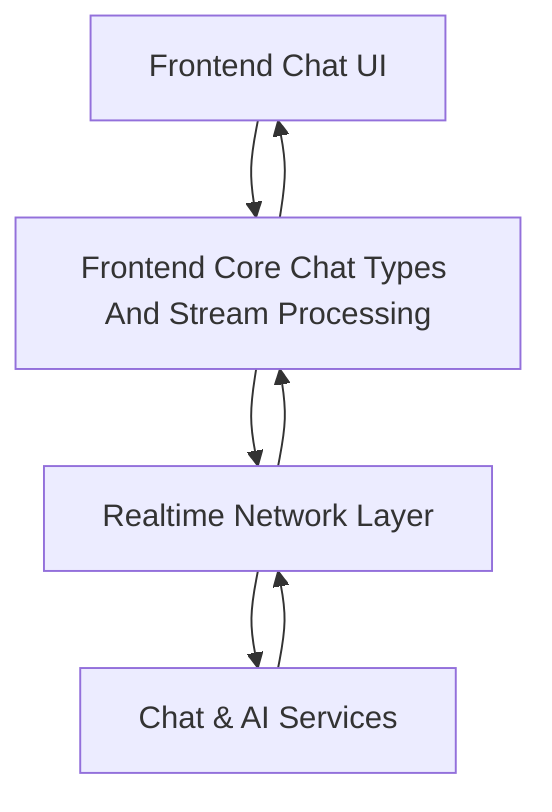
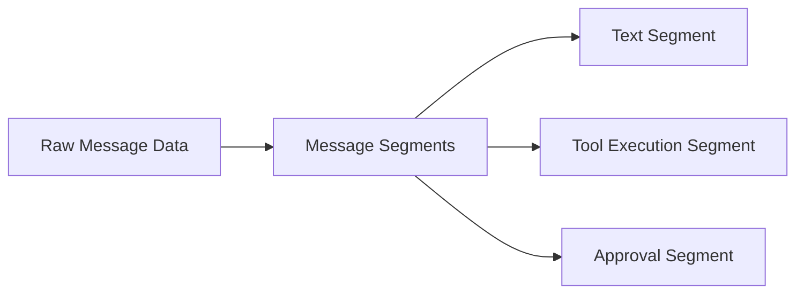
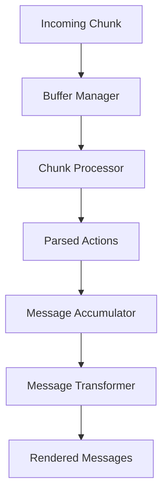

# Frontend Core Chat Types And Stream Processing

## Overview

The **Frontend Core Chat Types And Stream Processing** module provides the foundational type system and processing contracts for real‑time chat experiences in OpenFrame and Flamingo-powered frontends. It standardizes:

- **API request and response contracts** for chat dialogs, messages, approvals, and settings
- **UI component prop types** for chat containers, message lists, inputs, sidebars, and indicators
- **Message and segment models** used to render text, tool execution, approvals, and metadata
- **Network abstractions** for WebSocket and NATS-based streaming
- **Stream and chunk processing interfaces** for buffering, transformation, and incremental rendering

This module is intentionally **framework-agnostic at runtime** (types only) and acts as the shared contract layer between:
- Frontend chat UI implementations
- Realtime streaming infrastructure (NATS/WebSocket)
- Backend chat, tool execution, and approval workflows

---

## Position in the Platform Architecture

The module sits at the intersection of frontend UI, realtime messaging, and backend AI/tooling services.

**Key role:** provide a single, consistent language for chat data as it flows from backend services, through realtime streams, into rendered UI components.

---

## High-Level Responsibilities

| Area | Responsibility |
|-----|---------------|
| API Types | Define request/response shapes for dialogs, messages, approvals, and settings |
| Component Types | Strongly type chat UI components and interactions |
| Message Models | Normalize message content into renderable segments |
| Network Types | Abstract WebSocket, NATS, pagination, and chunk delivery |
| Stream Processing | Describe buffering, parsing, transformation, and lifecycle control |

---

## Sub-Module Breakdown

The module is logically organized into five major type groups.

### 1. API Types

**Purpose:** Define contracts used by REST, GraphQL, and hook-based APIs.

Key concepts:
- Dialog lifecycle (create, list)
- Message sending and responses
- Approval workflows
- User chat settings

Representative types:
- `ChatAPIRequest` / `ChatAPIResponse`
- `DialogCreateRequest` / `DialogCreateResponse`
- `DialogListRequest` / `DialogListResponse`
- `ApprovalRequest` / `ApprovalResponse`
- `UpdateSettingsRequest` / `UpdateSettingsResponse`

These types are consumed by frontend API clients and hooks and align with backend chat and approval services.

---

### 2. Component Prop Types

**Purpose:** Ensure consistency and safety across reusable chat UI components.

Defined props cover:
- Containers and layout (`ChatContainerProps`, `ChatSidebarProps`)
- Headers and indicators (`ChatHeaderProps`, `ConnectionIndicatorProps`)
- Message rendering (`ChatMessageEnhancedProps`, `ChatMessageListProps`)
- Inputs and actions (`ChatInputProps`, `ChatQuickActionProps`)
- Specialized UI blocks (approval requests, tool execution, model display)

This separation allows design systems or product frontends to implement chat UIs without re‑defining behavior contracts.

---

### 3. Message and Segment Types

**Purpose:** Provide a normalized, extensible model for chat content.

Messages are rendered as **segments**, enabling mixed content within a single message bubble.

Supported segment types:
- Text output
- Tool execution (executing / executed)
- Approval requests and results

Key abstractions:
- `MessageSegment`
- `MessageData` (API / GraphQL payloads)
- `ProcessedMessage` (UI-ready format)

This design supports incremental rendering and real‑time updates while preserving message intent.

---

### 4. Network and Streaming Types

**Purpose:** Abstract realtime communication and pagination without coupling to a specific transport.

Covered concerns:
- NATS message typing and connection status
- WebSocket configuration and lifecycle callbacks
- Chunk-based message delivery
- Generic and paginated API responses

Important types:
- `ChunkData`
- `WebSocketMessage` and `WebSocketConfig`
- `NetworkResponse` and `PaginatedResponse`

These types integrate with gateway, stream, and backend messaging services while remaining frontend-safe.

---

### 5. Stream and Chunk Processing Types

**Purpose:** Describe how realtime message chunks are buffered, parsed, and transformed into UI state.

Processing pipeline:

Key abstractions:
- **Buffering**: `BufferManager`, `BufferOptions`
- **Parsing**: `ChunkProcessor`, `ParsedChunkAction`
- **Accumulation**: `AccumulatorState`, pending approvals, executing tools
- **Transformation**: `MessageTransformer`, `TransformationOptions`
- **Lifecycle control**: `StreamProcessor`, `StreamState`

This allows advanced behaviors such as:
- Partial message rendering
- Tool execution progress updates
- Approval gating and escalation
- Recovery after reconnects or refreshes

---

## Interaction With Other Modules

This module does not implement networking or UI logic directly. Instead, it is consumed by:

- **Frontend service logic and API clients** for hooks, stores, and UI state
- **Chat client and dialog services** for realtime messaging
- **Gateway and stream services** for chunked message delivery
- **Authorization and approval flows** for gated actions

By centralizing types here, OpenFrame ensures end‑to‑end consistency from backend events to frontend rendering.

---

## Design Principles

- **Type-first architecture**: behavior is driven by explicit contracts
- **Transport-agnostic**: works with WebSocket, NATS, or polling
- **Composable messages**: segments allow rich, mixed-content chat
- **Realtime resilience**: buffering and state recovery are first-class concerns
- **UI flexibility**: supports multiple assistant types, tools, and approval models

---

## Summary

The **Frontend Core Chat Types And Stream Processing** module is the backbone of OpenFrame’s realtime chat experience. By defining shared, extensible contracts for messages, streaming, and UI integration, it enables:

- Rich AI-driven conversations
- Tool execution visibility
- Secure approval workflows
- Scalable realtime updates

All without coupling frontend implementations to backend or transport-specific details.
