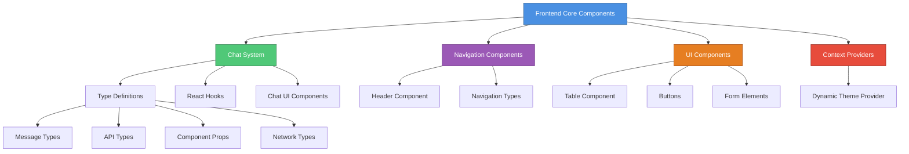
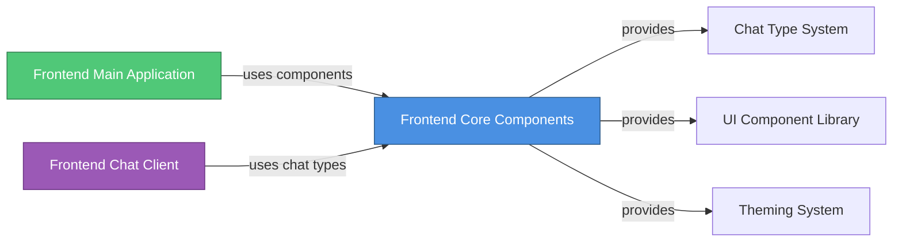
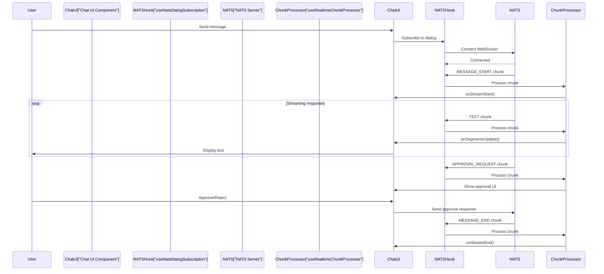
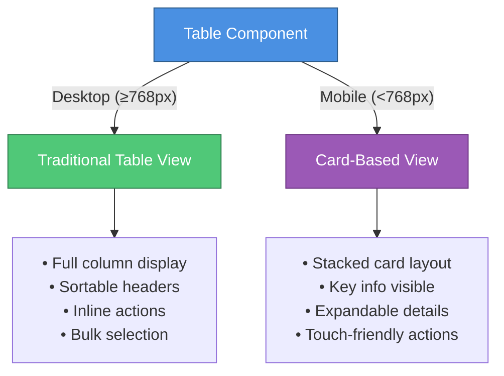

# Frontend Core Components Module

## Overview

The **Frontend Core Components** module (`openframe-frontend-core`) is a comprehensive React/TypeScript component library that provides reusable UI components, type definitions, and utilities for building the OpenFrame frontend applications. This module serves as the foundation for consistent user interfaces across the OpenFrame platform, including chat interfaces, navigation, tables, and theming capabilities.

**Key Capabilities:**
- 🎨 **Reusable UI Components**: Pre-built, styled components following OpenFrame Design System (ODS)
- 💬 **Advanced Chat System**: Real-time messaging with AI assistant integration, tool execution, and approval workflows
- 🧭 **Navigation Components**: Flexible header and navigation system with dropdown support
- 📊 **Data Tables**: Feature-rich table component with sorting, filtering, pagination, and responsive design
- 🎭 **Dynamic Theming**: Runtime theme customization with dark mode support
- 📡 **Real-time Communication**: NATS WebSocket integration for streaming chat responses
- 🔧 **TypeScript-First**: Comprehensive type definitions for type-safe development

---

## Architecture Overview

The module is organized into several key sub-modules, each focusing on specific functionality:



### Module Dependencies



---

## Sub-Modules

The Frontend Core Components module is divided into the following specialized sub-modules:

### 1. [Chat System](./frontend_core_chat_system.md)

The most comprehensive sub-module providing a complete chat interface with AI assistant integration.

**Core Components:**
- `ChatAPIRequest`, `ChatAPIResponse` - API request/response types
- `Message`, `MessageSegment` - Message data structures
- `ChatContainerProps` - Chat UI component props
- Real-time streaming support via NATS WebSocket
- Tool execution display and approval workflows

**Key Features:**
- Multi-segment message rendering (text, tool execution, approval requests)
- Real-time chunk processing with sequence tracking
- AI metadata display (model, provider, context window)
- Approval request handling with status tracking
- Error handling and display

[→ View detailed Chat System documentation](./frontend_core_chat_system.md)

---

### 2. [Navigation Components](./frontend_core_navigation.md)

Flexible navigation system for building application headers and menus.

**Core Components:**
- `HeaderProps`, `HeaderConfig` - Header configuration
- `NavigationItem` - Navigation item definitions
- Dropdown menu support
- Mobile-responsive navigation

**Key Features:**
- Auto-hide on scroll
- Nested dropdown menus
- Active state management
- Custom action buttons
- Mobile menu toggle

[→ View detailed Navigation documentation](./frontend_core_navigation.md)

---

### 3. [UI Components - Table](./frontend_core_ui_table.md)

Enterprise-grade data table component with advanced features.

**Core Components:**
- `TableProps` - Main table configuration
- `TableColumn` - Column definitions
- `CursorPagination`, `PagePagination` - Pagination types
- `BulkAction`, `RowAction` - Action definitions

**Key Features:**
- Sortable columns
- Filterable data
- Row selection and bulk actions
- Responsive design with mobile card view
- Skeleton loading states
- Cursor-based and page-based pagination

[→ View detailed Table documentation](./frontend_core_ui_table.md)

---

### 4. [Theme Provider](./frontend_core_theme_provider.md)

Dynamic theming system for runtime theme customization.

**Core Components:**
- `DynamicThemeContextType` - Theme context interface
- `DynamicThemeProvider` - Theme provider component
- `useDynamicTheme` - Theme hook

**Key Features:**
- Runtime theme updates
- Dark mode toggle
- CSS variable injection
- Theme persistence

[→ View detailed Theme Provider documentation](./frontend_core_theme_provider.md)

---

## Core Type System

The module provides a comprehensive type system for type-safe development:

### Chat Types Hierarchy

```mermaid
flowchart TD
    ChatTypes["Chat Type System"]
    
    ChatTypes --> MessageTypes["Message Types"]
    ChatTypes --> APITypes["API Types"]
    ChatTypes --> ComponentTypes["Component Types"]
    ChatTypes --> NetworkTypes["Network Types"]
    ChatTypes --> ChatEnums["Chat Enums"]
    
    MessageTypes --> Message["Message"]
    MessageTypes --> MessageSegment["MessageSegment"]
    MessageTypes --> MessageData["MessageData"]
    
    APITypes --> ChatAPIRequest["ChatAPIRequest"]
    APITypes --> ChatAPIResponse["ChatAPIResponse"]
    APITypes --> HookTypes["Hook Types"]
    
    ComponentTypes --> ChatContainerProps["ChatContainerProps"]
    ComponentTypes --> ChatHeaderProps["ChatHeaderProps"]
    ComponentTypes --> ChatInputProps["ChatInputProps"]
    
    NetworkTypes --> ChunkData["ChunkData"]
    NetworkTypes --> NatsTypes["NATS Types"]
    
    ChatEnums --> MessageType["MESSAGE_TYPE"]
    ChatEnums --> AssistantType["ASSISTANT_TYPE"]
    ChatEnums --> ChatType["CHAT_TYPE"]
    
    style ChatTypes fill:#4A90E2,stroke:#2E5C8A,color:#fff
    style MessageTypes fill:#50C878,stroke:#2E7D4E,color:#fff
    style APITypes fill:#9B59B6,stroke:#6C3483,color:#fff
    style ComponentTypes fill:#E67E22,stroke:#A04000,color:#fff
    style NetworkTypes fill:#E74C3C,stroke:#922B21,color:#fff
    style ChatEnums fill:#F39C12,stroke:#B9770E,color:#fff
```



---

## Integration with Other Modules

### Frontend Main Application

The Frontend Core Components module is heavily used by the [Frontend Main Application](./frontend_main.md):

```typescript
// Example: Using chat components in main application
import { ChatContainer, ChatMessageList, ChatInput } from '@openframe/frontend-core'
import type { Message, ChatAPIRequest } from '@openframe/frontend-core'

// Example: Using navigation components
import { Header } from '@openframe/frontend-core'
import type { HeaderConfig } from '@openframe/frontend-core'
```

**Integration Points:**
- Chat UI components for Mingo AI assistant
- Navigation header for application layout
- Table components for device and log management
- Theme provider for consistent styling

[→ View Frontend Main documentation](./frontend_main.md)

---

### Frontend Chat Client

The [Frontend Chat Client](./frontend_chat.md) extends the core chat types and components:

```typescript
// Example: Extending core chat types
import type { Message, MessageSegment } from '@openframe/frontend-core'

// Custom chat service using core types
class DialogGraphQLService {
  async sendMessage(request: ChatAPIRequest): Promise<ChatAPIResponse> {
    // Implementation
  }
}
```

**Integration Points:**
- Core chat type definitions
- Message rendering components
- Real-time chunk processing hooks
- Approval workflow types

[→ View Frontend Chat documentation](./frontend_chat.md)

---

## Component Usage Examples

### Chat System

```typescript
import { 
  ChatContainer, 
  ChatMessageList, 
  ChatInput,
  useRealtimeChunkProcessor,
  useNatsDialogSubscription 
} from '@openframe/frontend-core'
import type { Message, RealtimeChunkCallbacks } from '@openframe/frontend-core'

function ChatInterface({ dialogId }: { dialogId: string }) {
  const [messages, setMessages] = useState<Message[]>([])
  
  // Real-time chunk processing
  const callbacks: RealtimeChunkCallbacks = {
    onStreamStart: () => console.log('Stream started'),
    onSegmentsUpdate: (segments) => {
      // Update current message with new segments
    },
    onStreamEnd: () => console.log('Stream ended'),
    onApprove: async (requestId) => {
      // Handle approval
    }
  }
  
  const processor = useRealtimeChunkProcessor({ callbacks })
  
  // NATS subscription for real-time updates
  const { isConnected } = useNatsDialogSubscription({
    enabled: true,
    dialogId,
    onEvent: (payload) => processor.processChunk(payload),
    getNatsWsUrl: () => process.env.NEXT_PUBLIC_NATS_WS_URL
  })
  
  return (
    <ChatContainer>
      <ChatMessageList 
        messages={messages}
        dialogId={dialogId}
        isTyping={isConnected}
      />
      <ChatInput 
        onSend={(message) => {
          // Send message to API
        }}
      />
    </ChatContainer>
  )
}
```

### Navigation Header

```typescript
import { Header } from '@openframe/frontend-core'
import type { HeaderConfig } from '@openframe/frontend-core'

function AppLayout() {
  const headerConfig: HeaderConfig = {
    logo: {
      element: <Logo />,
      href: '/'
    },
    navigation: {
      items: [
        {
          id: 'devices',
          label: 'Devices',
          href: '/devices',
          isActive: true
        },
        {
          id: 'logs',
          label: 'Logs',
          href: '/logs'
        },
        {
          id: 'settings',
          label: 'Settings',
          children: [
            { id: 'profile', label: 'Profile', href: '/settings/profile' },
            { id: 'security', label: 'Security', href: '/settings/security' }
          ]
        }
      ],
      position: 'center'
    },
    actions: {
      right: [<UserMenu key="user" />]
    },
    autoHide: true
  }
  
  return <Header config={headerConfig} />
}
```

### Data Table

```typescript
import { Table } from '@openframe/frontend-core'
import type { TableProps, TableColumn } from '@openframe/frontend-core'

interface Device {
  id: string
  name: string
  status: 'online' | 'offline'
  lastSeen: Date
}

function DeviceTable() {
  const columns: TableColumn<Device>[] = [
    {
      key: 'name',
      label: 'Device Name',
      sortable: true,
      width: 'flex-1'
    },
    {
      key: 'status',
      label: 'Status',
      sortable: true,
      filterable: true,
      filterOptions: [
        { id: 'online', label: 'Online', value: 'online' },
        { id: 'offline', label: 'Offline', value: 'offline' }
      ],
      renderCell: (device) => (
        <StatusBadge status={device.status} />
      )
    },
    {
      key: 'lastSeen',
      label: 'Last Seen',
      sortable: true,
      renderCell: (device) => formatDate(device.lastSeen)
    }
  ]
  
  const tableProps: TableProps<Device> = {
    data: devices,
    columns,
    rowKey: 'id',
    loading: isLoading,
    sortBy: 'name',
    sortDirection: 'asc',
    onSort: (column, direction) => {
      // Handle sorting
    },
    onRowClick: (device) => {
      // Navigate to device details
    },
    cursorPagination: {
      hasNextPage: true,
      onNext: (cursor) => fetchNextPage(cursor)
    }
  }
  
  return <Table {...tableProps} />
}
```

### Dynamic Theming

```typescript
import { DynamicThemeProvider, useDynamicTheme } from '@openframe/frontend-core'

function App() {
  return (
    <DynamicThemeProvider>
      <AppContent />
    </DynamicThemeProvider>
  )
}

function ThemeToggle() {
  const { isDark, toggleDark, updateTheme } = useDynamicTheme()
  
  return (
    <button onClick={toggleDark}>
      {isDark ? 'Light Mode' : 'Dark Mode'}
    </button>
  )
}
```

---

## Design System Integration

The Frontend Core Components follow the **OpenFrame Design System (ODS)**, which provides:

### Color System

All components use ODS color tokens:

```css
/* Background colors */
--ods-bg-primary
--ods-bg-secondary
--ods-bg-hover
--ods-card

/* Text colors */
--ods-text-primary
--ods-text-secondary
--ods-text-muted

/* Border colors */
--ods-border
--ods-border-hover

/* Accent colors */
--ods-accent
--ods-accent-hover
```

### Typography

Components use the DM Sans font family with consistent sizing:

```css
font-family: 'DM Sans', sans-serif;
font-weight: 400 | 500 | 700; /* Regular, Medium, Bold */
```

### Spacing

Consistent spacing using Tailwind CSS utilities:
- `p-2`, `p-3`, `p-4` - Padding
- `m-2`, `m-3`, `m-4` - Margin
- `gap-2`, `gap-3`, `gap-4` - Flexbox/Grid gaps

---

## Real-Time Communication

The chat system integrates with NATS for real-time messaging:

### NATS WebSocket Flow



### Chunk Processing

The system processes various chunk types:

| Chunk Type | Description | Handler |
|------------|-------------|---------|
| `MESSAGE_START` | Start of AI response | `onStreamStart` |
| `TEXT` | Text content chunk | `onSegmentsUpdate` |
| `EXECUTING_TOOL` | Tool execution started | `onSegmentsUpdate` |
| `EXECUTED_TOOL` | Tool execution completed | `onSegmentsUpdate` |
| `APPROVAL_REQUEST` | Requires user approval | `onApprove`, `onReject` |
| `APPROVAL_RESULT` | Approval result | `onEscalatedApprovalResult` |
| `AI_METADATA` | Model information | `onMetadata` |
| `MESSAGE_END` | End of AI response | `onStreamEnd` |
| `ERROR` | Error occurred | `onError` |

---

## Responsive Design

All components are built with mobile-first responsive design:

### Breakpoints

```typescript
type TailwindBreakpoint = 'sm' | 'md' | 'lg' | 'xl' | '2xl'

// Breakpoint values
sm: 640px   // Small devices
md: 768px   // Medium devices (tablets)
lg: 1024px  // Large devices (desktops)
xl: 1280px  // Extra large devices
2xl: 1536px // 2X large devices
```

### Table Responsive Behavior



### Column Visibility Control

```typescript
const columns: TableColumn[] = [
  {
    key: 'name',
    label: 'Name',
    // Always visible
  },
  {
    key: 'email',
    label: 'Email',
    hideAt: 'sm', // Hide on small screens
  },
  {
    key: 'role',
    label: 'Role',
    hideAt: ['sm', 'md'], // Hide on small and medium screens
  }
]
```

---

## Performance Considerations

### Optimization Strategies

1. **Memoization**: Components use `React.memo` for expensive renders
2. **Virtual Scrolling**: Large message lists use virtual scrolling
3. **Lazy Loading**: Components are code-split for faster initial load
4. **Debouncing**: Input handlers are debounced to reduce re-renders
5. **Skeleton States**: Loading states prevent layout shift

### Bundle Size

The module is tree-shakeable, allowing imports of only needed components:

```typescript
// ✅ Good - Only imports what's needed
import { Table } from '@openframe/frontend-core'

// ❌ Avoid - Imports entire module
import * as FrontendCore from '@openframe/frontend-core'
```

---

## Testing

### Component Testing

Components are tested using React Testing Library:

```typescript
import { render, screen, fireEvent } from '@testing-library/react'
import { ChatInput } from '@openframe/frontend-core'

describe('ChatInput', () => {
  it('calls onSend when message is submitted', () => {
    const onSend = jest.fn()
    render(<ChatInput onSend={onSend} />)
    
    const input = screen.getByRole('textbox')
    fireEvent.change(input, { target: { value: 'Hello' } })
    fireEvent.submit(input)
    
    expect(onSend).toHaveBeenCalledWith('Hello')
  })
})
```

### Type Testing

TypeScript types are validated at compile time:

```typescript
// Type checking ensures correct usage
const message: Message = {
  id: '1',
  role: 'user', // ✅ Valid
  content: 'Hello',
  timestamp: new Date()
}

const invalidMessage: Message = {
  id: '1',
  role: 'invalid', // ❌ Type error
  content: 'Hello'
}
```

---

## Best Practices

### Component Usage

1. **Always provide required props**: TypeScript will enforce this
2. **Use type imports**: Import types separately for better tree-shaking
3. **Handle loading states**: Use skeleton components during data fetching
4. **Implement error boundaries**: Wrap components in error boundaries
5. **Follow ODS guidelines**: Use ODS color tokens and spacing

### Type Safety

```typescript
// ✅ Good - Type-safe component usage
import type { TableProps, TableColumn } from '@openframe/frontend-core'

const columns: TableColumn<Device>[] = [
  { key: 'name', label: 'Name' }
]

const props: TableProps<Device> = {
  data: devices,
  columns,
  rowKey: 'id'
}

// ❌ Avoid - Untyped usage
const props = {
  data: devices,
  columns: [{ key: 'name' }],
  rowKey: 'id'
}
```

### Performance

```typescript
// ✅ Good - Memoized callbacks
const handleSort = useCallback((column: string, direction: 'asc' | 'desc') => {
  // Handle sorting
}, [])

// ❌ Avoid - Inline functions cause re-renders
<Table onSort={(column, direction) => { /* ... */ }} />
```

---

## Migration Guide

### From Legacy Components

If migrating from older component libraries:

1. **Update imports**:
   ```typescript
   // Old
   import { Table } from '@legacy/components'
   
   // New
   import { Table } from '@openframe/frontend-core'
   ```

2. **Update prop names**: Check documentation for renamed props

3. **Update type imports**:
   ```typescript
   // Old
   import { TableProps } from '@legacy/components/types'
   
   // New
   import type { TableProps } from '@openframe/frontend-core'
   ```

4. **Update styling**: Replace custom CSS with ODS tokens

---

## Troubleshooting

### Common Issues

#### Chat Messages Not Rendering

**Problem**: Messages appear empty or don't render

**Solution**: Ensure message content is properly formatted:

```typescript
// ✅ Correct
const message: Message = {
  id: '1',
  role: 'user',
  content: 'Hello', // String content
  timestamp: new Date()
}

// ✅ Also correct
const message: Message = {
  id: '2',
  role: 'assistant',
  content: [
    { type: 'text', text: 'Hello' },
    { type: 'tool_execution', data: { /* ... */ } }
  ], // Segment array
  timestamp: new Date()
}
```

#### Table Not Sorting

**Problem**: Clicking column headers doesn't sort

**Solution**: Provide `onSort` callback:

```typescript
<Table
  data={data}
  columns={columns}
  rowKey="id"
  sortBy="name"
  sortDirection="asc"
  onSort={(column, direction) => {
    // Implement sorting logic
    setSortBy(column)
    setSortDirection(direction)
  }}
/>
```

#### Theme Not Applying

**Problem**: Theme changes don't take effect

**Solution**: Ensure `DynamicThemeProvider` wraps your app:

```typescript
function App() {
  return (
    <DynamicThemeProvider>
      <YourApp />
    </DynamicThemeProvider>
  )
}
```

---

## Related Documentation

- [Frontend Main Application](./frontend_main.md) - Main application using these components
- [Frontend Chat Client](./frontend_chat.md) - Chat-specific implementation
- [API Service](./api_service.md) - Backend API for chat and data
- [Security Core](./security_core.md) - Authentication and authorization

---

## Additional Resources

### Design System
- OpenFrame Design System (ODS) guidelines
- Color palette and typography standards
- Component design patterns

### Development
- React documentation: https://react.dev
- TypeScript handbook: https://www.typescriptlang.org/docs
- Tailwind CSS: https://tailwindcss.com

### Community
- OpenMSP Slack: https://join.slack.com/t/openmsp/shared_invite/zt-36bl7mx0h-3~U2nFH6nqHqoTPXMaHEHA
- GitHub Discussions: (managed via Slack)

---

**Questions or Issues?**

For questions about using these components or reporting issues, please join our OpenMSP Slack community. All development discussions and support are managed through Slack rather than GitHub Issues.
